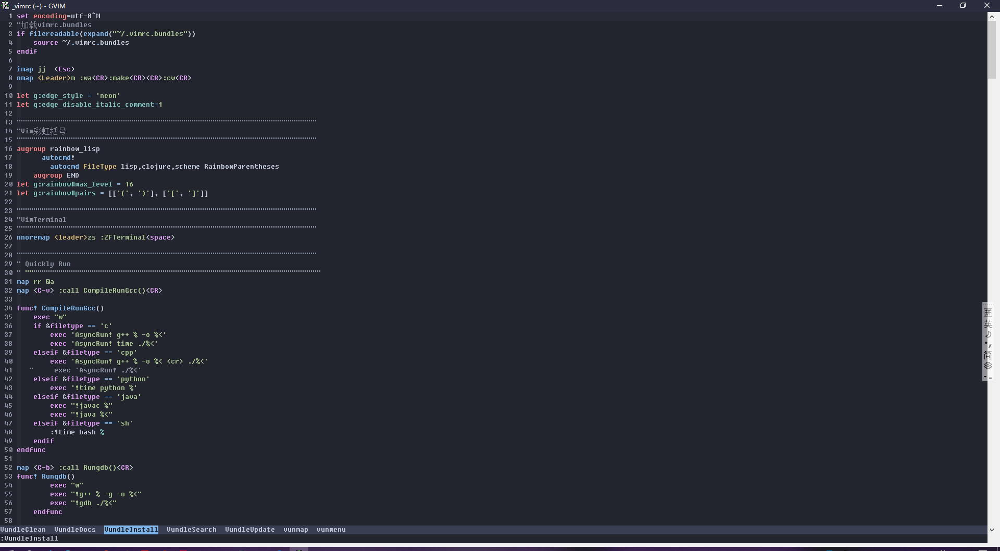

- Windows上配置vim8.1

介绍下情况, 之前是在wsl上使用rwindowsTerminal+angeer+vim_8  
为什么使用wsl, 有些软件Windows离不开, cmd是屎, ranger太香, linux太香  
为什么要windows装gvim, , 因为wsl, windowsteminal有bug  
其次是性能的问题  

# 我的配置(常用快捷键/命令)

* `<leader>` : 空格(Space)
* 文件操作
    - `<leader>w` : 保存
    - `<leader>WQ` : 保存退出
* buffer
    - `ml` : 循环下一个buffer
    - `mh` : 循环洗一个buffer
* NerdTree
    - `<C-y>` : 打开关闭NerdTree
    - `i` : 水平分割,新buffer
    - `s` : 垂直分割,新buffer
    - `o` : 新buffer
    - `gi` : 同上,但是光标仍在NerdTree
    - `gs/go` : 类似
* 窗口
    - `<leader>+[h/j/k/l]+w` : 切换上下左右窗口 
    - `nw` : 循环切换下一个窗口
* bullets.vim插件
    - `<C-t>` : 列表降一级
    - `<C-d>` : 列表升一级
    - `先选中 :Renumber.` :tab补全记不全整个命令: 把你选中的乱的列表重新标号

# 下载安装

1. 官网下载安装
2. 一路默认

# 配置文件

windows上配置文件是_vimrc, 和linux上的.vimrc不同  

关于wsl的配置和linux上vim的配置可以看我以前的文章, 在分类里找  

1. `_vimrc` 文件放到 `c:\用户\用户名` 下

`_vimrc` 是我在wsl上直接拿过来的, 
最前面加上了四行 `set` 关于编码的配置, 不然的话中文显示会乱码  
第六行 `expand("~/.vimrc.bundles")` , 这是加载另一个文件 `.vimrc.bundles` , 这里的东西直接写在 `_vimrc` 里也可以, 但是这样太臃肿  
所以 `.vimrc.bundles` 用来写所有安装的插件, `_vimrc` 用来写对这些插件的配置以及vim的配置
`~` 是linux的写法, 但是这样在windows里可以用, 我就懒得改了  
`.vimrc.bundles` 里相对于在wsl中我删了一些插件, 所以 `_vimrc` 中有些多余的配置, 我懒得删, 但是可以用, 

你直接复制就能用, 介意的话就自己找一找删掉  

``` 
"解决编码问题
set encoding=utf-8
set termencoding=utf-8
set fileencoding=utf-8
set fileencodings=ucs-bom,utf-8,chinese,cp936

"加载vimrc.bundles
if filereadable(expand("~/.vimrc.bundles"))
    source ~/.vimrc.bundles
endif

imap jj  <Esc> 
nmap <Leader>m :wa<CR>:make<CR><CR>:cw<CR>

let g:edge_style = 'neon'
let g:edge_disable_italic_comment=1

""""""""""""""""""""""""""""""""""""""""""""""""""""""""""""""""""""""""
"Vim彩虹括号
""""""""""""""""""""""""""""""""""""""""""""""""""""""""""""""""""""""""
augroup rainbow_lisp
      autocmd!
        autocmd FileType lisp,clojure,scheme RainbowParentheses
    augroup END
let g:rainbow#max_level = 16
let g:rainbow#pairs = [['(', ')'], ['[', ']']]

""""""""""""""""""""""""""""""""""""""""""""""""""""""""""""""""""""""""
"VimTerminal
""""""""""""""""""""""""""""""""""""""""""""""""""""""""""""""""""""""""
nnoremap <leader>zs :ZFTerminal<space>

""""""""""""""""""""""""""""""""""""""""""""""""""""""""""""""""""""""""
" Quickly Run
" """""""""""""""""""""""""""""""""""""""""""""""""""""""""""""""""""""""
map rr @a
map <C-v> :call CompileRunGcc()<CR>

func! CompileRunGcc()
    exec "w" 
    if &filetype == 'c' 
        exec 'AsyncRun! g++ % -o %<'
        exec 'AsyncRun! time ./%<'
    elseif &filetype == 'cpp'
        exec 'AsyncRun! g++ % -o %< <cr> ./%<'
   "     exec 'AsyncRun! ./%<'
    elseif &filetype == 'python'
        exec '!time python %'
    elseif &filetype == 'java'
        exec "!javac %"
        exec "!java %<"
    elseif &filetype == 'sh'
        :!time bash %
    endif                                                                              
endfunc 

map <C-b> :call Rungdb()<CR>
func! Rungdb()
        exec "w"
        exec "!g++ % -g -o %<"
        exec "!gdb ./%<"
    endfunc

"""""""""""""""""""""""""""""""""""""""""""""""""""""""""""""""""""""
           "iamcco/Markdown-Preview  markdown预览的相关设置
""""""""""""""""""""""""""""""""""""""""""""""""""""""""""""""""""""""
let g:mkdp_browser = ''
let g:mkdp_open_ip = ''
let g:mkdp_echo_preview_url = 0
let g:mkdp_browserfunc = ''
let g:mkdp_auto_start = 1
let g:mkdp_auto_close = 1
let g:mkdp_refresh_slow = 0
let g:mkdp_open_to_the_world = 0
let g:mkdp_browserfunc = ''
let g:mkdp_preview_options = {
    \ 'mkit': {},
    \ 'katex': {},
    \ 'uml': {},
    \ 'maid': {},
    \ 'disable_sync_scroll': 0,
    \ 'sync_scroll_type': 'middle',
    \ 'hide_yaml_meta': 1,
    \ 'sequence_diagrams': {}
    \ }
let g:mkdp_markdown_css = ''
let g:mkdp_highlight_css = ''
let g:mkdp_page_title = '「${name}」'

"""""""""""""""""""""""""""""""""""""""""""""""""""""""""""""""""""""
         "设置Bullets.vim
"""""""""""""""""""""""""""""""""""""""""""""""""""""""""""""""""""""
let g:bullets_enabled_file_types = [
    \ 'markdown',
    \ 'text',
    \ 'gitcommit',
    \ 'scratch'
    \]

""""""""""""""""""""""""""""""""""""""""""""""""""""""""""""""""""""""
"vim-instant=markdown
""""""""""""""""""""""""""""""""""""""""""""""""""""""""""""""""""""""
let g:instant_markdown_browser = "links2"
let g:instant_markdown_slow = 1
let g:instant_markdown_autostart = 1
let g:instant_markdown_open_to_the_world = 1
let g:instant_markdown_allow_unsafe_content = 0
let g:instant_markdown_allow_external_content = 0
let g:instant_markdown_mathjax = 1
let g:instant_markdown_logfile = '/tmp/instant_markdown.log'
let g:instant_markdown_autoscroll = 1
""""""""""""""""""""""""""""""""""""""""""""""""""""""""""""""""""""""
                      "  语法检测ale  "
""""""""""""""""""""""""""""""""""""""""""""""""""""""""""""""""""""""
""始终开启标志列
let g:ale_sign_column_always = 1
let g:ale_set_highlights = 1
"自定义error和warning图标
let g:ale_sign_error = '>>'
let g:ale_sign_warning = '--'
""在vim自带的状态栏中整合ale
let g:airline#extensions#ale#enabled = 1
let g:ale_statusline_format = ['>> %d', '-- %d', '| OK']
"显示Linter名称,出错或警告等相关信息
let g:ale_echo_msg_error_str = 'E'
let g:ale_echo_msg_warning_str = 'W'
let g:ale_echo_msg_format = '[%linter%] %s [%severity%]'
""普通模式下，sp前往上一个错误或警告，sn前往下一个错误或警告
nmap sp <Plug>(ale_previous_wrap)
nmap sn <Plug>(ale_next_wrap)
"<Leader>s触发/关闭语法检查
nmap <Leader>s :ALEToggle<CR>
""<Leader>d查看错误或警告的详细信息
nmap <Leader>d :ALEDetail<CR>
""""""""""""""""""""""""""""""""""""""""""""""""""""""""""""""""""""""
                            "  autopairs  "
""""""""""""""""""""""""""""""""""""""""""""""""""""""""""""""""""""""
let g:AutoPairs = {'(':')', '[':']', '{':'}',"'":"'",'"':'"'}
"设置要自动配对的符号
"let g:AutoPairs['<']='>'
"添加要自动配对的符号<>
"let b:AutoPairs = g:AutoParis
"设置要自动配对的符号，默认为g:AutoPairs，可以通过自动命令来对不同文件类型设置不同自动匹配对符号。
let g:AutoPairsShortcutToggle = '<M-p>'
"设置插件打开/关闭的快捷键，默认为ALT+p。
let g:AutoPairsShortcutFastWrap = '<>'
"设置自动为文本添加圆括号的快捷键，默认为ALT+e。
let g:AutoPairsShortcutJump = '<A-space>'
"设置调到下一层括号对的快捷键，默认为ALT+n。
let g:AutoPairsShortcutBackInsert = '<M-b>'
"设置撤销飞行模式的快捷键，默认为ALT+b。
let g:AutoPairsMapBS = 1
"把BACKSPACE键映射为删除括号对和引号，默认为1。
let g:AutoPairsMapCh = 1
"把ctrl+h键映射为删除括号对和引号，默认为1。
let g:AutoPairsMapCR = 1
"把ENTER键映射为换行并缩进，默认为1。
let g:AutoPairsCenterLine = 1
"当g:AutoPairsMapCR为1时，且文本位于窗口底部时，自动移到窗口中间。
let g:AutoPairsMapSpace = 1
"把SPACE键映射为在括号两侧添加空格，默认为1。
let g:AutoPairsFlyMode = 0
"启用飞行模式，默认为0。
let g:AutoPairsMultilineClose = 1

"""""""""""""""""""""""""""""""""""""""""""""""""""""""""""""""""""""
                                "airline 设置
"""""""""""""""""""""""""""""""""""""""""""""""""""""""""""""""""""""
let g:airline#extensions#tabline#enabled = 1
let g:airline_powerline_fonts=1
"let g:airline_theme='molokai'
let g:airline_theme='edge'
set ambiwidth=double

"""""""""""""""""""""""""""""""""""""""""""""""""""""""""""""""""""""
"tagbar  vim中右边的侧栏(设置快捷键和支持markdown标题)
map <C-t> :TagbarToggle<CR>
let TagbarWinSize=32
let g:tagbar_type_markdown = {
    \ 'ctagstype' : 'markdown',
    \ 'kinds' : [
        \ 'h:Heading_L1',
        \ 'i:Heading_L2',
        \ 'k:Heading_L3'
    \ ]
    \ }

""""""""""""""""""""""""""""""""""""""""""""""""""""""""""""""""""""""
     "NearTree  vim中左侧侧边栏设置快捷键为ctrl+b(file list)
"""""""""""""""""""""""""""""""""""""""""""""""""""""""""""""""""""""
map <C-y> :NERDTreeToggle<CR>
"设置NERDTREE子窗口宽度
let NERDTreeWinSize=32
" 显示隐藏文件
let NERDTreeShowHidden=1
" 删除文件时自动删除文件对应 buffer
let NERDTreeAutoDeleteBuffer=1
" 显示/隐藏 MiniBufExplorer 窗口
map <Leader>bl :MBEToggle<cr>
" buffer 切换快捷键
map mh :MBEbn<cr>
map ml :MBEbp<cr>
"""""""""""""""""""""""""""""""""""""""""""""""""""""""""""""""""""""
                                  "Markdown  
""""""""""""""""""""""""""""""""""""""""""""""""""""""""""""""""""""""
"disable folding
let g:vim_markdown_folding_disabled=1
" Highlight YAML frontmatter as used by Jekyll
let g:vim_markdown_frontmatter=1

"""""""""""""""""""""""""""""""""""""""""""""""""""""""""""""""""""""
                            "UltiSnips
""""""""""""""""""""""""""""""""""""""""""""""""""""""""""""""""""""""
let g:UltiSnipsExpandTrigger="<tab>"
let g:UltiSnipsJumpForwardTrigger="<cr>"
let g:UltiSnipsJumpBackwardTrigger="<c-z>"
let g:UltiSnipsEditSplit="vertical"
let g:UltiSnipsUsePythonVersion = 3

"""""""""""""""""""""""""""""""""""""""""""""""""""""""""""""""""""""
                            ""YouCompeleteMe
""""""""""""""""""""""""""""""""""""""""""""""""""""""""""""""""""""""
 let g:ycm_global_ycm_extra_conf = '~/.vim/bundle/YouCompleteMe/third_party/ycmd/.ycm_extra_conf.py'
"设置.ycm_extra_conf.py的全局路径，避免每次都需要复制到当前目录.若为空则每次都需复制.ycm_extra_conf.py文件到当前目录
"设置触发标识符补全的最小字符数，设置为99或更大的数字，则等效于关闭标识符补全功能，但保留语义补全功能 
let g:ycm_min_num_of_chars_for_completion = 1
"设置要在标示符补全列表中显示的候选项的最小字符数，0表示没有限制，对语义补全无影响
let g:ycm_min_num_identifier_candidate_chars = 0
"设置语义补全的最大候选项数量，0表示没有限制
let g:ycm_max_num_candidates = 50
"设置标识符补全的最大候选项数量，0表示没有限制
let g:ycm_max_num_identifier_candidates = 10
"0表示关闭ycm语义补全和标识符补全触发器，但仍可以用ctrl+space 打开语义补全，1表示打开
let g:ycm_auto_trigger=1
"文件类型白名单，vim打开这些类型文件时会开启YCM。*表示所有文件类型
let g:ycm_filetype_whitelist = { '*': 1 }
"文件类型黑名单，vim打开这些类型文件时会关闭YCM
let g:ycm_filetype_blacklist = {'tagbar' : 1, 'qf' : 1,'notes' : 1, 'unite' : 1, 'text' : 1, 'vimwiki' : 1, 'pandoc' : 1, 'infolog' : 1, 'mail' : 1}
"语义补全黑名单，vim打开这些类型文件时会关闭YCM语义补全，但标识符补全仍可用
let g:ycm_filetype_specific_completion_to_disable={'gitcommit': 1}
"开启YCM的显示诊断信息的功能，0表示关闭
let g:ycm_show_diagnostics_ui = 0
"设置错误标志为>>
let g:ycm_error_symbol = 'OO'
"设置警告标志为!!
let g:ycm_warning_symbol = '!!'
"在代码中高亮显示YCM诊断对应的内容，如果关闭，则会关闭错误和警告高亮功能，0表示关闭
let g:ycm_enable_diagnostic_signs = 0
"高亮显示代码中与诊断信息有关的文本或代码，0表示关闭
let g:ycm_enable_diagnostic_highlighting = 0
"当光标移到所在行时显示诊断信息
let g:ycm_echo_current_diagnostic = 0
"诊断信息过滤器，此选项控制YCM将呈现哪些诊断，针对特定文件类型，用正则表达式控制要显示的内容，用level控制消息的级别，{}表示显示所有诊断信息
let g:ycm_filter_diagnostics={}
"每次获取新诊断数据时自动填充位置列表，1表示打开，默认关闭以免干扰可能已放置在位置列表中的其他数据。在vim中用:helplocation-list命令查看位置列表的具体解释
let g:ycm_always_populate_location_list = 0
"在强制编译后自动打位置列表并用诊断信息填充，所谓位置列表就是标出各错误或警告对应在哪些行的小窗口，可以实现直接跳转到错误行
let g:ycm_open_loclist_on_ycm_diags = 1
"补全功能在注释中同样有效，1表示打开
let g:ycm_complete_in_comments=1
"打开字符串自动补全功能。0代表关闭。这用于c系语言中#include后列出头文件很有用，如果设置为0则关闭文件名补全功能
let g:ycm_complete_in_strings = 1
"让YCM可以收集注释中的文字来分析以用于补全，默认为0，只能收集代码中的文字来分析
let g:ycm_collect_identifiers_from_comments_and_strings = 0
"开启tags补全引擎 ，在vim中用:h 'tags’命令来查看相关信息，只支持ctags，切必须使用--fields=+l选项
let g:ycm_collect_identifiers_from_tags_files = 0

let g:ycm_keep_logfiles = 0
"YCM关闭时保存日志，0表示关闭
let g:ycm_log_level = 'info'
"设置YCM的日志记录级别，可以是debug，info，warning，error或critical。debug是最详细的
let g:ycm_auto_start_csharp_server = 1
"设置当vim打开c#文件时，OmniSharp server自动开启，0代表不自动开启
let g:ycm_auto_stop_csharp_server = 1
"设置当vim关闭c#文件时，OmniSharp server自动关闭，0代表不自动关闭
let g:ycm_csharp_server_port = 0
"指定OmniSharp server的监视端口，0表示使用os自动提供的未使用的端口
let g:ycm_csharp_insert_namespace_expr = ''
"默认c#中插入命名空间时自动在最近的using语句下插入using语句，如要插入到其他地方则设置该选项
let g:ycm_add_preview_to_completeopt = 0
"为当前补全选项在vim顶部增加预览窗口，用来显示函数原型等信息，如果vim的completeopt已经设置为prieview则不会有影响，:h completeopt查看相关信息，用:set completeopt?查看当前vim的设置，默认为0
let g:ycm_autoclose_preview_window_after_completion = 1
"选中补全选项后自动关闭预览窗口，当g:ycm_add_preview_to_completeopt设为1时或者vim的completeopt设为preview有效
let g:ycm_autoclose_preview_window_after_insertion = 1
"离开插入模式后自动关闭预览窗口，当g:ycm_add_preview_to_completeopt设为1时或者vim的completeopt设为preview有效
let g:ycm_max_diagnostics_to_display = 30
"此选项控制在文件中检测到错误或警告时向用户显示的最大诊断数
let g:ycm_key_list_select_completion = ['<C-n>']
"设置用于选择补全列表中的第一个选项以及进入补全列表后向下选择的快捷键，默认为tab键和方向下键
let g:ycm_key_list_previous_completion = [ '<Up>']
"设置用于向上选择补全列表中的选项的快捷键，默认为shift+tab，和方向上键
let g:ycm_key_list_stop_completion = ['<C-y>']
"设置用于关闭补全列表的快捷键，默认为ctrl+y
let g:ycm_key_invoke_completion = '<C-Space>'
"设置强制启用语义补全的快捷键，有些系统函数如fopen, strcpy如果不智能提示，可以按+键
let g:ycm_key_detailed_diagnostics = '<leader>d'
"设置查看光标停留处的错误诊断详细信息的快捷键,默认为\d
let g:ycm_confirm_extra_conf = 1
"允许自动加载.ycm_extra_conf.py，不再提示 ，设置为1，则每次都提示用于确认该文件是否安全
let g:ycm_extra_conf_globlist = []
"设置加载 .ycm_extra_conf.py的路径，*表示匹配任何字符，?匹配任何单个字符，[seq] 匹配seq中的任何单个字符，[!seq] 匹配不在seq中的任何单个字符，路径前加！表示不加载所有改路径上匹配的文件
let g:ycm_filepath_completion_use_working_dir = 0
"设置YCM的文件名补全时，相对路径是按照vim的当前工作目录还是活动缓冲区中的文件所在目录来解释。0是按照文件所在目录。
let g:ycm_semantic_triggers = {'c' : ['->', '.'],'objc' : ['->', '.', 're!\[[_a-zA-Z]+\w*\s', 're!^\s*[^\W\d]\w*\s','re!\[.*\]\s'],'ocaml' : ['.', '#'],'cpp,objcpp' : ['->', '.', '::'],'perl' : ['->'],'php' : ['->', '::'],'cs,java,javascript,typescript,d,python,perl6,scala,vb,elixir,go' : ['.'],'ruby' : ['.', '::'],'lua' : ['.', ':'],'erlang' : [':'],}
"设置YCM的语义触发器的关键字
let g:ycm_cache_omnifunc = 1
"某些omni补全引擎引起与YCM缓存不适配，可能不会为给定的前缀产生所有可能的结果，如果关闭该选项则每次都重新查询omni补全引擎生成匹配项 ，默认为1代表开启
let g:ycm_use_ultisnips_completer = 1
"启用ultisnips补全，1代表允许
let g:ycm_goto_buffer_command = 'same-buffer'
"设置使用goto跳转快捷键时，新窗口的打开方式可以设置为’same-buffer’, ‘horizontal-split’, ‘vertical-split’, 'new-tab’或 ‘new-or-existing-tab’
let g:ycm_disable_for_files_larger_than_kb = 1000
"设置YCM的作用的文件大小上限，单位为Kb，0表示无上限
"跳转到定义处
nnoremap <leader>jd :YcmCompleter GoToDefinitionElseDeclaration<CR>
let g:ycm_python_binary_path = 'python'

"""""""""""""""""""""""""""""""""""""""""""""""""""""""""""""""""""""
"vimconfig
"""""""""""""""""""""""""""""""""""""""""""""""""""""""""""""""""""""
"设置可以使用鼠标
set mouse=a
"设置背景为暗色
set background=dark
"设置vim配色主题
colorscheme edge
"colorscheme desert
" 基于缩进或语法进行代码折叠
set foldmethod=syntax
" 启动 vim 时关闭折叠代码
set nofoldenable
" 定义快捷键的前缀，即<Leader>
let mapleader="\<space>"
"定义快捷键到行首和行尾 
nmap lb 0
nmap le $
" 设置快捷键将选中文本块复制至系统剪贴板
vnoremap <Leader>y "+y
" 设置快捷键将系统剪贴板内容粘贴至 vim
nmap <Leader>p "+p
" 定义快捷键保存当前窗口内容
nmap <Leader>w :w<CR>
" 定义快捷键保存所有窗口内容并退出 vim
nmap <Leader>WQ :wa<CR>:q<CR>
" 不做任何保存，直接退出 vim
"nmap <Leader>Q :qa!<CR>
" 依次遍历子窗口 
 nnoremap nw <C-W><C-W> 
 " 跳转至右方的窗口 
 nnoremap <Leader>lw <C-W>l 
 " 跳转至左方的窗口 
 nnoremap <Leader>hw <C-W>h 
 " 跳转至上方的子窗口 
 nnoremap <Leader>kw <C-W>k 
 " 跳转至下方的子窗口 
 nnoremap <Leader>jw <C-W>j 
 " 定义快捷键在结对符之间跳转
 nmap <Leader>M %
 " 让配置变更立即生效 
 "autocmd BufWritePost $MYVIMRC source $MYVIMR
 nmap <Leader>bn :bn<CR>
 nmap <Leader>bp :bp<CP>
 " 开启实时搜索功能 
 set incsearch 
 " 搜索时大小写不敏感 
 set ignorecase 
 " 关闭兼容模式
 set  nocompatible
 " vim 自身命令行模式智能补全 
 set wildmenu
 " 总是显示状态栏 
 set laststatus=2 
 " 显示光标当前位置 
 set ruler 
 " 开启行号显示 
 set number 
 " 高亮显示当前行/列 
 set cursorline 
 set cursorcolumn
 autocmd InsertLeave * se cul
 " 高亮显示搜索结果
 set hlsearch
 " 设置 gvim 显示字体
 "set guifont=YaHei\ Consolas\ Hybrid\ 11.5
 "屏幕右下角显示未完成的指令
 set showcmd
 "设置左下角不显示当前的模式名称
 set noshowmode
 "设置滚动时屏幕上下至少留2行
 set scrolloff=2 
 " 禁止折行
 set nowrap
 " 设置状态栏主题风格
" let g:Powerline_colorscheme='solarized256'
 " 将制表符扩展为空格 
  set expandtab
  " 设置编辑时制表符占用空格数 
  set tabstop=4 
  " 设置格式化时制表符占用空格数 
  set shiftwidth=4 
  " 让 vim 把连续数量的空格视为一个制表符
  set softtabstop=4
  " 随 vim 自启动 
  let g:indent_guides_enable_on_vim_startup=1
  " 从第二层开始可视化显示缩进
  let g:indent_guides_start_level=2
  " 色块宽度
  let g:indent_guides_guide_size=1 
  " 快捷键 i 开/关缩进可视化
  :nmap <silent> <Leader>i <Plug>IndentGuidesToggle
  " 禁止显示菜单和工具条
  set guioptions-=m
  set guioptions-=T
  " *.cpp 和 *.h 间切换
  nmap <silent> <Leader>sw :FSHere<cr>
  " 使用 ctrlsf.vim插件在工程内全局查找光标所在关键字，设置快捷键。快捷键速记法：search in project
  nnoremap <Leader>sp :CtrlSF<CR>

" 替换函数。参数说明：
" confirm：是否替换前逐一确认
" wholeword：是否整词匹配
" replace：被替换字符串 
function! Replace(confirm, wholeword, replace)
    wa
    let flag = ''
    if a:confirm
        let flag .= 'gec'
    else
        let flag .= 'ge'
    endif
    let search = ''
    if a:wholeword
        let search .= '\<' . escape(expand('<cword>'), '/\.*$^~[') . '\>'
    else
        let search .= expand('<cword>')
    endif
    let replace = escape(a:replace, '/\&~')
    execute 'argdo %s/' . search . '/' . replace . '/' . flag . '| update'
endfunction

 "不确认、非整词
 nnoremap <Leader>R :call Replace(0, 0, input('Replace '.expand('<cword>').'with: '))<CR>
 " 不确认、整词
 nnoremap <Leader>rw :call Replace(0, 1, input('Replace '.expand('<cword>').'with: '))<CR>
 " 确认、非整词
 nnoremap <Leader>rc :call Replace(1, 0, input('Replace '.expand('<cword>').'with: '))<CR>
 " 确认、整词
 nnoremap <Leader>rcw :call Replace(1, 1, input('Replace '.expand('<cword>').'with: '))<CR>
 nnoremap <Leader>rwc :call Replace(1, 1, input('Replace '.expand('<cword>').'with: '))<CR>
  " 将外部命令 wmctrl 控制窗口最大化的命令行参数封装成一个 vim 的函数
   fun! ToggleFullscreen()
       call system("wmctrl -ir " . v:windowid . " -b toggle,fullscreen")
       endf
       " 全屏开/关快捷键
       map <silent> <F11> :call ToggleFullscreen()<CR>
       " 启动 vim 时自动全屏
       autocmd VimEnter * call ToggleFullscreen()

```

2. `.vimrc.bundles` 文件放到 `c:\用户\用户名` 下

Vundle是用来集中管理安装的插件的插件  
现在是好像是有比这样更好的插件管理工具  
但是我懒得换了, 应为Vundle  可以用, 如果介意的话可以去查一查
文件中 ` set rtp+=~/.vim/bundle/Vundle.vim` 这个是配置要下载的插件的安装位置  
`~` 指的是 `c:\用户\用户名` , 不是windows的写法, 但是可以用

配置要安装的插件, 插件的功能我已经加了注释

直接复制

``` 
set nocompatible              " 去除VI一致性,必须要添加
filetype on                  " 必须要添加
filetype plugin on

 set rtp+=~/.vim/bundle/Vundle.vim
  call vundle#begin()
"""""""""""""""""""""""""""""""""""""""""""""""""""""""""""""""
"配色
Plugin 'sainnhe/edge'
"""""""""""""""""""""""""""""""""""""""""""""""""""""""""""""""
"语言识别
Plugin 'sheerun/vim-polyglot'
"""""""""""""""""""""""""""""""""""""""""""""""""""""""""""""""
"Vundle  管理插件工具 一定不能删
Plugin 'VundleVim/Vundle.vim'
"""""""""""""""""""""""""""""""""""""""""""""""""""""""""""""""
"Vim 彩虹括号
Plugin 'junegunn/rainbow_parentheses.vim'
"""""""""""""""""""""""""""""""""""""""""""""""""""""""""""""""
"自动括号补全
Plugin 'jiangmiao/auto-pairs'
"""""""""""""""""""""""""""""""""""""""""""""""""""""""""""""""
  "Markdown  使vim支持markdown的插件
Plugin 'godlygeek/tabular'
Plugin 'plasticboy/vim-markdown'
"""""""""""""""""""""""""""""""""""""""""""""""""""""""""""""""
"markdown动态预览的插件
 Plugin 'iamcco/markdown-preview.nvim', { 'do': 'cd app & yarn install'   }
"""""""""""""""""""""""""""""""""""""""""""""""""""""""""""""""
"自动排列列表的插件
Plugin 'dkarter/bullets.vim'
"""""""""""""""""""""""""""""""""""""""""""""""""""""""""""""""
"左边侧栏
Plugin 'scrooloose/nerdtree'
"""""""""""""""""""""""""""""""""""""""""""""""""""""""""""""""
"UltiSnips     代码块引擎
Plugin 'SirVer/ultisnips'
Plugin 'honza/vim-snippets'
"""""""""""""""""""""""""""""""""""""""""""""""""""""""""""""""
"YCM"    代码补全
Plugin 'Valloric/YouCompleteMe'
"""""""""""""""""""""""""""""""""""""""""""""""""""""""""""""""
"就是上面和下面的那个有文件相关信息的条
Plugin 'vim-airline/vim-airline'
Plugin 'vim-airline/vim-airline-themes'
"""""""""""""""""""""""""""""""""""""""""""""""""""""""""""""""
"tagbar  右边侧栏 显示文件的大纲
"类啊结构体啊什么的如果有不支持的语言上他的GitHub看
Plugin 'majutsushi/tagbar'

   call vundle#end()    " 必须
   syntax enable
   syntax on
   filetype indent on
   filetype plugin indent on    " 必须
   " 加载vim自带和插件相应的语法和文件类型相关脚本
   " 忽视插件改变缩进,可以使用以下替代:
   "filetype plugin on
   
   " 常用的命令
   " :PluginList       - 列出所有已配置的插件
   " :PluginInstall     - 安装插件,追加 `!` 用以更新或使用 :PluginUpdate
   " :PluginSearch foo - 搜索 foo ; 追加 `!` 清除本地缓存 
   " :PluginClean      - 清除未使用插件,需要确认; 追加 `!` 自动批准移除未使用插件
   " 查阅 :h vundle 获取更多细节和wiki以及FAQ
   " 将你自己对非插件片段放在这行之后

```

3. 安装Vundle  安装到这个目录下 `C:\用户\用户名\.vim\bundle` 

目录自己建, github 搜 Vundle, 上面有安装教程, 克隆到这个目录下 `C:\用户\用户名\.vim\bundle` 

4. 安装插件

随便新建个文件, 右键用gvim打开  

vim基础就不说了  



`:VundleInstall` 安装插件

关于这个配色, 是一个配色的插件, 叫 edge什么的

配置文件了有, 你执行完安装插件也是这样


这几个插件好像都不用梯子, github上下载, 比较慢, 多等会儿

5. markdown预览插件安装

   这个好像是因为Vundle插件的问题, 需要手动安装一下

   vim normal模式, 命令 `call mkdp#util#install()` 

   等待安装完毕

   具体可以看[这里](https://github.com/iamcco/markdown-preview.nvim/issues/43)

6. Ultisnips配置

   这是个代码块引擎
   插件ultisnips是代码块引擎
   插件vim-snippets是代码块, 是一些常用的代码块
   你可以自己写一些代码块
   放在插件ultisnips\UltiSnips目录下, 自己新建
   怎么写片段自己查

7. YouCompleteMe安装

   命令行cd到 `C:\用户\用户名\.vim\bundle\YouCompleteMe` 目录下

`bundel` 下就是放vim插件的地方

   命令 `git submodule update --init --recursive` 

   这个是下载这里的东西

   

   !! `需要梯子` !!

   算了, 懒得写了

   [看这里](https://blog.csdn.net/liao20081228/article/details/80347889)

8. Python支持

   现在YCM和Ultisnips都用不了, 会报错
   添加Python支持就好了
   先添加vim环境变量 `C:\Program Files (x86)\Vim\vim81` 
   参考[这篇文章](https://blog.csdn.net/xjtugong/article/details/90737122)自已下载

   1. 自已下载源码重新编译gvim

   2. 安装python3.6

      但是，一来我懒，二来我不想用python旧版本
      于是下载了https://www.python.org/ftp/python/3.6.8/python-3.6.8-embed-win32.zip，直接解压缩到gvim的目录，搞定！
      [原文链接](https://blog.csdn.net/xjtugong/article/details/90737122)

`gvim` 目录是指 `C:\Program Files (x86)\Vim\vim81` 压缩文件里那一堆东西直接扔到这个目录下

