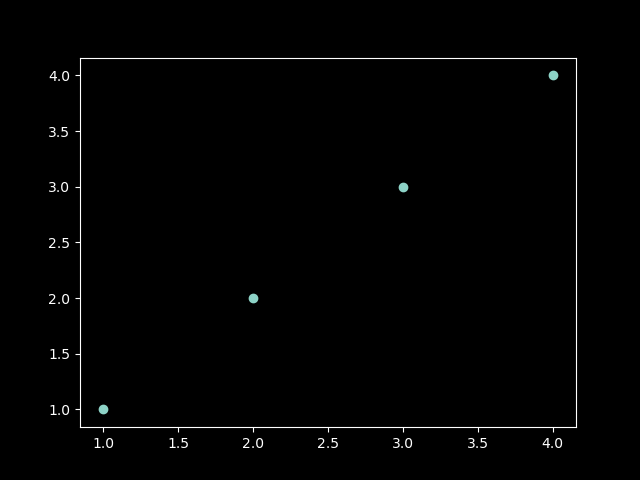

# df(x)=


```python {cmd=true matplotlib=true}
import numpy as np
import matplotlib.pyplot as plt
plt.rcParams['font.family'] = ['sans-serif']
plt.rcParams['font.sans-serif'] = ['SimHei']
matplotlib.rcParams['axes.unicode_minus'] =False
plt.style.use('dark_background')

x=np.arange(-np.pi,np.pi,0.1)
# x2=np.array[1,2,3,4]
y=(x*np.sin(x))/(1+np.power(np.cos(x),2))
# y=2*x

plt.plot(x,y)

plt.title("Matplotlib") 
plt.xlabel("x axis caption") 
plt.ylabel("y axis caption") 

plt.show()
# plt.savefig('./math/1png.png')
```


