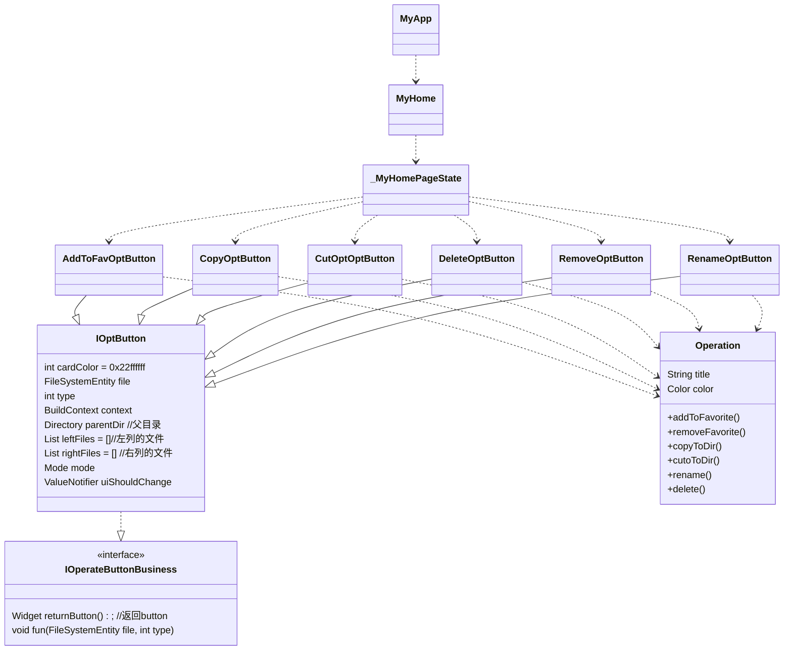

# 问题

- Flutter的嵌套很深, 写一个文件管理器的时候需要写很多操作按钮, 为了做出一下效果, 每个按钮就写的很长, 放在布局里加上响应函数一个类就写的很长, 我这个小屏幕真的是顶不住
- 每次增加一个按钮需要改多个地方的逻辑
- 所以就从这操作按钮的地方开始优化代码结构


# 类图



## 单一职责原则

- 修改前

    ```mermaid
    classDiagram
    class _MyHomePageState{
        +property()  \\属性
        +model() \\模板
        +operation() \\各种对操作的响应函数
    }
    ```
    根据单一职责原则, 将职责划分为1. 属性和模板 2. 响应函数

- 修改后

    ```mermaid
    classDiagram
    class _MyHomePageState{
        +property()  \\属性
        +model() \\模板
    }
    class AddToFavOptButton
    class CopyOptButton
    class CutOptOptButton
    class DeleteOptButton
    class RemoveOptButton
    class RenameOptButton
    _MyHomePageState..>AddToFavOptButton
    _MyHomePageState..>CopyOptButton
    _MyHomePageState..>CutOptOptButton
    _MyHomePageState..>DeleteOptButton
    _MyHomePageState..>RemoveOptButton
    _MyHomePageState..>RenameOptButton
    AddToFavOptButton..>Operation
    CopyOptButton..>Operation
    CutOptOptButton..>Operation
    DeleteOptButton..>Operation
    RemoveOptButton..>Operation
    RenameOptButton..>Operation
    ```

## 开放闭合原则

- 修改前
    ```mermaid
    classDiagram
    class WidgetItem{
        + returnButton()
    }
    class AddToFavOptButton
    class CopyOptButton
    class CutOptOptButton
    class DeleteOptButton
    class RemoveOptButton
    class RenameOptButton
    WidgetItem..>AddToFavOptButton
    WidgetItem..>CopyOptButton
    WidgetItem..>CutOptOptButton
    WidgetItem..>DeleteOptButton
    WidgetItem..>RemoveOptButton
    WidgetItem..>RenameOptButton
    AddToFavOptButton--|>IOptButton
    CopyOptButton--|>IOptButton
    CutOptOptButton--|>IOptButton
    DeleteOptButton--|>IOptButton
    RemoveOptButton--|>IOptButton
    RenameOptButton--|>IOptButton
    ```
    returnButton方法中
    ```dart
    Color color;
    switch(titleText){
      case '删除':
        return 不同的button
        break;
      case '重命名':
        return 不同的button
        break;
      case '复制':
        return 不同的button
        break;
      case '剪切':
        return 不同的button
        break;
      case '收藏':
        return 不同的button
        break;
      case '取消收藏':
        return 不同的button
        break;
    }
    ```
    因为需要不同的button需要widgetItem对button样式进行更改, 所以添加新的button会引起对Widget类的修改
- 修改后
    ```mermaid
    classDiagram
    class AddToFavOptButton{
        +return button
    }
    class CopyOptButton{
        +return button
    }
    class CutOptOptButton{
        +return button
    }
    class DeleteOptButton{
        +return button
    }
    class RemoveOptButton{
        +return button
    }
    class RenameOptButton{
        +return button
    }
    AddToFavOptButton--|>IOptButton
    CopyOptButton--|>IOptButton
    CutOptOptButton--|>IOptButton
    DeleteOptButton--|>IOptButton
    RemoveOptButton--|>IOptButton
    RenameOptButton--|>IOptButton
    ```
    对于新添加的button只需要创建新的继承, 不需要上层对代买的修改. 在布局里面使用的时候new xxxxxbutton(参数列表).returnButton();


1. m>3 i随意, j随意
2. 0