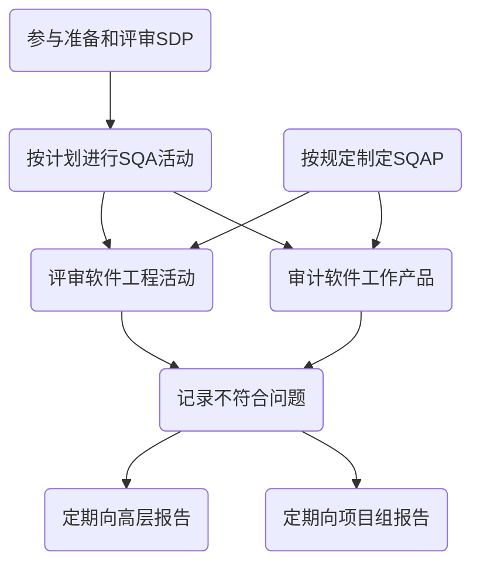

```mermaid
graph TD
can(参与准备和评审SDP) --> an(按计划进行SQA活动) --> ping
angui(按规定制定SQAP) --> ping(评审软件工程活动)
angui(按规定制定SQAP) --> shen(审计软件工作产品)
an(按计划进行SQA活动) --> shen
shen --> ji(记录不符合问题) --> dinggao(定期向高层报告)
ping --> ji --> ding(定期向项目组报告)
```