# 1. 数据库程序设计

## 1.1. 课程简介


主服务服务1 ORCL数据库名字


客户端 服务端 服务2 (有一个Listener 监听(有访问就搭一个桥))

每个用户下有不同数据库对象

sys
system 
scott/tiger

## 1.2. 数值函数

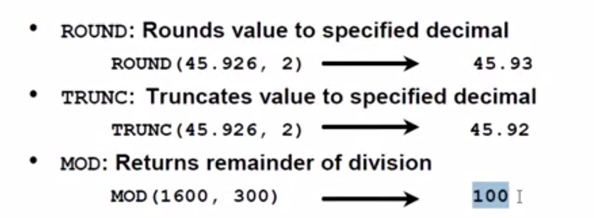

ROUND:四舍五入 TRUNC:截取(Oracle)

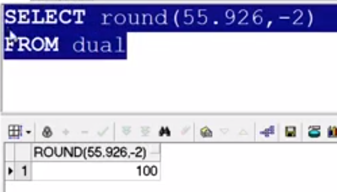

## 1.3. 字符函数


- LENGTH (oracle) len(SS)
  - 汉字个数 
  - lengthb 字节数
- LTRIM,RTRIM(SS); TRIM(oracle) 去空格
  - 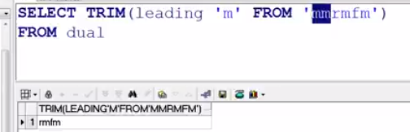
  - 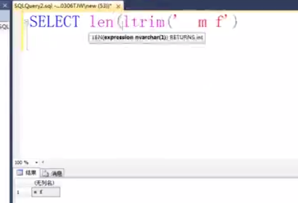
- SUBSTR,1 可省
  - 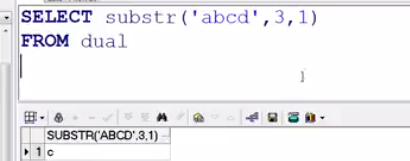
	,1 可省
- INSTR:
  - 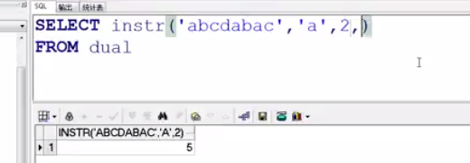
    pos 从第几个开始
  - 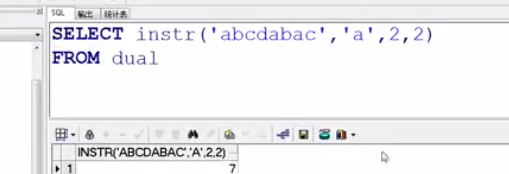
    nth 第几个

 ## 日期格式

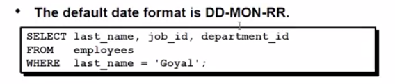

<center>Orcale</center>
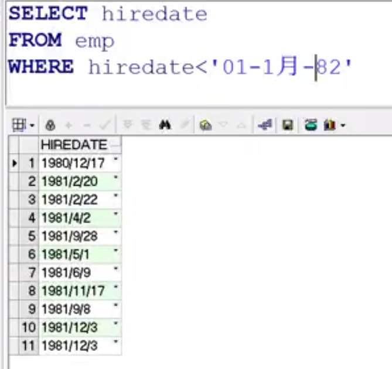

## 1.4. 日期运算

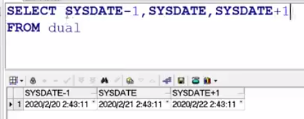


日期不能相加,可以相减 (差多少天)


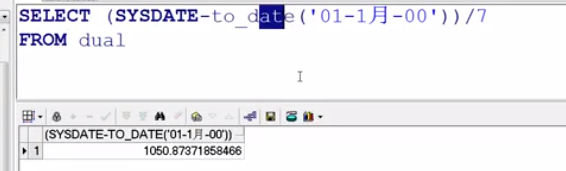


## 1.5. 日期处理

- `ADD_MONTHS(‘starting_date’,number_of_months)`
  - (日期,加几个月)
  - 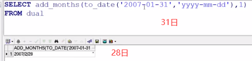
- `LAST_DAY(‘date’)`
  - 这个月的最后一天
- `MONTHS_BETWEEN(later_date,earlier_date)`
  - 日期间相差多少月
- `next_day`
  - 如果写星期几,就是还没过的下一个,不是下周的
  - 如果写数字,就是下个星期的第几天,周日是第一天
  - 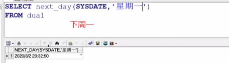

## 1.6. 字符函数

oracle 字符串 大小写敏感
SS 不敏感

- `upper.lower`
  
  - 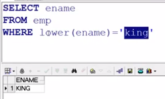
  
- `initcap` 首字母大写 (其他转成小写)

  - 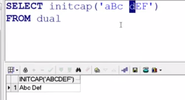


## 1.7. 其他函数

- `NVL(input_value,result_if_value_is_null)`
  -  两个参数要求数据类型一样
  - 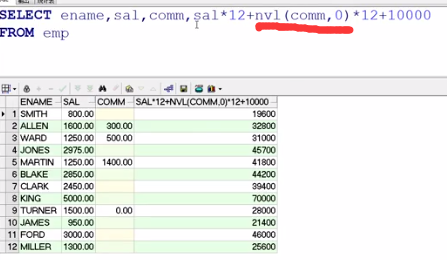
  - 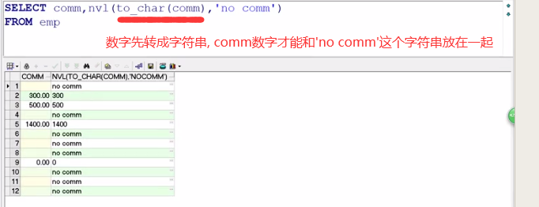
- `nvl2(input,value1,value2)`
  - 后两个参数类型一样
  - 如果表达式input不是空值，则返回value1值；否则返回value2值。
- `to_date`
  - 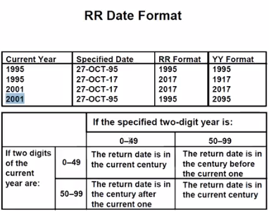
  - yy就是当前时间所在世纪
  - rr是离当前时间所在世纪较近的世纪
- `to_char`
  - 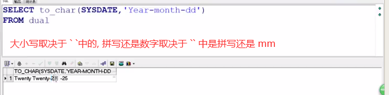
  - 一个d就是这个这个星期的第几天
  - 两个d就是这个月的第几天
  - 三个d就是这个年的第几天
  - 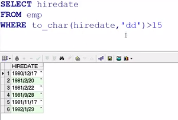
  - 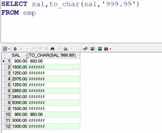
    - 位数少了就###
  - 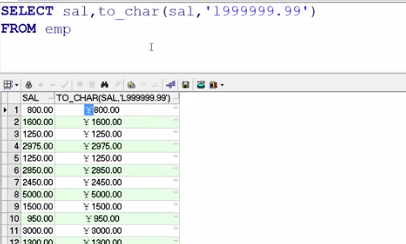
    - `l`当地货币
    - 写前面,就前面;写后面就后面($怎么写都是前面)
    - 可以加`,` 三位一分
- `to_number`

## 1.8. 工具的使用`SQlPlus`

- 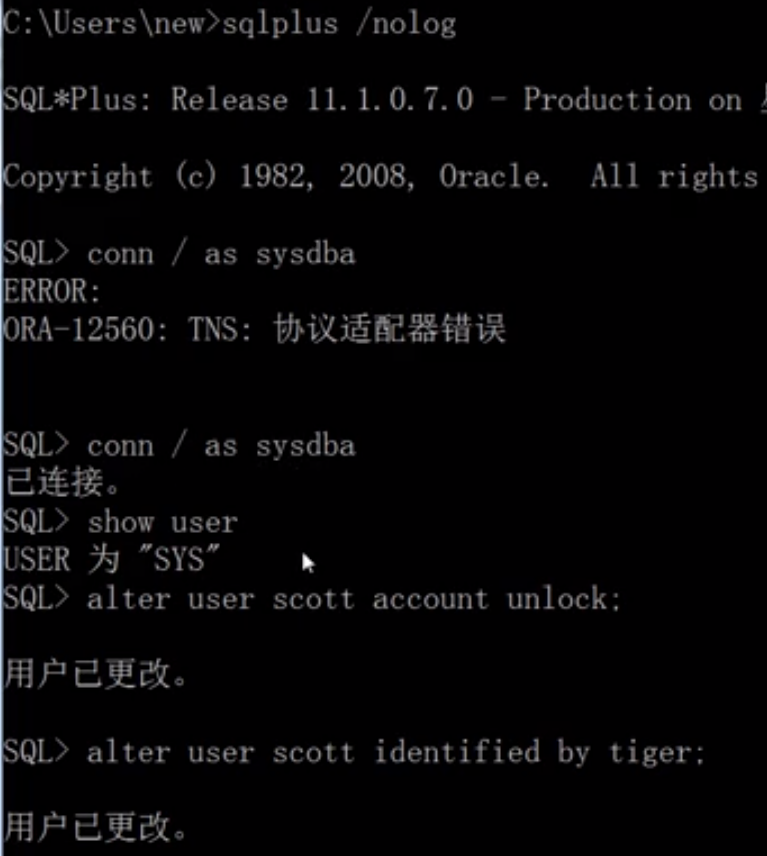

### 1.8.1. PL/SQL Developer

## 1.9. PL/SQL概述

- 过程化语言(扩展SQL)
  - IBM
    - SQL PL(Structured Query Language Proceduaral Language)
  - MicroSoft
    - T-SQL(Transact-SQL)
  - Oracle
    - PL/SQL(Proceduaral Lauguage/Structured Query Language)
- PL/SQL
  - 可以直接放在PLSQL中
    - select
    - dml: sert,update,delete,merge
    - commit,rollback,savepoint
  - 不可以直接放在PLSQL中(动态执行)
    - ddl:create,alert, drop,truncate, rename
    - dcl:grant revoke
- 优点
  - 改善性能
    - 发送整个语句块,单词调用完成,降低网络拥堵
  - 可重用性
    - 跨平台
  - 模块化
    - 程序块实现一个逻辑操作,分割不同任务,可独立/嵌套
- 块的类型
  - 匿名块
    - 不能保存在数据库中
  - 命名块
    - 包
      - 过程
      - 函数
      - (变量,类型等)
    - 触发器
      - 触发事件自动执行 ~~调用时执行~~
- PL/SQL块
  - DECLARE-可选
    - 变量,常量,游标,用户自定义的特殊类型
  - BEGIN-必须
    - SQL语句
    - PL/SQL语句
  - EXCEPTION-可选
    - 错误发生时的处理动作
  - END;-必须
- PL/SQL语句的处理
  - <center>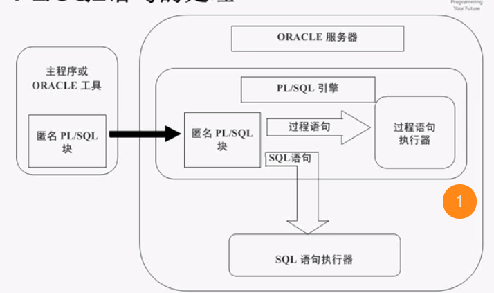</center>
- 变量
  - $\leqslant$30
  - ~~保留字~~
  - 字母开头
  - 字母,$,_,#,数字
  - 不建议与列名(字段名)相同
  - 类型
    - PL/SQL变量
      - **标量型**(不能拆分,只能存储单值,内部没有分量)
      - 复合型
      - 引用型
      - LOB型(大型对象)
  - 外部变量
    - 表单应用程序中的屏幕域
    - SQL Plus主机变量
    - <center>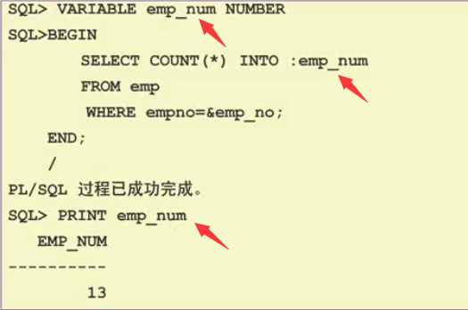</center>
  - 声明/定义变量
    - `variable_name [CONSTANT] type [NOT NULL] [:=value];`
  - %TYPE属性
    - ```sql
      v-name                       emp.ename%TYPE
      v_min_balance                v_balance%TYPE :=10
      ```
  - 其他变量
    - CLOB 食谱
    - BLOB 照片
    - BFILE 电影 (存在数据库外面,数据库存指针)
- 注释
  - `DBMS_OUTPUT.PUT_LINE`
  - 代码注释
    - /**/
    - \-\-

### 1.9.1. PLSQL中的SQL函数

- 过程语句中的有效函数
  - 单行数字(MOD,ROUND,TRUNC)
  - 单行字符(COUNT,LENGTH,LOWER,SUBSTR)
  - 数据类型转换(TO_CHAR,TO_DATE,TO_NUMBER)
  - 日期(ADD_MONTHS,SYSDATE,MONTH_BETWEEN)
- 过程语句中的无效函数
  - decode
  - 分组函数(avg,min,max,count,sum)
    - 仅在PLSQL块的SQL语句中适用


### 1.9.2. 控制执行部分的流程

- 条件分支语句
  - IF
    - if, then, end if
    - if, then, else, end if
    - if, then, elsif, end if
  - case
    - case selector
      - when exoression 1/n then result_{1}/n
      - [else resultn+1]
    - end
- 循环语句  
  - loop
    - Basic loop 无条件的循环
      - ```sql
        loop
          statement1;
          ...
          exit [when condition]
        end loop;
        ```
    - FOR loop 有计数的循环
      - ```sql
        BEGIN
         FOR i IN [REVERSE] 1..5 LOOP 
         dbms_output.put_line( 'i='||i ); 
         END LOOP; 
         dbms_output.put_line('end of loop'); 
        END;
        ```
    - WHILE loop 有条件循环
      - ```sql
        DECLARE x number; 
        BEGIN
         x:=0; 
         WHILE x<=3 LOOP
          x:=x+1;
          dbms_output.put_line( '内:x='||x );
         END LOOP;
        dbms_output.put_line('外:x='||x);  //
        END;
        ```
    - exit 强制结束

### 1.9.3. PLSQL中

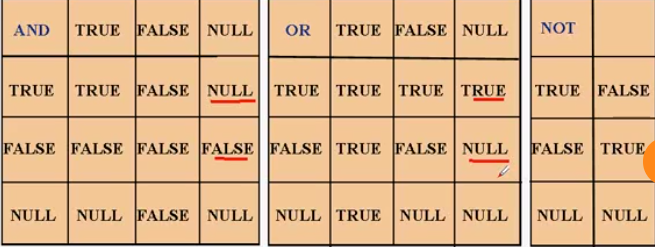