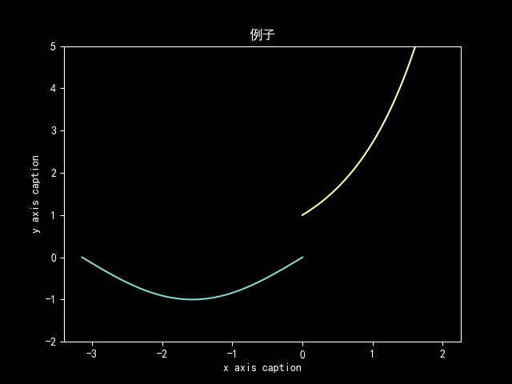

# 1. 不定积分与定积分的概念性质理论

## 1.1. 重要性质

### 1.1.1. 定积分存在定理 <kbd><font color=#f8e800>定理3.1.1</font></kbd>

> 1. 设$f(x)$在$[a, b]$上<font color=#2486b9>连续</font>, $\Rightarrow\int_{a}^{b}f(x) dx$存在  
> 2. 设$f(x)$在$[a,b]$上<font color=#2486b9>有界</font>,且只有<font color=#2486b9>有限个间断点</font>,$\Rightarrow\int_{a}^{b}f(x)dx$存在,  
>    1. (<font color=#2486b9>原函数不一定存在</font>,有跳跃间断点$\Rightarrow$一定不存在原函数)  
>    2. (若不连续,原函数与定积分是否存在可以不相干)

### 1.1.2. 原函数存在定理 <kbd><font color=#f8e800>定理3.1.2</font></kbd>

> 设$f(x)$在$[a,b]$上<font color=#2486b9>连续</font>,必存在原函数


### 1.1.3. 变上限函数对上限变量求导, 或称不定积分与定积分的关系 <kbd><font color=#f8e800>定理3.1.3</font></kbd>

> $f(x)$在$[a,b]$上连续, 则$\lgroup\int_{a}^{x}f(t)\mathrm{d}t\rgroup'_{x}=f(x)$  
> $$\int_{}^{}f(x)\mathrm{d}x=\int_{a}^{x}f(t)\mathrm{d}t+C$$

注: 

> $$
> \begin{aligned}
> &x_0\text{处跳跃间断点}, \text{其他连续}, 
> \\&\lim_{ x\rightarrow x_0^{-}} f(x)=f(x_0^{-}), \lim_{x\rightarrow x_0^{+}} f(x)=f(x_0^{+}), 
> \\&F(x)=\int_{c}^{x}f(x)dx
> \\&\text{不论}c\text{是否等于}x_0, \text{都有}
> \\&\text{\textcircled {1}}F(x)\text{在}[a, b]\text{上连续}; 
> \\&\text{\textcircled {2}}F'(x)=f(x) (x\neq x_0)
> \\&\text{\textcircled {3}}F_{-}^{'}(x_0)=f(x_0^{-}), F_{+}'(x_0)=f(x_0^{+}) \rightarrow \text{左右导数不相同}\rightarrow\text{不可导}
> \end{aligned}
> $$

<details>
<summary>源代码</summary>

```python {cmd=true matplotlib=true}
import numpy as np
import matplotlib.pyplot as plt
plt.rcParams['font.family'] = ['sans-serif']
plt.rcParams['font.sans-serif'] = ['SimHei']
matplotlib.rcParams['axes.unicode_minus'] =False
plt.style.use('dark_background')

x_1=np.linspace(-np.pi,0)
y_1=np.sin(x_1)
x_2=np.linspace(0,2)
y_2=np.power(np.e,x_2)

plt.ylim(-2,5)

plt.title("例子") 
plt.xlabel("x axis caption") 
plt.ylabel("y axis caption") 

plt.plot(x_1,y_1)
plt.plot(x_2,y_2)
plt.show()
plt.savefig('./3_一元函数积分学/1png.png')
```
</details>

<center>



</center>


### 1.1.4. 牛顿莱布尼兹定理<kbd>3.1.4</kbd>

> 算定积分

### 1.1.5. 定积分的性质<kbd>3.1.6</kbd>

1. 
    $$
    \begin{aligned}
        & f(x)\&g(x),[a,b]\textcolor{lightgreen}{\text{连续}},f(x)\leqslant g(x) \\
        & \rightarrow\text{至少一点}x_1,\rightarrow f(x_1)<g(x_1)\\
        & \text{则}\int_{a}^{b}f(x)\mathrm{d}x<\int_{a}^{b}g(x)\mathrm{d}x
    \end{aligned}
    $$
2. 积分中值定理
    $$
    \begin{aligned}
    &{\color{lightgreen}\text{连续}} \\
    &\int_{a}^{b}f(x)dx=f(\xi )(b-a)
    \end{aligned}
    $$

# 2. 不定积分与定积分的计算

## 2.1. 基本积分公式

> $$
> \begin{aligned}
> \int_{}^{}\sec xdx&=\ln |\sec x+\tan x|+C 
> \\\int_{}^{}\csc xdx&=\ln |\csc x-\cot x|+C
> \end{aligned}
> $$

## 2.2. 基本积分方法

### 2.2.1. 第一换元法(不定积分的凑微分求积分法)

$$
\begin{aligned}
\int_{}^{}f(\varphi (x))\varphi '(x)\mathrm{d}x=\int_{}^{}f(\varphi (x))\mathrm{d}\varphi (x)\overset{\varphi (x)=u}{=}\int_{}^{}f(u)\mathrm{d}u\\
\overset{\text{如果}}{=}F(u)+C\overset{\text{则}}{=}F(\varphi (x))+C 
\end{aligned}
$$

### 2.2.2. 第二换元法(不定积分的换元积分法)

$$
\begin{aligned}
    \int_{}^{}f(x)\mathrm{d}x\overset{x=\varphi (x)}{=}(\int_{}^{}f(\varphi (t))\varphi '(t)\mathrm{d}t)_{t=\psi(x)}\\
\end{aligned}
$$

### 2.2.3. 典型类型的换元法

<center>


</center>

> $$
> \begin{aligned}
> \text{\textcircled {1}}&
> \\&\sqrt[]{a^2-x^2}\rightarrow x=a\sin t, dx=a\cos tdt, \sqrt[]{a^2-x^2}=a\cos t(算定积分的时候a|\cos t|)
> \\&\sqrt[]{x^2+a^2}\rightarrow x=a\tan t, dx=a\sec ^2tdt 
> \\&\sqrt[]{x^2-a^2}\rightarrow x=a\sec t, dx=a\sec \tan tdt
> \\&\text{按勾股定理记}
> \\\text{\textcircled {2}}&\int_{}^{}R(x,\sqrt[n]{ax+b},\sqrt[m]{ax+b})\mathrm{d}x
> \\&\sqrt[mn]{ax+b}\rightarrow  \text{命}\sqrt[k]{ax+b}=t, x=\frac{t^{k}-b}{a}, dx=\frac{mn}{a}t^{k-1}dt(k\text{为}mn\text{的最小公倍数})
> \text{\textcircled {3}}\\&
> \\&\sqrt[]{\frac{ax+b}{cx+d}}\rightarrow \text{命}\sqrt[]{\frac{ax+b}{cx+d}}=t, x=\frac{dt^2-b}{a-ct^2}, dx=\frac{2(ad-bc)t}{(a-ct^2)^2}dt
> \\\text{\textcircled {4}}&\int_{}^{}R(\sin x, \cos x)dx
> \\&\text{命}\tan \frac{x}{2}=t, \sin x=\frac{2t}{1+t^2}, \cos x=\frac{1-t^2}{1+t^2}, dx=\frac{2}{1+t^2}dt(\text{万能代换})
> \\&\text{推导}:
> \end{aligned}
> $$

<center>
  

</center>

## 2.3. 定积分公式

### 2.3.1. 华里士公式

> $$
> \begin{aligned}
> \int_{0}^{\frac{\pi}{2}}\sin ^{n}xdx=\int_{0}^{\frac{\pi}{2}}\cos ^{n}xdx=
> \begin{cases}
> \frac{n-1}{n}\cdot \frac{n-3}{n-2}\cdot \cdot \cdot \cdot \cdot \frac{1}{2}\cdot \frac{\pi}{2}, &(\text{当}n\text{为正偶数} )
> \\\frac{n-1}{n}\cdot \frac{n-3}{n-2}\cdot \cdot \cdot \cdot \cdot \frac{2}{3}\cdot 1, &(\text{当}n\text{为大于}1\text{的正奇数})
> \end{cases}
> \end{aligned}
> $$

# 3. 反常积分及其计算与判敛

## 3.1. 定义

### 3.1.1. 无穷区间反常积分
> $$
> \begin{aligned}
> &[a, \infty )\text{连续}
> \\&\int_{a}^{+\infty }f(x)dx=\lim_{b\rightarrow -\infty } \int_{a}^{b}f(x)dx  
> \\&\int_{-\infty }^{+\infty }f(x)dx=\int_{-\infty }^{c}f(x)dx+\int_{c}^{+\infty }f(x)dx
> \\&\text{有一个积分不存在}, \text{就称反常积分发散}
> \end{aligned}
> $$

### 3.1.2. 无界函数反常积分

$$
\begin{aligned}
&\text{连续}, \lim_{x\rightarrow b^{-}} f(x) =\infty (b\text{为}{\color{blue}\text{奇点}})
\\&\int_{a}^{b}f(x)dx=\lim_{\beta \rightarrow b^{-}} \int_{a}^{\beta }f(x)dx
\\&\text{若}a, b\text{都为奇点}, \text{应分成}
\\&\int_{a}^{b}f(x)dx= \int_{a}^{x_0}f(x)dx+\int_{x_0}^{b}f(x)dx
\\&\text{内部}c\text{为奇点}
\\&\int_{a}^{b}f(x)dx=\int_{a}^{c}f(x)dx+\int_{c}^{b}f(x)    
\end{aligned}
$$

## 3.2. 重要性质, 定理, 公式

### 3.2.1. 对称区间上奇偶函数反常积分
1.
$$
\begin{aligned}
&{\color{blue}\text{连续}, \text{奇函数}}, {\color{red}\int_{0}^{+\infty }f(x) dx\text{收敛}}, \rightarrow \int_{-\infty }^{+\infty }f(x) dx=0
\\&\text{偶函数为}2\text{倍}, \text{注意}\int_{0}^{+\infty }f(x) dx\text{收敛的条件}
\end{aligned}
$$

### 3.2.2. 一个重要的反常积分

$$
\int_{-\infty }^{+\infty }e^{-x^2}dx=2\int_{0}^{+\infty }e^{-x^2}dx=\sqrt[]{\pi}  
$$

# 4. 定积分的应用

## 4.1. 基本方法

$$
\begin{aligned}
\Delta F&=f(x)\Delta x+o(\Delta x)
\\F&=\int_{a}^{b}f(x)dx.
\end{aligned}
$$

## 4.2. 重要几何公式与物理应用

### 4.2.1. 平面图形面积

* 极坐标

$$
A=\frac{1}{2}\int_{\alpha}^{\beta}r^2(\theta )d\theta 
$$

### 4.2.2. 平面曲线的弧长

$ds=\sqrt[]{(dx)^2+(dy)^2} $
$$
\begin{aligned}
&\text{参数方程}
\\&s=\int_{\alpha}^{\beta }\sqrt[]{x'^2(t)+y'^2(t)}dt
\\&\text{直角坐标}
\\&s=\int_{a}^{b}\sqrt[]{1+y'^2(x)}dx 
\\&\text{极坐标}r=r(\theta )
\\&s=\int_{\alpha}^{\beta }\sqrt[]{r^2(\theta )+r'^2(\theta )}d\theta  
\end{aligned}
$$

### 4.2.3. 旋转体的体积

$$
\begin{aligned}
&y_1, y_2, x=a, x=b, x\text{轴旋转}
V=\pi\int_{a}^{b}[y_2^2(x)-y_1^2(x)]dx
\\&y_1, y_2, x=a, x=b, y\text{轴旋转}
V=2\pi\int_{a}^{b}x(y_2(x)-y_1(x))dx
\end{aligned}
$$

### 4.2.4. 旋转曲面面积

$$
S=2\pi\int_{a}^{b}|y|ds 
$$

# 5. 定积分的证明题

