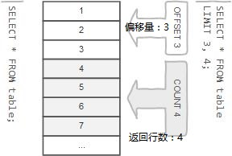

<style type="text/css">  
    body b,body strong{ color: #F07172; }
    .katex *{ color: #139f64; }
    html body img{ border-radius: 15px;box-shadow: 6px 7px 4px; }
    body .mord .cjk_fallback{ color: white; }
</style>

## 函数

# limit

[原文](https://www.yiibai.com/mysql/limit.html)

```plsql
SELECT 
    column1,column2,...
FROM
    table
LIMIT offset , count;
```

- offset参数指定要返回的第一行的偏移量。第一行的偏移量为0，而不是1。
- count指定要返回的最大行数。
    
