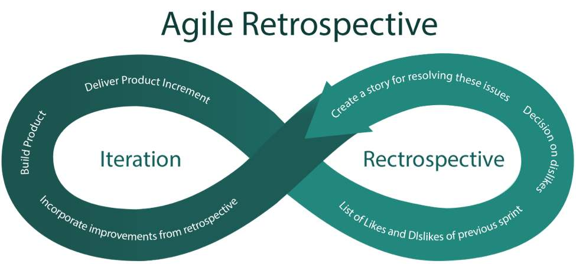

[参考](https://www.onedesk.com/scrum-methodology-vs-agile-methodology/)

# 敏捷项目管理源于?

丰田在汽车制造业中创造的"精益管理"理念 + 在2001年正式化的"敏捷宣言"(Agile Manifesto)

# Scrum就是敏捷(Agile)吗?

敏捷方法(Agile mothodology)有很多种,Scrum是其中最受欢迎的

# Scrum为什么受欢迎?

1. 简单+很大的灵活性
2. 独一无二的地方: 引入了"经验过程控制(empirical process control)": 使用项目的实际进度(~~best guess or uninformed forecast~~)规划和安排发布,因此可以在更短的时间内交付价值

# Scrum和敏捷

- Scrum是Agile的一种形式
- Agile不是规定性的,给你提出具体的步骤留下了很大的空间
- Scrum更具规定性,对于项目管理有更加严格的"规则"(仍不是很严格)