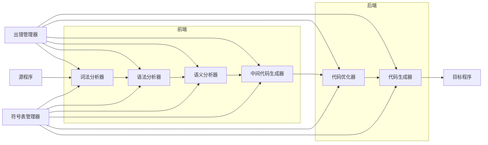
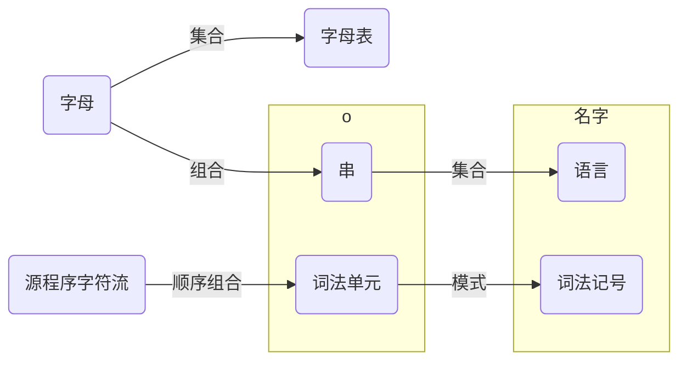
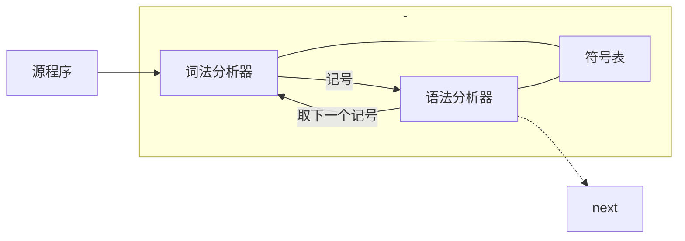

# 1. 绪论

## 1.1. 识别过程

词法-语法-语义(分析)-中间代码生成-可执行代码

## 1.2. 编译器构造与分析

$\rightarrow [集成开发环境(编辑器\overset{源程序}{\rightarrow }编译器)]\left\{\begin{matrix}
\overset{可执行程序.exe}{\rightarrow }
\\\rightarrow 解释器\overset{可执行程序.exe}{\rightarrow }
\end{matrix}\right. 操作系统$

## 1.3. 前端后端




- 前端 
  - 只依赖源程序
  - 独立于目标机器(生成中间代码)
- 后端
  - 与源程序无关
  - 依赖于目标机器
  - 有关: (只)中间语言(中间代码$\rightarrow$目标代码)
- 好处
  - 提高开发编译器效率
    - 前端重用
    - 重写后端


## 1.4. 翻译器

源语言$\rightarrow$目标语言

## 1.5. 编译器

一种翻译器  
目标语言比源语言更低级  
处理编程语言(机器, 汇编, 高级)

# 2. 词法分析器

* 识别单词
* 源程序$\rightarrow$词法记号(token)流  <font color="#f9bd10">(记号名,属性值)-区分标识符</font>

  $<id, 1>\ <=>\ <30>$  

* 符号表放id  
* 和用户接口的一些任务
* 输出: 单词种别编码 和 单词属性值


## 2.1. 词法单元

* 单词
* 编程语言中合法的字符串

## 2.2. 词法记号

* 词法单元 $\rightarrow$满足给定规则 $\rightarrow$词法记号

### 2.2.1. 属性

* 词法记号具有一定含义

### 2.2.2. 串和语言



## 2.3. 词法记号识别

* 对字符串的匹配
* 可以基于有限状态机

### 2.3.1. 有限状态机

#### 2.3.1.1. 确定的有限自动机(DFA)

* 状态集合S
* 输入字母表 $\Sigma$
* 转换函数 $move: S\times\Sigma\rightarrow S$
* 唯一的初态 $s\in S$
* 终态集合 $F\subseteq S$

#### 2.3.1.2. 不确定的有限自动机(NFA)

* 状态集合S
* 输入字母表 $\Sigma$
* 转换函数 $move: S\times\{\Sigma\cup\{\epsilon\}\}\rightarrow P\{S\}$
* 唯一的初态 $s\in S$
* 终态集合 $F\subseteq S$

#### 2.3.1.3. DFA构建


* 自然语言 $\rightarrow$ $DFA$
* 正规式 $\rightarrow$ $DFA$\
<font color="#33CCFF">
  * 先画出主要的一条通路
  * 然后补成全函数,看遇到输入跳转到哪个状态
  * </font> $(a|b)^*a$
    ```dot
    digraph finite_state_machine {
    rankdir = LR; size = "8,5"
        node[shape = point]
        start
        node [shape = doublecircle];
        node [shape = circle]; 
        start->1
        1->2 [label="a"]
        1->1 [label = "b" ]
        2->3 [label = "a" ]
    
    }
    ```
* 正规式 $\rightarrow$ $NFA$ $\rightarrow$ $DFA$    
  + NFA构建
    - 识别 $\epsilon$ 和 字母表符号的 $NFA$
    - 识别 选择
    - 识别 连接
    - 识别 闭包
  + NFA $\rightarrow$DFA转化
    - 子集构造法
        - 开始符号不用任何输入($\epsilon$)能到的状态算一堆
        - 遇到每个输入整一个状态--画表
        - 没有对某个输入的转换那就空着
  + DFA化简
    - (正规集表示: 唯一 状态最少 DFA 识别)
    - (状态分成不相交的子集)
    - 添加死状态$S_d$,所有输入转换到$S_d$本身 $\rightarrow$ 全函数
    - 宗旨:一个集合遇到输入分到一个集合的子集就是一起的,如果分到其他集合去了,就把它划分出去
    - (1) 接受状态和非接受状态 ($\epsilon$可判断) $\rightarrow$ 初始划分 $\prod$
    - (2) $for(\prod中的每个子集G)\{$  
&emsp; &emsp; &emsp; $划分子集G: 对于任意输入a, 转换到\prod的同一子集$  
&emsp; &emsp; &emsp; $\prod_{new}中用G的划分代替G\ \ \}$ 
    - (3) `if` ($\prod_{new}=\prod$) $\prod_{final}=\prod\rightarrow(4)$ `else` $\prod=\prod_{new}\rightarrow$ (2)
    - (4) $\prod_{final} 状态子集选一个代表$
    - (5) `if` ($M'$ 有死状态) 去掉  

&emsp; &emsp; 开始状态不可达的删除  
&emsp; &emsp; 到死状态的转换改成无定义

## 2.4. 正规式

- 存在一个$DFA$接受这个语言:正规语言


1. 按照一组定义规则
2. 由简单正规式构成
3. 正规式r表示语言L(r)
4. 表示简单的语言$\rightarrow$正规集
5. <font color="#f9bd10">正规式等价: 识别的语言集相等</font>


<center>
</center>

## 2.5. 词法模式

* 给定规则



## 2.6. 词法错误

### 2.6.1. 恢复策略

* 紧急恢复
* 错误修补尝试
  + 删多余字符
  + 插入遗漏字符
  + 正确字符代替
  + 交换相邻字符
