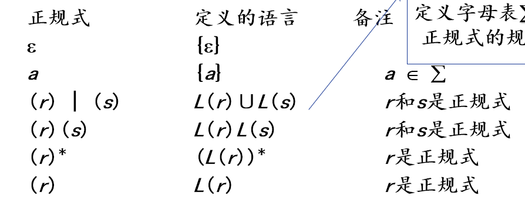

<html>
<body>

&nbsp;

<h1>1. 绪论</h1>
<h2>1.1. 识别过程</h2>

词法-语法-语义(分析)-中间代码生成-可执行代码

<h2>1.2. 编译器构造与分析</h2>

<svg xmlns:xlink="http://www.w3.org/1999/xlink" width="64.758ex" height="8.334ex" viewBox="0 -2056.4 27882 3588.3" role="img" focusable="false" style="vertical-align: -3.558ex;"><defs><path stroke-width="0" id="E1-MJMAIN-2192" d="M56 237T56 250T70 270H835Q719 357 692 493Q692 494 692 496T691 499Q691 511 708 511H711Q720 511 723 510T729 506T732 497T735 481T743 456Q765 389 816 336T935 261Q944 258 944 250Q944 244 939 241T915 231T877 212Q836 186 806 152T761 85T740 35T732 4Q730 -6 727 -8T711 -11Q691 -11 691 0Q691 7 696 25Q728 151 835 230H70Q56 237 56 250Z"></path><path stroke-width="0" id="E1-MJMAIN-5B" d="M118 -250V750H255V710H158V-210H255V-250H118Z"></path><path stroke-width="0" id="E1-MJMAIN-28" d="M94 250Q94 319 104 381T127 488T164 576T202 643T244 695T277 729T302 750H315H319Q333 750 333 741Q333 738 316 720T275 667T226 581T184 443T167 250T184 58T225 -81T274 -167T316 -220T333 -241Q333 -250 318 -250H315H302L274 -226Q180 -141 137 -14T94 250Z"></path><path stroke-width="0" id="E1-MJMAIN-29" d="M60 749L64 750Q69 750 74 750H86L114 726Q208 641 251 514T294 250Q294 182 284 119T261 12T224 -76T186 -143T145 -194T113 -227T90 -246Q87 -249 86 -250H74Q66 -250 63 -250T58 -247T55 -238Q56 -237 66 -225Q221 -64 221 250T66 725Q56 737 55 738Q55 746 60 749Z"></path><path stroke-width="0" id="E1-MJMAIN-5D" d="M22 710V750H159V-250H22V-210H119V710H22Z"></path><path stroke-width="0" id="E1-MJMAIN-7B" d="M434 -231Q434 -244 428 -250H410Q281 -250 230 -184Q225 -177 222 -172T217 -161T213 -148T211 -133T210 -111T209 -84T209 -47T209 0Q209 21 209 53Q208 142 204 153Q203 154 203 155Q189 191 153 211T82 231Q71 231 68 234T65 250T68 266T82 269Q116 269 152 289T203 345Q208 356 208 377T209 529V579Q209 634 215 656T244 698Q270 724 324 740Q361 748 377 749Q379 749 390 749T408 750H428Q434 744 434 732Q434 719 431 716Q429 713 415 713Q362 710 332 689T296 647Q291 634 291 499V417Q291 370 288 353T271 314Q240 271 184 255L170 250L184 245Q202 239 220 230T262 196T290 137Q291 131 291 1Q291 -134 296 -147Q306 -174 339 -192T415 -213Q429 -213 431 -216Q434 -219 434 -231Z"></path><path stroke-width="0" id="E1-MJMAIN-2E" d="M78 60Q78 84 95 102T138 120Q162 120 180 104T199 61Q199 36 182 18T139 0T96 17T78 60Z"></path><path stroke-width="0" id="E1-MJMATHI-65" d="M39 168Q39 225 58 272T107 350T174 402T244 433T307 442H310Q355 442 388 420T421 355Q421 265 310 237Q261 224 176 223Q139 223 138 221Q138 219 132 186T125 128Q125 81 146 54T209 26T302 45T394 111Q403 121 406 121Q410 121 419 112T429 98T420 82T390 55T344 24T281 -1T205 -11Q126 -11 83 42T39 168ZM373 353Q367 405 305 405Q272 405 244 391T199 357T170 316T154 280T149 261Q149 260 169 260Q282 260 327 284T373 353Z"></path><path stroke-width="0" id="E1-MJMATHI-78" d="M52 289Q59 331 106 386T222 442Q257 442 286 424T329 379Q371 442 430 442Q467 442 494 420T522 361Q522 332 508 314T481 292T458 288Q439 288 427 299T415 328Q415 374 465 391Q454 404 425 404Q412 404 406 402Q368 386 350 336Q290 115 290 78Q290 50 306 38T341 26Q378 26 414 59T463 140Q466 150 469 151T485 153H489Q504 153 504 145Q504 144 502 134Q486 77 440 33T333 -11Q263 -11 227 52Q186 -10 133 -10H127Q78 -10 57 16T35 71Q35 103 54 123T99 143Q142 143 142 101Q142 81 130 66T107 46T94 41L91 40Q91 39 97 36T113 29T132 26Q168 26 194 71Q203 87 217 139T245 247T261 313Q266 340 266 352Q266 380 251 392T217 404Q177 404 142 372T93 290Q91 281 88 280T72 278H58Q52 284 52 289Z"></path><path stroke-width="0" id="E1-MJSZ4-23A7" d="M712 899L718 893V876V865Q718 854 704 846Q627 793 577 710T510 525Q510 524 509 521Q505 493 504 349Q504 345 504 334Q504 277 504 240Q504 -2 503 -4Q502 -8 494 -9T444 -10Q392 -10 390 -9Q387 -8 386 -5Q384 5 384 230Q384 262 384 312T383 382Q383 481 392 535T434 656Q510 806 664 892L677 899H712Z"></path><path stroke-width="0" id="E1-MJSZ4-23A9" d="M718 -893L712 -899H677L666 -893Q542 -825 468 -714T385 -476Q384 -466 384 -282Q384 3 385 5L389 9Q392 10 444 10Q486 10 494 9T503 4Q504 2 504 -239V-310V-366Q504 -470 508 -513T530 -609Q546 -657 569 -698T617 -767T661 -812T699 -843T717 -856T718 -876V-893Z"></path><path stroke-width="0" id="E1-MJSZ4-23A8" d="M389 1159Q391 1160 455 1160Q496 1160 498 1159Q501 1158 502 1155Q504 1145 504 924Q504 691 503 682Q494 549 425 439T243 259L229 250L243 241Q349 175 421 66T503 -182Q504 -191 504 -424Q504 -600 504 -629T499 -659H498Q496 -660 444 -660T390 -659Q387 -658 386 -655Q384 -645 384 -425V-282Q384 -176 377 -116T342 10Q325 54 301 92T255 155T214 196T183 222T171 232Q170 233 170 250T171 268Q171 269 191 284T240 331T300 407T354 524T383 679Q384 691 384 925Q384 1152 385 1155L389 1159Z"></path></defs><g stroke="currentColor" fill="currentColor" stroke-width="0" transform="matrix(1 0 0 -1 0 0)"><use xlink:href="#E1-MJMAIN-2192" x="0" y="0"></use><use xlink:href="#E1-MJMAIN-5B" x="1277" y="0"></use><g transform="translate(1555,0)"><text font-family="STIXGeneral,'Arial Unicode MS',serif" stroke="none" transform="scale(43.711) matrix(1 0 0 -1 0 0)">集</text></g><g transform="translate(2381,0)"><text font-family="STIXGeneral,'Arial Unicode MS',serif" stroke="none" transform="scale(43.711) matrix(1 0 0 -1 0 0)">成</text></g><g transform="translate(3207,0)"><text font-family="STIXGeneral,'Arial Unicode MS',serif" stroke="none" transform="scale(43.711) matrix(1 0 0 -1 0 0)">开</text></g><g transform="translate(4032,0)"><text font-family="STIXGeneral,'Arial Unicode MS',serif" stroke="none" transform="scale(43.711) matrix(1 0 0 -1 0 0)">发</text></g><g transform="translate(4858,0)"><text font-family="STIXGeneral,'Arial Unicode MS',serif" stroke="none" transform="scale(43.711) matrix(1 0 0 -1 0 0)">环</text></g><g transform="translate(5684,0)"><text font-family="STIXGeneral,'Arial Unicode MS',serif" stroke="none" transform="scale(43.711) matrix(1 0 0 -1 0 0)">境</text></g><use xlink:href="#E1-MJMAIN-28" x="6510" y="0"></use><g transform="translate(6899,0)"><text font-family="STIXGeneral,'Arial Unicode MS',serif" stroke="none" transform="scale(43.711) matrix(1 0 0 -1 0 0)">编</text></g><g transform="translate(7724,0)"><text font-family="STIXGeneral,'Arial Unicode MS',serif" stroke="none" transform="scale(43.711) matrix(1 0 0 -1 0 0)">辑</text></g><g transform="translate(8550,0)"><text font-family="STIXGeneral,'Arial Unicode MS',serif" stroke="none" transform="scale(43.711) matrix(1 0 0 -1 0 0)">器</text></g><g transform="translate(9654,0)"><use xlink:href="#E1-MJMAIN-2192" x="375" y="0"></use><g transform="translate(0,711)"><text font-family="STIXGeneral,'Arial Unicode MS',serif" stroke="none" transform="scale(30.908) matrix(1 0 0 -1 0 0)">源</text><g transform="translate(583,0)"><text font-family="STIXGeneral,'Arial Unicode MS',serif" stroke="none" transform="scale(30.908) matrix(1 0 0 -1 0 0)">程</text></g><g transform="translate(1167,0)"><text font-family="STIXGeneral,'Arial Unicode MS',serif" stroke="none" transform="scale(30.908) matrix(1 0 0 -1 0 0)">序</text></g></g></g><g transform="translate(11683,0)"><text font-family="STIXGeneral,'Arial Unicode MS',serif" stroke="none" transform="scale(43.711) matrix(1 0 0 -1 0 0)">编</text></g><g transform="translate(12509,0)"><text font-family="STIXGeneral,'Arial Unicode MS',serif" stroke="none" transform="scale(43.711) matrix(1 0 0 -1 0 0)">译</text></g><g transform="translate(13334,0)"><text font-family="STIXGeneral,'Arial Unicode MS',serif" stroke="none" transform="scale(43.711) matrix(1 0 0 -1 0 0)">器</text></g><use xlink:href="#E1-MJMAIN-29" x="14160" y="0"></use><use xlink:href="#E1-MJMAIN-5D" x="14549" y="0"></use><g transform="translate(14994,0)"><g transform="translate(0,1976)"><use xlink:href="#E1-MJSZ4-23A7" x="0" y="-899"></use><use xlink:href="#E1-MJSZ4-23A8" x="0" y="-1977"></use><use xlink:href="#E1-MJSZ4-23A9" x="0" y="-2554"></use></g><g transform="translate(1056,0)"><g transform="translate(-18,0)"><g transform="translate(2016,650)"><use xlink:href="#E1-MJMAIN-2192" x="1589" y="0"></use><g transform="translate(0,711)"><text font-family="STIXGeneral,'Arial Unicode MS',serif" stroke="none" transform="scale(30.908) matrix(1 0 0 -1 0 0)">可</text><g transform="translate(583,0)"><text font-family="STIXGeneral,'Arial Unicode MS',serif" stroke="none" transform="scale(30.908) matrix(1 0 0 -1 0 0)">执</text></g><g transform="translate(1167,0)"><text font-family="STIXGeneral,'Arial Unicode MS',serif" stroke="none" transform="scale(30.908) matrix(1 0 0 -1 0 0)">行</text></g><g transform="translate(1751,0)"><text font-family="STIXGeneral,'Arial Unicode MS',serif" stroke="none" transform="scale(30.908) matrix(1 0 0 -1 0 0)">程</text></g><g transform="translate(2335,0)"><text font-family="STIXGeneral,'Arial Unicode MS',serif" stroke="none" transform="scale(30.908) matrix(1 0 0 -1 0 0)">序</text></g><use transform="scale(0.707)" xlink:href="#E1-MJMAIN-2E" x="4128" y="0"></use><use transform="scale(0.707)" xlink:href="#E1-MJMATHI-65" x="4406" y="0"></use><use transform="scale(0.707)" xlink:href="#E1-MJMATHI-78" x="4872" y="0"></use><use transform="scale(0.707)" xlink:href="#E1-MJMATHI-65" x="5444" y="0"></use></g></g><g transform="translate(0,-1277)"><use xlink:href="#E1-MJMAIN-2192" x="0" y="0"></use><g transform="translate(1277,0)"><text font-family="STIXGeneral,'Arial Unicode MS',serif" stroke="none" transform="scale(43.711) matrix(1 0 0 -1 0 0)">解</text></g><g transform="translate(2103,0)"><text font-family="STIXGeneral,'Arial Unicode MS',serif" stroke="none" transform="scale(43.711) matrix(1 0 0 -1 0 0)">释</text></g><g transform="translate(2929,0)"><text font-family="STIXGeneral,'Arial Unicode MS',serif" stroke="none" transform="scale(43.711) matrix(1 0 0 -1 0 0)">器</text></g><g transform="translate(4032,0)"><use xlink:href="#E1-MJMAIN-2192" x="1589" y="0"></use><g transform="translate(0,711)"><text font-family="STIXGeneral,'Arial Unicode MS',serif" stroke="none" transform="scale(30.908) matrix(1 0 0 -1 0 0)">可</text><g transform="translate(583,0)"><text font-family="STIXGeneral,'Arial Unicode MS',serif" stroke="none" transform="scale(30.908) matrix(1 0 0 -1 0 0)">执</text></g><g transform="translate(1167,0)"><text font-family="STIXGeneral,'Arial Unicode MS',serif" stroke="none" transform="scale(30.908) matrix(1 0 0 -1 0 0)">行</text></g><g transform="translate(1751,0)"><text font-family="STIXGeneral,'Arial Unicode MS',serif" stroke="none" transform="scale(30.908) matrix(1 0 0 -1 0 0)">程</text></g><g transform="translate(2335,0)"><text font-family="STIXGeneral,'Arial Unicode MS',serif" stroke="none" transform="scale(30.908) matrix(1 0 0 -1 0 0)">序</text></g><use transform="scale(0.707)" xlink:href="#E1-MJMAIN-2E" x="4128" y="0"></use><use transform="scale(0.707)" xlink:href="#E1-MJMATHI-65" x="4406" y="0"></use><use transform="scale(0.707)" xlink:href="#E1-MJMATHI-78" x="4872" y="0"></use><use transform="scale(0.707)" xlink:href="#E1-MJMATHI-65" x="5444" y="0"></use></g></g></g></g></g></g><g transform="translate(24579,0)"><text font-family="STIXGeneral,'Arial Unicode MS',serif" stroke="none" transform="scale(43.711) matrix(1 0 0 -1 0 0)">操</text></g><g transform="translate(25404,0)"><text font-family="STIXGeneral,'Arial Unicode MS',serif" stroke="none" transform="scale(43.711) matrix(1 0 0 -1 0 0)">作</text></g><g transform="translate(26230,0)"><text font-family="STIXGeneral,'Arial Unicode MS',serif" stroke="none" transform="scale(43.711) matrix(1 0 0 -1 0 0)">系</text></g><g transform="translate(27056,0)"><text font-family="STIXGeneral,'Arial Unicode MS',serif" stroke="none" transform="scale(43.711) matrix(1 0 0 -1 0 0)">统</text></g></g></svg>

<h2>1.3. 前端后端</h2>
<pre><code class='language-mermaid' lang='mermaid'>graph LR
I[出错管理器]--&gt;B
I--&gt;C
I--&gt;D
I--&gt;E
I--&gt;F
I--&gt;G
A[源程序]--&gt;B[词法分析器]
subgraph 前端
B--&gt;C[语法分析器]--&gt;D[语义分析器]--&gt;E[中间代码生成器]
end 

subgraph 后端
E--&gt;F[代码优化器]--&gt;G[代码生成器]
end
H[符号表管理器]--&gt;B
H--&gt;C
H--&gt;D
H--&gt;E
H--&gt;F
H--&gt;G
G--&gt;目标程序
</code></pre>
<ul>
<li>
前端 

<ul>
<li>只依赖源程序</li>
<li>独立于目标机器(生成中间代码)</li>

</ul>
</li>
<li>
后端

<ul>
<li>与源程序无关</li>
<li>依赖于目标机器</li>
<li>有关: (只)中间语言(中间代码<svg xmlns:xlink="http://www.w3.org/1999/xlink" width="2.323ex" height="1.532ex" viewBox="0 -570.2 1000 659.7" role="img" focusable="false" style="vertical-align: -0.208ex;"><defs><path stroke-width="0" id="E44-MJMAIN-2192" d="M56 237T56 250T70 270H835Q719 357 692 493Q692 494 692 496T691 499Q691 511 708 511H711Q720 511 723 510T729 506T732 497T735 481T743 456Q765 389 816 336T935 261Q944 258 944 250Q944 244 939 241T915 231T877 212Q836 186 806 152T761 85T740 35T732 4Q730 -6 727 -8T711 -11Q691 -11 691 0Q691 7 696 25Q728 151 835 230H70Q56 237 56 250Z"></path></defs><g stroke="currentColor" fill="currentColor" stroke-width="0" transform="matrix(1 0 0 -1 0 0)"><use xlink:href="#E44-MJMAIN-2192" x="0" y="0"></use></g></svg>目标代码)</li>

</ul>
</li>
<li>
好处

<ul>
<li>
提高开发编译器效率

<ul>
<li>前端重用</li>
<li>重写后端</li>

</ul>
</li>

</ul>
</li>

</ul>

&nbsp;

<h2>1.4. 翻译器</h2>

源语言<svg xmlns:xlink="http://www.w3.org/1999/xlink" width="2.323ex" height="1.532ex" viewBox="0 -570.2 1000 659.7" role="img" focusable="false" style="vertical-align: -0.208ex;"><defs><path stroke-width="0" id="E44-MJMAIN-2192" d="M56 237T56 250T70 270H835Q719 357 692 493Q692 494 692 496T691 499Q691 511 708 511H711Q720 511 723 510T729 506T732 497T735 481T743 456Q765 389 816 336T935 261Q944 258 944 250Q944 244 939 241T915 231T877 212Q836 186 806 152T761 85T740 35T732 4Q730 -6 727 -8T711 -11Q691 -11 691 0Q691 7 696 25Q728 151 835 230H70Q56 237 56 250Z"></path></defs><g stroke="currentColor" fill="currentColor" stroke-width="0" transform="matrix(1 0 0 -1 0 0)"><use xlink:href="#E44-MJMAIN-2192" x="0" y="0"></use></g></svg>目标语言

<h2>1.5. 编译器</h2>

一种翻译器 目标语言比源语言更低级 处理编程语言(机器, 汇编, 高级)

<h1>2. 词法分析器</h1>
<ul>
<li>
识别单词

</li>
<li>
源程序<svg xmlns:xlink="http://www.w3.org/1999/xlink" width="2.323ex" height="1.532ex" viewBox="0 -570.2 1000 659.7" role="img" focusable="false" style="vertical-align: -0.208ex;"><defs><path stroke-width="0" id="E44-MJMAIN-2192" d="M56 237T56 250T70 270H835Q719 357 692 493Q692 494 692 496T691 499Q691 511 708 511H711Q720 511 723 510T729 506T732 497T735 481T743 456Q765 389 816 336T935 261Q944 258 944 250Q944 244 939 241T915 231T877 212Q836 186 806 152T761 85T740 35T732 4Q730 -6 727 -8T711 -11Q691 -11 691 0Q691 7 696 25Q728 151 835 230H70Q56 237 56 250Z"></path></defs><g stroke="currentColor" fill="currentColor" stroke-width="0" transform="matrix(1 0 0 -1 0 0)"><use xlink:href="#E44-MJMAIN-2192" x="0" y="0"></use></g></svg>词法记号(token)流  (记号名,属性值)-区分标识符

<svg xmlns:xlink="http://www.w3.org/1999/xlink" width="25.504ex" height="2.344ex" viewBox="0 -745.1 10980.9 1009.4" role="img" focusable="false" style="vertical-align: -0.614ex;"><defs><path stroke-width="0" id="E5-MJMAIN-3C" d="M694 -11T694 -19T688 -33T678 -40Q671 -40 524 29T234 166L90 235Q83 240 83 250Q83 261 91 266Q664 540 678 540Q681 540 687 534T694 519T687 505Q686 504 417 376L151 250L417 124Q686 -4 687 -5Q694 -11 694 -19Z"></path><path stroke-width="0" id="E5-MJMATHI-69" d="M184 600Q184 624 203 642T247 661Q265 661 277 649T290 619Q290 596 270 577T226 557Q211 557 198 567T184 600ZM21 287Q21 295 30 318T54 369T98 420T158 442Q197 442 223 419T250 357Q250 340 236 301T196 196T154 83Q149 61 149 51Q149 26 166 26Q175 26 185 29T208 43T235 78T260 137Q263 149 265 151T282 153Q302 153 302 143Q302 135 293 112T268 61T223 11T161 -11Q129 -11 102 10T74 74Q74 91 79 106T122 220Q160 321 166 341T173 380Q173 404 156 404H154Q124 404 99 371T61 287Q60 286 59 284T58 281T56 279T53 278T49 278T41 278H27Q21 284 21 287Z"></path><path stroke-width="0" id="E5-MJMATHI-64" d="M366 683Q367 683 438 688T511 694Q523 694 523 686Q523 679 450 384T375 83T374 68Q374 26 402 26Q411 27 422 35Q443 55 463 131Q469 151 473 152Q475 153 483 153H487H491Q506 153 506 145Q506 140 503 129Q490 79 473 48T445 8T417 -8Q409 -10 393 -10Q359 -10 336 5T306 36L300 51Q299 52 296 50Q294 48 292 46Q233 -10 172 -10Q117 -10 75 30T33 157Q33 205 53 255T101 341Q148 398 195 420T280 442Q336 442 364 400Q369 394 369 396Q370 400 396 505T424 616Q424 629 417 632T378 637H357Q351 643 351 645T353 664Q358 683 366 683ZM352 326Q329 405 277 405Q242 405 210 374T160 293Q131 214 119 129Q119 126 119 118T118 106Q118 61 136 44T179 26Q233 26 290 98L298 109L352 326Z"></path><path stroke-width="0" id="E5-MJMAIN-2C" d="M78 35T78 60T94 103T137 121Q165 121 187 96T210 8Q210 -27 201 -60T180 -117T154 -158T130 -185T117 -194Q113 -194 104 -185T95 -172Q95 -168 106 -156T131 -126T157 -76T173 -3V9L172 8Q170 7 167 6T161 3T152 1T140 0Q113 0 96 17Z"></path><path stroke-width="0" id="E5-MJMAIN-31" d="M213 578L200 573Q186 568 160 563T102 556H83V602H102Q149 604 189 617T245 641T273 663Q275 666 285 666Q294 666 302 660V361L303 61Q310 54 315 52T339 48T401 46H427V0H416Q395 3 257 3Q121 3 100 0H88V46H114Q136 46 152 46T177 47T193 50T201 52T207 57T213 61V578Z"></path><path stroke-width="0" id="E5-MJMAIN-3E" d="M84 520Q84 528 88 533T96 539L99 540Q106 540 253 471T544 334L687 265Q694 260 694 250T687 235Q685 233 395 96L107 -40H101Q83 -38 83 -20Q83 -19 83 -17Q82 -10 98 -1Q117 9 248 71Q326 108 378 132L626 250L378 368Q90 504 86 509Q84 513 84 520Z"></path><path stroke-width="0" id="E5-MJMAIN-3D" d="M56 347Q56 360 70 367H707Q722 359 722 347Q722 336 708 328L390 327H72Q56 332 56 347ZM56 153Q56 168 72 173H708Q722 163 722 153Q722 140 707 133H70Q56 140 56 153Z"></path><path stroke-width="0" id="E5-MJMAIN-33" d="M127 463Q100 463 85 480T69 524Q69 579 117 622T233 665Q268 665 277 664Q351 652 390 611T430 522Q430 470 396 421T302 350L299 348Q299 347 308 345T337 336T375 315Q457 262 457 175Q457 96 395 37T238 -22Q158 -22 100 21T42 130Q42 158 60 175T105 193Q133 193 151 175T169 130Q169 119 166 110T159 94T148 82T136 74T126 70T118 67L114 66Q165 21 238 21Q293 21 321 74Q338 107 338 175V195Q338 290 274 322Q259 328 213 329L171 330L168 332Q166 335 166 348Q166 366 174 366Q202 366 232 371Q266 376 294 413T322 525V533Q322 590 287 612Q265 626 240 626Q208 626 181 615T143 592T132 580H135Q138 579 143 578T153 573T165 566T175 555T183 540T186 520Q186 498 172 481T127 463Z"></path><path stroke-width="0" id="E5-MJMAIN-30" d="M96 585Q152 666 249 666Q297 666 345 640T423 548Q460 465 460 320Q460 165 417 83Q397 41 362 16T301 -15T250 -22Q224 -22 198 -16T137 16T82 83Q39 165 39 320Q39 494 96 585ZM321 597Q291 629 250 629Q208 629 178 597Q153 571 145 525T137 333Q137 175 145 125T181 46Q209 16 250 16Q290 16 318 46Q347 76 354 130T362 333Q362 478 354 524T321 597Z"></path></defs><g stroke="currentColor" fill="currentColor" stroke-width="0" transform="matrix(1 0 0 -1 0 0)"><use xlink:href="#E5-MJMAIN-3C" x="0" y="0"></use><use xlink:href="#E5-MJMATHI-69" x="1055" y="0"></use><use xlink:href="#E5-MJMATHI-64" x="1400" y="0"></use><use xlink:href="#E5-MJMAIN-2C" x="1923" y="0"></use><use xlink:href="#E5-MJMAIN-31" x="2368" y="0"></use><use xlink:href="#E5-MJMAIN-3E" x="3146" y="0"></use><g transform="translate(4729,0)"><use xlink:href="#E5-MJMAIN-3C"></use><use xlink:href="#E5-MJMAIN-3D" x="778" y="0"></use><use xlink:href="#E5-MJMAIN-3E" x="1556" y="0"></use></g><use xlink:href="#E5-MJMAIN-3C" x="7869" y="0"></use><g transform="translate(8925,0)"><use xlink:href="#E5-MJMAIN-33"></use><use xlink:href="#E5-MJMAIN-30" x="500" y="0"></use></g><use xlink:href="#E5-MJMAIN-3E" x="10202" y="0"></use></g></svg>  

</li>
<li>
符号表放id  

</li>
<li>
和用户接口的一些任务

</li>
<li>
输出: 单词种别编码 和 单词属性值

</li>

</ul>
<h2>2.1. 词法单元</h2>
<ul>
<li>单词</li>
<li>编程语言中合法的字符串</li>

</ul>
<h2>2.2. 词法记号</h2>
<ul>
<li>词法单元 <svg xmlns:xlink="http://www.w3.org/1999/xlink" width="2.323ex" height="1.532ex" viewBox="0 -570.2 1000 659.7" role="img" focusable="false" style="vertical-align: -0.208ex;"><defs><path stroke-width="0" id="E44-MJMAIN-2192" d="M56 237T56 250T70 270H835Q719 357 692 493Q692 494 692 496T691 499Q691 511 708 511H711Q720 511 723 510T729 506T732 497T735 481T743 456Q765 389 816 336T935 261Q944 258 944 250Q944 244 939 241T915 231T877 212Q836 186 806 152T761 85T740 35T732 4Q730 -6 727 -8T711 -11Q691 -11 691 0Q691 7 696 25Q728 151 835 230H70Q56 237 56 250Z"></path></defs><g stroke="currentColor" fill="currentColor" stroke-width="0" transform="matrix(1 0 0 -1 0 0)"><use xlink:href="#E44-MJMAIN-2192" x="0" y="0"></use></g></svg>满足给定规则 <svg xmlns:xlink="http://www.w3.org/1999/xlink" width="2.323ex" height="1.532ex" viewBox="0 -570.2 1000 659.7" role="img" focusable="false" style="vertical-align: -0.208ex;"><defs><path stroke-width="0" id="E44-MJMAIN-2192" d="M56 237T56 250T70 270H835Q719 357 692 493Q692 494 692 496T691 499Q691 511 708 511H711Q720 511 723 510T729 506T732 497T735 481T743 456Q765 389 816 336T935 261Q944 258 944 250Q944 244 939 241T915 231T877 212Q836 186 806 152T761 85T740 35T732 4Q730 -6 727 -8T711 -11Q691 -11 691 0Q691 7 696 25Q728 151 835 230H70Q56 237 56 250Z"></path></defs><g stroke="currentColor" fill="currentColor" stroke-width="0" transform="matrix(1 0 0 -1 0 0)"><use xlink:href="#E44-MJMAIN-2192" x="0" y="0"></use></g></svg>词法记号</li>

</ul>
<h3>2.2.1. 属性</h3>
<ul>
<li>词法记号具有一定含义</li>

</ul>
<h3>2.2.2. 串和语言</h3>
<pre><code class='language-mermaid' lang='mermaid'>graph LR
    A(字母)
    B(字母表)
    A--集合--&gt;B
    A--组合--&gt;C
    C--集合--&gt;D
    subgraph o
    C(串)
    F(词法单元)
    end
    subgraph 名字
    D(语言)
    G(词法记号)
    end
    E(源程序字符流)
    E--顺序组合--&gt;F
    F--模式--&gt;G
</code></pre>
<h2>2.3. 词法记号识别</h2>
<ul>
<li>对字符串的匹配</li>
<li>可以基于有限状态机</li>

</ul>
<h3>2.3.1. 有限状态机</h3>
<h4>2.3.1.1. 确定的有限自动机(DFA)</h4>
<ul>
<li>状态集合S</li>
<li>输入字母表 <svg xmlns:xlink="http://www.w3.org/1999/xlink" width="1.677ex" height="1.837ex" viewBox="0 -745.1 722 790.8" role="img" focusable="false" style="vertical-align: -0.106ex;"><defs><path stroke-width="0" id="E12-MJMAIN-3A3" d="M666 247Q664 244 652 126T638 4V0H351Q131 0 95 0T57 5V6Q54 12 57 17L73 36Q89 54 121 90T182 159L305 299L56 644L55 658Q55 677 60 681Q63 683 351 683H638V679Q640 674 652 564T666 447V443H626V447Q618 505 604 543T559 605Q529 626 478 631T333 637H294H189L293 494Q314 465 345 422Q400 346 400 340Q400 338 399 337L154 57Q407 57 428 58Q476 60 508 68T551 83T575 103Q595 125 608 162T624 225L626 251H666V247Z"></path></defs><g stroke="currentColor" fill="currentColor" stroke-width="0" transform="matrix(1 0 0 -1 0 0)"><use xlink:href="#E12-MJMAIN-3A3" x="0" y="0"></use></g></svg></li>
<li>转换函数 <svg xmlns:xlink="http://www.w3.org/1999/xlink" width="18.436ex" height="2.04ex" viewBox="0 -788.8 7937.6 878.2" role="img" focusable="false" style="vertical-align: -0.208ex;"><defs><path stroke-width="0" id="E9-MJMATHI-6D" d="M21 287Q22 293 24 303T36 341T56 388T88 425T132 442T175 435T205 417T221 395T229 376L231 369Q231 367 232 367L243 378Q303 442 384 442Q401 442 415 440T441 433T460 423T475 411T485 398T493 385T497 373T500 364T502 357L510 367Q573 442 659 442Q713 442 746 415T780 336Q780 285 742 178T704 50Q705 36 709 31T724 26Q752 26 776 56T815 138Q818 149 821 151T837 153Q857 153 857 145Q857 144 853 130Q845 101 831 73T785 17T716 -10Q669 -10 648 17T627 73Q627 92 663 193T700 345Q700 404 656 404H651Q565 404 506 303L499 291L466 157Q433 26 428 16Q415 -11 385 -11Q372 -11 364 -4T353 8T350 18Q350 29 384 161L420 307Q423 322 423 345Q423 404 379 404H374Q288 404 229 303L222 291L189 157Q156 26 151 16Q138 -11 108 -11Q95 -11 87 -5T76 7T74 17Q74 30 112 181Q151 335 151 342Q154 357 154 369Q154 405 129 405Q107 405 92 377T69 316T57 280Q55 278 41 278H27Q21 284 21 287Z"></path><path stroke-width="0" id="E9-MJMATHI-6F" d="M201 -11Q126 -11 80 38T34 156Q34 221 64 279T146 380Q222 441 301 441Q333 441 341 440Q354 437 367 433T402 417T438 387T464 338T476 268Q476 161 390 75T201 -11ZM121 120Q121 70 147 48T206 26Q250 26 289 58T351 142Q360 163 374 216T388 308Q388 352 370 375Q346 405 306 405Q243 405 195 347Q158 303 140 230T121 120Z"></path><path stroke-width="0" id="E9-MJMATHI-76" d="M173 380Q173 405 154 405Q130 405 104 376T61 287Q60 286 59 284T58 281T56 279T53 278T49 278T41 278H27Q21 284 21 287Q21 294 29 316T53 368T97 419T160 441Q202 441 225 417T249 361Q249 344 246 335Q246 329 231 291T200 202T182 113Q182 86 187 69Q200 26 250 26Q287 26 319 60T369 139T398 222T409 277Q409 300 401 317T383 343T365 361T357 383Q357 405 376 424T417 443Q436 443 451 425T467 367Q467 340 455 284T418 159T347 40T241 -11Q177 -11 139 22Q102 54 102 117Q102 148 110 181T151 298Q173 362 173 380Z"></path><path stroke-width="0" id="E9-MJMATHI-65" d="M39 168Q39 225 58 272T107 350T174 402T244 433T307 442H310Q355 442 388 420T421 355Q421 265 310 237Q261 224 176 223Q139 223 138 221Q138 219 132 186T125 128Q125 81 146 54T209 26T302 45T394 111Q403 121 406 121Q410 121 419 112T429 98T420 82T390 55T344 24T281 -1T205 -11Q126 -11 83 42T39 168ZM373 353Q367 405 305 405Q272 405 244 391T199 357T170 316T154 280T149 261Q149 260 169 260Q282 260 327 284T373 353Z"></path><path stroke-width="0" id="E9-MJMAIN-3A" d="M78 370Q78 394 95 412T138 430Q162 430 180 414T199 371Q199 346 182 328T139 310T96 327T78 370ZM78 60Q78 84 95 102T138 120Q162 120 180 104T199 61Q199 36 182 18T139 0T96 17T78 60Z"></path><path stroke-width="0" id="E9-MJMATHI-53" d="M308 24Q367 24 416 76T466 197Q466 260 414 284Q308 311 278 321T236 341Q176 383 176 462Q176 523 208 573T273 648Q302 673 343 688T407 704H418H425Q521 704 564 640Q565 640 577 653T603 682T623 704Q624 704 627 704T632 705Q645 705 645 698T617 577T585 459T569 456Q549 456 549 465Q549 471 550 475Q550 478 551 494T553 520Q553 554 544 579T526 616T501 641Q465 662 419 662Q362 662 313 616T263 510Q263 480 278 458T319 427Q323 425 389 408T456 390Q490 379 522 342T554 242Q554 216 546 186Q541 164 528 137T492 78T426 18T332 -20Q320 -22 298 -22Q199 -22 144 33L134 44L106 13Q83 -14 78 -18T65 -22Q52 -22 52 -14Q52 -11 110 221Q112 227 130 227H143Q149 221 149 216Q149 214 148 207T144 186T142 153Q144 114 160 87T203 47T255 29T308 24Z"></path><path stroke-width="0" id="E9-MJMAIN-D7" d="M630 29Q630 9 609 9Q604 9 587 25T493 118L389 222L284 117Q178 13 175 11Q171 9 168 9Q160 9 154 15T147 29Q147 36 161 51T255 146L359 250L255 354Q174 435 161 449T147 471Q147 480 153 485T168 490Q173 490 175 489Q178 487 284 383L389 278L493 382Q570 459 587 475T609 491Q630 491 630 471Q630 464 620 453T522 355L418 250L522 145Q606 61 618 48T630 29Z"></path><path stroke-width="0" id="E9-MJMAIN-3A3" d="M666 247Q664 244 652 126T638 4V0H351Q131 0 95 0T57 5V6Q54 12 57 17L73 36Q89 54 121 90T182 159L305 299L56 644L55 658Q55 677 60 681Q63 683 351 683H638V679Q640 674 652 564T666 447V443H626V447Q618 505 604 543T559 605Q529 626 478 631T333 637H294H189L293 494Q314 465 345 422Q400 346 400 340Q400 338 399 337L154 57Q407 57 428 58Q476 60 508 68T551 83T575 103Q595 125 608 162T624 225L626 251H666V247Z"></path><path stroke-width="0" id="E9-MJMAIN-2192" d="M56 237T56 250T70 270H835Q719 357 692 493Q692 494 692 496T691 499Q691 511 708 511H711Q720 511 723 510T729 506T732 497T735 481T743 456Q765 389 816 336T935 261Q944 258 944 250Q944 244 939 241T915 231T877 212Q836 186 806 152T761 85T740 35T732 4Q730 -6 727 -8T711 -11Q691 -11 691 0Q691 7 696 25Q728 151 835 230H70Q56 237 56 250Z"></path></defs><g stroke="currentColor" fill="currentColor" stroke-width="0" transform="matrix(1 0 0 -1 0 0)"><use xlink:href="#E9-MJMATHI-6D" x="0" y="0"></use><use xlink:href="#E9-MJMATHI-6F" x="878" y="0"></use><use xlink:href="#E9-MJMATHI-76" x="1363" y="0"></use><use xlink:href="#E9-MJMATHI-65" x="1848" y="0"></use><use xlink:href="#E9-MJMAIN-3A" x="2591" y="0"></use><use xlink:href="#E9-MJMATHI-53" x="3147" y="0"></use><use xlink:href="#E9-MJMAIN-D7" x="4014" y="0"></use><use xlink:href="#E9-MJMAIN-3A3" x="5015" y="0"></use><use xlink:href="#E9-MJMAIN-2192" x="6014" y="0"></use><use xlink:href="#E9-MJMATHI-53" x="7292" y="0"></use></g></svg></li>
<li>唯一的初态 <svg xmlns:xlink="http://www.w3.org/1999/xlink" width="5.427ex" height="2.04ex" viewBox="0 -788.8 2336.6 878.2" role="img" focusable="false" style="vertical-align: -0.208ex;"><defs><path stroke-width="0" id="E14-MJMATHI-73" d="M131 289Q131 321 147 354T203 415T300 442Q362 442 390 415T419 355Q419 323 402 308T364 292Q351 292 340 300T328 326Q328 342 337 354T354 372T367 378Q368 378 368 379Q368 382 361 388T336 399T297 405Q249 405 227 379T204 326Q204 301 223 291T278 274T330 259Q396 230 396 163Q396 135 385 107T352 51T289 7T195 -10Q118 -10 86 19T53 87Q53 126 74 143T118 160Q133 160 146 151T160 120Q160 94 142 76T111 58Q109 57 108 57T107 55Q108 52 115 47T146 34T201 27Q237 27 263 38T301 66T318 97T323 122Q323 150 302 164T254 181T195 196T148 231Q131 256 131 289Z"></path><path stroke-width="0" id="E14-MJMAIN-2208" d="M84 250Q84 372 166 450T360 539Q361 539 377 539T419 540T469 540H568Q583 532 583 520Q583 511 570 501L466 500Q355 499 329 494Q280 482 242 458T183 409T147 354T129 306T124 272V270H568Q583 262 583 250T568 230H124V228Q124 207 134 177T167 112T231 48T328 7Q355 1 466 0H570Q583 -10 583 -20Q583 -32 568 -40H471Q464 -40 446 -40T417 -41Q262 -41 172 45Q84 127 84 250Z"></path><path stroke-width="0" id="E14-MJMATHI-53" d="M308 24Q367 24 416 76T466 197Q466 260 414 284Q308 311 278 321T236 341Q176 383 176 462Q176 523 208 573T273 648Q302 673 343 688T407 704H418H425Q521 704 564 640Q565 640 577 653T603 682T623 704Q624 704 627 704T632 705Q645 705 645 698T617 577T585 459T569 456Q549 456 549 465Q549 471 550 475Q550 478 551 494T553 520Q553 554 544 579T526 616T501 641Q465 662 419 662Q362 662 313 616T263 510Q263 480 278 458T319 427Q323 425 389 408T456 390Q490 379 522 342T554 242Q554 216 546 186Q541 164 528 137T492 78T426 18T332 -20Q320 -22 298 -22Q199 -22 144 33L134 44L106 13Q83 -14 78 -18T65 -22Q52 -22 52 -14Q52 -11 110 221Q112 227 130 227H143Q149 221 149 216Q149 214 148 207T144 186T142 153Q144 114 160 87T203 47T255 29T308 24Z"></path></defs><g stroke="currentColor" fill="currentColor" stroke-width="0" transform="matrix(1 0 0 -1 0 0)"><use xlink:href="#E14-MJMATHI-73" x="0" y="0"></use><use xlink:href="#E14-MJMAIN-2208" x="746" y="0"></use><use xlink:href="#E14-MJMATHI-53" x="1691" y="0"></use></g></svg></li>
<li>终态集合 <svg xmlns:xlink="http://www.w3.org/1999/xlink" width="6.335ex" height="2.344ex" viewBox="0 -788.8 2727.6 1009.4" role="img" focusable="false" style="vertical-align: -0.512ex;"><defs><path stroke-width="0" id="E15-MJMATHI-46" d="M48 1Q31 1 31 11Q31 13 34 25Q38 41 42 43T65 46Q92 46 125 49Q139 52 144 61Q146 66 215 342T285 622Q285 629 281 629Q273 632 228 634H197Q191 640 191 642T193 659Q197 676 203 680H742Q749 676 749 669Q749 664 736 557T722 447Q720 440 702 440H690Q683 445 683 453Q683 454 686 477T689 530Q689 560 682 579T663 610T626 626T575 633T503 634H480Q398 633 393 631Q388 629 386 623Q385 622 352 492L320 363H375Q378 363 398 363T426 364T448 367T472 374T489 386Q502 398 511 419T524 457T529 475Q532 480 548 480H560Q567 475 567 470Q567 467 536 339T502 207Q500 200 482 200H470Q463 206 463 212Q463 215 468 234T473 274Q473 303 453 310T364 317H309L277 190Q245 66 245 60Q245 46 334 46H359Q365 40 365 39T363 19Q359 6 353 0H336Q295 2 185 2Q120 2 86 2T48 1Z"></path><path stroke-width="0" id="E15-MJMAIN-2286" d="M84 346Q84 468 166 546T360 635Q361 635 370 635T395 635T430 636T475 636T524 636H679Q694 628 694 616Q694 607 681 597L522 596H470H441Q366 596 338 592T266 568Q244 557 224 542T179 500T139 433T124 346V341Q124 253 185 185Q244 121 328 103Q348 98 366 98T522 96H681Q694 86 694 76Q694 64 679 56H526Q510 56 480 56T434 55Q350 55 289 71T172 141Q84 223 84 346ZM104 -131T104 -118T118 -98H679Q694 -106 694 -118T679 -138H118Q104 -131 104 -118Z"></path><path stroke-width="0" id="E15-MJMATHI-53" d="M308 24Q367 24 416 76T466 197Q466 260 414 284Q308 311 278 321T236 341Q176 383 176 462Q176 523 208 573T273 648Q302 673 343 688T407 704H418H425Q521 704 564 640Q565 640 577 653T603 682T623 704Q624 704 627 704T632 705Q645 705 645 698T617 577T585 459T569 456Q549 456 549 465Q549 471 550 475Q550 478 551 494T553 520Q553 554 544 579T526 616T501 641Q465 662 419 662Q362 662 313 616T263 510Q263 480 278 458T319 427Q323 425 389 408T456 390Q490 379 522 342T554 242Q554 216 546 186Q541 164 528 137T492 78T426 18T332 -20Q320 -22 298 -22Q199 -22 144 33L134 44L106 13Q83 -14 78 -18T65 -22Q52 -22 52 -14Q52 -11 110 221Q112 227 130 227H143Q149 221 149 216Q149 214 148 207T144 186T142 153Q144 114 160 87T203 47T255 29T308 24Z"></path></defs><g stroke="currentColor" fill="currentColor" stroke-width="0" transform="matrix(1 0 0 -1 0 0)"><use xlink:href="#E15-MJMATHI-46" x="0" y="0"></use><use xlink:href="#E15-MJMAIN-2286" x="1026" y="0"></use><use xlink:href="#E15-MJMATHI-53" x="2082" y="0"></use></g></svg></li>

</ul>
<h4>2.3.1.2. 不确定的有限自动机(NFA)</h4>
<ul>
<li>状态集合S</li>
<li>输入字母表 <svg xmlns:xlink="http://www.w3.org/1999/xlink" width="1.677ex" height="1.837ex" viewBox="0 -745.1 722 790.8" role="img" focusable="false" style="vertical-align: -0.106ex;"><defs><path stroke-width="0" id="E12-MJMAIN-3A3" d="M666 247Q664 244 652 126T638 4V0H351Q131 0 95 0T57 5V6Q54 12 57 17L73 36Q89 54 121 90T182 159L305 299L56 644L55 658Q55 677 60 681Q63 683 351 683H638V679Q640 674 652 564T666 447V443H626V447Q618 505 604 543T559 605Q529 626 478 631T333 637H294H189L293 494Q314 465 345 422Q400 346 400 340Q400 338 399 337L154 57Q407 57 428 58Q476 60 508 68T551 83T575 103Q595 125 608 162T624 225L626 251H666V247Z"></path></defs><g stroke="currentColor" fill="currentColor" stroke-width="0" transform="matrix(1 0 0 -1 0 0)"><use xlink:href="#E12-MJMAIN-3A3" x="0" y="0"></use></g></svg></li>
<li>转换函数 <svg xmlns:xlink="http://www.w3.org/1999/xlink" width="30.672ex" height="2.649ex" viewBox="0 -832.5 13206 1140.5" role="img" focusable="false" style="vertical-align: -0.715ex;"><defs><path stroke-width="0" id="E13-MJMATHI-6D" d="M21 287Q22 293 24 303T36 341T56 388T88 425T132 442T175 435T205 417T221 395T229 376L231 369Q231 367 232 367L243 378Q303 442 384 442Q401 442 415 440T441 433T460 423T475 411T485 398T493 385T497 373T500 364T502 357L510 367Q573 442 659 442Q713 442 746 415T780 336Q780 285 742 178T704 50Q705 36 709 31T724 26Q752 26 776 56T815 138Q818 149 821 151T837 153Q857 153 857 145Q857 144 853 130Q845 101 831 73T785 17T716 -10Q669 -10 648 17T627 73Q627 92 663 193T700 345Q700 404 656 404H651Q565 404 506 303L499 291L466 157Q433 26 428 16Q415 -11 385 -11Q372 -11 364 -4T353 8T350 18Q350 29 384 161L420 307Q423 322 423 345Q423 404 379 404H374Q288 404 229 303L222 291L189 157Q156 26 151 16Q138 -11 108 -11Q95 -11 87 -5T76 7T74 17Q74 30 112 181Q151 335 151 342Q154 357 154 369Q154 405 129 405Q107 405 92 377T69 316T57 280Q55 278 41 278H27Q21 284 21 287Z"></path><path stroke-width="0" id="E13-MJMATHI-6F" d="M201 -11Q126 -11 80 38T34 156Q34 221 64 279T146 380Q222 441 301 441Q333 441 341 440Q354 437 367 433T402 417T438 387T464 338T476 268Q476 161 390 75T201 -11ZM121 120Q121 70 147 48T206 26Q250 26 289 58T351 142Q360 163 374 216T388 308Q388 352 370 375Q346 405 306 405Q243 405 195 347Q158 303 140 230T121 120Z"></path><path stroke-width="0" id="E13-MJMATHI-76" d="M173 380Q173 405 154 405Q130 405 104 376T61 287Q60 286 59 284T58 281T56 279T53 278T49 278T41 278H27Q21 284 21 287Q21 294 29 316T53 368T97 419T160 441Q202 441 225 417T249 361Q249 344 246 335Q246 329 231 291T200 202T182 113Q182 86 187 69Q200 26 250 26Q287 26 319 60T369 139T398 222T409 277Q409 300 401 317T383 343T365 361T357 383Q357 405 376 424T417 443Q436 443 451 425T467 367Q467 340 455 284T418 159T347 40T241 -11Q177 -11 139 22Q102 54 102 117Q102 148 110 181T151 298Q173 362 173 380Z"></path><path stroke-width="0" id="E13-MJMATHI-65" d="M39 168Q39 225 58 272T107 350T174 402T244 433T307 442H310Q355 442 388 420T421 355Q421 265 310 237Q261 224 176 223Q139 223 138 221Q138 219 132 186T125 128Q125 81 146 54T209 26T302 45T394 111Q403 121 406 121Q410 121 419 112T429 98T420 82T390 55T344 24T281 -1T205 -11Q126 -11 83 42T39 168ZM373 353Q367 405 305 405Q272 405 244 391T199 357T170 316T154 280T149 261Q149 260 169 260Q282 260 327 284T373 353Z"></path><path stroke-width="0" id="E13-MJMAIN-3A" d="M78 370Q78 394 95 412T138 430Q162 430 180 414T199 371Q199 346 182 328T139 310T96 327T78 370ZM78 60Q78 84 95 102T138 120Q162 120 180 104T199 61Q199 36 182 18T139 0T96 17T78 60Z"></path><path stroke-width="0" id="E13-MJMATHI-53" d="M308 24Q367 24 416 76T466 197Q466 260 414 284Q308 311 278 321T236 341Q176 383 176 462Q176 523 208 573T273 648Q302 673 343 688T407 704H418H425Q521 704 564 640Q565 640 577 653T603 682T623 704Q624 704 627 704T632 705Q645 705 645 698T617 577T585 459T569 456Q549 456 549 465Q549 471 550 475Q550 478 551 494T553 520Q553 554 544 579T526 616T501 641Q465 662 419 662Q362 662 313 616T263 510Q263 480 278 458T319 427Q323 425 389 408T456 390Q490 379 522 342T554 242Q554 216 546 186Q541 164 528 137T492 78T426 18T332 -20Q320 -22 298 -22Q199 -22 144 33L134 44L106 13Q83 -14 78 -18T65 -22Q52 -22 52 -14Q52 -11 110 221Q112 227 130 227H143Q149 221 149 216Q149 214 148 207T144 186T142 153Q144 114 160 87T203 47T255 29T308 24Z"></path><path stroke-width="0" id="E13-MJMAIN-D7" d="M630 29Q630 9 609 9Q604 9 587 25T493 118L389 222L284 117Q178 13 175 11Q171 9 168 9Q160 9 154 15T147 29Q147 36 161 51T255 146L359 250L255 354Q174 435 161 449T147 471Q147 480 153 485T168 490Q173 490 175 489Q178 487 284 383L389 278L493 382Q570 459 587 475T609 491Q630 491 630 471Q630 464 620 453T522 355L418 250L522 145Q606 61 618 48T630 29Z"></path><path stroke-width="0" id="E13-MJMAIN-7B" d="M434 -231Q434 -244 428 -250H410Q281 -250 230 -184Q225 -177 222 -172T217 -161T213 -148T211 -133T210 -111T209 -84T209 -47T209 0Q209 21 209 53Q208 142 204 153Q203 154 203 155Q189 191 153 211T82 231Q71 231 68 234T65 250T68 266T82 269Q116 269 152 289T203 345Q208 356 208 377T209 529V579Q209 634 215 656T244 698Q270 724 324 740Q361 748 377 749Q379 749 390 749T408 750H428Q434 744 434 732Q434 719 431 716Q429 713 415 713Q362 710 332 689T296 647Q291 634 291 499V417Q291 370 288 353T271 314Q240 271 184 255L170 250L184 245Q202 239 220 230T262 196T290 137Q291 131 291 1Q291 -134 296 -147Q306 -174 339 -192T415 -213Q429 -213 431 -216Q434 -219 434 -231Z"></path><path stroke-width="0" id="E13-MJMAIN-3A3" d="M666 247Q664 244 652 126T638 4V0H351Q131 0 95 0T57 5V6Q54 12 57 17L73 36Q89 54 121 90T182 159L305 299L56 644L55 658Q55 677 60 681Q63 683 351 683H638V679Q640 674 652 564T666 447V443H626V447Q618 505 604 543T559 605Q529 626 478 631T333 637H294H189L293 494Q314 465 345 422Q400 346 400 340Q400 338 399 337L154 57Q407 57 428 58Q476 60 508 68T551 83T575 103Q595 125 608 162T624 225L626 251H666V247Z"></path><path stroke-width="0" id="E13-MJMAIN-222A" d="M591 598H592Q604 598 611 583V376Q611 345 611 296Q610 162 606 148Q605 146 605 145Q586 68 507 23T333 -22Q268 -22 209 -1T106 66T56 173Q55 180 55 384L56 585Q66 598 75 598Q85 598 95 585V378L96 172L98 162Q112 95 181 57T332 18Q415 18 487 58T570 175Q571 180 571 383V583Q579 598 591 598Z"></path><path stroke-width="0" id="E13-MJMATHI-3F5" d="M227 -11Q149 -11 95 41T40 174Q40 262 87 322Q121 367 173 396T287 430Q289 431 329 431H367Q382 426 382 411Q382 385 341 385H325H312Q191 385 154 277L150 265H327Q340 256 340 246Q340 228 320 219H138V217Q128 187 128 143Q128 77 160 52T231 26Q258 26 284 36T326 57T343 68Q350 68 354 58T358 39Q358 36 357 35Q354 31 337 21T289 0T227 -11Z"></path><path stroke-width="0" id="E13-MJMAIN-7D" d="M65 731Q65 745 68 747T88 750Q171 750 216 725T279 670Q288 649 289 635T291 501Q292 362 293 357Q306 312 345 291T417 269Q428 269 431 266T434 250T431 234T417 231Q380 231 345 210T298 157Q293 143 292 121T291 -28V-79Q291 -134 285 -156T256 -198Q202 -250 89 -250Q71 -250 68 -247T65 -230Q65 -224 65 -223T66 -218T69 -214T77 -213Q91 -213 108 -210T146 -200T183 -177T207 -139Q208 -134 209 3L210 139Q223 196 280 230Q315 247 330 250Q305 257 280 270Q225 304 212 352L210 362L209 498Q208 635 207 640Q195 680 154 696T77 713Q68 713 67 716T65 731Z"></path><path stroke-width="0" id="E13-MJMAIN-2192" d="M56 237T56 250T70 270H835Q719 357 692 493Q692 494 692 496T691 499Q691 511 708 511H711Q720 511 723 510T729 506T732 497T735 481T743 456Q765 389 816 336T935 261Q944 258 944 250Q944 244 939 241T915 231T877 212Q836 186 806 152T761 85T740 35T732 4Q730 -6 727 -8T711 -11Q691 -11 691 0Q691 7 696 25Q728 151 835 230H70Q56 237 56 250Z"></path><path stroke-width="0" id="E13-MJMATHI-50" d="M287 628Q287 635 230 637Q206 637 199 638T192 648Q192 649 194 659Q200 679 203 681T397 683Q587 682 600 680Q664 669 707 631T751 530Q751 453 685 389Q616 321 507 303Q500 302 402 301H307L277 182Q247 66 247 59Q247 55 248 54T255 50T272 48T305 46H336Q342 37 342 35Q342 19 335 5Q330 0 319 0Q316 0 282 1T182 2Q120 2 87 2T51 1Q33 1 33 11Q33 13 36 25Q40 41 44 43T67 46Q94 46 127 49Q141 52 146 61Q149 65 218 339T287 628ZM645 554Q645 567 643 575T634 597T609 619T560 635Q553 636 480 637Q463 637 445 637T416 636T404 636Q391 635 386 627Q384 621 367 550T332 412T314 344Q314 342 395 342H407H430Q542 342 590 392Q617 419 631 471T645 554Z"></path></defs><g stroke="currentColor" fill="currentColor" stroke-width="0" transform="matrix(1 0 0 -1 0 0)"><use xlink:href="#E13-MJMATHI-6D" x="0" y="0"></use><use xlink:href="#E13-MJMATHI-6F" x="878" y="0"></use><use xlink:href="#E13-MJMATHI-76" x="1363" y="0"></use><use xlink:href="#E13-MJMATHI-65" x="1848" y="0"></use><use xlink:href="#E13-MJMAIN-3A" x="2591" y="0"></use><use xlink:href="#E13-MJMATHI-53" x="3147" y="0"></use><use xlink:href="#E13-MJMAIN-D7" x="4014" y="0"></use><use xlink:href="#E13-MJMAIN-7B" x="5015" y="0"></use><use xlink:href="#E13-MJMAIN-3A3" x="5515" y="0"></use><use xlink:href="#E13-MJMAIN-222A" x="6459" y="0"></use><use xlink:href="#E13-MJMAIN-7B" x="7348" y="0"></use><use xlink:href="#E13-MJMATHI-3F5" x="7848" y="0"></use><use xlink:href="#E13-MJMAIN-7D" x="8254" y="0"></use><use xlink:href="#E13-MJMAIN-7D" x="8754" y="0"></use><use xlink:href="#E13-MJMAIN-2192" x="9532" y="0"></use><use xlink:href="#E13-MJMATHI-50" x="10810" y="0"></use><use xlink:href="#E13-MJMAIN-7B" x="11561" y="0"></use><use xlink:href="#E13-MJMATHI-53" x="12061" y="0"></use><use xlink:href="#E13-MJMAIN-7D" x="12706" y="0"></use></g></svg></li>
<li>唯一的初态 <svg xmlns:xlink="http://www.w3.org/1999/xlink" width="5.427ex" height="2.04ex" viewBox="0 -788.8 2336.6 878.2" role="img" focusable="false" style="vertical-align: -0.208ex;"><defs><path stroke-width="0" id="E14-MJMATHI-73" d="M131 289Q131 321 147 354T203 415T300 442Q362 442 390 415T419 355Q419 323 402 308T364 292Q351 292 340 300T328 326Q328 342 337 354T354 372T367 378Q368 378 368 379Q368 382 361 388T336 399T297 405Q249 405 227 379T204 326Q204 301 223 291T278 274T330 259Q396 230 396 163Q396 135 385 107T352 51T289 7T195 -10Q118 -10 86 19T53 87Q53 126 74 143T118 160Q133 160 146 151T160 120Q160 94 142 76T111 58Q109 57 108 57T107 55Q108 52 115 47T146 34T201 27Q237 27 263 38T301 66T318 97T323 122Q323 150 302 164T254 181T195 196T148 231Q131 256 131 289Z"></path><path stroke-width="0" id="E14-MJMAIN-2208" d="M84 250Q84 372 166 450T360 539Q361 539 377 539T419 540T469 540H568Q583 532 583 520Q583 511 570 501L466 500Q355 499 329 494Q280 482 242 458T183 409T147 354T129 306T124 272V270H568Q583 262 583 250T568 230H124V228Q124 207 134 177T167 112T231 48T328 7Q355 1 466 0H570Q583 -10 583 -20Q583 -32 568 -40H471Q464 -40 446 -40T417 -41Q262 -41 172 45Q84 127 84 250Z"></path><path stroke-width="0" id="E14-MJMATHI-53" d="M308 24Q367 24 416 76T466 197Q466 260 414 284Q308 311 278 321T236 341Q176 383 176 462Q176 523 208 573T273 648Q302 673 343 688T407 704H418H425Q521 704 564 640Q565 640 577 653T603 682T623 704Q624 704 627 704T632 705Q645 705 645 698T617 577T585 459T569 456Q549 456 549 465Q549 471 550 475Q550 478 551 494T553 520Q553 554 544 579T526 616T501 641Q465 662 419 662Q362 662 313 616T263 510Q263 480 278 458T319 427Q323 425 389 408T456 390Q490 379 522 342T554 242Q554 216 546 186Q541 164 528 137T492 78T426 18T332 -20Q320 -22 298 -22Q199 -22 144 33L134 44L106 13Q83 -14 78 -18T65 -22Q52 -22 52 -14Q52 -11 110 221Q112 227 130 227H143Q149 221 149 216Q149 214 148 207T144 186T142 153Q144 114 160 87T203 47T255 29T308 24Z"></path></defs><g stroke="currentColor" fill="currentColor" stroke-width="0" transform="matrix(1 0 0 -1 0 0)"><use xlink:href="#E14-MJMATHI-73" x="0" y="0"></use><use xlink:href="#E14-MJMAIN-2208" x="746" y="0"></use><use xlink:href="#E14-MJMATHI-53" x="1691" y="0"></use></g></svg></li>
<li>终态集合 <svg xmlns:xlink="http://www.w3.org/1999/xlink" width="6.335ex" height="2.344ex" viewBox="0 -788.8 2727.6 1009.4" role="img" focusable="false" style="vertical-align: -0.512ex;"><defs><path stroke-width="0" id="E15-MJMATHI-46" d="M48 1Q31 1 31 11Q31 13 34 25Q38 41 42 43T65 46Q92 46 125 49Q139 52 144 61Q146 66 215 342T285 622Q285 629 281 629Q273 632 228 634H197Q191 640 191 642T193 659Q197 676 203 680H742Q749 676 749 669Q749 664 736 557T722 447Q720 440 702 440H690Q683 445 683 453Q683 454 686 477T689 530Q689 560 682 579T663 610T626 626T575 633T503 634H480Q398 633 393 631Q388 629 386 623Q385 622 352 492L320 363H375Q378 363 398 363T426 364T448 367T472 374T489 386Q502 398 511 419T524 457T529 475Q532 480 548 480H560Q567 475 567 470Q567 467 536 339T502 207Q500 200 482 200H470Q463 206 463 212Q463 215 468 234T473 274Q473 303 453 310T364 317H309L277 190Q245 66 245 60Q245 46 334 46H359Q365 40 365 39T363 19Q359 6 353 0H336Q295 2 185 2Q120 2 86 2T48 1Z"></path><path stroke-width="0" id="E15-MJMAIN-2286" d="M84 346Q84 468 166 546T360 635Q361 635 370 635T395 635T430 636T475 636T524 636H679Q694 628 694 616Q694 607 681 597L522 596H470H441Q366 596 338 592T266 568Q244 557 224 542T179 500T139 433T124 346V341Q124 253 185 185Q244 121 328 103Q348 98 366 98T522 96H681Q694 86 694 76Q694 64 679 56H526Q510 56 480 56T434 55Q350 55 289 71T172 141Q84 223 84 346ZM104 -131T104 -118T118 -98H679Q694 -106 694 -118T679 -138H118Q104 -131 104 -118Z"></path><path stroke-width="0" id="E15-MJMATHI-53" d="M308 24Q367 24 416 76T466 197Q466 260 414 284Q308 311 278 321T236 341Q176 383 176 462Q176 523 208 573T273 648Q302 673 343 688T407 704H418H425Q521 704 564 640Q565 640 577 653T603 682T623 704Q624 704 627 704T632 705Q645 705 645 698T617 577T585 459T569 456Q549 456 549 465Q549 471 550 475Q550 478 551 494T553 520Q553 554 544 579T526 616T501 641Q465 662 419 662Q362 662 313 616T263 510Q263 480 278 458T319 427Q323 425 389 408T456 390Q490 379 522 342T554 242Q554 216 546 186Q541 164 528 137T492 78T426 18T332 -20Q320 -22 298 -22Q199 -22 144 33L134 44L106 13Q83 -14 78 -18T65 -22Q52 -22 52 -14Q52 -11 110 221Q112 227 130 227H143Q149 221 149 216Q149 214 148 207T144 186T142 153Q144 114 160 87T203 47T255 29T308 24Z"></path></defs><g stroke="currentColor" fill="currentColor" stroke-width="0" transform="matrix(1 0 0 -1 0 0)"><use xlink:href="#E15-MJMATHI-46" x="0" y="0"></use><use xlink:href="#E15-MJMAIN-2286" x="1026" y="0"></use><use xlink:href="#E15-MJMATHI-53" x="2082" y="0"></use></g></svg></li>

</ul>
<h4>2.3.1.3. DFA构建</h4>
<ul>
<li>
自然语言 <svg xmlns:xlink="http://www.w3.org/1999/xlink" width="2.323ex" height="1.532ex" viewBox="0 -570.2 1000 659.7" role="img" focusable="false" style="vertical-align: -0.208ex;"><defs><path stroke-width="0" id="E44-MJMAIN-2192" d="M56 237T56 250T70 270H835Q719 357 692 493Q692 494 692 496T691 499Q691 511 708 511H711Q720 511 723 510T729 506T732 497T735 481T743 456Q765 389 816 336T935 261Q944 258 944 250Q944 244 939 241T915 231T877 212Q836 186 806 152T761 85T740 35T732 4Q730 -6 727 -8T711 -11Q691 -11 691 0Q691 7 696 25Q728 151 835 230H70Q56 237 56 250Z"></path></defs><g stroke="currentColor" fill="currentColor" stroke-width="0" transform="matrix(1 0 0 -1 0 0)"><use xlink:href="#E44-MJMAIN-2192" x="0" y="0"></use></g></svg> <svg xmlns:xlink="http://www.w3.org/1999/xlink" width="5.405ex" height="1.938ex" viewBox="0 -788.8 2327 834.5" role="img" focusable="false" style="vertical-align: -0.106ex;"><defs><path stroke-width="0" id="E43-MJMATHI-44" d="M287 628Q287 635 230 637Q207 637 200 638T193 647Q193 655 197 667T204 682Q206 683 403 683Q570 682 590 682T630 676Q702 659 752 597T803 431Q803 275 696 151T444 3L430 1L236 0H125H72Q48 0 41 2T33 11Q33 13 36 25Q40 41 44 43T67 46Q94 46 127 49Q141 52 146 61Q149 65 218 339T287 628ZM703 469Q703 507 692 537T666 584T629 613T590 629T555 636Q553 636 541 636T512 636T479 637H436Q392 637 386 627Q384 623 313 339T242 52Q242 48 253 48T330 47Q335 47 349 47T373 46Q499 46 581 128Q617 164 640 212T683 339T703 469Z"></path><path stroke-width="0" id="E43-MJMATHI-46" d="M48 1Q31 1 31 11Q31 13 34 25Q38 41 42 43T65 46Q92 46 125 49Q139 52 144 61Q146 66 215 342T285 622Q285 629 281 629Q273 632 228 634H197Q191 640 191 642T193 659Q197 676 203 680H742Q749 676 749 669Q749 664 736 557T722 447Q720 440 702 440H690Q683 445 683 453Q683 454 686 477T689 530Q689 560 682 579T663 610T626 626T575 633T503 634H480Q398 633 393 631Q388 629 386 623Q385 622 352 492L320 363H375Q378 363 398 363T426 364T448 367T472 374T489 386Q502 398 511 419T524 457T529 475Q532 480 548 480H560Q567 475 567 470Q567 467 536 339T502 207Q500 200 482 200H470Q463 206 463 212Q463 215 468 234T473 274Q473 303 453 310T364 317H309L277 190Q245 66 245 60Q245 46 334 46H359Q365 40 365 39T363 19Q359 6 353 0H336Q295 2 185 2Q120 2 86 2T48 1Z"></path><path stroke-width="0" id="E43-MJMATHI-41" d="M208 74Q208 50 254 46Q272 46 272 35Q272 34 270 22Q267 8 264 4T251 0Q249 0 239 0T205 1T141 2Q70 2 50 0H42Q35 7 35 11Q37 38 48 46H62Q132 49 164 96Q170 102 345 401T523 704Q530 716 547 716H555H572Q578 707 578 706L606 383Q634 60 636 57Q641 46 701 46Q726 46 726 36Q726 34 723 22Q720 7 718 4T704 0Q701 0 690 0T651 1T578 2Q484 2 455 0H443Q437 6 437 9T439 27Q443 40 445 43L449 46H469Q523 49 533 63L521 213H283L249 155Q208 86 208 74ZM516 260Q516 271 504 416T490 562L463 519Q447 492 400 412L310 260L413 259Q516 259 516 260Z"></path></defs><g stroke="currentColor" fill="currentColor" stroke-width="0" transform="matrix(1 0 0 -1 0 0)"><use xlink:href="#E43-MJMATHI-44" x="0" y="0"></use><use xlink:href="#E43-MJMATHI-46" x="828" y="0"></use><use xlink:href="#E43-MJMATHI-41" x="1577" y="0"></use></g></svg>

</li>
<li>
正规式 <svg xmlns:xlink="http://www.w3.org/1999/xlink" width="2.323ex" height="1.532ex" viewBox="0 -570.2 1000 659.7" role="img" focusable="false" style="vertical-align: -0.208ex;"><defs><path stroke-width="0" id="E44-MJMAIN-2192" d="M56 237T56 250T70 270H835Q719 357 692 493Q692 494 692 496T691 499Q691 511 708 511H711Q720 511 723 510T729 506T732 497T735 481T743 456Q765 389 816 336T935 261Q944 258 944 250Q944 244 939 241T915 231T877 212Q836 186 806 152T761 85T740 35T732 4Q730 -6 727 -8T711 -11Q691 -11 691 0Q691 7 696 25Q728 151 835 230H70Q56 237 56 250Z"></path></defs><g stroke="currentColor" fill="currentColor" stroke-width="0" transform="matrix(1 0 0 -1 0 0)"><use xlink:href="#E44-MJMAIN-2192" x="0" y="0"></use></g></svg> <svg xmlns:xlink="http://www.w3.org/1999/xlink" width="5.405ex" height="1.938ex" viewBox="0 -788.8 2327 834.5" role="img" focusable="false" style="vertical-align: -0.106ex;"><defs><path stroke-width="0" id="E43-MJMATHI-44" d="M287 628Q287 635 230 637Q207 637 200 638T193 647Q193 655 197 667T204 682Q206 683 403 683Q570 682 590 682T630 676Q702 659 752 597T803 431Q803 275 696 151T444 3L430 1L236 0H125H72Q48 0 41 2T33 11Q33 13 36 25Q40 41 44 43T67 46Q94 46 127 49Q141 52 146 61Q149 65 218 339T287 628ZM703 469Q703 507 692 537T666 584T629 613T590 629T555 636Q553 636 541 636T512 636T479 637H436Q392 637 386 627Q384 623 313 339T242 52Q242 48 253 48T330 47Q335 47 349 47T373 46Q499 46 581 128Q617 164 640 212T683 339T703 469Z"></path><path stroke-width="0" id="E43-MJMATHI-46" d="M48 1Q31 1 31 11Q31 13 34 25Q38 41 42 43T65 46Q92 46 125 49Q139 52 144 61Q146 66 215 342T285 622Q285 629 281 629Q273 632 228 634H197Q191 640 191 642T193 659Q197 676 203 680H742Q749 676 749 669Q749 664 736 557T722 447Q720 440 702 440H690Q683 445 683 453Q683 454 686 477T689 530Q689 560 682 579T663 610T626 626T575 633T503 634H480Q398 633 393 631Q388 629 386 623Q385 622 352 492L320 363H375Q378 363 398 363T426 364T448 367T472 374T489 386Q502 398 511 419T524 457T529 475Q532 480 548 480H560Q567 475 567 470Q567 467 536 339T502 207Q500 200 482 200H470Q463 206 463 212Q463 215 468 234T473 274Q473 303 453 310T364 317H309L277 190Q245 66 245 60Q245 46 334 46H359Q365 40 365 39T363 19Q359 6 353 0H336Q295 2 185 2Q120 2 86 2T48 1Z"></path><path stroke-width="0" id="E43-MJMATHI-41" d="M208 74Q208 50 254 46Q272 46 272 35Q272 34 270 22Q267 8 264 4T251 0Q249 0 239 0T205 1T141 2Q70 2 50 0H42Q35 7 35 11Q37 38 48 46H62Q132 49 164 96Q170 102 345 401T523 704Q530 716 547 716H555H572Q578 707 578 706L606 383Q634 60 636 57Q641 46 701 46Q726 46 726 36Q726 34 723 22Q720 7 718 4T704 0Q701 0 690 0T651 1T578 2Q484 2 455 0H443Q437 6 437 9T439 27Q443 40 445 43L449 46H469Q523 49 533 63L521 213H283L249 155Q208 86 208 74ZM516 260Q516 271 504 416T490 562L463 519Q447 492 400 412L310 260L413 259Q516 259 516 260Z"></path></defs><g stroke="currentColor" fill="currentColor" stroke-width="0" transform="matrix(1 0 0 -1 0 0)"><use xlink:href="#E43-MJMATHI-44" x="0" y="0"></use><use xlink:href="#E43-MJMATHI-46" x="828" y="0"></use><use xlink:href="#E43-MJMATHI-41" x="1577" y="0"></use></g></svg>\

<ul>
<li>
先画出主要的一条通路

</li>
<li>
然后补成全函数,看遇到输入跳转到哪个状态

</li>
<li>
 <svg xmlns:xlink="http://www.w3.org/1999/xlink" width="6.96ex" height="2.649ex" viewBox="0 -832.5 2996.6 1140.5" role="img" focusable="false" style="vertical-align: -0.715ex;"><defs><path stroke-width="0" id="E20-MJMAIN-28" d="M94 250Q94 319 104 381T127 488T164 576T202 643T244 695T277 729T302 750H315H319Q333 750 333 741Q333 738 316 720T275 667T226 581T184 443T167 250T184 58T225 -81T274 -167T316 -220T333 -241Q333 -250 318 -250H315H302L274 -226Q180 -141 137 -14T94 250Z"></path><path stroke-width="0" id="E20-MJMATHI-61" d="M33 157Q33 258 109 349T280 441Q331 441 370 392Q386 422 416 422Q429 422 439 414T449 394Q449 381 412 234T374 68Q374 43 381 35T402 26Q411 27 422 35Q443 55 463 131Q469 151 473 152Q475 153 483 153H487Q506 153 506 144Q506 138 501 117T481 63T449 13Q436 0 417 -8Q409 -10 393 -10Q359 -10 336 5T306 36L300 51Q299 52 296 50Q294 48 292 46Q233 -10 172 -10Q117 -10 75 30T33 157ZM351 328Q351 334 346 350T323 385T277 405Q242 405 210 374T160 293Q131 214 119 129Q119 126 119 118T118 106Q118 61 136 44T179 26Q217 26 254 59T298 110Q300 114 325 217T351 328Z"></path><path stroke-width="0" id="E20-MJMAIN-7C" d="M139 -249H137Q125 -249 119 -235V251L120 737Q130 750 139 750Q152 750 159 735V-235Q151 -249 141 -249H139Z"></path><path stroke-width="0" id="E20-MJMATHI-62" d="M73 647Q73 657 77 670T89 683Q90 683 161 688T234 694Q246 694 246 685T212 542Q204 508 195 472T180 418L176 399Q176 396 182 402Q231 442 283 442Q345 442 383 396T422 280Q422 169 343 79T173 -11Q123 -11 82 27T40 150V159Q40 180 48 217T97 414Q147 611 147 623T109 637Q104 637 101 637H96Q86 637 83 637T76 640T73 647ZM336 325V331Q336 405 275 405Q258 405 240 397T207 376T181 352T163 330L157 322L136 236Q114 150 114 114Q114 66 138 42Q154 26 178 26Q211 26 245 58Q270 81 285 114T318 219Q336 291 336 325Z"></path><path stroke-width="0" id="E20-MJMAIN-29" d="M60 749L64 750Q69 750 74 750H86L114 726Q208 641 251 514T294 250Q294 182 284 119T261 12T224 -76T186 -143T145 -194T113 -227T90 -246Q87 -249 86 -250H74Q66 -250 63 -250T58 -247T55 -238Q56 -237 66 -225Q221 -64 221 250T66 725Q56 737 55 738Q55 746 60 749Z"></path><path stroke-width="0" id="E20-MJMAIN-2217" d="M229 286Q216 420 216 436Q216 454 240 464Q241 464 245 464T251 465Q263 464 273 456T283 436Q283 419 277 356T270 286L328 328Q384 369 389 372T399 375Q412 375 423 365T435 338Q435 325 425 315Q420 312 357 282T289 250L355 219L425 184Q434 175 434 161Q434 146 425 136T401 125Q393 125 383 131T328 171L270 213Q283 79 283 63Q283 53 276 44T250 35Q231 35 224 44T216 63Q216 80 222 143T229 213L171 171Q115 130 110 127Q106 124 100 124Q87 124 76 134T64 161Q64 166 64 169T67 175T72 181T81 188T94 195T113 204T138 215T170 230T210 250L74 315Q65 324 65 338Q65 353 74 363T98 374Q106 374 116 368T171 328L229 286Z"></path></defs><g stroke="currentColor" fill="currentColor" stroke-width="0" transform="matrix(1 0 0 -1 0 0)"><use xlink:href="#E20-MJMAIN-28" x="0" y="0"></use><use xlink:href="#E20-MJMATHI-61" x="389" y="0"></use><use xlink:href="#E20-MJMAIN-7C" x="918" y="0"></use><use xlink:href="#E20-MJMATHI-62" x="1196" y="0"></use><g transform="translate(1625,0)"><use xlink:href="#E20-MJMAIN-29" x="0" y="0"></use><use transform="scale(0.707)" xlink:href="#E20-MJMAIN-2217" x="550" y="513"></use></g><use xlink:href="#E20-MJMATHI-61" x="2467" y="0"></use></g></svg>

<pre><code class='language-dot' lang='dot'>digraph finite_state_machine {
rankdir = LR; size = &quot;8,5&quot;
    node[shape = point]
    start
    node [shape = doublecircle];
    node [shape = circle]; 
    start-&gt;1
    1-&gt;2 [label=&quot;a&quot;]
    1-&gt;1 [label = &quot;b&quot; ]
    2-&gt;3 [label = &quot;a&quot; ]

}
</code></pre>
</li>

</ul>
</li>
<li>
正规式 <svg xmlns:xlink="http://www.w3.org/1999/xlink" width="2.323ex" height="1.532ex" viewBox="0 -570.2 1000 659.7" role="img" focusable="false" style="vertical-align: -0.208ex;"><defs><path stroke-width="0" id="E44-MJMAIN-2192" d="M56 237T56 250T70 270H835Q719 357 692 493Q692 494 692 496T691 499Q691 511 708 511H711Q720 511 723 510T729 506T732 497T735 481T743 456Q765 389 816 336T935 261Q944 258 944 250Q944 244 939 241T915 231T877 212Q836 186 806 152T761 85T740 35T732 4Q730 -6 727 -8T711 -11Q691 -11 691 0Q691 7 696 25Q728 151 835 230H70Q56 237 56 250Z"></path></defs><g stroke="currentColor" fill="currentColor" stroke-width="0" transform="matrix(1 0 0 -1 0 0)"><use xlink:href="#E44-MJMAIN-2192" x="0" y="0"></use></g></svg> <svg xmlns:xlink="http://www.w3.org/1999/xlink" width="5.544ex" height="1.938ex" viewBox="0 -788.8 2387 834.5" role="img" focusable="false" style="vertical-align: -0.106ex;"><defs><path stroke-width="0" id="E26-MJMATHI-4E" d="M234 637Q231 637 226 637Q201 637 196 638T191 649Q191 676 202 682Q204 683 299 683Q376 683 387 683T401 677Q612 181 616 168L670 381Q723 592 723 606Q723 633 659 637Q635 637 635 648Q635 650 637 660Q641 676 643 679T653 683Q656 683 684 682T767 680Q817 680 843 681T873 682Q888 682 888 672Q888 650 880 642Q878 637 858 637Q787 633 769 597L620 7Q618 0 599 0Q585 0 582 2Q579 5 453 305L326 604L261 344Q196 88 196 79Q201 46 268 46H278Q284 41 284 38T282 19Q278 6 272 0H259Q228 2 151 2Q123 2 100 2T63 2T46 1Q31 1 31 10Q31 14 34 26T39 40Q41 46 62 46Q130 49 150 85Q154 91 221 362L289 634Q287 635 234 637Z"></path><path stroke-width="0" id="E26-MJMATHI-46" d="M48 1Q31 1 31 11Q31 13 34 25Q38 41 42 43T65 46Q92 46 125 49Q139 52 144 61Q146 66 215 342T285 622Q285 629 281 629Q273 632 228 634H197Q191 640 191 642T193 659Q197 676 203 680H742Q749 676 749 669Q749 664 736 557T722 447Q720 440 702 440H690Q683 445 683 453Q683 454 686 477T689 530Q689 560 682 579T663 610T626 626T575 633T503 634H480Q398 633 393 631Q388 629 386 623Q385 622 352 492L320 363H375Q378 363 398 363T426 364T448 367T472 374T489 386Q502 398 511 419T524 457T529 475Q532 480 548 480H560Q567 475 567 470Q567 467 536 339T502 207Q500 200 482 200H470Q463 206 463 212Q463 215 468 234T473 274Q473 303 453 310T364 317H309L277 190Q245 66 245 60Q245 46 334 46H359Q365 40 365 39T363 19Q359 6 353 0H336Q295 2 185 2Q120 2 86 2T48 1Z"></path><path stroke-width="0" id="E26-MJMATHI-41" d="M208 74Q208 50 254 46Q272 46 272 35Q272 34 270 22Q267 8 264 4T251 0Q249 0 239 0T205 1T141 2Q70 2 50 0H42Q35 7 35 11Q37 38 48 46H62Q132 49 164 96Q170 102 345 401T523 704Q530 716 547 716H555H572Q578 707 578 706L606 383Q634 60 636 57Q641 46 701 46Q726 46 726 36Q726 34 723 22Q720 7 718 4T704 0Q701 0 690 0T651 1T578 2Q484 2 455 0H443Q437 6 437 9T439 27Q443 40 445 43L449 46H469Q523 49 533 63L521 213H283L249 155Q208 86 208 74ZM516 260Q516 271 504 416T490 562L463 519Q447 492 400 412L310 260L413 259Q516 259 516 260Z"></path></defs><g stroke="currentColor" fill="currentColor" stroke-width="0" transform="matrix(1 0 0 -1 0 0)"><use xlink:href="#E26-MJMATHI-4E" x="0" y="0"></use><use xlink:href="#E26-MJMATHI-46" x="888" y="0"></use><use xlink:href="#E26-MJMATHI-41" x="1637" y="0"></use></g></svg> <svg xmlns:xlink="http://www.w3.org/1999/xlink" width="2.323ex" height="1.532ex" viewBox="0 -570.2 1000 659.7" role="img" focusable="false" style="vertical-align: -0.208ex;"><defs><path stroke-width="0" id="E44-MJMAIN-2192" d="M56 237T56 250T70 270H835Q719 357 692 493Q692 494 692 496T691 499Q691 511 708 511H711Q720 511 723 510T729 506T732 497T735 481T743 456Q765 389 816 336T935 261Q944 258 944 250Q944 244 939 241T915 231T877 212Q836 186 806 152T761 85T740 35T732 4Q730 -6 727 -8T711 -11Q691 -11 691 0Q691 7 696 25Q728 151 835 230H70Q56 237 56 250Z"></path></defs><g stroke="currentColor" fill="currentColor" stroke-width="0" transform="matrix(1 0 0 -1 0 0)"><use xlink:href="#E44-MJMAIN-2192" x="0" y="0"></use></g></svg> <svg xmlns:xlink="http://www.w3.org/1999/xlink" width="5.405ex" height="1.938ex" viewBox="0 -788.8 2327 834.5" role="img" focusable="false" style="vertical-align: -0.106ex;"><defs><path stroke-width="0" id="E43-MJMATHI-44" d="M287 628Q287 635 230 637Q207 637 200 638T193 647Q193 655 197 667T204 682Q206 683 403 683Q570 682 590 682T630 676Q702 659 752 597T803 431Q803 275 696 151T444 3L430 1L236 0H125H72Q48 0 41 2T33 11Q33 13 36 25Q40 41 44 43T67 46Q94 46 127 49Q141 52 146 61Q149 65 218 339T287 628ZM703 469Q703 507 692 537T666 584T629 613T590 629T555 636Q553 636 541 636T512 636T479 637H436Q392 637 386 627Q384 623 313 339T242 52Q242 48 253 48T330 47Q335 47 349 47T373 46Q499 46 581 128Q617 164 640 212T683 339T703 469Z"></path><path stroke-width="0" id="E43-MJMATHI-46" d="M48 1Q31 1 31 11Q31 13 34 25Q38 41 42 43T65 46Q92 46 125 49Q139 52 144 61Q146 66 215 342T285 622Q285 629 281 629Q273 632 228 634H197Q191 640 191 642T193 659Q197 676 203 680H742Q749 676 749 669Q749 664 736 557T722 447Q720 440 702 440H690Q683 445 683 453Q683 454 686 477T689 530Q689 560 682 579T663 610T626 626T575 633T503 634H480Q398 633 393 631Q388 629 386 623Q385 622 352 492L320 363H375Q378 363 398 363T426 364T448 367T472 374T489 386Q502 398 511 419T524 457T529 475Q532 480 548 480H560Q567 475 567 470Q567 467 536 339T502 207Q500 200 482 200H470Q463 206 463 212Q463 215 468 234T473 274Q473 303 453 310T364 317H309L277 190Q245 66 245 60Q245 46 334 46H359Q365 40 365 39T363 19Q359 6 353 0H336Q295 2 185 2Q120 2 86 2T48 1Z"></path><path stroke-width="0" id="E43-MJMATHI-41" d="M208 74Q208 50 254 46Q272 46 272 35Q272 34 270 22Q267 8 264 4T251 0Q249 0 239 0T205 1T141 2Q70 2 50 0H42Q35 7 35 11Q37 38 48 46H62Q132 49 164 96Q170 102 345 401T523 704Q530 716 547 716H555H572Q578 707 578 706L606 383Q634 60 636 57Q641 46 701 46Q726 46 726 36Q726 34 723 22Q720 7 718 4T704 0Q701 0 690 0T651 1T578 2Q484 2 455 0H443Q437 6 437 9T439 27Q443 40 445 43L449 46H469Q523 49 533 63L521 213H283L249 155Q208 86 208 74ZM516 260Q516 271 504 416T490 562L463 519Q447 492 400 412L310 260L413 259Q516 259 516 260Z"></path></defs><g stroke="currentColor" fill="currentColor" stroke-width="0" transform="matrix(1 0 0 -1 0 0)"><use xlink:href="#E43-MJMATHI-44" x="0" y="0"></use><use xlink:href="#E43-MJMATHI-46" x="828" y="0"></use><use xlink:href="#E43-MJMATHI-41" x="1577" y="0"></use></g></svg>    

<ul>
<li>
NFA构建

<ul>
<li>识别 <svg xmlns:xlink="http://www.w3.org/1999/xlink" width="0.943ex" height="1.329ex" viewBox="0 -482.8 406 572.2" role="img" focusable="false" style="vertical-align: -0.208ex;"><defs><path stroke-width="0" id="E32-MJMATHI-3F5" d="M227 -11Q149 -11 95 41T40 174Q40 262 87 322Q121 367 173 396T287 430Q289 431 329 431H367Q382 426 382 411Q382 385 341 385H325H312Q191 385 154 277L150 265H327Q340 256 340 246Q340 228 320 219H138V217Q128 187 128 143Q128 77 160 52T231 26Q258 26 284 36T326 57T343 68Q350 68 354 58T358 39Q358 36 357 35Q354 31 337 21T289 0T227 -11Z"></path></defs><g stroke="currentColor" fill="currentColor" stroke-width="0" transform="matrix(1 0 0 -1 0 0)"><use xlink:href="#E32-MJMATHI-3F5" x="0" y="0"></use></g></svg> 和 字母表符号的 <svg xmlns:xlink="http://www.w3.org/1999/xlink" width="5.544ex" height="1.938ex" viewBox="0 -788.8 2387 834.5" role="img" focusable="false" style="vertical-align: -0.106ex;"><defs><path stroke-width="0" id="E26-MJMATHI-4E" d="M234 637Q231 637 226 637Q201 637 196 638T191 649Q191 676 202 682Q204 683 299 683Q376 683 387 683T401 677Q612 181 616 168L670 381Q723 592 723 606Q723 633 659 637Q635 637 635 648Q635 650 637 660Q641 676 643 679T653 683Q656 683 684 682T767 680Q817 680 843 681T873 682Q888 682 888 672Q888 650 880 642Q878 637 858 637Q787 633 769 597L620 7Q618 0 599 0Q585 0 582 2Q579 5 453 305L326 604L261 344Q196 88 196 79Q201 46 268 46H278Q284 41 284 38T282 19Q278 6 272 0H259Q228 2 151 2Q123 2 100 2T63 2T46 1Q31 1 31 10Q31 14 34 26T39 40Q41 46 62 46Q130 49 150 85Q154 91 221 362L289 634Q287 635 234 637Z"></path><path stroke-width="0" id="E26-MJMATHI-46" d="M48 1Q31 1 31 11Q31 13 34 25Q38 41 42 43T65 46Q92 46 125 49Q139 52 144 61Q146 66 215 342T285 622Q285 629 281 629Q273 632 228 634H197Q191 640 191 642T193 659Q197 676 203 680H742Q749 676 749 669Q749 664 736 557T722 447Q720 440 702 440H690Q683 445 683 453Q683 454 686 477T689 530Q689 560 682 579T663 610T626 626T575 633T503 634H480Q398 633 393 631Q388 629 386 623Q385 622 352 492L320 363H375Q378 363 398 363T426 364T448 367T472 374T489 386Q502 398 511 419T524 457T529 475Q532 480 548 480H560Q567 475 567 470Q567 467 536 339T502 207Q500 200 482 200H470Q463 206 463 212Q463 215 468 234T473 274Q473 303 453 310T364 317H309L277 190Q245 66 245 60Q245 46 334 46H359Q365 40 365 39T363 19Q359 6 353 0H336Q295 2 185 2Q120 2 86 2T48 1Z"></path><path stroke-width="0" id="E26-MJMATHI-41" d="M208 74Q208 50 254 46Q272 46 272 35Q272 34 270 22Q267 8 264 4T251 0Q249 0 239 0T205 1T141 2Q70 2 50 0H42Q35 7 35 11Q37 38 48 46H62Q132 49 164 96Q170 102 345 401T523 704Q530 716 547 716H555H572Q578 707 578 706L606 383Q634 60 636 57Q641 46 701 46Q726 46 726 36Q726 34 723 22Q720 7 718 4T704 0Q701 0 690 0T651 1T578 2Q484 2 455 0H443Q437 6 437 9T439 27Q443 40 445 43L449 46H469Q523 49 533 63L521 213H283L249 155Q208 86 208 74ZM516 260Q516 271 504 416T490 562L463 519Q447 492 400 412L310 260L413 259Q516 259 516 260Z"></path></defs><g stroke="currentColor" fill="currentColor" stroke-width="0" transform="matrix(1 0 0 -1 0 0)"><use xlink:href="#E26-MJMATHI-4E" x="0" y="0"></use><use xlink:href="#E26-MJMATHI-46" x="888" y="0"></use><use xlink:href="#E26-MJMATHI-41" x="1637" y="0"></use></g></svg></li>
<li>识别 选择</li>
<li>识别 连接</li>
<li>识别 闭包</li>

</ul>
</li>
<li>
NFA <svg xmlns:xlink="http://www.w3.org/1999/xlink" width="2.323ex" height="1.532ex" viewBox="0 -570.2 1000 659.7" role="img" focusable="false" style="vertical-align: -0.208ex;"><defs><path stroke-width="0" id="E44-MJMAIN-2192" d="M56 237T56 250T70 270H835Q719 357 692 493Q692 494 692 496T691 499Q691 511 708 511H711Q720 511 723 510T729 506T732 497T735 481T743 456Q765 389 816 336T935 261Q944 258 944 250Q944 244 939 241T915 231T877 212Q836 186 806 152T761 85T740 35T732 4Q730 -6 727 -8T711 -11Q691 -11 691 0Q691 7 696 25Q728 151 835 230H70Q56 237 56 250Z"></path></defs><g stroke="currentColor" fill="currentColor" stroke-width="0" transform="matrix(1 0 0 -1 0 0)"><use xlink:href="#E44-MJMAIN-2192" x="0" y="0"></use></g></svg>DFA转化

<ul>
<li>
子集构造法

<ul>
<li>开始符号不用任何输入(<svg xmlns:xlink="http://www.w3.org/1999/xlink" width="0.943ex" height="1.329ex" viewBox="0 -482.8 406 572.2" role="img" focusable="false" style="vertical-align: -0.208ex;"><defs><path stroke-width="0" id="E32-MJMATHI-3F5" d="M227 -11Q149 -11 95 41T40 174Q40 262 87 322Q121 367 173 396T287 430Q289 431 329 431H367Q382 426 382 411Q382 385 341 385H325H312Q191 385 154 277L150 265H327Q340 256 340 246Q340 228 320 219H138V217Q128 187 128 143Q128 77 160 52T231 26Q258 26 284 36T326 57T343 68Q350 68 354 58T358 39Q358 36 357 35Q354 31 337 21T289 0T227 -11Z"></path></defs><g stroke="currentColor" fill="currentColor" stroke-width="0" transform="matrix(1 0 0 -1 0 0)"><use xlink:href="#E32-MJMATHI-3F5" x="0" y="0"></use></g></svg>)能到的状态算一堆</li>
<li>遇到每个输入整一个状态--画表</li>
<li>没有对某个输入的转换那就空着</li>

</ul>
</li>

</ul>
</li>
<li>
DFA化简

<ul>
<li>(正规集表示: 唯一 状态最少 DFA 识别)</li>
<li>(状态分成不相交的子集)</li>
<li>添加死状态<svg xmlns:xlink="http://www.w3.org/1999/xlink" width="2.515ex" height="2.344ex" viewBox="0 -788.8 1082.8 1009.4" role="img" focusable="false" style="vertical-align: -0.512ex;"><defs><path stroke-width="0" id="E30-MJMATHI-53" d="M308 24Q367 24 416 76T466 197Q466 260 414 284Q308 311 278 321T236 341Q176 383 176 462Q176 523 208 573T273 648Q302 673 343 688T407 704H418H425Q521 704 564 640Q565 640 577 653T603 682T623 704Q624 704 627 704T632 705Q645 705 645 698T617 577T585 459T569 456Q549 456 549 465Q549 471 550 475Q550 478 551 494T553 520Q553 554 544 579T526 616T501 641Q465 662 419 662Q362 662 313 616T263 510Q263 480 278 458T319 427Q323 425 389 408T456 390Q490 379 522 342T554 242Q554 216 546 186Q541 164 528 137T492 78T426 18T332 -20Q320 -22 298 -22Q199 -22 144 33L134 44L106 13Q83 -14 78 -18T65 -22Q52 -22 52 -14Q52 -11 110 221Q112 227 130 227H143Q149 221 149 216Q149 214 148 207T144 186T142 153Q144 114 160 87T203 47T255 29T308 24Z"></path><path stroke-width="0" id="E30-MJMATHI-64" d="M366 683Q367 683 438 688T511 694Q523 694 523 686Q523 679 450 384T375 83T374 68Q374 26 402 26Q411 27 422 35Q443 55 463 131Q469 151 473 152Q475 153 483 153H487H491Q506 153 506 145Q506 140 503 129Q490 79 473 48T445 8T417 -8Q409 -10 393 -10Q359 -10 336 5T306 36L300 51Q299 52 296 50Q294 48 292 46Q233 -10 172 -10Q117 -10 75 30T33 157Q33 205 53 255T101 341Q148 398 195 420T280 442Q336 442 364 400Q369 394 369 396Q370 400 396 505T424 616Q424 629 417 632T378 637H357Q351 643 351 645T353 664Q358 683 366 683ZM352 326Q329 405 277 405Q242 405 210 374T160 293Q131 214 119 129Q119 126 119 118T118 106Q118 61 136 44T179 26Q233 26 290 98L298 109L352 326Z"></path></defs><g stroke="currentColor" fill="currentColor" stroke-width="0" transform="matrix(1 0 0 -1 0 0)"><use xlink:href="#E30-MJMATHI-53" x="0" y="0"></use><use transform="scale(0.707)" xlink:href="#E30-MJMATHI-64" x="866" y="-213"></use></g></svg>,所有输入转换到<svg xmlns:xlink="http://www.w3.org/1999/xlink" width="2.515ex" height="2.344ex" viewBox="0 -788.8 1082.8 1009.4" role="img" focusable="false" style="vertical-align: -0.512ex;"><defs><path stroke-width="0" id="E30-MJMATHI-53" d="M308 24Q367 24 416 76T466 197Q466 260 414 284Q308 311 278 321T236 341Q176 383 176 462Q176 523 208 573T273 648Q302 673 343 688T407 704H418H425Q521 704 564 640Q565 640 577 653T603 682T623 704Q624 704 627 704T632 705Q645 705 645 698T617 577T585 459T569 456Q549 456 549 465Q549 471 550 475Q550 478 551 494T553 520Q553 554 544 579T526 616T501 641Q465 662 419 662Q362 662 313 616T263 510Q263 480 278 458T319 427Q323 425 389 408T456 390Q490 379 522 342T554 242Q554 216 546 186Q541 164 528 137T492 78T426 18T332 -20Q320 -22 298 -22Q199 -22 144 33L134 44L106 13Q83 -14 78 -18T65 -22Q52 -22 52 -14Q52 -11 110 221Q112 227 130 227H143Q149 221 149 216Q149 214 148 207T144 186T142 153Q144 114 160 87T203 47T255 29T308 24Z"></path><path stroke-width="0" id="E30-MJMATHI-64" d="M366 683Q367 683 438 688T511 694Q523 694 523 686Q523 679 450 384T375 83T374 68Q374 26 402 26Q411 27 422 35Q443 55 463 131Q469 151 473 152Q475 153 483 153H487H491Q506 153 506 145Q506 140 503 129Q490 79 473 48T445 8T417 -8Q409 -10 393 -10Q359 -10 336 5T306 36L300 51Q299 52 296 50Q294 48 292 46Q233 -10 172 -10Q117 -10 75 30T33 157Q33 205 53 255T101 341Q148 398 195 420T280 442Q336 442 364 400Q369 394 369 396Q370 400 396 505T424 616Q424 629 417 632T378 637H357Q351 643 351 645T353 664Q358 683 366 683ZM352 326Q329 405 277 405Q242 405 210 374T160 293Q131 214 119 129Q119 126 119 118T118 106Q118 61 136 44T179 26Q233 26 290 98L298 109L352 326Z"></path></defs><g stroke="currentColor" fill="currentColor" stroke-width="0" transform="matrix(1 0 0 -1 0 0)"><use xlink:href="#E30-MJMATHI-53" x="0" y="0"></use><use transform="scale(0.707)" xlink:href="#E30-MJMATHI-64" x="866" y="-213"></use></g></svg>本身 <svg xmlns:xlink="http://www.w3.org/1999/xlink" width="2.323ex" height="1.532ex" viewBox="0 -570.2 1000 659.7" role="img" focusable="false" style="vertical-align: -0.208ex;"><defs><path stroke-width="0" id="E44-MJMAIN-2192" d="M56 237T56 250T70 270H835Q719 357 692 493Q692 494 692 496T691 499Q691 511 708 511H711Q720 511 723 510T729 506T732 497T735 481T743 456Q765 389 816 336T935 261Q944 258 944 250Q944 244 939 241T915 231T877 212Q836 186 806 152T761 85T740 35T732 4Q730 -6 727 -8T711 -11Q691 -11 691 0Q691 7 696 25Q728 151 835 230H70Q56 237 56 250Z"></path></defs><g stroke="currentColor" fill="currentColor" stroke-width="0" transform="matrix(1 0 0 -1 0 0)"><use xlink:href="#E44-MJMAIN-2192" x="0" y="0"></use></g></svg> 全函数</li>
<li>宗旨:一个集合遇到输入分到一个集合的子集就是一起的,如果分到其他集合去了,就把它划分出去</li>
<li>(1) 接受状态和非接受状态 (<svg xmlns:xlink="http://www.w3.org/1999/xlink" width="0.943ex" height="1.329ex" viewBox="0 -482.8 406 572.2" role="img" focusable="false" style="vertical-align: -0.208ex;"><defs><path stroke-width="0" id="E32-MJMATHI-3F5" d="M227 -11Q149 -11 95 41T40 174Q40 262 87 322Q121 367 173 396T287 430Q289 431 329 431H367Q382 426 382 411Q382 385 341 385H325H312Q191 385 154 277L150 265H327Q340 256 340 246Q340 228 320 219H138V217Q128 187 128 143Q128 77 160 52T231 26Q258 26 284 36T326 57T343 68Q350 68 354 58T358 39Q358 36 357 35Q354 31 337 21T289 0T227 -11Z"></path></defs><g stroke="currentColor" fill="currentColor" stroke-width="0" transform="matrix(1 0 0 -1 0 0)"><use xlink:href="#E32-MJMATHI-3F5" x="0" y="0"></use></g></svg>可判断) <svg xmlns:xlink="http://www.w3.org/1999/xlink" width="2.323ex" height="1.532ex" viewBox="0 -570.2 1000 659.7" role="img" focusable="false" style="vertical-align: -0.208ex;"><defs><path stroke-width="0" id="E44-MJMAIN-2192" d="M56 237T56 250T70 270H835Q719 357 692 493Q692 494 692 496T691 499Q691 511 708 511H711Q720 511 723 510T729 506T732 497T735 481T743 456Q765 389 816 336T935 261Q944 258 944 250Q944 244 939 241T915 231T877 212Q836 186 806 152T761 85T740 35T732 4Q730 -6 727 -8T711 -11Q691 -11 691 0Q691 7 696 25Q728 151 835 230H70Q56 237 56 250Z"></path></defs><g stroke="currentColor" fill="currentColor" stroke-width="0" transform="matrix(1 0 0 -1 0 0)"><use xlink:href="#E44-MJMAIN-2192" x="0" y="0"></use></g></svg> 初始划分 <svg xmlns:xlink="http://www.w3.org/1999/xlink" width="2.193ex" height="2.649ex" viewBox="0 -832.5 944 1140.5" role="img" focusable="false" style="vertical-align: -0.715ex;"><defs><path stroke-width="0" id="E34-MJSZ1-220F" d="M158 656Q147 684 131 694Q110 707 69 710H55V750H888V710H874Q840 708 820 698T795 678T786 656V-155Q798 -206 874 -210H888V-250H570V-210H584Q618 -208 638 -197T663 -178T673 -155V710H270V277L271 -155Q283 -206 359 -210H373V-250H55V-210H69Q103 -208 123 -197T148 -178T158 -155V656Z"></path></defs><g stroke="currentColor" fill="currentColor" stroke-width="0" transform="matrix(1 0 0 -1 0 0)"><use xlink:href="#E34-MJSZ1-220F" x="0" y="0"></use></g></svg></li>
<li>(2) <svg xmlns:xlink="http://www.w3.org/1999/xlink" width="22.332ex" height="2.649ex" viewBox="0 -832.5 9615 1140.5" role="img" focusable="false" style="vertical-align: -0.715ex;"><defs><path stroke-width="0" id="E35-MJMATHI-66" d="M118 -162Q120 -162 124 -164T135 -167T147 -168Q160 -168 171 -155T187 -126Q197 -99 221 27T267 267T289 382V385H242Q195 385 192 387Q188 390 188 397L195 425Q197 430 203 430T250 431Q298 431 298 432Q298 434 307 482T319 540Q356 705 465 705Q502 703 526 683T550 630Q550 594 529 578T487 561Q443 561 443 603Q443 622 454 636T478 657L487 662Q471 668 457 668Q445 668 434 658T419 630Q412 601 403 552T387 469T380 433Q380 431 435 431Q480 431 487 430T498 424Q499 420 496 407T491 391Q489 386 482 386T428 385H372L349 263Q301 15 282 -47Q255 -132 212 -173Q175 -205 139 -205Q107 -205 81 -186T55 -132Q55 -95 76 -78T118 -61Q162 -61 162 -103Q162 -122 151 -136T127 -157L118 -162Z"></path><path stroke-width="0" id="E35-MJMATHI-6F" d="M201 -11Q126 -11 80 38T34 156Q34 221 64 279T146 380Q222 441 301 441Q333 441 341 440Q354 437 367 433T402 417T438 387T464 338T476 268Q476 161 390 75T201 -11ZM121 120Q121 70 147 48T206 26Q250 26 289 58T351 142Q360 163 374 216T388 308Q388 352 370 375Q346 405 306 405Q243 405 195 347Q158 303 140 230T121 120Z"></path><path stroke-width="0" id="E35-MJMATHI-72" d="M21 287Q22 290 23 295T28 317T38 348T53 381T73 411T99 433T132 442Q161 442 183 430T214 408T225 388Q227 382 228 382T236 389Q284 441 347 441H350Q398 441 422 400Q430 381 430 363Q430 333 417 315T391 292T366 288Q346 288 334 299T322 328Q322 376 378 392Q356 405 342 405Q286 405 239 331Q229 315 224 298T190 165Q156 25 151 16Q138 -11 108 -11Q95 -11 87 -5T76 7T74 17Q74 30 114 189T154 366Q154 405 128 405Q107 405 92 377T68 316T57 280Q55 278 41 278H27Q21 284 21 287Z"></path><path stroke-width="0" id="E35-MJMAIN-28" d="M94 250Q94 319 104 381T127 488T164 576T202 643T244 695T277 729T302 750H315H319Q333 750 333 741Q333 738 316 720T275 667T226 581T184 443T167 250T184 58T225 -81T274 -167T316 -220T333 -241Q333 -250 318 -250H315H302L274 -226Q180 -141 137 -14T94 250Z"></path><path stroke-width="0" id="E35-MJSZ1-220F" d="M158 656Q147 684 131 694Q110 707 69 710H55V750H888V710H874Q840 708 820 698T795 678T786 656V-155Q798 -206 874 -210H888V-250H570V-210H584Q618 -208 638 -197T663 -178T673 -155V710H270V277L271 -155Q283 -206 359 -210H373V-250H55V-210H69Q103 -208 123 -197T148 -178T158 -155V656Z"></path><path stroke-width="0" id="E35-MJMATHI-47" d="M50 252Q50 367 117 473T286 641T490 704Q580 704 633 653Q642 643 648 636T656 626L657 623Q660 623 684 649Q691 655 699 663T715 679T725 690L740 705H746Q760 705 760 698Q760 694 728 561Q692 422 692 421Q690 416 687 415T669 413H653Q647 419 647 422Q647 423 648 429T650 449T651 481Q651 552 619 605T510 659Q492 659 471 656T418 643T357 615T294 567T236 496T189 394T158 260Q156 242 156 221Q156 173 170 136T206 79T256 45T308 28T353 24Q407 24 452 47T514 106Q517 114 529 161T541 214Q541 222 528 224T468 227H431Q425 233 425 235T427 254Q431 267 437 273H454Q494 271 594 271Q634 271 659 271T695 272T707 272Q721 272 721 263Q721 261 719 249Q714 230 709 228Q706 227 694 227Q674 227 653 224Q646 221 643 215T629 164Q620 131 614 108Q589 6 586 3Q584 1 581 1Q571 1 553 21T530 52Q530 53 528 52T522 47Q448 -22 322 -22Q201 -22 126 55T50 252Z"></path><path stroke-width="0" id="E35-MJMAIN-29" d="M60 749L64 750Q69 750 74 750H86L114 726Q208 641 251 514T294 250Q294 182 284 119T261 12T224 -76T186 -143T145 -194T113 -227T90 -246Q87 -249 86 -250H74Q66 -250 63 -250T58 -247T55 -238Q56 -237 66 -225Q221 -64 221 250T66 725Q56 737 55 738Q55 746 60 749Z"></path><path stroke-width="0" id="E35-MJMAIN-7B" d="M434 -231Q434 -244 428 -250H410Q281 -250 230 -184Q225 -177 222 -172T217 -161T213 -148T211 -133T210 -111T209 -84T209 -47T209 0Q209 21 209 53Q208 142 204 153Q203 154 203 155Q189 191 153 211T82 231Q71 231 68 234T65 250T68 266T82 269Q116 269 152 289T203 345Q208 356 208 377T209 529V579Q209 634 215 656T244 698Q270 724 324 740Q361 748 377 749Q379 749 390 749T408 750H428Q434 744 434 732Q434 719 431 716Q429 713 415 713Q362 710 332 689T296 647Q291 634 291 499V417Q291 370 288 353T271 314Q240 271 184 255L170 250L184 245Q202 239 220 230T262 196T290 137Q291 131 291 1Q291 -134 296 -147Q306 -174 339 -192T415 -213Q429 -213 431 -216Q434 -219 434 -231Z"></path></defs><g stroke="currentColor" fill="currentColor" stroke-width="0" transform="matrix(1 0 0 -1 0 0)"><use xlink:href="#E35-MJMATHI-66" x="0" y="0"></use><use xlink:href="#E35-MJMATHI-6F" x="550" y="0"></use><use xlink:href="#E35-MJMATHI-72" x="1035" y="0"></use><use xlink:href="#E35-MJMAIN-28" x="1486" y="0"></use><use xlink:href="#E35-MJSZ1-220F" x="1875" y="0"></use><g transform="translate(2985,0)"><text font-family="STIXGeneral,'Arial Unicode MS',serif" stroke="none" transform="scale(43.711) matrix(1 0 0 -1 0 0)">中</text></g><g transform="translate(3811,0)"><text font-family="STIXGeneral,'Arial Unicode MS',serif" stroke="none" transform="scale(43.711) matrix(1 0 0 -1 0 0)">的</text></g><g transform="translate(4637,0)"><text font-family="STIXGeneral,'Arial Unicode MS',serif" stroke="none" transform="scale(43.711) matrix(1 0 0 -1 0 0)">每</text></g><g transform="translate(5462,0)"><text font-family="STIXGeneral,'Arial Unicode MS',serif" stroke="none" transform="scale(43.711) matrix(1 0 0 -1 0 0)">个</text></g><g transform="translate(6288,0)"><text font-family="STIXGeneral,'Arial Unicode MS',serif" stroke="none" transform="scale(43.711) matrix(1 0 0 -1 0 0)">子</text></g><g transform="translate(7114,0)"><text font-family="STIXGeneral,'Arial Unicode MS',serif" stroke="none" transform="scale(43.711) matrix(1 0 0 -1 0 0)">集</text></g><use xlink:href="#E35-MJMATHI-47" x="7940" y="0"></use><use xlink:href="#E35-MJMAIN-29" x="8726" y="0"></use><use xlink:href="#E35-MJMAIN-7B" x="9115" y="0"></use></g></svg> &emsp; &emsp; &emsp; <svg xmlns:xlink="http://www.w3.org/1999/xlink" width="43.511ex" height="2.649ex" viewBox="0 -832.5 18733.7 1140.5" role="img" focusable="false" style="vertical-align: -0.715ex;"><defs><path stroke-width="0" id="E36-MJMATHI-47" d="M50 252Q50 367 117 473T286 641T490 704Q580 704 633 653Q642 643 648 636T656 626L657 623Q660 623 684 649Q691 655 699 663T715 679T725 690L740 705H746Q760 705 760 698Q760 694 728 561Q692 422 692 421Q690 416 687 415T669 413H653Q647 419 647 422Q647 423 648 429T650 449T651 481Q651 552 619 605T510 659Q492 659 471 656T418 643T357 615T294 567T236 496T189 394T158 260Q156 242 156 221Q156 173 170 136T206 79T256 45T308 28T353 24Q407 24 452 47T514 106Q517 114 529 161T541 214Q541 222 528 224T468 227H431Q425 233 425 235T427 254Q431 267 437 273H454Q494 271 594 271Q634 271 659 271T695 272T707 272Q721 272 721 263Q721 261 719 249Q714 230 709 228Q706 227 694 227Q674 227 653 224Q646 221 643 215T629 164Q620 131 614 108Q589 6 586 3Q584 1 581 1Q571 1 553 21T530 52Q530 53 528 52T522 47Q448 -22 322 -22Q201 -22 126 55T50 252Z"></path><path stroke-width="0" id="E36-MJMAIN-3A" d="M78 370Q78 394 95 412T138 430Q162 430 180 414T199 371Q199 346 182 328T139 310T96 327T78 370ZM78 60Q78 84 95 102T138 120Q162 120 180 104T199 61Q199 36 182 18T139 0T96 17T78 60Z"></path><path stroke-width="0" id="E36-MJMATHI-61" d="M33 157Q33 258 109 349T280 441Q331 441 370 392Q386 422 416 422Q429 422 439 414T449 394Q449 381 412 234T374 68Q374 43 381 35T402 26Q411 27 422 35Q443 55 463 131Q469 151 473 152Q475 153 483 153H487Q506 153 506 144Q506 138 501 117T481 63T449 13Q436 0 417 -8Q409 -10 393 -10Q359 -10 336 5T306 36L300 51Q299 52 296 50Q294 48 292 46Q233 -10 172 -10Q117 -10 75 30T33 157ZM351 328Q351 334 346 350T323 385T277 405Q242 405 210 374T160 293Q131 214 119 129Q119 126 119 118T118 106Q118 61 136 44T179 26Q217 26 254 59T298 110Q300 114 325 217T351 328Z"></path><path stroke-width="0" id="E36-MJMAIN-2C" d="M78 35T78 60T94 103T137 121Q165 121 187 96T210 8Q210 -27 201 -60T180 -117T154 -158T130 -185T117 -194Q113 -194 104 -185T95 -172Q95 -168 106 -156T131 -126T157 -76T173 -3V9L172 8Q170 7 167 6T161 3T152 1T140 0Q113 0 96 17Z"></path><path stroke-width="0" id="E36-MJSZ1-220F" d="M158 656Q147 684 131 694Q110 707 69 710H55V750H888V710H874Q840 708 820 698T795 678T786 656V-155Q798 -206 874 -210H888V-250H570V-210H584Q618 -208 638 -197T663 -178T673 -155V710H270V277L271 -155Q283 -206 359 -210H373V-250H55V-210H69Q103 -208 123 -197T148 -178T158 -155V656Z"></path></defs><g stroke="currentColor" fill="currentColor" stroke-width="0" transform="matrix(1 0 0 -1 0 0)"><text font-family="STIXGeneral,'Arial Unicode MS',serif" stroke="none" transform="scale(43.711) matrix(1 0 0 -1 0 0)">划</text><g transform="translate(825,0)"><text font-family="STIXGeneral,'Arial Unicode MS',serif" stroke="none" transform="scale(43.711) matrix(1 0 0 -1 0 0)">分</text></g><g transform="translate(1651,0)"><text font-family="STIXGeneral,'Arial Unicode MS',serif" stroke="none" transform="scale(43.711) matrix(1 0 0 -1 0 0)">子</text></g><g transform="translate(2477,0)"><text font-family="STIXGeneral,'Arial Unicode MS',serif" stroke="none" transform="scale(43.711) matrix(1 0 0 -1 0 0)">集</text></g><use xlink:href="#E36-MJMATHI-47" x="3302" y="0"></use><use xlink:href="#E36-MJMAIN-3A" x="4366" y="0"></use><g transform="translate(4922,0)"><text font-family="STIXGeneral,'Arial Unicode MS',serif" stroke="none" transform="scale(43.711) matrix(1 0 0 -1 0 0)">对</text></g><g transform="translate(5748,0)"><text font-family="STIXGeneral,'Arial Unicode MS',serif" stroke="none" transform="scale(43.711) matrix(1 0 0 -1 0 0)">于</text></g><g transform="translate(6573,0)"><text font-family="STIXGeneral,'Arial Unicode MS',serif" stroke="none" transform="scale(43.711) matrix(1 0 0 -1 0 0)">任</text></g><g transform="translate(7399,0)"><text font-family="STIXGeneral,'Arial Unicode MS',serif" stroke="none" transform="scale(43.711) matrix(1 0 0 -1 0 0)">意</text></g><g transform="translate(8225,0)"><text font-family="STIXGeneral,'Arial Unicode MS',serif" stroke="none" transform="scale(43.711) matrix(1 0 0 -1 0 0)">输</text></g><g transform="translate(9051,0)"><text font-family="STIXGeneral,'Arial Unicode MS',serif" stroke="none" transform="scale(43.711) matrix(1 0 0 -1 0 0)">入</text></g><use xlink:href="#E36-MJMATHI-61" x="9876" y="0"></use><use xlink:href="#E36-MJMAIN-2C" x="10405" y="0"></use><g transform="translate(10850,0)"><text font-family="STIXGeneral,'Arial Unicode MS',serif" stroke="none" transform="scale(43.711) matrix(1 0 0 -1 0 0)">转</text></g><g transform="translate(11676,0)"><text font-family="STIXGeneral,'Arial Unicode MS',serif" stroke="none" transform="scale(43.711) matrix(1 0 0 -1 0 0)">换</text></g><g transform="translate(12501,0)"><text font-family="STIXGeneral,'Arial Unicode MS',serif" stroke="none" transform="scale(43.711) matrix(1 0 0 -1 0 0)">到</text></g><use xlink:href="#E36-MJSZ1-220F" x="13494" y="0"></use><g transform="translate(14605,0)"><text font-family="STIXGeneral,'Arial Unicode MS',serif" stroke="none" transform="scale(43.711) matrix(1 0 0 -1 0 0)">的</text></g><g transform="translate(15430,0)"><text font-family="STIXGeneral,'Arial Unicode MS',serif" stroke="none" transform="scale(43.711) matrix(1 0 0 -1 0 0)">同</text></g><g transform="translate(16256,0)"><text font-family="STIXGeneral,'Arial Unicode MS',serif" stroke="none" transform="scale(43.711) matrix(1 0 0 -1 0 0)">一</text></g><g transform="translate(17082,0)"><text font-family="STIXGeneral,'Arial Unicode MS',serif" stroke="none" transform="scale(43.711) matrix(1 0 0 -1 0 0)">子</text></g><g transform="translate(17907,0)"><text font-family="STIXGeneral,'Arial Unicode MS',serif" stroke="none" transform="scale(43.711) matrix(1 0 0 -1 0 0)">集</text></g></g></svg> &emsp; &emsp; &emsp; <svg xmlns:xlink="http://www.w3.org/1999/xlink" width="25.137ex" height="2.75ex" viewBox="0 -832.5 10822.8 1184.2" role="img" focusable="false" style="vertical-align: -0.817ex;"><defs><path stroke-width="0" id="E37-MJSZ1-220F" d="M158 656Q147 684 131 694Q110 707 69 710H55V750H888V710H874Q840 708 820 698T795 678T786 656V-155Q798 -206 874 -210H888V-250H570V-210H584Q618 -208 638 -197T663 -178T673 -155V710H270V277L271 -155Q283 -206 359 -210H373V-250H55V-210H69Q103 -208 123 -197T148 -178T158 -155V656Z"></path><path stroke-width="0" id="E37-MJMATHI-6E" d="M21 287Q22 293 24 303T36 341T56 388T89 425T135 442Q171 442 195 424T225 390T231 369Q231 367 232 367L243 378Q304 442 382 442Q436 442 469 415T503 336T465 179T427 52Q427 26 444 26Q450 26 453 27Q482 32 505 65T540 145Q542 153 560 153Q580 153 580 145Q580 144 576 130Q568 101 554 73T508 17T439 -10Q392 -10 371 17T350 73Q350 92 386 193T423 345Q423 404 379 404H374Q288 404 229 303L222 291L189 157Q156 26 151 16Q138 -11 108 -11Q95 -11 87 -5T76 7T74 17Q74 30 112 180T152 343Q153 348 153 366Q153 405 129 405Q91 405 66 305Q60 285 60 284Q58 278 41 278H27Q21 284 21 287Z"></path><path stroke-width="0" id="E37-MJMATHI-65" d="M39 168Q39 225 58 272T107 350T174 402T244 433T307 442H310Q355 442 388 420T421 355Q421 265 310 237Q261 224 176 223Q139 223 138 221Q138 219 132 186T125 128Q125 81 146 54T209 26T302 45T394 111Q403 121 406 121Q410 121 419 112T429 98T420 82T390 55T344 24T281 -1T205 -11Q126 -11 83 42T39 168ZM373 353Q367 405 305 405Q272 405 244 391T199 357T170 316T154 280T149 261Q149 260 169 260Q282 260 327 284T373 353Z"></path><path stroke-width="0" id="E37-MJMATHI-77" d="M580 385Q580 406 599 424T641 443Q659 443 674 425T690 368Q690 339 671 253Q656 197 644 161T609 80T554 12T482 -11Q438 -11 404 5T355 48Q354 47 352 44Q311 -11 252 -11Q226 -11 202 -5T155 14T118 53T104 116Q104 170 138 262T173 379Q173 380 173 381Q173 390 173 393T169 400T158 404H154Q131 404 112 385T82 344T65 302T57 280Q55 278 41 278H27Q21 284 21 287Q21 293 29 315T52 366T96 418T161 441Q204 441 227 416T250 358Q250 340 217 250T184 111Q184 65 205 46T258 26Q301 26 334 87L339 96V119Q339 122 339 128T340 136T341 143T342 152T345 165T348 182T354 206T362 238T373 281Q402 395 406 404Q419 431 449 431Q468 431 475 421T483 402Q483 389 454 274T422 142Q420 131 420 107V100Q420 85 423 71T442 42T487 26Q558 26 600 148Q609 171 620 213T632 273Q632 306 619 325T593 357T580 385Z"></path><path stroke-width="0" id="E37-MJMATHI-47" d="M50 252Q50 367 117 473T286 641T490 704Q580 704 633 653Q642 643 648 636T656 626L657 623Q660 623 684 649Q691 655 699 663T715 679T725 690L740 705H746Q760 705 760 698Q760 694 728 561Q692 422 692 421Q690 416 687 415T669 413H653Q647 419 647 422Q647 423 648 429T650 449T651 481Q651 552 619 605T510 659Q492 659 471 656T418 643T357 615T294 567T236 496T189 394T158 260Q156 242 156 221Q156 173 170 136T206 79T256 45T308 28T353 24Q407 24 452 47T514 106Q517 114 529 161T541 214Q541 222 528 224T468 227H431Q425 233 425 235T427 254Q431 267 437 273H454Q494 271 594 271Q634 271 659 271T695 272T707 272Q721 272 721 263Q721 261 719 249Q714 230 709 228Q706 227 694 227Q674 227 653 224Q646 221 643 215T629 164Q620 131 614 108Q589 6 586 3Q584 1 581 1Q571 1 553 21T530 52Q530 53 528 52T522 47Q448 -22 322 -22Q201 -22 126 55T50 252Z"></path><path stroke-width="0" id="E37-MJMAIN-7D" d="M65 731Q65 745 68 747T88 750Q171 750 216 725T279 670Q288 649 289 635T291 501Q292 362 293 357Q306 312 345 291T417 269Q428 269 431 266T434 250T431 234T417 231Q380 231 345 210T298 157Q293 143 292 121T291 -28V-79Q291 -134 285 -156T256 -198Q202 -250 89 -250Q71 -250 68 -247T65 -230Q65 -224 65 -223T66 -218T69 -214T77 -213Q91 -213 108 -210T146 -200T183 -177T207 -139Q208 -134 209 3L210 139Q223 196 280 230Q315 247 330 250Q305 257 280 270Q225 304 212 352L210 362L209 498Q208 635 207 640Q195 680 154 696T77 713Q68 713 67 716T65 731Z"></path></defs><g stroke="currentColor" fill="currentColor" stroke-width="0" transform="matrix(1 0 0 -1 0 0)"><use xlink:href="#E37-MJSZ1-220F" x="0" y="0"></use><g transform="translate(944,-286)"><use transform="scale(0.707)" xlink:href="#E37-MJMATHI-6E" x="0" y="0"></use><use transform="scale(0.707)" xlink:href="#E37-MJMATHI-65" x="600" y="0"></use><use transform="scale(0.707)" xlink:href="#E37-MJMATHI-77" x="1066" y="0"></use></g><g transform="translate(2470,0)"><text font-family="STIXGeneral,'Arial Unicode MS',serif" stroke="none" transform="scale(43.711) matrix(1 0 0 -1 0 0)">中</text></g><g transform="translate(3296,0)"><text font-family="STIXGeneral,'Arial Unicode MS',serif" stroke="none" transform="scale(43.711) matrix(1 0 0 -1 0 0)">用</text></g><use xlink:href="#E37-MJMATHI-47" x="4122" y="0"></use><g transform="translate(4908,0)"><text font-family="STIXGeneral,'Arial Unicode MS',serif" stroke="none" transform="scale(43.711) matrix(1 0 0 -1 0 0)">的</text></g><g transform="translate(5733,0)"><text font-family="STIXGeneral,'Arial Unicode MS',serif" stroke="none" transform="scale(43.711) matrix(1 0 0 -1 0 0)">划</text></g><g transform="translate(6559,0)"><text font-family="STIXGeneral,'Arial Unicode MS',serif" stroke="none" transform="scale(43.711) matrix(1 0 0 -1 0 0)">分</text></g><g transform="translate(7385,0)"><text font-family="STIXGeneral,'Arial Unicode MS',serif" stroke="none" transform="scale(43.711) matrix(1 0 0 -1 0 0)">代</text></g><g transform="translate(8211,0)"><text font-family="STIXGeneral,'Arial Unicode MS',serif" stroke="none" transform="scale(43.711) matrix(1 0 0 -1 0 0)">替</text></g><use xlink:href="#E37-MJMATHI-47" x="9036" y="0"></use><use xlink:href="#E37-MJMAIN-7D" x="10322" y="0"></use></g></svg> </li>
<li>(3) <code>if</code> (<svg xmlns:xlink="http://www.w3.org/1999/xlink" width="10.641ex" height="2.75ex" viewBox="0 -832.5 4581.6 1184.2" role="img" focusable="false" style="vertical-align: -0.817ex;"><defs><path stroke-width="0" id="E38-MJSZ1-220F" d="M158 656Q147 684 131 694Q110 707 69 710H55V750H888V710H874Q840 708 820 698T795 678T786 656V-155Q798 -206 874 -210H888V-250H570V-210H584Q618 -208 638 -197T663 -178T673 -155V710H270V277L271 -155Q283 -206 359 -210H373V-250H55V-210H69Q103 -208 123 -197T148 -178T158 -155V656Z"></path><path stroke-width="0" id="E38-MJMATHI-6E" d="M21 287Q22 293 24 303T36 341T56 388T89 425T135 442Q171 442 195 424T225 390T231 369Q231 367 232 367L243 378Q304 442 382 442Q436 442 469 415T503 336T465 179T427 52Q427 26 444 26Q450 26 453 27Q482 32 505 65T540 145Q542 153 560 153Q580 153 580 145Q580 144 576 130Q568 101 554 73T508 17T439 -10Q392 -10 371 17T350 73Q350 92 386 193T423 345Q423 404 379 404H374Q288 404 229 303L222 291L189 157Q156 26 151 16Q138 -11 108 -11Q95 -11 87 -5T76 7T74 17Q74 30 112 180T152 343Q153 348 153 366Q153 405 129 405Q91 405 66 305Q60 285 60 284Q58 278 41 278H27Q21 284 21 287Z"></path><path stroke-width="0" id="E38-MJMATHI-65" d="M39 168Q39 225 58 272T107 350T174 402T244 433T307 442H310Q355 442 388 420T421 355Q421 265 310 237Q261 224 176 223Q139 223 138 221Q138 219 132 186T125 128Q125 81 146 54T209 26T302 45T394 111Q403 121 406 121Q410 121 419 112T429 98T420 82T390 55T344 24T281 -1T205 -11Q126 -11 83 42T39 168ZM373 353Q367 405 305 405Q272 405 244 391T199 357T170 316T154 280T149 261Q149 260 169 260Q282 260 327 284T373 353Z"></path><path stroke-width="0" id="E38-MJMATHI-77" d="M580 385Q580 406 599 424T641 443Q659 443 674 425T690 368Q690 339 671 253Q656 197 644 161T609 80T554 12T482 -11Q438 -11 404 5T355 48Q354 47 352 44Q311 -11 252 -11Q226 -11 202 -5T155 14T118 53T104 116Q104 170 138 262T173 379Q173 380 173 381Q173 390 173 393T169 400T158 404H154Q131 404 112 385T82 344T65 302T57 280Q55 278 41 278H27Q21 284 21 287Q21 293 29 315T52 366T96 418T161 441Q204 441 227 416T250 358Q250 340 217 250T184 111Q184 65 205 46T258 26Q301 26 334 87L339 96V119Q339 122 339 128T340 136T341 143T342 152T345 165T348 182T354 206T362 238T373 281Q402 395 406 404Q419 431 449 431Q468 431 475 421T483 402Q483 389 454 274T422 142Q420 131 420 107V100Q420 85 423 71T442 42T487 26Q558 26 600 148Q609 171 620 213T632 273Q632 306 619 325T593 357T580 385Z"></path><path stroke-width="0" id="E38-MJMAIN-3D" d="M56 347Q56 360 70 367H707Q722 359 722 347Q722 336 708 328L390 327H72Q56 332 56 347ZM56 153Q56 168 72 173H708Q722 163 722 153Q722 140 707 133H70Q56 140 56 153Z"></path></defs><g stroke="currentColor" fill="currentColor" stroke-width="0" transform="matrix(1 0 0 -1 0 0)"><use xlink:href="#E38-MJSZ1-220F" x="0" y="0"></use><g transform="translate(944,-286)"><use transform="scale(0.707)" xlink:href="#E38-MJMATHI-6E" x="0" y="0"></use><use transform="scale(0.707)" xlink:href="#E38-MJMATHI-65" x="600" y="0"></use><use transform="scale(0.707)" xlink:href="#E38-MJMATHI-77" x="1066" y="0"></use></g><use xlink:href="#E38-MJMAIN-3D" x="2581" y="0"></use><use xlink:href="#E38-MJSZ1-220F" x="3637" y="0"></use></g></svg>) <svg xmlns:xlink="http://www.w3.org/1999/xlink" width="18.109ex" height="3.055ex" viewBox="0 -832.5 7797 1315.3" role="img" focusable="false" style="vertical-align: -1.121ex;"><defs><path stroke-width="0" id="E39-MJSZ1-220F" d="M158 656Q147 684 131 694Q110 707 69 710H55V750H888V710H874Q840 708 820 698T795 678T786 656V-155Q798 -206 874 -210H888V-250H570V-210H584Q618 -208 638 -197T663 -178T673 -155V710H270V277L271 -155Q283 -206 359 -210H373V-250H55V-210H69Q103 -208 123 -197T148 -178T158 -155V656Z"></path><path stroke-width="0" id="E39-MJMATHI-66" d="M118 -162Q120 -162 124 -164T135 -167T147 -168Q160 -168 171 -155T187 -126Q197 -99 221 27T267 267T289 382V385H242Q195 385 192 387Q188 390 188 397L195 425Q197 430 203 430T250 431Q298 431 298 432Q298 434 307 482T319 540Q356 705 465 705Q502 703 526 683T550 630Q550 594 529 578T487 561Q443 561 443 603Q443 622 454 636T478 657L487 662Q471 668 457 668Q445 668 434 658T419 630Q412 601 403 552T387 469T380 433Q380 431 435 431Q480 431 487 430T498 424Q499 420 496 407T491 391Q489 386 482 386T428 385H372L349 263Q301 15 282 -47Q255 -132 212 -173Q175 -205 139 -205Q107 -205 81 -186T55 -132Q55 -95 76 -78T118 -61Q162 -61 162 -103Q162 -122 151 -136T127 -157L118 -162Z"></path><path stroke-width="0" id="E39-MJMATHI-69" d="M184 600Q184 624 203 642T247 661Q265 661 277 649T290 619Q290 596 270 577T226 557Q211 557 198 567T184 600ZM21 287Q21 295 30 318T54 369T98 420T158 442Q197 442 223 419T250 357Q250 340 236 301T196 196T154 83Q149 61 149 51Q149 26 166 26Q175 26 185 29T208 43T235 78T260 137Q263 149 265 151T282 153Q302 153 302 143Q302 135 293 112T268 61T223 11T161 -11Q129 -11 102 10T74 74Q74 91 79 106T122 220Q160 321 166 341T173 380Q173 404 156 404H154Q124 404 99 371T61 287Q60 286 59 284T58 281T56 279T53 278T49 278T41 278H27Q21 284 21 287Z"></path><path stroke-width="0" id="E39-MJMATHI-6E" d="M21 287Q22 293 24 303T36 341T56 388T89 425T135 442Q171 442 195 424T225 390T231 369Q231 367 232 367L243 378Q304 442 382 442Q436 442 469 415T503 336T465 179T427 52Q427 26 444 26Q450 26 453 27Q482 32 505 65T540 145Q542 153 560 153Q580 153 580 145Q580 144 576 130Q568 101 554 73T508 17T439 -10Q392 -10 371 17T350 73Q350 92 386 193T423 345Q423 404 379 404H374Q288 404 229 303L222 291L189 157Q156 26 151 16Q138 -11 108 -11Q95 -11 87 -5T76 7T74 17Q74 30 112 180T152 343Q153 348 153 366Q153 405 129 405Q91 405 66 305Q60 285 60 284Q58 278 41 278H27Q21 284 21 287Z"></path><path stroke-width="0" id="E39-MJMATHI-61" d="M33 157Q33 258 109 349T280 441Q331 441 370 392Q386 422 416 422Q429 422 439 414T449 394Q449 381 412 234T374 68Q374 43 381 35T402 26Q411 27 422 35Q443 55 463 131Q469 151 473 152Q475 153 483 153H487Q506 153 506 144Q506 138 501 117T481 63T449 13Q436 0 417 -8Q409 -10 393 -10Q359 -10 336 5T306 36L300 51Q299 52 296 50Q294 48 292 46Q233 -10 172 -10Q117 -10 75 30T33 157ZM351 328Q351 334 346 350T323 385T277 405Q242 405 210 374T160 293Q131 214 119 129Q119 126 119 118T118 106Q118 61 136 44T179 26Q217 26 254 59T298 110Q300 114 325 217T351 328Z"></path><path stroke-width="0" id="E39-MJMATHI-6C" d="M117 59Q117 26 142 26Q179 26 205 131Q211 151 215 152Q217 153 225 153H229Q238 153 241 153T246 151T248 144Q247 138 245 128T234 90T214 43T183 6T137 -11Q101 -11 70 11T38 85Q38 97 39 102L104 360Q167 615 167 623Q167 626 166 628T162 632T157 634T149 635T141 636T132 637T122 637Q112 637 109 637T101 638T95 641T94 647Q94 649 96 661Q101 680 107 682T179 688Q194 689 213 690T243 693T254 694Q266 694 266 686Q266 675 193 386T118 83Q118 81 118 75T117 65V59Z"></path><path stroke-width="0" id="E39-MJMAIN-3D" d="M56 347Q56 360 70 367H707Q722 359 722 347Q722 336 708 328L390 327H72Q56 332 56 347ZM56 153Q56 168 72 173H708Q722 163 722 153Q722 140 707 133H70Q56 140 56 153Z"></path><path stroke-width="0" id="E39-MJMAIN-2192" d="M56 237T56 250T70 270H835Q719 357 692 493Q692 494 692 496T691 499Q691 511 708 511H711Q720 511 723 510T729 506T732 497T735 481T743 456Q765 389 816 336T935 261Q944 258 944 250Q944 244 939 241T915 231T877 212Q836 186 806 152T761 85T740 35T732 4Q730 -6 727 -8T711 -11Q691 -11 691 0Q691 7 696 25Q728 151 835 230H70Q56 237 56 250Z"></path><path stroke-width="0" id="E39-MJMAIN-28" d="M94 250Q94 319 104 381T127 488T164 576T202 643T244 695T277 729T302 750H315H319Q333 750 333 741Q333 738 316 720T275 667T226 581T184 443T167 250T184 58T225 -81T274 -167T316 -220T333 -241Q333 -250 318 -250H315H302L274 -226Q180 -141 137 -14T94 250Z"></path><path stroke-width="0" id="E39-MJMAIN-34" d="M462 0Q444 3 333 3Q217 3 199 0H190V46H221Q241 46 248 46T265 48T279 53T286 61Q287 63 287 115V165H28V211L179 442Q332 674 334 675Q336 677 355 677H373L379 671V211H471V165H379V114Q379 73 379 66T385 54Q393 47 442 46H471V0H462ZM293 211V545L74 212L183 211H293Z"></path><path stroke-width="0" id="E39-MJMAIN-29" d="M60 749L64 750Q69 750 74 750H86L114 726Q208 641 251 514T294 250Q294 182 284 119T261 12T224 -76T186 -143T145 -194T113 -227T90 -246Q87 -249 86 -250H74Q66 -250 63 -250T58 -247T55 -238Q56 -237 66 -225Q221 -64 221 250T66 725Q56 737 55 738Q55 746 60 749Z"></path></defs><g stroke="currentColor" fill="currentColor" stroke-width="0" transform="matrix(1 0 0 -1 0 0)"><use xlink:href="#E39-MJSZ1-220F" x="0" y="0"></use><g transform="translate(944,-286)"><use transform="scale(0.707)" xlink:href="#E39-MJMATHI-66" x="0" y="0"></use><use transform="scale(0.707)" xlink:href="#E39-MJMATHI-69" x="550" y="0"></use><use transform="scale(0.707)" xlink:href="#E39-MJMATHI-6E" x="894" y="0"></use><use transform="scale(0.707)" xlink:href="#E39-MJMATHI-61" x="1495" y="0"></use><use transform="scale(0.707)" xlink:href="#E39-MJMATHI-6C" x="2023" y="0"></use></g><use xlink:href="#E39-MJMAIN-3D" x="2963" y="0"></use><use xlink:href="#E39-MJSZ1-220F" x="4019" y="0"></use><use xlink:href="#E39-MJMAIN-2192" x="5241" y="0"></use><use xlink:href="#E39-MJMAIN-28" x="6519" y="0"></use><use xlink:href="#E39-MJMAIN-34" x="6908" y="0"></use><use xlink:href="#E39-MJMAIN-29" x="7408" y="0"></use></g></svg> <code>else</code> <svg xmlns:xlink="http://www.w3.org/1999/xlink" width="13.609ex" height="2.75ex" viewBox="0 -832.5 5859.4 1184.2" role="img" focusable="false" style="vertical-align: -0.817ex;"><defs><path stroke-width="0" id="E40-MJSZ1-220F" d="M158 656Q147 684 131 694Q110 707 69 710H55V750H888V710H874Q840 708 820 698T795 678T786 656V-155Q798 -206 874 -210H888V-250H570V-210H584Q618 -208 638 -197T663 -178T673 -155V710H270V277L271 -155Q283 -206 359 -210H373V-250H55V-210H69Q103 -208 123 -197T148 -178T158 -155V656Z"></path><path stroke-width="0" id="E40-MJMAIN-3D" d="M56 347Q56 360 70 367H707Q722 359 722 347Q722 336 708 328L390 327H72Q56 332 56 347ZM56 153Q56 168 72 173H708Q722 163 722 153Q722 140 707 133H70Q56 140 56 153Z"></path><path stroke-width="0" id="E40-MJMATHI-6E" d="M21 287Q22 293 24 303T36 341T56 388T89 425T135 442Q171 442 195 424T225 390T231 369Q231 367 232 367L243 378Q304 442 382 442Q436 442 469 415T503 336T465 179T427 52Q427 26 444 26Q450 26 453 27Q482 32 505 65T540 145Q542 153 560 153Q580 153 580 145Q580 144 576 130Q568 101 554 73T508 17T439 -10Q392 -10 371 17T350 73Q350 92 386 193T423 345Q423 404 379 404H374Q288 404 229 303L222 291L189 157Q156 26 151 16Q138 -11 108 -11Q95 -11 87 -5T76 7T74 17Q74 30 112 180T152 343Q153 348 153 366Q153 405 129 405Q91 405 66 305Q60 285 60 284Q58 278 41 278H27Q21 284 21 287Z"></path><path stroke-width="0" id="E40-MJMATHI-65" d="M39 168Q39 225 58 272T107 350T174 402T244 433T307 442H310Q355 442 388 420T421 355Q421 265 310 237Q261 224 176 223Q139 223 138 221Q138 219 132 186T125 128Q125 81 146 54T209 26T302 45T394 111Q403 121 406 121Q410 121 419 112T429 98T420 82T390 55T344 24T281 -1T205 -11Q126 -11 83 42T39 168ZM373 353Q367 405 305 405Q272 405 244 391T199 357T170 316T154 280T149 261Q149 260 169 260Q282 260 327 284T373 353Z"></path><path stroke-width="0" id="E40-MJMATHI-77" d="M580 385Q580 406 599 424T641 443Q659 443 674 425T690 368Q690 339 671 253Q656 197 644 161T609 80T554 12T482 -11Q438 -11 404 5T355 48Q354 47 352 44Q311 -11 252 -11Q226 -11 202 -5T155 14T118 53T104 116Q104 170 138 262T173 379Q173 380 173 381Q173 390 173 393T169 400T158 404H154Q131 404 112 385T82 344T65 302T57 280Q55 278 41 278H27Q21 284 21 287Q21 293 29 315T52 366T96 418T161 441Q204 441 227 416T250 358Q250 340 217 250T184 111Q184 65 205 46T258 26Q301 26 334 87L339 96V119Q339 122 339 128T340 136T341 143T342 152T345 165T348 182T354 206T362 238T373 281Q402 395 406 404Q419 431 449 431Q468 431 475 421T483 402Q483 389 454 274T422 142Q420 131 420 107V100Q420 85 423 71T442 42T487 26Q558 26 600 148Q609 171 620 213T632 273Q632 306 619 325T593 357T580 385Z"></path><path stroke-width="0" id="E40-MJMAIN-2192" d="M56 237T56 250T70 270H835Q719 357 692 493Q692 494 692 496T691 499Q691 511 708 511H711Q720 511 723 510T729 506T732 497T735 481T743 456Q765 389 816 336T935 261Q944 258 944 250Q944 244 939 241T915 231T877 212Q836 186 806 152T761 85T740 35T732 4Q730 -6 727 -8T711 -11Q691 -11 691 0Q691 7 696 25Q728 151 835 230H70Q56 237 56 250Z"></path></defs><g stroke="currentColor" fill="currentColor" stroke-width="0" transform="matrix(1 0 0 -1 0 0)"><use xlink:href="#E40-MJSZ1-220F" x="0" y="0"></use><use xlink:href="#E40-MJMAIN-3D" x="1221" y="0"></use><g transform="translate(2277,0)"><use xlink:href="#E40-MJSZ1-220F" x="0" y="0"></use><g transform="translate(944,-286)"><use transform="scale(0.707)" xlink:href="#E40-MJMATHI-6E" x="0" y="0"></use><use transform="scale(0.707)" xlink:href="#E40-MJMATHI-65" x="600" y="0"></use><use transform="scale(0.707)" xlink:href="#E40-MJMATHI-77" x="1066" y="0"></use></g></g><use xlink:href="#E40-MJMAIN-2192" x="4859" y="0"></use></g></svg> (2)</li>
<li>(4) <svg xmlns:xlink="http://www.w3.org/1999/xlink" width="23.886ex" height="3.055ex" viewBox="0 -832.5 10284.1 1315.3" role="img" focusable="false" style="vertical-align: -1.121ex;"><defs><path stroke-width="0" id="E41-MJSZ1-220F" d="M158 656Q147 684 131 694Q110 707 69 710H55V750H888V710H874Q840 708 820 698T795 678T786 656V-155Q798 -206 874 -210H888V-250H570V-210H584Q618 -208 638 -197T663 -178T673 -155V710H270V277L271 -155Q283 -206 359 -210H373V-250H55V-210H69Q103 -208 123 -197T148 -178T158 -155V656Z"></path><path stroke-width="0" id="E41-MJMATHI-66" d="M118 -162Q120 -162 124 -164T135 -167T147 -168Q160 -168 171 -155T187 -126Q197 -99 221 27T267 267T289 382V385H242Q195 385 192 387Q188 390 188 397L195 425Q197 430 203 430T250 431Q298 431 298 432Q298 434 307 482T319 540Q356 705 465 705Q502 703 526 683T550 630Q550 594 529 578T487 561Q443 561 443 603Q443 622 454 636T478 657L487 662Q471 668 457 668Q445 668 434 658T419 630Q412 601 403 552T387 469T380 433Q380 431 435 431Q480 431 487 430T498 424Q499 420 496 407T491 391Q489 386 482 386T428 385H372L349 263Q301 15 282 -47Q255 -132 212 -173Q175 -205 139 -205Q107 -205 81 -186T55 -132Q55 -95 76 -78T118 -61Q162 -61 162 -103Q162 -122 151 -136T127 -157L118 -162Z"></path><path stroke-width="0" id="E41-MJMATHI-69" d="M184 600Q184 624 203 642T247 661Q265 661 277 649T290 619Q290 596 270 577T226 557Q211 557 198 567T184 600ZM21 287Q21 295 30 318T54 369T98 420T158 442Q197 442 223 419T250 357Q250 340 236 301T196 196T154 83Q149 61 149 51Q149 26 166 26Q175 26 185 29T208 43T235 78T260 137Q263 149 265 151T282 153Q302 153 302 143Q302 135 293 112T268 61T223 11T161 -11Q129 -11 102 10T74 74Q74 91 79 106T122 220Q160 321 166 341T173 380Q173 404 156 404H154Q124 404 99 371T61 287Q60 286 59 284T58 281T56 279T53 278T49 278T41 278H27Q21 284 21 287Z"></path><path stroke-width="0" id="E41-MJMATHI-6E" d="M21 287Q22 293 24 303T36 341T56 388T89 425T135 442Q171 442 195 424T225 390T231 369Q231 367 232 367L243 378Q304 442 382 442Q436 442 469 415T503 336T465 179T427 52Q427 26 444 26Q450 26 453 27Q482 32 505 65T540 145Q542 153 560 153Q580 153 580 145Q580 144 576 130Q568 101 554 73T508 17T439 -10Q392 -10 371 17T350 73Q350 92 386 193T423 345Q423 404 379 404H374Q288 404 229 303L222 291L189 157Q156 26 151 16Q138 -11 108 -11Q95 -11 87 -5T76 7T74 17Q74 30 112 180T152 343Q153 348 153 366Q153 405 129 405Q91 405 66 305Q60 285 60 284Q58 278 41 278H27Q21 284 21 287Z"></path><path stroke-width="0" id="E41-MJMATHI-61" d="M33 157Q33 258 109 349T280 441Q331 441 370 392Q386 422 416 422Q429 422 439 414T449 394Q449 381 412 234T374 68Q374 43 381 35T402 26Q411 27 422 35Q443 55 463 131Q469 151 473 152Q475 153 483 153H487Q506 153 506 144Q506 138 501 117T481 63T449 13Q436 0 417 -8Q409 -10 393 -10Q359 -10 336 5T306 36L300 51Q299 52 296 50Q294 48 292 46Q233 -10 172 -10Q117 -10 75 30T33 157ZM351 328Q351 334 346 350T323 385T277 405Q242 405 210 374T160 293Q131 214 119 129Q119 126 119 118T118 106Q118 61 136 44T179 26Q217 26 254 59T298 110Q300 114 325 217T351 328Z"></path><path stroke-width="0" id="E41-MJMATHI-6C" d="M117 59Q117 26 142 26Q179 26 205 131Q211 151 215 152Q217 153 225 153H229Q238 153 241 153T246 151T248 144Q247 138 245 128T234 90T214 43T183 6T137 -11Q101 -11 70 11T38 85Q38 97 39 102L104 360Q167 615 167 623Q167 626 166 628T162 632T157 634T149 635T141 636T132 637T122 637Q112 637 109 637T101 638T95 641T94 647Q94 649 96 661Q101 680 107 682T179 688Q194 689 213 690T243 693T254 694Q266 694 266 686Q266 675 193 386T118 83Q118 81 118 75T117 65V59Z"></path></defs><g stroke="currentColor" fill="currentColor" stroke-width="0" transform="matrix(1 0 0 -1 0 0)"><use xlink:href="#E41-MJSZ1-220F" x="0" y="0"></use><g transform="translate(944,-286)"><use transform="scale(0.707)" xlink:href="#E41-MJMATHI-66" x="0" y="0"></use><use transform="scale(0.707)" xlink:href="#E41-MJMATHI-69" x="550" y="0"></use><use transform="scale(0.707)" xlink:href="#E41-MJMATHI-6E" x="894" y="0"></use><use transform="scale(0.707)" xlink:href="#E41-MJMATHI-61" x="1495" y="0"></use><use transform="scale(0.707)" xlink:href="#E41-MJMATHI-6C" x="2023" y="0"></use></g><g transform="translate(2852,0)"><text font-family="STIXGeneral,'Arial Unicode MS',serif" stroke="none" transform="scale(43.711) matrix(1 0 0 -1 0 0)">状</text></g><g transform="translate(3678,0)"><text font-family="STIXGeneral,'Arial Unicode MS',serif" stroke="none" transform="scale(43.711) matrix(1 0 0 -1 0 0)">态</text></g><g transform="translate(4504,0)"><text font-family="STIXGeneral,'Arial Unicode MS',serif" stroke="none" transform="scale(43.711) matrix(1 0 0 -1 0 0)">子</text></g><g transform="translate(5329,0)"><text font-family="STIXGeneral,'Arial Unicode MS',serif" stroke="none" transform="scale(43.711) matrix(1 0 0 -1 0 0)">集</text></g><g transform="translate(6155,0)"><text font-family="STIXGeneral,'Arial Unicode MS',serif" stroke="none" transform="scale(43.711) matrix(1 0 0 -1 0 0)">选</text></g><g transform="translate(6981,0)"><text font-family="STIXGeneral,'Arial Unicode MS',serif" stroke="none" transform="scale(43.711) matrix(1 0 0 -1 0 0)">一</text></g><g transform="translate(7806,0)"><text font-family="STIXGeneral,'Arial Unicode MS',serif" stroke="none" transform="scale(43.711) matrix(1 0 0 -1 0 0)">个</text></g><g transform="translate(8632,0)"><text font-family="STIXGeneral,'Arial Unicode MS',serif" stroke="none" transform="scale(43.711) matrix(1 0 0 -1 0 0)">代</text></g><g transform="translate(9458,0)"><text font-family="STIXGeneral,'Arial Unicode MS',serif" stroke="none" transform="scale(43.711) matrix(1 0 0 -1 0 0)">表</text></g></g></svg></li>
<li>(5) <code>if</code> (<svg xmlns:xlink="http://www.w3.org/1999/xlink" width="3.181ex" height="2.04ex" viewBox="0 -832.5 1369.8 878.2" role="img" focusable="false" style="vertical-align: -0.106ex;"><defs><path stroke-width="0" id="E42-MJMATHI-4D" d="M289 629Q289 635 232 637Q208 637 201 638T194 648Q194 649 196 659Q197 662 198 666T199 671T201 676T203 679T207 681T212 683T220 683T232 684Q238 684 262 684T307 683Q386 683 398 683T414 678Q415 674 451 396L487 117L510 154Q534 190 574 254T662 394Q837 673 839 675Q840 676 842 678T846 681L852 683H948Q965 683 988 683T1017 684Q1051 684 1051 673Q1051 668 1048 656T1045 643Q1041 637 1008 637Q968 636 957 634T939 623Q936 618 867 340T797 59Q797 55 798 54T805 50T822 48T855 46H886Q892 37 892 35Q892 19 885 5Q880 0 869 0Q864 0 828 1T736 2Q675 2 644 2T609 1Q592 1 592 11Q592 13 594 25Q598 41 602 43T625 46Q652 46 685 49Q699 52 704 61Q706 65 742 207T813 490T848 631L654 322Q458 10 453 5Q451 4 449 3Q444 0 433 0Q418 0 415 7Q413 11 374 317L335 624L267 354Q200 88 200 79Q206 46 272 46H282Q288 41 289 37T286 19Q282 3 278 1Q274 0 267 0Q265 0 255 0T221 1T157 2Q127 2 95 1T58 0Q43 0 39 2T35 11Q35 13 38 25T43 40Q45 46 65 46Q135 46 154 86Q158 92 223 354T289 629Z"></path><path stroke-width="0" id="E42-MJMAIN-2032" d="M79 43Q73 43 52 49T30 61Q30 68 85 293T146 528Q161 560 198 560Q218 560 240 545T262 501Q262 496 260 486Q259 479 173 263T84 45T79 43Z"></path></defs><g stroke="currentColor" fill="currentColor" stroke-width="0" transform="matrix(1 0 0 -1 0 0)"><use xlink:href="#E42-MJMATHI-4D" x="0" y="0"></use><use transform="scale(0.707)" xlink:href="#E42-MJMAIN-2032" x="1520" y="513"></use></g></svg> 有死状态) 去掉  </li>

</ul>
</li>

</ul>
</li>

</ul>

&emsp; &emsp; 开始状态不可达的删除 &emsp; &emsp; 到死状态的转换改成无定义

<h2>2.4. 正规式</h2>
<ul>
<li>存在一个<svg xmlns:xlink="http://www.w3.org/1999/xlink" width="5.405ex" height="1.938ex" viewBox="0 -788.8 2327 834.5" role="img" focusable="false" style="vertical-align: -0.106ex;"><defs><path stroke-width="0" id="E43-MJMATHI-44" d="M287 628Q287 635 230 637Q207 637 200 638T193 647Q193 655 197 667T204 682Q206 683 403 683Q570 682 590 682T630 676Q702 659 752 597T803 431Q803 275 696 151T444 3L430 1L236 0H125H72Q48 0 41 2T33 11Q33 13 36 25Q40 41 44 43T67 46Q94 46 127 49Q141 52 146 61Q149 65 218 339T287 628ZM703 469Q703 507 692 537T666 584T629 613T590 629T555 636Q553 636 541 636T512 636T479 637H436Q392 637 386 627Q384 623 313 339T242 52Q242 48 253 48T330 47Q335 47 349 47T373 46Q499 46 581 128Q617 164 640 212T683 339T703 469Z"></path><path stroke-width="0" id="E43-MJMATHI-46" d="M48 1Q31 1 31 11Q31 13 34 25Q38 41 42 43T65 46Q92 46 125 49Q139 52 144 61Q146 66 215 342T285 622Q285 629 281 629Q273 632 228 634H197Q191 640 191 642T193 659Q197 676 203 680H742Q749 676 749 669Q749 664 736 557T722 447Q720 440 702 440H690Q683 445 683 453Q683 454 686 477T689 530Q689 560 682 579T663 610T626 626T575 633T503 634H480Q398 633 393 631Q388 629 386 623Q385 622 352 492L320 363H375Q378 363 398 363T426 364T448 367T472 374T489 386Q502 398 511 419T524 457T529 475Q532 480 548 480H560Q567 475 567 470Q567 467 536 339T502 207Q500 200 482 200H470Q463 206 463 212Q463 215 468 234T473 274Q473 303 453 310T364 317H309L277 190Q245 66 245 60Q245 46 334 46H359Q365 40 365 39T363 19Q359 6 353 0H336Q295 2 185 2Q120 2 86 2T48 1Z"></path><path stroke-width="0" id="E43-MJMATHI-41" d="M208 74Q208 50 254 46Q272 46 272 35Q272 34 270 22Q267 8 264 4T251 0Q249 0 239 0T205 1T141 2Q70 2 50 0H42Q35 7 35 11Q37 38 48 46H62Q132 49 164 96Q170 102 345 401T523 704Q530 716 547 716H555H572Q578 707 578 706L606 383Q634 60 636 57Q641 46 701 46Q726 46 726 36Q726 34 723 22Q720 7 718 4T704 0Q701 0 690 0T651 1T578 2Q484 2 455 0H443Q437 6 437 9T439 27Q443 40 445 43L449 46H469Q523 49 533 63L521 213H283L249 155Q208 86 208 74ZM516 260Q516 271 504 416T490 562L463 519Q447 492 400 412L310 260L413 259Q516 259 516 260Z"></path></defs><g stroke="currentColor" fill="currentColor" stroke-width="0" transform="matrix(1 0 0 -1 0 0)"><use xlink:href="#E43-MJMATHI-44" x="0" y="0"></use><use xlink:href="#E43-MJMATHI-46" x="828" y="0"></use><use xlink:href="#E43-MJMATHI-41" x="1577" y="0"></use></g></svg>接受这个语言:正规语言</li>

</ul>
<ol start='' >
<li>按照一组定义规则</li>
<li>由简单正规式构成</li>
<li>正规式r表示语言L(r)</li>
<li>表示简单的语言<svg xmlns:xlink="http://www.w3.org/1999/xlink" width="2.323ex" height="1.532ex" viewBox="0 -570.2 1000 659.7" role="img" focusable="false" style="vertical-align: -0.208ex;"><defs><path stroke-width="0" id="E44-MJMAIN-2192" d="M56 237T56 250T70 270H835Q719 357 692 493Q692 494 692 496T691 499Q691 511 708 511H711Q720 511 723 510T729 506T732 497T735 481T743 456Q765 389 816 336T935 261Q944 258 944 250Q944 244 939 241T915 231T877 212Q836 186 806 152T761 85T740 35T732 4Q730 -6 727 -8T711 -11Q691 -11 691 0Q691 7 696 25Q728 151 835 230H70Q56 237 56 250Z"></path></defs><g stroke="currentColor" fill="currentColor" stroke-width="0" transform="matrix(1 0 0 -1 0 0)"><use xlink:href="#E44-MJMAIN-2192" x="0" y="0"></use></g></svg>正规集</li>
<li>正规式等价: 识别的语言集相等</li>

</ol>

<h2>2.5. 词法模式</h2>
<ul>
<li>给定规则</li>

</ul>
<pre><code class='language-mermaid' lang='mermaid'>graph LR
    A[源程序]
    subgraph - 
    B[词法分析器]
    C[语法分析器]  
    D[符号表]
    end
    B---D
    B--记号--&gt;C
    C---D
    A--&gt;B
    C--取下一个记号--&gt;B
    C-.-&gt;next
</code></pre>
<h2>2.6. 词法错误</h2>
<h3>2.6.1. 恢复策略</h3>
<ul>
<li>
紧急恢复

</li>
<li>
错误修补尝试

<ul>
<li>删多余字符</li>
<li>插入遗漏字符</li>
<li>正确字符代替</li>
<li>交换相邻字符</li>

</ul>
</li>

</ul>
</body>
</html>
