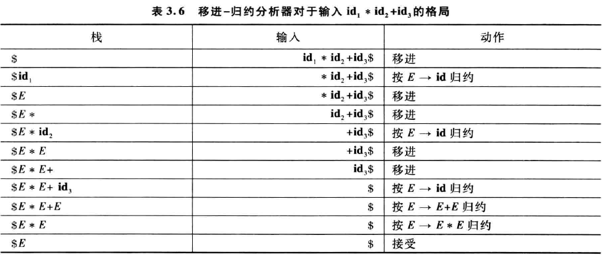
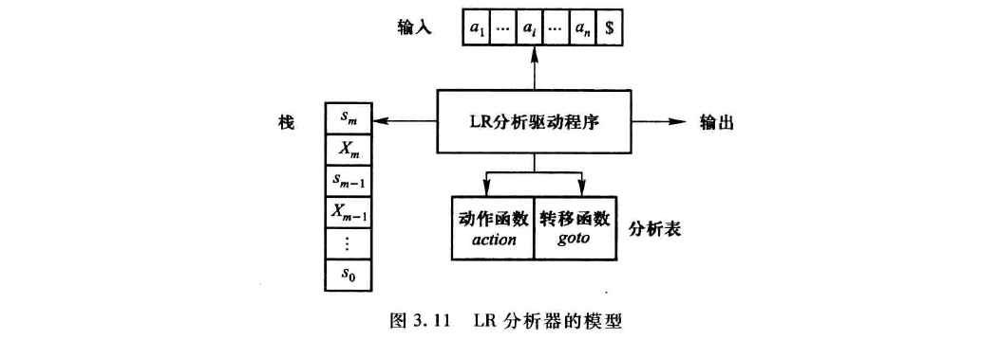
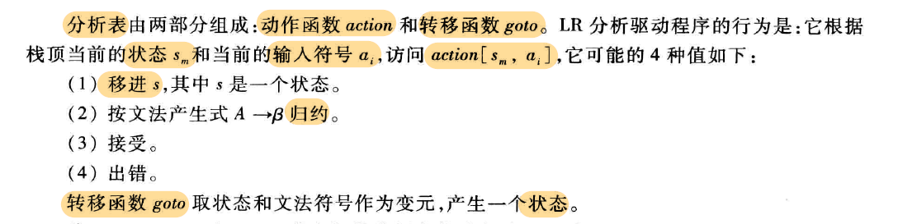
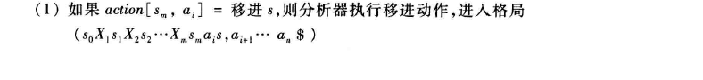
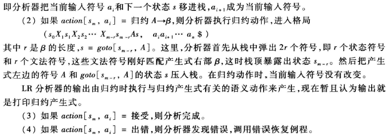
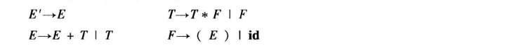
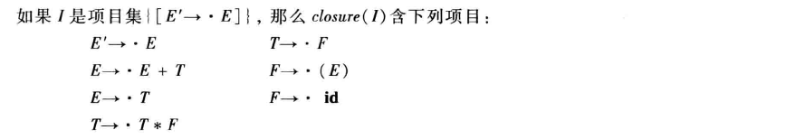
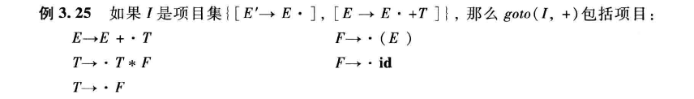
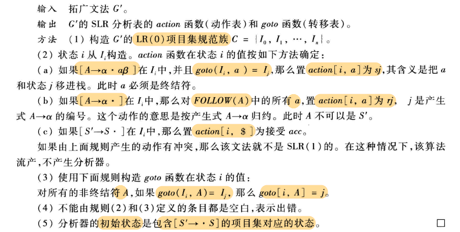
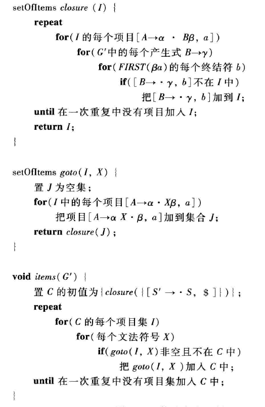

<!doctype html>
<html>
<body><h1>1. 语法分析</h1>
<ul>
<li>目标:语法记号(token)流 <svg xmlns:xlink="http://www.w3.org/1999/xlink" width="2.323ex" height="1.532ex" viewBox="0 -570.2 1000 659.7" role="img" focusable="false" style="vertical-align: -0.208ex;"><defs><path stroke-width="0" id="E58-MJMAIN-2192" d="M56 237T56 250T70 270H835Q719 357 692 493Q692 494 692 496T691 499Q691 511 708 511H711Q720 511 723 510T729 506T732 497T735 481T743 456Q765 389 816 336T935 261Q944 258 944 250Q944 244 939 241T915 231T877 212Q836 186 806 152T761 85T740 35T732 4Q730 -6 727 -8T711 -11Q691 -11 691 0Q691 7 696 25Q728 151 835 230H70Q56 237 56 250Z"></path></defs><g stroke="currentColor" fill="currentColor" stroke-width="0" transform="matrix(1 0 0 -1 0 0)"><use xlink:href="#E58-MJMAIN-2192" x="0" y="0"></use></g></svg> 语法短语 (分析树)</li>
<li>实质:无结构数据 <svg xmlns:xlink="http://www.w3.org/1999/xlink" width="2.323ex" height="1.532ex" viewBox="0 -570.2 1000 659.7" role="img" focusable="false" style="vertical-align: -0.208ex;"><defs><path stroke-width="0" id="E58-MJMAIN-2192" d="M56 237T56 250T70 270H835Q719 357 692 493Q692 494 692 496T691 499Q691 511 708 511H711Q720 511 723 510T729 506T732 497T735 481T743 456Q765 389 816 336T935 261Q944 258 944 250Q944 244 939 241T915 231T877 212Q836 186 806 152T761 85T740 35T732 4Q730 -6 727 -8T711 -11Q691 -11 691 0Q691 7 696 25Q728 151 835 230H70Q56 237 56 250Z"></path></defs><g stroke="currentColor" fill="currentColor" stroke-width="0" transform="matrix(1 0 0 -1 0 0)"><use xlink:href="#E58-MJMAIN-2192" x="0" y="0"></use></g></svg> 有结构数据</li>
<li>依据:上下无关文法</li>

</ul>
<pre><code class='language-mermaid' lang='mermaid'>graph LR
    A(字符)
    subgraph 词法分析器-正规式
    B(字符串)
    C(记号)
    end
    subgraph 语法分析器-上下文无关文法
    C
    D(表达式)
    E(语句)
    F(程序块)
    G(程序)
    end
    H(语法分析树)

    A--&gt;B--&gt;C--&gt;D--&gt;E--&gt;F--&gt;G--&gt;H
</code></pre>
<h2>1.1. 上下无关文法</h2>
<ul>
<li>
正规式定义简单的语言

</li>
<li>
给定结构 固定次数/无指定次数 重复

</li>
<li>
<del>描述配对/嵌套</del>

</li>
<li>
四元组

<ul>
<li><svg xmlns:xlink="http://www.w3.org/1999/xlink" width="2.743ex" height="2.243ex" viewBox="0 -745.1 1180.8 965.6" role="img" focusable="false" style="vertical-align: -0.512ex;"><defs><path stroke-width="0" id="E5-MJMATHI-56" d="M52 648Q52 670 65 683H76Q118 680 181 680Q299 680 320 683H330Q336 677 336 674T334 656Q329 641 325 637H304Q282 635 274 635Q245 630 242 620Q242 618 271 369T301 118L374 235Q447 352 520 471T595 594Q599 601 599 609Q599 633 555 637Q537 637 537 648Q537 649 539 661Q542 675 545 679T558 683Q560 683 570 683T604 682T668 681Q737 681 755 683H762Q769 676 769 672Q769 655 760 640Q757 637 743 637Q730 636 719 635T698 630T682 623T670 615T660 608T652 599T645 592L452 282Q272 -9 266 -16Q263 -18 259 -21L241 -22H234Q216 -22 216 -15Q213 -9 177 305Q139 623 138 626Q133 637 76 637H59Q52 642 52 648Z"></path><path stroke-width="0" id="E5-MJMATHI-54" d="M40 437Q21 437 21 445Q21 450 37 501T71 602L88 651Q93 669 101 677H569H659Q691 677 697 676T704 667Q704 661 687 553T668 444Q668 437 649 437Q640 437 637 437T631 442L629 445Q629 451 635 490T641 551Q641 586 628 604T573 629Q568 630 515 631Q469 631 457 630T439 622Q438 621 368 343T298 60Q298 48 386 46Q418 46 427 45T436 36Q436 31 433 22Q429 4 424 1L422 0Q419 0 415 0Q410 0 363 1T228 2Q99 2 64 0H49Q43 6 43 9T45 27Q49 40 55 46H83H94Q174 46 189 55Q190 56 191 56Q196 59 201 76T241 233Q258 301 269 344Q339 619 339 625Q339 630 310 630H279Q212 630 191 624Q146 614 121 583T67 467Q60 445 57 441T43 437H40Z"></path></defs><g stroke="currentColor" fill="currentColor" stroke-width="0" transform="matrix(1 0 0 -1 0 0)"><use xlink:href="#E5-MJMATHI-56" x="0" y="0"></use><use transform="scale(0.707)" xlink:href="#E5-MJMATHI-54" x="824" y="-213"></use></g></svg> 终 非空有限 记号名-同义词</li>
<li><svg xmlns:xlink="http://www.w3.org/1999/xlink" width="3.045ex" height="2.243ex" viewBox="0 -745.1 1310.9 965.6" role="img" focusable="false" style="vertical-align: -0.512ex;"><defs><path stroke-width="0" id="E6-MJMATHI-56" d="M52 648Q52 670 65 683H76Q118 680 181 680Q299 680 320 683H330Q336 677 336 674T334 656Q329 641 325 637H304Q282 635 274 635Q245 630 242 620Q242 618 271 369T301 118L374 235Q447 352 520 471T595 594Q599 601 599 609Q599 633 555 637Q537 637 537 648Q537 649 539 661Q542 675 545 679T558 683Q560 683 570 683T604 682T668 681Q737 681 755 683H762Q769 676 769 672Q769 655 760 640Q757 637 743 637Q730 636 719 635T698 630T682 623T670 615T660 608T652 599T645 592L452 282Q272 -9 266 -16Q263 -18 259 -21L241 -22H234Q216 -22 216 -15Q213 -9 177 305Q139 623 138 626Q133 637 76 637H59Q52 642 52 648Z"></path><path stroke-width="0" id="E6-MJMATHI-4E" d="M234 637Q231 637 226 637Q201 637 196 638T191 649Q191 676 202 682Q204 683 299 683Q376 683 387 683T401 677Q612 181 616 168L670 381Q723 592 723 606Q723 633 659 637Q635 637 635 648Q635 650 637 660Q641 676 643 679T653 683Q656 683 684 682T767 680Q817 680 843 681T873 682Q888 682 888 672Q888 650 880 642Q878 637 858 637Q787 633 769 597L620 7Q618 0 599 0Q585 0 582 2Q579 5 453 305L326 604L261 344Q196 88 196 79Q201 46 268 46H278Q284 41 284 38T282 19Q278 6 272 0H259Q228 2 151 2Q123 2 100 2T63 2T46 1Q31 1 31 10Q31 14 34 26T39 40Q41 46 62 46Q130 49 150 85Q154 91 221 362L289 634Q287 635 234 637Z"></path></defs><g stroke="currentColor" fill="currentColor" stroke-width="0" transform="matrix(1 0 0 -1 0 0)"><use xlink:href="#E6-MJMATHI-56" x="0" y="0"></use><use transform="scale(0.707)" xlink:href="#E6-MJMATHI-4E" x="824" y="-213"></use></g></svg> 非 非空有限 和终无交集</li>
<li><svg xmlns:xlink="http://www.w3.org/1999/xlink" width="1.498ex" height="2.04ex" viewBox="0 -788.8 645 878.2" role="img" focusable="false" style="vertical-align: -0.208ex;"><defs><path stroke-width="0" id="E16-MJMATHI-53" d="M308 24Q367 24 416 76T466 197Q466 260 414 284Q308 311 278 321T236 341Q176 383 176 462Q176 523 208 573T273 648Q302 673 343 688T407 704H418H425Q521 704 564 640Q565 640 577 653T603 682T623 704Q624 704 627 704T632 705Q645 705 645 698T617 577T585 459T569 456Q549 456 549 465Q549 471 550 475Q550 478 551 494T553 520Q553 554 544 579T526 616T501 641Q465 662 419 662Q362 662 313 616T263 510Q263 480 278 458T319 427Q323 425 389 408T456 390Q490 379 522 342T554 242Q554 216 546 186Q541 164 528 137T492 78T426 18T332 -20Q320 -22 298 -22Q199 -22 144 33L134 44L106 13Q83 -14 78 -18T65 -22Q52 -22 52 -14Q52 -11 110 221Q112 227 130 227H143Q149 221 149 216Q149 214 148 207T144 186T142 153Q144 114 160 87T203 47T255 29T308 24Z"></path></defs><g stroke="currentColor" fill="currentColor" stroke-width="0" transform="matrix(1 0 0 -1 0 0)"><use xlink:href="#E16-MJMATHI-53" x="0" y="0"></use></g></svg> 开始符号</li>
<li><svg xmlns:xlink="http://www.w3.org/1999/xlink" width="1.744ex" height="1.837ex" viewBox="0 -745.1 751 790.8" role="img" focusable="false" style="vertical-align: -0.106ex;"><defs><path stroke-width="0" id="E8-MJMATHI-50" d="M287 628Q287 635 230 637Q206 637 199 638T192 648Q192 649 194 659Q200 679 203 681T397 683Q587 682 600 680Q664 669 707 631T751 530Q751 453 685 389Q616 321 507 303Q500 302 402 301H307L277 182Q247 66 247 59Q247 55 248 54T255 50T272 48T305 46H336Q342 37 342 35Q342 19 335 5Q330 0 319 0Q316 0 282 1T182 2Q120 2 87 2T51 1Q33 1 33 11Q33 13 36 25Q40 41 44 43T67 46Q94 46 127 49Q141 52 146 61Q149 65 218 339T287 628ZM645 554Q645 567 643 575T634 597T609 619T560 635Q553 636 480 637Q463 637 445 637T416 636T404 636Q391 635 386 627Q384 621 367 550T332 412T314 344Q314 342 395 342H407H430Q542 342 590 392Q617 419 631 471T645 554Z"></path></defs><g stroke="currentColor" fill="currentColor" stroke-width="0" transform="matrix(1 0 0 -1 0 0)"><use xlink:href="#E8-MJMATHI-50" x="0" y="0"></use></g></svg> 产生式集合</li>

</ul>
</li>

</ul>
<h2>1.2. 最左推导</h2>
<h2>1.3. 最右推导</h2>
<h2>1.4. 判断满足语法规则(语法分析目标)</h2>
<ul>
<li>存在推导 <svg xmlns:xlink="http://www.w3.org/1999/xlink" width="2.323ex" height="1.532ex" viewBox="0 -570.2 1000 659.7" role="img" focusable="false" style="vertical-align: -0.208ex;"><defs><path stroke-width="0" id="E58-MJMAIN-2192" d="M56 237T56 250T70 270H835Q719 357 692 493Q692 494 692 496T691 499Q691 511 708 511H711Q720 511 723 510T729 506T732 497T735 481T743 456Q765 389 816 336T935 261Q944 258 944 250Q944 244 939 241T915 231T877 212Q836 186 806 152T761 85T740 35T732 4Q730 -6 727 -8T711 -11Q691 -11 691 0Q691 7 696 25Q728 151 835 230H70Q56 237 56 250Z"></path></defs><g stroke="currentColor" fill="currentColor" stroke-width="0" transform="matrix(1 0 0 -1 0 0)"><use xlink:href="#E58-MJMAIN-2192" x="0" y="0"></use></g></svg> 推导出给定句子</li>

</ul>
<h2>1.5. 二义性</h2>
<ul>
<li>
常见且需要避免

</li>
<li>
符合文法规则-句子 : 存在两种可能的分析树

</li>
<li>
无二义性

<ul>
<li>左右推导 <svg xmlns:xlink="http://www.w3.org/1999/xlink" width="2.323ex" height="1.532ex" viewBox="0 -570.2 1000 659.7" role="img" focusable="false" style="vertical-align: -0.208ex;"><defs><path stroke-width="0" id="E58-MJMAIN-2192" d="M56 237T56 250T70 270H835Q719 357 692 493Q692 494 692 496T691 499Q691 511 708 511H711Q720 511 723 510T729 506T732 497T735 481T743 456Q765 389 816 336T935 261Q944 258 944 250Q944 244 939 241T915 231T877 212Q836 186 806 152T761 85T740 35T732 4Q730 -6 727 -8T711 -11Q691 -11 691 0Q691 7 696 25Q728 151 835 230H70Q56 237 56 250Z"></path></defs><g stroke="currentColor" fill="currentColor" stroke-width="0" transform="matrix(1 0 0 -1 0 0)"><use xlink:href="#E58-MJMAIN-2192" x="0" y="0"></use></g></svg> 语法树相同</li>
<li>唯一 左右 推导</li>

</ul>
</li>

</ul>
<h3>1.5.1. 产生原因</h3>
<ul>
<li>符号优先级没有体现</li>

</ul>
<h2>1.6. 优点</h2>
<ul>
<li>精确, 易理解-语法说明</li>
<li>自动产生 高效分析器</li>
<li>给 语言 定义出 层级结构</li>
<li>便于 语言的修改 (以文法为基础)</li>

</ul>
<h2>1.7. 缺点</h2>
<ul>
<li>只能 描述 编程语言的 大部分语法</li>

</ul>
<h2>1.8. NFA <svg xmlns:xlink="http://www.w3.org/1999/xlink" width="2.323ex" height="1.532ex" viewBox="0 -570.2 1000 659.7" role="img" focusable="false" style="vertical-align: -0.208ex;"><defs><path stroke-width="0" id="E58-MJMAIN-2192" d="M56 237T56 250T70 270H835Q719 357 692 493Q692 494 692 496T691 499Q691 511 708 511H711Q720 511 723 510T729 506T732 497T735 481T743 456Q765 389 816 336T935 261Q944 258 944 250Q944 244 939 241T915 231T877 212Q836 186 806 152T761 85T740 35T732 4Q730 -6 727 -8T711 -11Q691 -11 691 0Q691 7 696 25Q728 151 835 230H70Q56 237 56 250Z"></path></defs><g stroke="currentColor" fill="currentColor" stroke-width="0" transform="matrix(1 0 0 -1 0 0)"><use xlink:href="#E58-MJMAIN-2192" x="0" y="0"></use></g></svg> 上下文无关文法</h2>
<ul>
<li>确定 终结符集合</li>
<li>状态 <svg xmlns:xlink="http://www.w3.org/1999/xlink" width="2.323ex" height="1.532ex" viewBox="0 -570.2 1000 659.7" role="img" focusable="false" style="vertical-align: -0.208ex;"><defs><path stroke-width="0" id="E58-MJMAIN-2192" d="M56 237T56 250T70 270H835Q719 357 692 493Q692 494 692 496T691 499Q691 511 708 511H711Q720 511 723 510T729 506T732 497T735 481T743 456Q765 389 816 336T935 261Q944 258 944 250Q944 244 939 241T915 231T877 212Q836 186 806 152T761 85T740 35T732 4Q730 -6 727 -8T711 -11Q691 -11 691 0Q691 7 696 25Q728 151 835 230H70Q56 237 56 250Z"></path></defs><g stroke="currentColor" fill="currentColor" stroke-width="0" transform="matrix(1 0 0 -1 0 0)"><use xlink:href="#E58-MJMAIN-2192" x="0" y="0"></use></g></svg> <svg xmlns:xlink="http://www.w3.org/1999/xlink" width="2.541ex" height="2.344ex" viewBox="0 -788.8 1094 1009.4" role="img" focusable="false" style="vertical-align: -0.512ex;"><defs><path stroke-width="0" id="E13-MJMATHI-41" d="M208 74Q208 50 254 46Q272 46 272 35Q272 34 270 22Q267 8 264 4T251 0Q249 0 239 0T205 1T141 2Q70 2 50 0H42Q35 7 35 11Q37 38 48 46H62Q132 49 164 96Q170 102 345 401T523 704Q530 716 547 716H555H572Q578 707 578 706L606 383Q634 60 636 57Q641 46 701 46Q726 46 726 36Q726 34 723 22Q720 7 718 4T704 0Q701 0 690 0T651 1T578 2Q484 2 455 0H443Q437 6 437 9T439 27Q443 40 445 43L449 46H469Q523 49 533 63L521 213H283L249 155Q208 86 208 74ZM516 260Q516 271 504 416T490 562L463 519Q447 492 400 412L310 260L413 259Q516 259 516 260Z"></path><path stroke-width="0" id="E13-MJMATHI-69" d="M184 600Q184 624 203 642T247 661Q265 661 277 649T290 619Q290 596 270 577T226 557Q211 557 198 567T184 600ZM21 287Q21 295 30 318T54 369T98 420T158 442Q197 442 223 419T250 357Q250 340 236 301T196 196T154 83Q149 61 149 51Q149 26 166 26Q175 26 185 29T208 43T235 78T260 137Q263 149 265 151T282 153Q302 153 302 143Q302 135 293 112T268 61T223 11T161 -11Q129 -11 102 10T74 74Q74 91 79 106T122 220Q160 321 166 341T173 380Q173 404 156 404H154Q124 404 99 371T61 287Q60 286 59 284T58 281T56 279T53 278T49 278T41 278H27Q21 284 21 287Z"></path></defs><g stroke="currentColor" fill="currentColor" stroke-width="0" transform="matrix(1 0 0 -1 0 0)"><use xlink:href="#E13-MJMATHI-41" x="0" y="0"></use><use transform="scale(0.707)" xlink:href="#E13-MJMATHI-69" x="1060" y="-213"></use></g></svg></li>
<li>转换(a) &emsp; <svg xmlns:xlink="http://www.w3.org/1999/xlink" width="10.033ex" height="2.649ex" viewBox="0 -788.8 4319.8 1140.5" role="img" focusable="false" style="vertical-align: -0.817ex;"><defs><path stroke-width="0" id="E14-MJMATHI-41" d="M208 74Q208 50 254 46Q272 46 272 35Q272 34 270 22Q267 8 264 4T251 0Q249 0 239 0T205 1T141 2Q70 2 50 0H42Q35 7 35 11Q37 38 48 46H62Q132 49 164 96Q170 102 345 401T523 704Q530 716 547 716H555H572Q578 707 578 706L606 383Q634 60 636 57Q641 46 701 46Q726 46 726 36Q726 34 723 22Q720 7 718 4T704 0Q701 0 690 0T651 1T578 2Q484 2 455 0H443Q437 6 437 9T439 27Q443 40 445 43L449 46H469Q523 49 533 63L521 213H283L249 155Q208 86 208 74ZM516 260Q516 271 504 416T490 562L463 519Q447 492 400 412L310 260L413 259Q516 259 516 260Z"></path><path stroke-width="0" id="E14-MJMATHI-69" d="M184 600Q184 624 203 642T247 661Q265 661 277 649T290 619Q290 596 270 577T226 557Q211 557 198 567T184 600ZM21 287Q21 295 30 318T54 369T98 420T158 442Q197 442 223 419T250 357Q250 340 236 301T196 196T154 83Q149 61 149 51Q149 26 166 26Q175 26 185 29T208 43T235 78T260 137Q263 149 265 151T282 153Q302 153 302 143Q302 135 293 112T268 61T223 11T161 -11Q129 -11 102 10T74 74Q74 91 79 106T122 220Q160 321 166 341T173 380Q173 404 156 404H154Q124 404 99 371T61 287Q60 286 59 284T58 281T56 279T53 278T49 278T41 278H27Q21 284 21 287Z"></path><path stroke-width="0" id="E14-MJMAIN-2192" d="M56 237T56 250T70 270H835Q719 357 692 493Q692 494 692 496T691 499Q691 511 708 511H711Q720 511 723 510T729 506T732 497T735 481T743 456Q765 389 816 336T935 261Q944 258 944 250Q944 244 939 241T915 231T877 212Q836 186 806 152T761 85T740 35T732 4Q730 -6 727 -8T711 -11Q691 -11 691 0Q691 7 696 25Q728 151 835 230H70Q56 237 56 250Z"></path><path stroke-width="0" id="E14-MJMATHI-61" d="M33 157Q33 258 109 349T280 441Q331 441 370 392Q386 422 416 422Q429 422 439 414T449 394Q449 381 412 234T374 68Q374 43 381 35T402 26Q411 27 422 35Q443 55 463 131Q469 151 473 152Q475 153 483 153H487Q506 153 506 144Q506 138 501 117T481 63T449 13Q436 0 417 -8Q409 -10 393 -10Q359 -10 336 5T306 36L300 51Q299 52 296 50Q294 48 292 46Q233 -10 172 -10Q117 -10 75 30T33 157ZM351 328Q351 334 346 350T323 385T277 405Q242 405 210 374T160 293Q131 214 119 129Q119 126 119 118T118 106Q118 61 136 44T179 26Q217 26 254 59T298 110Q300 114 325 217T351 328Z"></path><path stroke-width="0" id="E14-MJMATHI-6A" d="M297 596Q297 627 318 644T361 661Q378 661 389 651T403 623Q403 595 384 576T340 557Q322 557 310 567T297 596ZM288 376Q288 405 262 405Q240 405 220 393T185 362T161 325T144 293L137 279Q135 278 121 278H107Q101 284 101 286T105 299Q126 348 164 391T252 441Q253 441 260 441T272 442Q296 441 316 432Q341 418 354 401T367 348V332L318 133Q267 -67 264 -75Q246 -125 194 -164T75 -204Q25 -204 7 -183T-12 -137Q-12 -110 7 -91T53 -71Q70 -71 82 -81T95 -112Q95 -148 63 -167Q69 -168 77 -168Q111 -168 139 -140T182 -74L193 -32Q204 11 219 72T251 197T278 308T289 365Q289 372 288 376Z"></path></defs><g stroke="currentColor" fill="currentColor" stroke-width="0" transform="matrix(1 0 0 -1 0 0)"><use xlink:href="#E14-MJMATHI-41" x="0" y="0"></use><use transform="scale(0.707)" xlink:href="#E14-MJMATHI-69" x="1060" y="-213"></use><use xlink:href="#E14-MJMAIN-2192" x="1371" y="0"></use><use xlink:href="#E14-MJMATHI-61" x="2649" y="0"></use><g transform="translate(3178,0)"><use xlink:href="#E14-MJMATHI-41" x="0" y="0"></use><use transform="scale(0.707)" xlink:href="#E14-MJMATHI-6A" x="1060" y="-213"></use></g></g></svg> &ensp; / 接受状态 &ensp; <svg xmlns:xlink="http://www.w3.org/1999/xlink" width="7.097ex" height="2.344ex" viewBox="0 -788.8 3055.5 1009.4" role="img" focusable="false" style="vertical-align: -0.512ex;"><defs><path stroke-width="0" id="E15-MJMATHI-41" d="M208 74Q208 50 254 46Q272 46 272 35Q272 34 270 22Q267 8 264 4T251 0Q249 0 239 0T205 1T141 2Q70 2 50 0H42Q35 7 35 11Q37 38 48 46H62Q132 49 164 96Q170 102 345 401T523 704Q530 716 547 716H555H572Q578 707 578 706L606 383Q634 60 636 57Q641 46 701 46Q726 46 726 36Q726 34 723 22Q720 7 718 4T704 0Q701 0 690 0T651 1T578 2Q484 2 455 0H443Q437 6 437 9T439 27Q443 40 445 43L449 46H469Q523 49 533 63L521 213H283L249 155Q208 86 208 74ZM516 260Q516 271 504 416T490 562L463 519Q447 492 400 412L310 260L413 259Q516 259 516 260Z"></path><path stroke-width="0" id="E15-MJMATHI-69" d="M184 600Q184 624 203 642T247 661Q265 661 277 649T290 619Q290 596 270 577T226 557Q211 557 198 567T184 600ZM21 287Q21 295 30 318T54 369T98 420T158 442Q197 442 223 419T250 357Q250 340 236 301T196 196T154 83Q149 61 149 51Q149 26 166 26Q175 26 185 29T208 43T235 78T260 137Q263 149 265 151T282 153Q302 153 302 143Q302 135 293 112T268 61T223 11T161 -11Q129 -11 102 10T74 74Q74 91 79 106T122 220Q160 321 166 341T173 380Q173 404 156 404H154Q124 404 99 371T61 287Q60 286 59 284T58 281T56 279T53 278T49 278T41 278H27Q21 284 21 287Z"></path><path stroke-width="0" id="E15-MJMAIN-2192" d="M56 237T56 250T70 270H835Q719 357 692 493Q692 494 692 496T691 499Q691 511 708 511H711Q720 511 723 510T729 506T732 497T735 481T743 456Q765 389 816 336T935 261Q944 258 944 250Q944 244 939 241T915 231T877 212Q836 186 806 152T761 85T740 35T732 4Q730 -6 727 -8T711 -11Q691 -11 691 0Q691 7 696 25Q728 151 835 230H70Q56 237 56 250Z"></path><path stroke-width="0" id="E15-MJMATHI-3F5" d="M227 -11Q149 -11 95 41T40 174Q40 262 87 322Q121 367 173 396T287 430Q289 431 329 431H367Q382 426 382 411Q382 385 341 385H325H312Q191 385 154 277L150 265H327Q340 256 340 246Q340 228 320 219H138V217Q128 187 128 143Q128 77 160 52T231 26Q258 26 284 36T326 57T343 68Q350 68 354 58T358 39Q358 36 357 35Q354 31 337 21T289 0T227 -11Z"></path></defs><g stroke="currentColor" fill="currentColor" stroke-width="0" transform="matrix(1 0 0 -1 0 0)"><use xlink:href="#E15-MJMATHI-41" x="0" y="0"></use><use transform="scale(0.707)" xlink:href="#E15-MJMATHI-69" x="1060" y="-213"></use><use xlink:href="#E15-MJMAIN-2192" x="1371" y="0"></use><use xlink:href="#E15-MJMATHI-3F5" x="2649" y="0"></use></g></svg></li>

</ul>
<h2>1.9. 分离词法分析器理由</h2>
<ul>
<li>
正规式定义词法

<ul>
<li>规则简单 不比上下文无关文法</li>
<li>词法记号-正规式 描述 简洁/易理解</li>
<li>正规式构造 词法分析器 效率高</li>

</ul>
</li>
<li>
简化设计

</li>
<li>
编译器 效率

</li>
<li>
编译器 移植性

</li>
<li>
编译器 前端 模块划分

</li>
<li>
语法分析器

<ul>
<li>规则 不必 考虑 注解和空白</li>

</ul>
</li>

</ul>
<h2>1.10. 自上而下分析(语法分析途径之一)</h2>
<ul>
<li>
基本思想

<ul>
<li>寻找 最左推导 分析树</li>
<li>try 根据 当前输入单词 确定 使用哪个 产生式  (试探和回溯)</li>
<li><strong>试探</strong>与<strong>回溯</strong>是一种穷尽一切可能的办法, <strong>效率低</strong>, <strong>代价高</strong>, 只有<strong>理论意义</strong>, 在实践中用处不大</li>

</ul>
</li>
<li>
基本过程

<ul>
<li><svg xmlns:xlink="http://www.w3.org/1999/xlink" width="1.498ex" height="2.04ex" viewBox="0 -788.8 645 878.2" role="img" focusable="false" style="vertical-align: -0.208ex;"><defs><path stroke-width="0" id="E16-MJMATHI-53" d="M308 24Q367 24 416 76T466 197Q466 260 414 284Q308 311 278 321T236 341Q176 383 176 462Q176 523 208 573T273 648Q302 673 343 688T407 704H418H425Q521 704 564 640Q565 640 577 653T603 682T623 704Q624 704 627 704T632 705Q645 705 645 698T617 577T585 459T569 456Q549 456 549 465Q549 471 550 475Q550 478 551 494T553 520Q553 554 544 579T526 616T501 641Q465 662 419 662Q362 662 313 616T263 510Q263 480 278 458T319 427Q323 425 389 408T456 390Q490 379 522 342T554 242Q554 216 546 186Q541 164 528 137T492 78T426 18T332 -20Q320 -22 298 -22Q199 -22 144 33L134 44L106 13Q83 -14 78 -18T65 -22Q52 -22 52 -14Q52 -11 110 221Q112 227 130 227H143Q149 221 149 216Q149 214 148 207T144 186T142 153Q144 114 160 87T203 47T255 29T308 24Z"></path></defs><g stroke="currentColor" fill="currentColor" stroke-width="0" transform="matrix(1 0 0 -1 0 0)"><use xlink:href="#E16-MJMATHI-53" x="0" y="0"></use></g></svg>出发</li>
<li>构造Token 最左推导</li>
<li>构造Token 分析树 (最左推导顺序)</li>

</ul>
</li>
<li>
文法 <svg xmlns:xlink="http://www.w3.org/1999/xlink" width="18.858ex" height="2.649ex" viewBox="0 -832.5 8119.3 1140.5" role="img" focusable="false" style="vertical-align: -0.715ex;"><defs><path stroke-width="0" id="E17-MJMATHI-47" d="M50 252Q50 367 117 473T286 641T490 704Q580 704 633 653Q642 643 648 636T656 626L657 623Q660 623 684 649Q691 655 699 663T715 679T725 690L740 705H746Q760 705 760 698Q760 694 728 561Q692 422 692 421Q690 416 687 415T669 413H653Q647 419 647 422Q647 423 648 429T650 449T651 481Q651 552 619 605T510 659Q492 659 471 656T418 643T357 615T294 567T236 496T189 394T158 260Q156 242 156 221Q156 173 170 136T206 79T256 45T308 28T353 24Q407 24 452 47T514 106Q517 114 529 161T541 214Q541 222 528 224T468 227H431Q425 233 425 235T427 254Q431 267 437 273H454Q494 271 594 271Q634 271 659 271T695 272T707 272Q721 272 721 263Q721 261 719 249Q714 230 709 228Q706 227 694 227Q674 227 653 224Q646 221 643 215T629 164Q620 131 614 108Q589 6 586 3Q584 1 581 1Q571 1 553 21T530 52Q530 53 528 52T522 47Q448 -22 322 -22Q201 -22 126 55T50 252Z"></path><path stroke-width="0" id="E17-MJMAIN-3D" d="M56 347Q56 360 70 367H707Q722 359 722 347Q722 336 708 328L390 327H72Q56 332 56 347ZM56 153Q56 168 72 173H708Q722 163 722 153Q722 140 707 133H70Q56 140 56 153Z"></path><path stroke-width="0" id="E17-MJMAIN-28" d="M94 250Q94 319 104 381T127 488T164 576T202 643T244 695T277 729T302 750H315H319Q333 750 333 741Q333 738 316 720T275 667T226 581T184 443T167 250T184 58T225 -81T274 -167T316 -220T333 -241Q333 -250 318 -250H315H302L274 -226Q180 -141 137 -14T94 250Z"></path><path stroke-width="0" id="E17-MJMATHI-56" d="M52 648Q52 670 65 683H76Q118 680 181 680Q299 680 320 683H330Q336 677 336 674T334 656Q329 641 325 637H304Q282 635 274 635Q245 630 242 620Q242 618 271 369T301 118L374 235Q447 352 520 471T595 594Q599 601 599 609Q599 633 555 637Q537 637 537 648Q537 649 539 661Q542 675 545 679T558 683Q560 683 570 683T604 682T668 681Q737 681 755 683H762Q769 676 769 672Q769 655 760 640Q757 637 743 637Q730 636 719 635T698 630T682 623T670 615T660 608T652 599T645 592L452 282Q272 -9 266 -16Q263 -18 259 -21L241 -22H234Q216 -22 216 -15Q213 -9 177 305Q139 623 138 626Q133 637 76 637H59Q52 642 52 648Z"></path><path stroke-width="0" id="E17-MJMATHI-54" d="M40 437Q21 437 21 445Q21 450 37 501T71 602L88 651Q93 669 101 677H569H659Q691 677 697 676T704 667Q704 661 687 553T668 444Q668 437 649 437Q640 437 637 437T631 442L629 445Q629 451 635 490T641 551Q641 586 628 604T573 629Q568 630 515 631Q469 631 457 630T439 622Q438 621 368 343T298 60Q298 48 386 46Q418 46 427 45T436 36Q436 31 433 22Q429 4 424 1L422 0Q419 0 415 0Q410 0 363 1T228 2Q99 2 64 0H49Q43 6 43 9T45 27Q49 40 55 46H83H94Q174 46 189 55Q190 56 191 56Q196 59 201 76T241 233Q258 301 269 344Q339 619 339 625Q339 630 310 630H279Q212 630 191 624Q146 614 121 583T67 467Q60 445 57 441T43 437H40Z"></path><path stroke-width="0" id="E17-MJMAIN-2C" d="M78 35T78 60T94 103T137 121Q165 121 187 96T210 8Q210 -27 201 -60T180 -117T154 -158T130 -185T117 -194Q113 -194 104 -185T95 -172Q95 -168 106 -156T131 -126T157 -76T173 -3V9L172 8Q170 7 167 6T161 3T152 1T140 0Q113 0 96 17Z"></path><path stroke-width="0" id="E17-MJMATHI-4E" d="M234 637Q231 637 226 637Q201 637 196 638T191 649Q191 676 202 682Q204 683 299 683Q376 683 387 683T401 677Q612 181 616 168L670 381Q723 592 723 606Q723 633 659 637Q635 637 635 648Q635 650 637 660Q641 676 643 679T653 683Q656 683 684 682T767 680Q817 680 843 681T873 682Q888 682 888 672Q888 650 880 642Q878 637 858 637Q787 633 769 597L620 7Q618 0 599 0Q585 0 582 2Q579 5 453 305L326 604L261 344Q196 88 196 79Q201 46 268 46H278Q284 41 284 38T282 19Q278 6 272 0H259Q228 2 151 2Q123 2 100 2T63 2T46 1Q31 1 31 10Q31 14 34 26T39 40Q41 46 62 46Q130 49 150 85Q154 91 221 362L289 634Q287 635 234 637Z"></path><path stroke-width="0" id="E17-MJMATHI-53" d="M308 24Q367 24 416 76T466 197Q466 260 414 284Q308 311 278 321T236 341Q176 383 176 462Q176 523 208 573T273 648Q302 673 343 688T407 704H418H425Q521 704 564 640Q565 640 577 653T603 682T623 704Q624 704 627 704T632 705Q645 705 645 698T617 577T585 459T569 456Q549 456 549 465Q549 471 550 475Q550 478 551 494T553 520Q553 554 544 579T526 616T501 641Q465 662 419 662Q362 662 313 616T263 510Q263 480 278 458T319 427Q323 425 389 408T456 390Q490 379 522 342T554 242Q554 216 546 186Q541 164 528 137T492 78T426 18T332 -20Q320 -22 298 -22Q199 -22 144 33L134 44L106 13Q83 -14 78 -18T65 -22Q52 -22 52 -14Q52 -11 110 221Q112 227 130 227H143Q149 221 149 216Q149 214 148 207T144 186T142 153Q144 114 160 87T203 47T255 29T308 24Z"></path><path stroke-width="0" id="E17-MJMATHI-50" d="M287 628Q287 635 230 637Q206 637 199 638T192 648Q192 649 194 659Q200 679 203 681T397 683Q587 682 600 680Q664 669 707 631T751 530Q751 453 685 389Q616 321 507 303Q500 302 402 301H307L277 182Q247 66 247 59Q247 55 248 54T255 50T272 48T305 46H336Q342 37 342 35Q342 19 335 5Q330 0 319 0Q316 0 282 1T182 2Q120 2 87 2T51 1Q33 1 33 11Q33 13 36 25Q40 41 44 43T67 46Q94 46 127 49Q141 52 146 61Q149 65 218 339T287 628ZM645 554Q645 567 643 575T634 597T609 619T560 635Q553 636 480 637Q463 637 445 637T416 636T404 636Q391 635 386 627Q384 621 367 550T332 412T314 344Q314 342 395 342H407H430Q542 342 590 392Q617 419 631 471T645 554Z"></path><path stroke-width="0" id="E17-MJMAIN-29" d="M60 749L64 750Q69 750 74 750H86L114 726Q208 641 251 514T294 250Q294 182 284 119T261 12T224 -76T186 -143T145 -194T113 -227T90 -246Q87 -249 86 -250H74Q66 -250 63 -250T58 -247T55 -238Q56 -237 66 -225Q221 -64 221 250T66 725Q56 737 55 738Q55 746 60 749Z"></path></defs><g stroke="currentColor" fill="currentColor" stroke-width="0" transform="matrix(1 0 0 -1 0 0)"><use xlink:href="#E17-MJMATHI-47" x="0" y="0"></use><use xlink:href="#E17-MJMAIN-3D" x="1063" y="0"></use><use xlink:href="#E17-MJMAIN-28" x="2119" y="0"></use><g transform="translate(2508,0)"><use xlink:href="#E17-MJMATHI-56" x="0" y="0"></use><use transform="scale(0.707)" xlink:href="#E17-MJMATHI-54" x="824" y="-213"></use></g><use xlink:href="#E17-MJMAIN-2C" x="3689" y="0"></use><g transform="translate(4134,0)"><use xlink:href="#E17-MJMATHI-56" x="0" y="0"></use><use transform="scale(0.707)" xlink:href="#E17-MJMATHI-4E" x="824" y="-213"></use></g><use xlink:href="#E17-MJMAIN-2C" x="5444" y="0"></use><use xlink:href="#E17-MJMATHI-53" x="5889" y="0"></use><use xlink:href="#E17-MJMAIN-2C" x="6534" y="0"></use><use xlink:href="#E17-MJMATHI-50" x="6979" y="0"></use><use xlink:href="#E17-MJMAIN-29" x="7730" y="0"></use></g></svg>

<ul>
<li>
0型 : 短语

<ul>
<li>
1型 : 上下文有关

<ul>
<li>
2型 : 上下文无关

<ul>
<li>3型 : 正规式 正规文法</li>

</ul>
</li>

</ul>
</li>

</ul>
</li>

</ul>
</li>
<li>
<code>LL(1)</code>文法

<blockquote>
L(Left):自左向右扫描  L(Left): 使用最左推导 <svg xmlns:xlink="http://www.w3.org/1999/xlink" width="1.161ex" height="1.837ex" viewBox="0 -745.1 500 790.8" role="img" focusable="false" style="vertical-align: -0.106ex;"><defs><path stroke-width="0" id="E18-MJMAIN-31" d="M213 578L200 573Q186 568 160 563T102 556H83V602H102Q149 604 189 617T245 641T273 663Q275 666 285 666Q294 666 302 660V361L303 61Q310 54 315 52T339 48T401 46H427V0H416Q395 3 257 3Q121 3 100 0H88V46H114Q136 46 152 46T177 47T193 50T201 52T207 57T213 61V578Z"></path></defs><g stroke="currentColor" fill="currentColor" stroke-width="0" transform="matrix(1 0 0 -1 0 0)"><use xlink:href="#E18-MJMAIN-31" x="0" y="0"></use></g></svg>:向前看一个符号,预测避免回溯 <strong>不带回溯</strong>的<strong>自上而下</strong>文法

</blockquote>
</li>

</ul>
<blockquote>
<mark>判断是不是<code>LL(1)</code>文法</mark>

<blockquote>
当且仅当对于G的每个非终结符A的任何两个产生式<code>A → α | β</code>，有：

<pre><code class='language-java' lang='java'>0) 不能有左递归
// 消除左递归，提取最左公因子的情况下
1）如果α、β均不能推导出ε,FIRST(α) ∩ FIRST(β) = ∅
2) α 和 β 至多有一个能推导出 ε
2）若ε ∈ FIRST(β)，则FIRST(α) ∩ FOLLOW(A) = ∅
</code></pre>

改为LL(1)文法

<ul>
<li>消除左递归,提取左因子 (不一定成功)</li>

</ul>
<ol start='' >
<li>消除左递归 </li>
<li>避免回溯(消除二义性)</li>
<li>速递下降的预测分析</li>

</ol>
</blockquote>
</blockquote>
<blockquote>
消除<strong>二义性</strong>

<blockquote>
<em>大多数编程语言使用有二义性的语言, 因为消除后的会失去了<strong>简洁性</strong>. 文法有二义性不可怕, 只要有<strong>消除二义性的规则</strong>就可以了</em>

<blockquote>
消除方法 : 体现运算符的<strong>优先次序</strong> &amp; <strong>结合规则</strong>
<svg xmlns:xlink="http://www.w3.org/1999/xlink" width="39.606ex" height="15.136ex" viewBox="0 -3498.9 17052.4 6516.9" role="img" focusable="false" style="vertical-align: -7.01ex;"><defs><path stroke-width="0" id="E19-MJMATHI-53" d="M308 24Q367 24 416 76T466 197Q466 260 414 284Q308 311 278 321T236 341Q176 383 176 462Q176 523 208 573T273 648Q302 673 343 688T407 704H418H425Q521 704 564 640Q565 640 577 653T603 682T623 704Q624 704 627 704T632 705Q645 705 645 698T617 577T585 459T569 456Q549 456 549 465Q549 471 550 475Q550 478 551 494T553 520Q553 554 544 579T526 616T501 641Q465 662 419 662Q362 662 313 616T263 510Q263 480 278 458T319 427Q323 425 389 408T456 390Q490 379 522 342T554 242Q554 216 546 186Q541 164 528 137T492 78T426 18T332 -20Q320 -22 298 -22Q199 -22 144 33L134 44L106 13Q83 -14 78 -18T65 -22Q52 -22 52 -14Q52 -11 110 221Q112 227 130 227H143Q149 221 149 216Q149 214 148 207T144 186T142 153Q144 114 160 87T203 47T255 29T308 24Z"></path><path stroke-width="0" id="E19-MJMAIN-2192" d="M56 237T56 250T70 270H835Q719 357 692 493Q692 494 692 496T691 499Q691 511 708 511H711Q720 511 723 510T729 506T732 497T735 481T743 456Q765 389 816 336T935 261Q944 258 944 250Q944 244 939 241T915 231T877 212Q836 186 806 152T761 85T740 35T732 4Q730 -6 727 -8T711 -11Q691 -11 691 0Q691 7 696 25Q728 151 835 230H70Q56 237 56 250Z"></path><path stroke-width="0" id="E19-MJMATHI-61" d="M33 157Q33 258 109 349T280 441Q331 441 370 392Q386 422 416 422Q429 422 439 414T449 394Q449 381 412 234T374 68Q374 43 381 35T402 26Q411 27 422 35Q443 55 463 131Q469 151 473 152Q475 153 483 153H487Q506 153 506 144Q506 138 501 117T481 63T449 13Q436 0 417 -8Q409 -10 393 -10Q359 -10 336 5T306 36L300 51Q299 52 296 50Q294 48 292 46Q233 -10 172 -10Q117 -10 75 30T33 157ZM351 328Q351 334 346 350T323 385T277 405Q242 405 210 374T160 293Q131 214 119 129Q119 126 119 118T118 106Q118 61 136 44T179 26Q217 26 254 59T298 110Q300 114 325 217T351 328Z"></path><path stroke-width="0" id="E19-MJMATHI-6E" d="M21 287Q22 293 24 303T36 341T56 388T89 425T135 442Q171 442 195 424T225 390T231 369Q231 367 232 367L243 378Q304 442 382 442Q436 442 469 415T503 336T465 179T427 52Q427 26 444 26Q450 26 453 27Q482 32 505 65T540 145Q542 153 560 153Q580 153 580 145Q580 144 576 130Q568 101 554 73T508 17T439 -10Q392 -10 371 17T350 73Q350 92 386 193T423 345Q423 404 379 404H374Q288 404 229 303L222 291L189 157Q156 26 151 16Q138 -11 108 -11Q95 -11 87 -5T76 7T74 17Q74 30 112 180T152 343Q153 348 153 366Q153 405 129 405Q91 405 66 305Q60 285 60 284Q58 278 41 278H27Q21 284 21 287Z"></path><path stroke-width="0" id="E19-MJMATHI-64" d="M366 683Q367 683 438 688T511 694Q523 694 523 686Q523 679 450 384T375 83T374 68Q374 26 402 26Q411 27 422 35Q443 55 463 131Q469 151 473 152Q475 153 483 153H487H491Q506 153 506 145Q506 140 503 129Q490 79 473 48T445 8T417 -8Q409 -10 393 -10Q359 -10 336 5T306 36L300 51Q299 52 296 50Q294 48 292 46Q233 -10 172 -10Q117 -10 75 30T33 157Q33 205 53 255T101 341Q148 398 195 420T280 442Q336 442 364 400Q369 394 369 396Q370 400 396 505T424 616Q424 629 417 632T378 637H357Q351 643 351 645T353 664Q358 683 366 683ZM352 326Q329 405 277 405Q242 405 210 374T160 293Q131 214 119 129Q119 126 119 118T118 106Q118 61 136 44T179 26Q233 26 290 98L298 109L352 326Z"></path><path stroke-width="0" id="E19-MJMAIN-7C" d="M139 -249H137Q125 -249 119 -235V251L120 737Q130 750 139 750Q152 750 159 735V-235Q151 -249 141 -249H139Z"></path><path stroke-width="0" id="E19-MJMATHI-6F" d="M201 -11Q126 -11 80 38T34 156Q34 221 64 279T146 380Q222 441 301 441Q333 441 341 440Q354 437 367 433T402 417T438 387T464 338T476 268Q476 161 390 75T201 -11ZM121 120Q121 70 147 48T206 26Q250 26 289 58T351 142Q360 163 374 216T388 308Q388 352 370 375Q346 405 306 405Q243 405 195 347Q158 303 140 230T121 120Z"></path><path stroke-width="0" id="E19-MJMATHI-72" d="M21 287Q22 290 23 295T28 317T38 348T53 381T73 411T99 433T132 442Q161 442 183 430T214 408T225 388Q227 382 228 382T236 389Q284 441 347 441H350Q398 441 422 400Q430 381 430 363Q430 333 417 315T391 292T366 288Q346 288 334 299T322 328Q322 376 378 392Q356 405 342 405Q286 405 239 331Q229 315 224 298T190 165Q156 25 151 16Q138 -11 108 -11Q95 -11 87 -5T76 7T74 17Q74 30 114 189T154 366Q154 405 128 405Q107 405 92 377T68 316T57 280Q55 278 41 278H27Q21 284 21 287Z"></path><path stroke-width="0" id="E19-MJMATHI-74" d="M26 385Q19 392 19 395Q19 399 22 411T27 425Q29 430 36 430T87 431H140L159 511Q162 522 166 540T173 566T179 586T187 603T197 615T211 624T229 626Q247 625 254 615T261 596Q261 589 252 549T232 470L222 433Q222 431 272 431H323Q330 424 330 420Q330 398 317 385H210L174 240Q135 80 135 68Q135 26 162 26Q197 26 230 60T283 144Q285 150 288 151T303 153H307Q322 153 322 145Q322 142 319 133Q314 117 301 95T267 48T216 6T155 -11Q125 -11 98 4T59 56Q57 64 57 83V101L92 241Q127 382 128 383Q128 385 77 385H26Z"></path><path stroke-width="0" id="E19-MJMATHI-70" d="M23 287Q24 290 25 295T30 317T40 348T55 381T75 411T101 433T134 442Q209 442 230 378L240 387Q302 442 358 442Q423 442 460 395T497 281Q497 173 421 82T249 -10Q227 -10 210 -4Q199 1 187 11T168 28L161 36Q160 35 139 -51T118 -138Q118 -144 126 -145T163 -148H188Q194 -155 194 -157T191 -175Q188 -187 185 -190T172 -194Q170 -194 161 -194T127 -193T65 -192Q-5 -192 -24 -194H-32Q-39 -187 -39 -183Q-37 -156 -26 -148H-6Q28 -147 33 -136Q36 -130 94 103T155 350Q156 355 156 364Q156 405 131 405Q109 405 94 377T71 316T59 280Q57 278 43 278H29Q23 284 23 287ZM178 102Q200 26 252 26Q282 26 310 49T356 107Q374 141 392 215T411 325V331Q411 405 350 405Q339 405 328 402T306 393T286 380T269 365T254 350T243 336T235 326L232 322Q232 321 229 308T218 264T204 212Q178 106 178 102Z"></path><path stroke-width="0" id="E19-MJMATHI-71" d="M33 157Q33 258 109 349T280 441Q340 441 372 389Q373 390 377 395T388 406T404 418Q438 442 450 442Q454 442 457 439T460 434Q460 425 391 149Q320 -135 320 -139Q320 -147 365 -148H390Q396 -156 396 -157T393 -175Q389 -188 383 -194H370Q339 -192 262 -192Q234 -192 211 -192T174 -192T157 -193Q143 -193 143 -185Q143 -182 145 -170Q149 -154 152 -151T172 -148Q220 -148 230 -141Q238 -136 258 -53T279 32Q279 33 272 29Q224 -10 172 -10Q117 -10 75 30T33 157ZM352 326Q329 405 277 405Q242 405 210 374T160 293Q131 214 119 129Q119 126 119 118T118 106Q118 61 136 44T179 26Q233 26 290 98L298 109L352 326Z"></path><path stroke-width="0" id="E19-MJMAIN-28" d="M94 250Q94 319 104 381T127 488T164 576T202 643T244 695T277 729T302 750H315H319Q333 750 333 741Q333 738 316 720T275 667T226 581T184 443T167 250T184 58T225 -81T274 -167T316 -220T333 -241Q333 -250 318 -250H315H302L274 -226Q180 -141 137 -14T94 250Z"></path><path stroke-width="0" id="E19-MJMAIN-29" d="M60 749L64 750Q69 750 74 750H86L114 726Q208 641 251 514T294 250Q294 182 284 119T261 12T224 -76T186 -143T145 -194T113 -227T90 -246Q87 -249 86 -250H74Q66 -250 63 -250T58 -247T55 -238Q56 -237 66 -225Q221 -64 221 250T66 725Q56 737 55 738Q55 746 60 749Z"></path><path stroke-width="0" id="E19-MJMAIN-3A" d="M78 370Q78 394 95 412T138 430Q162 430 180 414T199 371Q199 346 182 328T139 310T96 327T78 370ZM78 60Q78 84 95 102T138 120Q162 120 180 104T199 61Q199 36 182 18T139 0T96 17T78 60Z"></path><path stroke-width="0" id="E19-MJMATHI-45" d="M492 213Q472 213 472 226Q472 230 477 250T482 285Q482 316 461 323T364 330H312Q311 328 277 192T243 52Q243 48 254 48T334 46Q428 46 458 48T518 61Q567 77 599 117T670 248Q680 270 683 272Q690 274 698 274Q718 274 718 261Q613 7 608 2Q605 0 322 0H133Q31 0 31 11Q31 13 34 25Q38 41 42 43T65 46Q92 46 125 49Q139 52 144 61Q146 66 215 342T285 622Q285 629 281 629Q273 632 228 634H197Q191 640 191 642T193 659Q197 676 203 680H757Q764 676 764 669Q764 664 751 557T737 447Q735 440 717 440H705Q698 445 698 453L701 476Q704 500 704 528Q704 558 697 578T678 609T643 625T596 632T532 634H485Q397 633 392 631Q388 629 386 622Q385 619 355 499T324 377Q347 376 372 376H398Q464 376 489 391T534 472Q538 488 540 490T557 493Q562 493 565 493T570 492T572 491T574 487T577 483L544 351Q511 218 508 216Q505 213 492 213Z"></path><path stroke-width="0" id="E19-MJMATHI-54" d="M40 437Q21 437 21 445Q21 450 37 501T71 602L88 651Q93 669 101 677H569H659Q691 677 697 676T704 667Q704 661 687 553T668 444Q668 437 649 437Q640 437 637 437T631 442L629 445Q629 451 635 490T641 551Q641 586 628 604T573 629Q568 630 515 631Q469 631 457 630T439 622Q438 621 368 343T298 60Q298 48 386 46Q418 46 427 45T436 36Q436 31 433 22Q429 4 424 1L422 0Q419 0 415 0Q410 0 363 1T228 2Q99 2 64 0H49Q43 6 43 9T45 27Q49 40 55 46H83H94Q174 46 189 55Q190 56 191 56Q196 59 201 76T241 233Q258 301 269 344Q339 619 339 625Q339 630 310 630H279Q212 630 191 624Q146 614 121 583T67 467Q60 445 57 441T43 437H40Z"></path><path stroke-width="0" id="E19-MJMATHI-46" d="M48 1Q31 1 31 11Q31 13 34 25Q38 41 42 43T65 46Q92 46 125 49Q139 52 144 61Q146 66 215 342T285 622Q285 629 281 629Q273 632 228 634H197Q191 640 191 642T193 659Q197 676 203 680H742Q749 676 749 669Q749 664 736 557T722 447Q720 440 702 440H690Q683 445 683 453Q683 454 686 477T689 530Q689 560 682 579T663 610T626 626T575 633T503 634H480Q398 633 393 631Q388 629 386 623Q385 622 352 492L320 363H375Q378 363 398 363T426 364T448 367T472 374T489 386Q502 398 511 419T524 457T529 475Q532 480 548 480H560Q567 475 567 470Q567 467 536 339T502 207Q500 200 482 200H470Q463 206 463 212Q463 215 468 234T473 274Q473 303 453 310T364 317H309L277 190Q245 66 245 60Q245 46 334 46H359Q365 40 365 39T363 19Q359 6 353 0H336Q295 2 185 2Q120 2 86 2T48 1Z"></path></defs><g stroke="currentColor" fill="currentColor" stroke-width="0" transform="matrix(1 0 0 -1 0 0)"><g transform="translate(167,0)"><g transform="translate(-18,0)"><g transform="translate(0,2649)"><use xlink:href="#E19-MJMATHI-53" x="0" y="0"></use><use xlink:href="#E19-MJMAIN-2192" x="922" y="0"></use><use xlink:href="#E19-MJMATHI-53" x="2200" y="0"></use><use xlink:href="#E19-MJMATHI-61" x="3095" y="0"></use><use xlink:href="#E19-MJMATHI-6E" x="3624" y="0"></use><use xlink:href="#E19-MJMATHI-64" x="4224" y="0"></use><use xlink:href="#E19-MJMATHI-53" x="4747" y="0"></use><use xlink:href="#E19-MJMAIN-7C" x="5642" y="0"></use><use xlink:href="#E19-MJMATHI-53" x="6170" y="0"></use><use xlink:href="#E19-MJMATHI-6F" x="7065" y="0"></use><use xlink:href="#E19-MJMATHI-72" x="7550" y="0"></use><use xlink:href="#E19-MJMATHI-53" x="8251" y="0"></use><use xlink:href="#E19-MJMAIN-7C" x="9146" y="0"></use><use xlink:href="#E19-MJMATHI-6E" x="9674" y="0"></use><use xlink:href="#E19-MJMATHI-6F" x="10274" y="0"></use><use xlink:href="#E19-MJMATHI-74" x="10759" y="0"></use><use xlink:href="#E19-MJMATHI-53" x="11370" y="0"></use><use xlink:href="#E19-MJMAIN-7C" x="12015" y="0"></use><use xlink:href="#E19-MJMATHI-70" x="12543" y="0"></use><use xlink:href="#E19-MJMAIN-7C" x="13296" y="0"></use><use xlink:href="#E19-MJMATHI-71" x="13824" y="0"></use><use xlink:href="#E19-MJMAIN-7C" x="14534" y="0"></use><use xlink:href="#E19-MJMAIN-28" x="15062" y="0"></use><use xlink:href="#E19-MJMATHI-53" x="15451" y="0"></use><use xlink:href="#E19-MJMAIN-29" x="16096" y="0"></use></g><g transform="translate(0,1299)"><text font-family="STIXGeneral,'Arial Unicode MS',serif" stroke="none" transform="scale(43.711) matrix(1 0 0 -1 0 0)">非</text><g transform="translate(825,0)"><text font-family="STIXGeneral,'Arial Unicode MS',serif" stroke="none" transform="scale(43.711) matrix(1 0 0 -1 0 0)">二</text></g><g transform="translate(1651,0)"><text font-family="STIXGeneral,'Arial Unicode MS',serif" stroke="none" transform="scale(43.711) matrix(1 0 0 -1 0 0)">义</text></g><g transform="translate(2477,0)"><text font-family="STIXGeneral,'Arial Unicode MS',serif" stroke="none" transform="scale(43.711) matrix(1 0 0 -1 0 0)">文</text></g><g transform="translate(3302,0)"><text font-family="STIXGeneral,'Arial Unicode MS',serif" stroke="none" transform="scale(43.711) matrix(1 0 0 -1 0 0)">法</text></g><g transform="translate(4128,0)"><text font-family="STIXGeneral,'Arial Unicode MS',serif" stroke="none" transform="scale(43.711) matrix(1 0 0 -1 0 0)">的</text></g><g transform="translate(4954,0)"><text font-family="STIXGeneral,'Arial Unicode MS',serif" stroke="none" transform="scale(43.711) matrix(1 0 0 -1 0 0)">产</text></g><g transform="translate(5780,0)"><text font-family="STIXGeneral,'Arial Unicode MS',serif" stroke="none" transform="scale(43.711) matrix(1 0 0 -1 0 0)">生</text></g><g transform="translate(6605,0)"><text font-family="STIXGeneral,'Arial Unicode MS',serif" stroke="none" transform="scale(43.711) matrix(1 0 0 -1 0 0)">式</text></g><g transform="translate(7431,0)"><text font-family="STIXGeneral,'Arial Unicode MS',serif" stroke="none" transform="scale(43.711) matrix(1 0 0 -1 0 0)">如</text></g><g transform="translate(8257,0)"><text font-family="STIXGeneral,'Arial Unicode MS',serif" stroke="none" transform="scale(43.711) matrix(1 0 0 -1 0 0)">下</text></g><use xlink:href="#E19-MJMAIN-3A" x="9360" y="0"></use></g><g transform="translate(0,-1)"><use xlink:href="#E19-MJMATHI-45" x="0" y="0"></use><use xlink:href="#E19-MJMAIN-2192" x="1041" y="0"></use><use xlink:href="#E19-MJMATHI-45" x="2319" y="0"></use><use xlink:href="#E19-MJMATHI-6F" x="3333" y="0"></use><use xlink:href="#E19-MJMATHI-72" x="3818" y="0"></use><use xlink:href="#E19-MJMATHI-54" x="4519" y="0"></use><use xlink:href="#E19-MJMAIN-7C" x="5473" y="0"></use><use xlink:href="#E19-MJMATHI-54" x="6001" y="0"></use></g><g transform="translate(0,-1350)"><use xlink:href="#E19-MJMATHI-54" x="0" y="0"></use><use xlink:href="#E19-MJMAIN-2192" x="981" y="0"></use><use xlink:href="#E19-MJMATHI-54" x="2259" y="0"></use><use xlink:href="#E19-MJMATHI-61" x="3213" y="0"></use><use xlink:href="#E19-MJMATHI-6E" x="3742" y="0"></use><use xlink:href="#E19-MJMATHI-64" x="4342" y="0"></use><use xlink:href="#E19-MJMATHI-46" x="5115" y="0"></use><use xlink:href="#E19-MJMAIN-7C" x="6114" y="0"></use><use xlink:href="#E19-MJMATHI-46" x="6642" y="0"></use></g><g transform="translate(0,-2699)"><use xlink:href="#E19-MJMATHI-46" x="0" y="0"></use><use xlink:href="#E19-MJMAIN-2192" x="1026" y="0"></use><use xlink:href="#E19-MJMATHI-6E" x="2304" y="0"></use><use xlink:href="#E19-MJMATHI-6F" x="2904" y="0"></use><use xlink:href="#E19-MJMATHI-74" x="3389" y="0"></use><use xlink:href="#E19-MJMATHI-46" x="4000" y="0"></use><use xlink:href="#E19-MJMAIN-7C" x="4999" y="0"></use><use xlink:href="#E19-MJMAIN-28" x="5527" y="0"></use><use xlink:href="#E19-MJMATHI-45" x="5916" y="0"></use><use xlink:href="#E19-MJMAIN-29" x="6680" y="0"></use><use xlink:href="#E19-MJMAIN-7C" x="7319" y="0"></use><use xlink:href="#E19-MJMATHI-70" x="7847" y="0"></use><use xlink:href="#E19-MJMAIN-7C" x="8600" y="0"></use><use xlink:href="#E19-MJMATHI-71" x="9128" y="0"></use></g></g></g></g></svg>
优先级高的后写

</blockquote>
</blockquote>
</blockquote>
<blockquote>
消除<strong>左递归</strong>

<blockquote>
<em>也就是变成右递归</em> 文法左递归: <svg xmlns:xlink="http://www.w3.org/1999/xlink" width="10.093ex" height="2.141ex" viewBox="0 -832.5 4345.7 921.9" role="img" focusable="false" style="vertical-align: -0.208ex;"><defs><path stroke-width="0" id="E20-MJMATHI-41" d="M208 74Q208 50 254 46Q272 46 272 35Q272 34 270 22Q267 8 264 4T251 0Q249 0 239 0T205 1T141 2Q70 2 50 0H42Q35 7 35 11Q37 38 48 46H62Q132 49 164 96Q170 102 345 401T523 704Q530 716 547 716H555H572Q578 707 578 706L606 383Q634 60 636 57Q641 46 701 46Q726 46 726 36Q726 34 723 22Q720 7 718 4T704 0Q701 0 690 0T651 1T578 2Q484 2 455 0H443Q437 6 437 9T439 27Q443 40 445 43L449 46H469Q523 49 533 63L521 213H283L249 155Q208 86 208 74ZM516 260Q516 271 504 416T490 562L463 519Q447 492 400 412L310 260L413 259Q516 259 516 260Z"></path><path stroke-width="0" id="E20-MJMAIN-21D2" d="M580 514Q580 525 596 525Q601 525 604 525T609 525T613 524T615 523T617 520T619 517T622 512Q659 438 720 381T831 300T927 263Q944 258 944 250T935 239T898 228T840 204Q696 134 622 -12Q618 -21 615 -22T600 -24Q580 -24 580 -17Q580 -13 585 0Q620 69 671 123L681 133H70Q56 140 56 153Q56 168 72 173H725L735 181Q774 211 852 250Q851 251 834 259T789 283T735 319L725 327H72Q56 332 56 347Q56 360 70 367H681L671 377Q638 412 609 458T580 514Z"></path><path stroke-width="0" id="E20-MJMAIN-2B" d="M56 237T56 250T70 270H369V420L370 570Q380 583 389 583Q402 583 409 568V270H707Q722 262 722 250T707 230H409V-68Q401 -82 391 -82H389H387Q375 -82 369 -68V230H70Q56 237 56 250Z"></path><path stroke-width="0" id="E20-MJMATHI-3B1" d="M34 156Q34 270 120 356T309 442Q379 442 421 402T478 304Q484 275 485 237V208Q534 282 560 374Q564 388 566 390T582 393Q603 393 603 385Q603 376 594 346T558 261T497 161L486 147L487 123Q489 67 495 47T514 26Q528 28 540 37T557 60Q559 67 562 68T577 70Q597 70 597 62Q597 56 591 43Q579 19 556 5T512 -10H505Q438 -10 414 62L411 69L400 61Q390 53 370 41T325 18T267 -2T203 -11Q124 -11 79 39T34 156ZM208 26Q257 26 306 47T379 90L403 112Q401 255 396 290Q382 405 304 405Q235 405 183 332Q156 292 139 224T121 120Q121 71 146 49T208 26Z"></path></defs><g stroke="currentColor" fill="currentColor" stroke-width="0" transform="matrix(1 0 0 -1 0 0)"><use xlink:href="#E20-MJMATHI-41" x="0" y="0"></use><g transform="translate(1027,0)"><use xlink:href="#E20-MJMAIN-21D2" x="0" y="0"></use><use transform="scale(0.707)" xlink:href="#E20-MJMAIN-2B" x="1414" y="513"></use></g><use xlink:href="#E20-MJMATHI-41" x="2955" y="0"></use><use xlink:href="#E20-MJMATHI-3B1" x="3705" y="0"></use></g></svg>
直接左递归: <svg xmlns:xlink="http://www.w3.org/1999/xlink" width="10.56ex" height="2.649ex" viewBox="0 -832.5 4546.6 1140.5" role="img" focusable="false" style="vertical-align: -0.715ex;"><defs><path stroke-width="0" id="E21-MJMATHI-41" d="M208 74Q208 50 254 46Q272 46 272 35Q272 34 270 22Q267 8 264 4T251 0Q249 0 239 0T205 1T141 2Q70 2 50 0H42Q35 7 35 11Q37 38 48 46H62Q132 49 164 96Q170 102 345 401T523 704Q530 716 547 716H555H572Q578 707 578 706L606 383Q634 60 636 57Q641 46 701 46Q726 46 726 36Q726 34 723 22Q720 7 718 4T704 0Q701 0 690 0T651 1T578 2Q484 2 455 0H443Q437 6 437 9T439 27Q443 40 445 43L449 46H469Q523 49 533 63L521 213H283L249 155Q208 86 208 74ZM516 260Q516 271 504 416T490 562L463 519Q447 492 400 412L310 260L413 259Q516 259 516 260Z"></path><path stroke-width="0" id="E21-MJMAIN-2192" d="M56 237T56 250T70 270H835Q719 357 692 493Q692 494 692 496T691 499Q691 511 708 511H711Q720 511 723 510T729 506T732 497T735 481T743 456Q765 389 816 336T935 261Q944 258 944 250Q944 244 939 241T915 231T877 212Q836 186 806 152T761 85T740 35T732 4Q730 -6 727 -8T711 -11Q691 -11 691 0Q691 7 696 25Q728 151 835 230H70Q56 237 56 250Z"></path><path stroke-width="0" id="E21-MJMATHI-3B1" d="M34 156Q34 270 120 356T309 442Q379 442 421 402T478 304Q484 275 485 237V208Q534 282 560 374Q564 388 566 390T582 393Q603 393 603 385Q603 376 594 346T558 261T497 161L486 147L487 123Q489 67 495 47T514 26Q528 28 540 37T557 60Q559 67 562 68T577 70Q597 70 597 62Q597 56 591 43Q579 19 556 5T512 -10H505Q438 -10 414 62L411 69L400 61Q390 53 370 41T325 18T267 -2T203 -11Q124 -11 79 39T34 156ZM208 26Q257 26 306 47T379 90L403 112Q401 255 396 290Q382 405 304 405Q235 405 183 332Q156 292 139 224T121 120Q121 71 146 49T208 26Z"></path><path stroke-width="0" id="E21-MJMAIN-7C" d="M139 -249H137Q125 -249 119 -235V251L120 737Q130 750 139 750Q152 750 159 735V-235Q151 -249 141 -249H139Z"></path><path stroke-width="0" id="E21-MJMATHI-3B2" d="M29 -194Q23 -188 23 -186Q23 -183 102 134T186 465Q208 533 243 584T309 658Q365 705 429 705H431Q493 705 533 667T573 570Q573 465 469 396L482 383Q533 332 533 252Q533 139 448 65T257 -10Q227 -10 203 -2T165 17T143 40T131 59T126 65L62 -188Q60 -194 42 -194H29ZM353 431Q392 431 427 419L432 422Q436 426 439 429T449 439T461 453T472 471T484 495T493 524T501 560Q503 569 503 593Q503 611 502 616Q487 667 426 667Q384 667 347 643T286 582T247 514T224 455Q219 439 186 308T152 168Q151 163 151 147Q151 99 173 68Q204 26 260 26Q302 26 349 51T425 137Q441 171 449 214T457 279Q457 337 422 372Q380 358 347 358H337Q258 358 258 389Q258 396 261 403Q275 431 353 431Z"></path></defs><g stroke="currentColor" fill="currentColor" stroke-width="0" transform="matrix(1 0 0 -1 0 0)"><use xlink:href="#E21-MJMATHI-41" x="0" y="0"></use><use xlink:href="#E21-MJMAIN-2192" x="1027" y="0"></use><use xlink:href="#E21-MJMATHI-41" x="2305" y="0"></use><use xlink:href="#E21-MJMATHI-3B1" x="3055" y="0"></use><use xlink:href="#E21-MJMAIN-7C" x="3695" y="0"></use><use xlink:href="#E21-MJMATHI-3B2" x="3973" y="0"></use></g></svg>
<svg xmlns:xlink="http://www.w3.org/1999/xlink" width="12.276ex" height="5.796ex" viewBox="0 -1488.2 5285.3 2495.5" role="img" focusable="false" style="vertical-align: -2.34ex;"><defs><path stroke-width="0" id="E22-MJMATHI-41" d="M208 74Q208 50 254 46Q272 46 272 35Q272 34 270 22Q267 8 264 4T251 0Q249 0 239 0T205 1T141 2Q70 2 50 0H42Q35 7 35 11Q37 38 48 46H62Q132 49 164 96Q170 102 345 401T523 704Q530 716 547 716H555H572Q578 707 578 706L606 383Q634 60 636 57Q641 46 701 46Q726 46 726 36Q726 34 723 22Q720 7 718 4T704 0Q701 0 690 0T651 1T578 2Q484 2 455 0H443Q437 6 437 9T439 27Q443 40 445 43L449 46H469Q523 49 533 63L521 213H283L249 155Q208 86 208 74ZM516 260Q516 271 504 416T490 562L463 519Q447 492 400 412L310 260L413 259Q516 259 516 260Z"></path><path stroke-width="0" id="E22-MJMAIN-2192" d="M56 237T56 250T70 270H835Q719 357 692 493Q692 494 692 496T691 499Q691 511 708 511H711Q720 511 723 510T729 506T732 497T735 481T743 456Q765 389 816 336T935 261Q944 258 944 250Q944 244 939 241T915 231T877 212Q836 186 806 152T761 85T740 35T732 4Q730 -6 727 -8T711 -11Q691 -11 691 0Q691 7 696 25Q728 151 835 230H70Q56 237 56 250Z"></path><path stroke-width="0" id="E22-MJMATHI-3B2" d="M29 -194Q23 -188 23 -186Q23 -183 102 134T186 465Q208 533 243 584T309 658Q365 705 429 705H431Q493 705 533 667T573 570Q573 465 469 396L482 383Q533 332 533 252Q533 139 448 65T257 -10Q227 -10 203 -2T165 17T143 40T131 59T126 65L62 -188Q60 -194 42 -194H29ZM353 431Q392 431 427 419L432 422Q436 426 439 429T449 439T461 453T472 471T484 495T493 524T501 560Q503 569 503 593Q503 611 502 616Q487 667 426 667Q384 667 347 643T286 582T247 514T224 455Q219 439 186 308T152 168Q151 163 151 147Q151 99 173 68Q204 26 260 26Q302 26 349 51T425 137Q441 171 449 214T457 279Q457 337 422 372Q380 358 347 358H337Q258 358 258 389Q258 396 261 403Q275 431 353 431Z"></path><path stroke-width="0" id="E22-MJMAIN-2032" d="M79 43Q73 43 52 49T30 61Q30 68 85 293T146 528Q161 560 198 560Q218 560 240 545T262 501Q262 496 260 486Q259 479 173 263T84 45T79 43Z"></path><path stroke-width="0" id="E22-MJMATHI-3B1" d="M34 156Q34 270 120 356T309 442Q379 442 421 402T478 304Q484 275 485 237V208Q534 282 560 374Q564 388 566 390T582 393Q603 393 603 385Q603 376 594 346T558 261T497 161L486 147L487 123Q489 67 495 47T514 26Q528 28 540 37T557 60Q559 67 562 68T577 70Q597 70 597 62Q597 56 591 43Q579 19 556 5T512 -10H505Q438 -10 414 62L411 69L400 61Q390 53 370 41T325 18T267 -2T203 -11Q124 -11 79 39T34 156ZM208 26Q257 26 306 47T379 90L403 112Q401 255 396 290Q382 405 304 405Q235 405 183 332Q156 292 139 224T121 120Q121 71 146 49T208 26Z"></path><path stroke-width="0" id="E22-MJMAIN-7C" d="M139 -249H137Q125 -249 119 -235V251L120 737Q130 750 139 750Q152 750 159 735V-235Q151 -249 141 -249H139Z"></path><path stroke-width="0" id="E22-MJMATHI-3F5" d="M227 -11Q149 -11 95 41T40 174Q40 262 87 322Q121 367 173 396T287 430Q289 431 329 431H367Q382 426 382 411Q382 385 341 385H325H312Q191 385 154 277L150 265H327Q340 256 340 246Q340 228 320 219H138V217Q128 187 128 143Q128 77 160 52T231 26Q258 26 284 36T326 57T343 68Q350 68 354 58T358 39Q358 36 357 35Q354 31 337 21T289 0T227 -11Z"></path></defs><g stroke="currentColor" fill="currentColor" stroke-width="0" transform="matrix(1 0 0 -1 0 0)"><g transform="translate(167,0)"><g transform="translate(-18,0)"><g transform="translate(0,624)"><use xlink:href="#E22-MJMATHI-41" x="0" y="0"></use><use xlink:href="#E22-MJMAIN-2192" x="1027" y="0"></use><use xlink:href="#E22-MJMATHI-3B2" x="2305" y="0"></use><g transform="translate(2878,0)"><use xlink:href="#E22-MJMATHI-41" x="0" y="0"></use><use transform="scale(0.707)" xlink:href="#E22-MJMAIN-2032" x="1060" y="583"></use></g></g><g transform="translate(0,-685)"><use xlink:href="#E22-MJMATHI-41" x="0" y="0"></use><use transform="scale(0.707)" xlink:href="#E22-MJMAIN-2032" x="1060" y="583"></use><use xlink:href="#E22-MJMAIN-2192" x="1322" y="0"></use><use xlink:href="#E22-MJMATHI-3B1" x="2600" y="0"></use><g transform="translate(3240,0)"><use xlink:href="#E22-MJMATHI-41" x="0" y="0"></use><use transform="scale(0.707)" xlink:href="#E22-MJMAIN-2032" x="1060" y="583"></use></g><use xlink:href="#E22-MJMAIN-7C" x="4284" y="0"></use><use xlink:href="#E22-MJMATHI-3F5" x="4562" y="0"></use></g></g></g></g></svg>
间接左递归
<svg xmlns:xlink="http://www.w3.org/1999/xlink" width="32.727ex" height="2.644ex" viewBox="0 -831.1 14090.7 1138.6" role="img" focusable="false" style="vertical-align: -0.714ex;"><defs><path stroke-width="0" id="E23-MJMATHI-53" d="M308 24Q367 24 416 76T466 197Q466 260 414 284Q308 311 278 321T236 341Q176 383 176 462Q176 523 208 573T273 648Q302 673 343 688T407 704H418H425Q521 704 564 640Q565 640 577 653T603 682T623 704Q624 704 627 704T632 705Q645 705 645 698T617 577T585 459T569 456Q549 456 549 465Q549 471 550 475Q550 478 551 494T553 520Q553 554 544 579T526 616T501 641Q465 662 419 662Q362 662 313 616T263 510Q263 480 278 458T319 427Q323 425 389 408T456 390Q490 379 522 342T554 242Q554 216 546 186Q541 164 528 137T492 78T426 18T332 -20Q320 -22 298 -22Q199 -22 144 33L134 44L106 13Q83 -14 78 -18T65 -22Q52 -22 52 -14Q52 -11 110 221Q112 227 130 227H143Q149 221 149 216Q149 214 148 207T144 186T142 153Q144 114 160 87T203 47T255 29T308 24Z"></path><path stroke-width="0" id="E23-MJMAIN-2192" d="M56 237T56 250T70 270H835Q719 357 692 493Q692 494 692 496T691 499Q691 511 708 511H711Q720 511 723 510T729 506T732 497T735 481T743 456Q765 389 816 336T935 261Q944 258 944 250Q944 244 939 241T915 231T877 212Q836 186 806 152T761 85T740 35T732 4Q730 -6 727 -8T711 -11Q691 -11 691 0Q691 7 696 25Q728 151 835 230H70Q56 237 56 250Z"></path><path stroke-width="0" id="E23-MJMATHI-41" d="M208 74Q208 50 254 46Q272 46 272 35Q272 34 270 22Q267 8 264 4T251 0Q249 0 239 0T205 1T141 2Q70 2 50 0H42Q35 7 35 11Q37 38 48 46H62Q132 49 164 96Q170 102 345 401T523 704Q530 716 547 716H555H572Q578 707 578 706L606 383Q634 60 636 57Q641 46 701 46Q726 46 726 36Q726 34 723 22Q720 7 718 4T704 0Q701 0 690 0T651 1T578 2Q484 2 455 0H443Q437 6 437 9T439 27Q443 40 445 43L449 46H469Q523 49 533 63L521 213H283L249 155Q208 86 208 74ZM516 260Q516 271 504 416T490 562L463 519Q447 492 400 412L310 260L413 259Q516 259 516 260Z"></path><path stroke-width="0" id="E23-MJMATHI-63" d="M34 159Q34 268 120 355T306 442Q362 442 394 418T427 355Q427 326 408 306T360 285Q341 285 330 295T319 325T330 359T352 380T366 386H367Q367 388 361 392T340 400T306 404Q276 404 249 390Q228 381 206 359Q162 315 142 235T121 119Q121 73 147 50Q169 26 205 26H209Q321 26 394 111Q403 121 406 121Q410 121 419 112T429 98T420 83T391 55T346 25T282 0T202 -11Q127 -11 81 37T34 159Z"></path><path stroke-width="0" id="E23-MJMAIN-7C" d="M139 -249H137Q125 -249 119 -235V251L120 737Q130 750 139 750Q152 750 159 735V-235Q151 -249 141 -249H139Z"></path><path stroke-width="0" id="E23-MJMATHI-42" d="M231 637Q204 637 199 638T194 649Q194 676 205 682Q206 683 335 683Q594 683 608 681Q671 671 713 636T756 544Q756 480 698 429T565 360L555 357Q619 348 660 311T702 219Q702 146 630 78T453 1Q446 0 242 0Q42 0 39 2Q35 5 35 10Q35 17 37 24Q42 43 47 45Q51 46 62 46H68Q95 46 128 49Q142 52 147 61Q150 65 219 339T288 628Q288 635 231 637ZM649 544Q649 574 634 600T585 634Q578 636 493 637Q473 637 451 637T416 636H403Q388 635 384 626Q382 622 352 506Q352 503 351 500L320 374H401Q482 374 494 376Q554 386 601 434T649 544ZM595 229Q595 273 572 302T512 336Q506 337 429 337Q311 337 310 336Q310 334 293 263T258 122L240 52Q240 48 252 48T333 46Q422 46 429 47Q491 54 543 105T595 229Z"></path><path stroke-width="0" id="E23-MJMATHI-62" d="M73 647Q73 657 77 670T89 683Q90 683 161 688T234 694Q246 694 246 685T212 542Q204 508 195 472T180 418L176 399Q176 396 182 402Q231 442 283 442Q345 442 383 396T422 280Q422 169 343 79T173 -11Q123 -11 82 27T40 150V159Q40 180 48 217T97 414Q147 611 147 623T109 637Q104 637 101 637H96Q86 637 83 637T76 640T73 647ZM336 325V331Q336 405 275 405Q258 405 240 397T207 376T181 352T163 330L157 322L136 236Q114 150 114 114Q114 66 138 42Q154 26 178 26Q211 26 245 58Q270 81 285 114T318 219Q336 291 336 325Z"></path><path stroke-width="0" id="E23-MJMATHI-61" d="M33 157Q33 258 109 349T280 441Q331 441 370 392Q386 422 416 422Q429 422 439 414T449 394Q449 381 412 234T374 68Q374 43 381 35T402 26Q411 27 422 35Q443 55 463 131Q469 151 473 152Q475 153 483 153H487Q506 153 506 144Q506 138 501 117T481 63T449 13Q436 0 417 -8Q409 -10 393 -10Q359 -10 336 5T306 36L300 51Q299 52 296 50Q294 48 292 46Q233 -10 172 -10Q117 -10 75 30T33 157ZM351 328Q351 334 346 350T323 385T277 405Q242 405 210 374T160 293Q131 214 119 129Q119 126 119 118T118 106Q118 61 136 44T179 26Q217 26 254 59T298 110Q300 114 325 217T351 328Z"></path></defs><g stroke="currentColor" fill="currentColor" stroke-width="0" transform="matrix(1 0 0 -1 0 0)"><use xlink:href="#E23-MJMATHI-53" x="0" y="0"></use><use xlink:href="#E23-MJMAIN-2192" x="922" y="0"></use><use xlink:href="#E23-MJMATHI-41" x="2200" y="0"></use><use xlink:href="#E23-MJMATHI-63" x="2950" y="0"></use><use xlink:href="#E23-MJMAIN-7C" x="3383" y="0"></use><use xlink:href="#E23-MJMATHI-63" x="3661" y="0"></use><use xlink:href="#E23-MJMATHI-41" x="4844" y="0"></use><use xlink:href="#E23-MJMAIN-2192" x="5872" y="0"></use><use xlink:href="#E23-MJMATHI-42" x="7150" y="0"></use><use xlink:href="#E23-MJMATHI-62" x="7909" y="0"></use><use xlink:href="#E23-MJMAIN-7C" x="8338" y="0"></use><use xlink:href="#E23-MJMATHI-62" x="8616" y="0"></use><use xlink:href="#E23-MJMATHI-42" x="9795" y="0"></use><use xlink:href="#E23-MJMAIN-2192" x="10831" y="0"></use><use xlink:href="#E23-MJMATHI-53" x="12109" y="0"></use><use xlink:href="#E23-MJMATHI-61" x="12754" y="0"></use><use xlink:href="#E23-MJMAIN-7C" x="13283" y="0"></use><use xlink:href="#E23-MJMATHI-61" x="13561" y="0"></use></g></svg>

<ol start='' >
<li>B定义代入A</li>
<li>A定义带入S</li>
<li>消除左递归
<svg xmlns:xlink="http://www.w3.org/1999/xlink" width="19.99ex" height="5.898ex" viewBox="0 -1531.9 8606.7 2539.2" role="img" focusable="false" style="vertical-align: -2.34ex;"><defs><path stroke-width="0" id="E24-MJMATHI-53" d="M308 24Q367 24 416 76T466 197Q466 260 414 284Q308 311 278 321T236 341Q176 383 176 462Q176 523 208 573T273 648Q302 673 343 688T407 704H418H425Q521 704 564 640Q565 640 577 653T603 682T623 704Q624 704 627 704T632 705Q645 705 645 698T617 577T585 459T569 456Q549 456 549 465Q549 471 550 475Q550 478 551 494T553 520Q553 554 544 579T526 616T501 641Q465 662 419 662Q362 662 313 616T263 510Q263 480 278 458T319 427Q323 425 389 408T456 390Q490 379 522 342T554 242Q554 216 546 186Q541 164 528 137T492 78T426 18T332 -20Q320 -22 298 -22Q199 -22 144 33L134 44L106 13Q83 -14 78 -18T65 -22Q52 -22 52 -14Q52 -11 110 221Q112 227 130 227H143Q149 221 149 216Q149 214 148 207T144 186T142 153Q144 114 160 87T203 47T255 29T308 24Z"></path><path stroke-width="0" id="E24-MJMAIN-2192" d="M56 237T56 250T70 270H835Q719 357 692 493Q692 494 692 496T691 499Q691 511 708 511H711Q720 511 723 510T729 506T732 497T735 481T743 456Q765 389 816 336T935 261Q944 258 944 250Q944 244 939 241T915 231T877 212Q836 186 806 152T761 85T740 35T732 4Q730 -6 727 -8T711 -11Q691 -11 691 0Q691 7 696 25Q728 151 835 230H70Q56 237 56 250Z"></path><path stroke-width="0" id="E24-MJMATHI-61" d="M33 157Q33 258 109 349T280 441Q331 441 370 392Q386 422 416 422Q429 422 439 414T449 394Q449 381 412 234T374 68Q374 43 381 35T402 26Q411 27 422 35Q443 55 463 131Q469 151 473 152Q475 153 483 153H487Q506 153 506 144Q506 138 501 117T481 63T449 13Q436 0 417 -8Q409 -10 393 -10Q359 -10 336 5T306 36L300 51Q299 52 296 50Q294 48 292 46Q233 -10 172 -10Q117 -10 75 30T33 157ZM351 328Q351 334 346 350T323 385T277 405Q242 405 210 374T160 293Q131 214 119 129Q119 126 119 118T118 106Q118 61 136 44T179 26Q217 26 254 59T298 110Q300 114 325 217T351 328Z"></path><path stroke-width="0" id="E24-MJMATHI-62" d="M73 647Q73 657 77 670T89 683Q90 683 161 688T234 694Q246 694 246 685T212 542Q204 508 195 472T180 418L176 399Q176 396 182 402Q231 442 283 442Q345 442 383 396T422 280Q422 169 343 79T173 -11Q123 -11 82 27T40 150V159Q40 180 48 217T97 414Q147 611 147 623T109 637Q104 637 101 637H96Q86 637 83 637T76 640T73 647ZM336 325V331Q336 405 275 405Q258 405 240 397T207 376T181 352T163 330L157 322L136 236Q114 150 114 114Q114 66 138 42Q154 26 178 26Q211 26 245 58Q270 81 285 114T318 219Q336 291 336 325Z"></path><path stroke-width="0" id="E24-MJMATHI-63" d="M34 159Q34 268 120 355T306 442Q362 442 394 418T427 355Q427 326 408 306T360 285Q341 285 330 295T319 325T330 359T352 380T366 386H367Q367 388 361 392T340 400T306 404Q276 404 249 390Q228 381 206 359Q162 315 142 235T121 119Q121 73 147 50Q169 26 205 26H209Q321 26 394 111Q403 121 406 121Q410 121 419 112T429 98T420 83T391 55T346 25T282 0T202 -11Q127 -11 81 37T34 159Z"></path><path stroke-width="0" id="E24-MJMAIN-2032" d="M79 43Q73 43 52 49T30 61Q30 68 85 293T146 528Q161 560 198 560Q218 560 240 545T262 501Q262 496 260 486Q259 479 173 263T84 45T79 43Z"></path><path stroke-width="0" id="E24-MJMAIN-7C" d="M139 -249H137Q125 -249 119 -235V251L120 737Q130 750 139 750Q152 750 159 735V-235Q151 -249 141 -249H139Z"></path><path stroke-width="0" id="E24-MJMATHI-3F5" d="M227 -11Q149 -11 95 41T40 174Q40 262 87 322Q121 367 173 396T287 430Q289 431 329 431H367Q382 426 382 411Q382 385 341 385H325H312Q191 385 154 277L150 265H327Q340 256 340 246Q340 228 320 219H138V217Q128 187 128 143Q128 77 160 52T231 26Q258 26 284 36T326 57T343 68Q350 68 354 58T358 39Q358 36 357 35Q354 31 337 21T289 0T227 -11Z"></path></defs><g stroke="currentColor" fill="currentColor" stroke-width="0" transform="matrix(1 0 0 -1 0 0)"><g transform="translate(167,0)"><g transform="translate(-18,0)"><g transform="translate(0,649)"><use xlink:href="#E24-MJMATHI-53" x="0" y="0"></use><use xlink:href="#E24-MJMAIN-2192" x="922" y="0"></use><use xlink:href="#E24-MJMATHI-61" x="2200" y="0"></use><use xlink:href="#E24-MJMATHI-62" x="2729" y="0"></use><use xlink:href="#E24-MJMATHI-63" x="3158" y="0"></use><g transform="translate(3591,0)"><use xlink:href="#E24-MJMATHI-53" x="0" y="0"></use><use transform="scale(0.707)" xlink:href="#E24-MJMAIN-2032" x="925" y="583"></use></g><use xlink:href="#E24-MJMAIN-7C" x="4540" y="0"></use><use xlink:href="#E24-MJMATHI-62" x="4818" y="0"></use><use xlink:href="#E24-MJMATHI-63" x="5247" y="0"></use><g transform="translate(5680,0)"><use xlink:href="#E24-MJMATHI-53" x="0" y="0"></use><use transform="scale(0.707)" xlink:href="#E24-MJMAIN-2032" x="925" y="583"></use></g><use xlink:href="#E24-MJMAIN-7C" x="6629" y="0"></use><use xlink:href="#E24-MJMATHI-63" x="6907" y="0"></use><g transform="translate(7340,0)"><use xlink:href="#E24-MJMATHI-53" x="0" y="0"></use><use transform="scale(0.707)" xlink:href="#E24-MJMAIN-2032" x="925" y="583"></use></g></g><g transform="translate(0,-709)"><use xlink:href="#E24-MJMATHI-53" x="0" y="0"></use><use transform="scale(0.707)" xlink:href="#E24-MJMAIN-2032" x="925" y="583"></use><use xlink:href="#E24-MJMAIN-2192" x="1226" y="0"></use><use xlink:href="#E24-MJMATHI-61" x="2504" y="0"></use><use xlink:href="#E24-MJMATHI-62" x="3033" y="0"></use><use xlink:href="#E24-MJMATHI-63" x="3462" y="0"></use><g transform="translate(3895,0)"><use xlink:href="#E24-MJMATHI-53" x="0" y="0"></use><use transform="scale(0.707)" xlink:href="#E24-MJMAIN-2032" x="925" y="583"></use></g><use xlink:href="#E24-MJMAIN-7C" x="4844" y="0"></use><use xlink:href="#E24-MJMATHI-3F5" x="5122" y="0"></use></g></g></g></g></svg></li>
<li>其他的删掉</li>

</ol>
</blockquote>
</blockquote>
<blockquote>
提<strong>左因子</strong>

<blockquote>
推迟决定

<svg xmlns:xlink="http://www.w3.org/1999/xlink" width="20.25ex" height="12.091ex" viewBox="0 -2843.2 8718.6 5205.6" role="img" focusable="false" style="vertical-align: -5.487ex; max-width: 100%;"><defs><path stroke-width="0" id="E1-MJMATHI-41" d="M208 74Q208 50 254 46Q272 46 272 35Q272 34 270 22Q267 8 264 4T251 0Q249 0 239 0T205 1T141 2Q70 2 50 0H42Q35 7 35 11Q37 38 48 46H62Q132 49 164 96Q170 102 345 401T523 704Q530 716 547 716H555H572Q578 707 578 706L606 383Q634 60 636 57Q641 46 701 46Q726 46 726 36Q726 34 723 22Q720 7 718 4T704 0Q701 0 690 0T651 1T578 2Q484 2 455 0H443Q437 6 437 9T439 27Q443 40 445 43L449 46H469Q523 49 533 63L521 213H283L249 155Q208 86 208 74ZM516 260Q516 271 504 416T490 562L463 519Q447 492 400 412L310 260L413 259Q516 259 516 260Z"></path><path stroke-width="0" id="E1-MJMAIN-2192" d="M56 237T56 250T70 270H835Q719 357 692 493Q692 494 692 496T691 499Q691 511 708 511H711Q720 511 723 510T729 506T732 497T735 481T743 456Q765 389 816 336T935 261Q944 258 944 250Q944 244 939 241T915 231T877 212Q836 186 806 152T761 85T740 35T732 4Q730 -6 727 -8T711 -11Q691 -11 691 0Q691 7 696 25Q728 151 835 230H70Q56 237 56 250Z"></path><path stroke-width="0" id="E1-MJMATHI-3B1" d="M34 156Q34 270 120 356T309 442Q379 442 421 402T478 304Q484 275 485 237V208Q534 282 560 374Q564 388 566 390T582 393Q603 393 603 385Q603 376 594 346T558 261T497 161L486 147L487 123Q489 67 495 47T514 26Q528 28 540 37T557 60Q559 67 562 68T577 70Q597 70 597 62Q597 56 591 43Q579 19 556 5T512 -10H505Q438 -10 414 62L411 69L400 61Q390 53 370 41T325 18T267 -2T203 -11Q124 -11 79 39T34 156ZM208 26Q257 26 306 47T379 90L403 112Q401 255 396 290Q382 405 304 405Q235 405 183 332Q156 292 139 224T121 120Q121 71 146 49T208 26Z"></path><path stroke-width="0" id="E1-MJMATHI-3B2" d="M29 -194Q23 -188 23 -186Q23 -183 102 134T186 465Q208 533 243 584T309 658Q365 705 429 705H431Q493 705 533 667T573 570Q573 465 469 396L482 383Q533 332 533 252Q533 139 448 65T257 -10Q227 -10 203 -2T165 17T143 40T131 59T126 65L62 -188Q60 -194 42 -194H29ZM353 431Q392 431 427 419L432 422Q436 426 439 429T449 439T461 453T472 471T484 495T493 524T501 560Q503 569 503 593Q503 611 502 616Q487 667 426 667Q384 667 347 643T286 582T247 514T224 455Q219 439 186 308T152 168Q151 163 151 147Q151 99 173 68Q204 26 260 26Q302 26 349 51T425 137Q441 171 449 214T457 279Q457 337 422 372Q380 358 347 358H337Q258 358 258 389Q258 396 261 403Q275 431 353 431Z"></path><path stroke-width="0" id="E1-MJMAIN-31" d="M213 578L200 573Q186 568 160 563T102 556H83V602H102Q149 604 189 617T245 641T273 663Q275 666 285 666Q294 666 302 660V361L303 61Q310 54 315 52T339 48T401 46H427V0H416Q395 3 257 3Q121 3 100 0H88V46H114Q136 46 152 46T177 47T193 50T201 52T207 57T213 61V578Z"></path><path stroke-width="0" id="E1-MJMAIN-7C" d="M139 -249H137Q125 -249 119 -235V251L120 737Q130 750 139 750Q152 750 159 735V-235Q151 -249 141 -249H139Z"></path><path stroke-width="0" id="E1-MJMAIN-32" d="M109 429Q82 429 66 447T50 491Q50 562 103 614T235 666Q326 666 387 610T449 465Q449 422 429 383T381 315T301 241Q265 210 201 149L142 93L218 92Q375 92 385 97Q392 99 409 186V189H449V186Q448 183 436 95T421 3V0H50V19V31Q50 38 56 46T86 81Q115 113 136 137Q145 147 170 174T204 211T233 244T261 278T284 308T305 340T320 369T333 401T340 431T343 464Q343 527 309 573T212 619Q179 619 154 602T119 569T109 550Q109 549 114 549Q132 549 151 535T170 489Q170 464 154 447T109 429Z"></path><path stroke-width="0" id="E1-MJMATHI-3B3" d="M31 249Q11 249 11 258Q11 275 26 304T66 365T129 418T206 441Q233 441 239 440Q287 429 318 386T371 255Q385 195 385 170Q385 166 386 166L398 193Q418 244 443 300T486 391T508 430Q510 431 524 431H537Q543 425 543 422Q543 418 522 378T463 251T391 71Q385 55 378 6T357 -100Q341 -165 330 -190T303 -216Q286 -216 286 -188Q286 -138 340 32L346 51L347 69Q348 79 348 100Q348 257 291 317Q251 355 196 355Q148 355 108 329T51 260Q49 251 47 251Q45 249 31 249Z"></path><path stroke-width="0" id="E1-MJMAIN-2032" d="M79 43Q73 43 52 49T30 61Q30 68 85 293T146 528Q161 560 198 560Q218 560 240 545T262 501Q262 496 260 486Q259 479 173 263T84 45T79 43Z"></path></defs><g stroke="currentColor" fill="currentColor" stroke-width="0" transform="matrix(1 0 0 -1 0 0)"><g transform="translate(167,0)"><g transform="translate(-18,0)"><g transform="translate(0,1977)"><use xlink:href="#E1-MJMATHI-41" x="0" y="0"></use><use xlink:href="#E1-MJMAIN-2192" x="1027" y="0"></use><use xlink:href="#E1-MJMATHI-3B1" x="2305" y="0"></use><g transform="translate(2945,0)"><use xlink:href="#E1-MJMATHI-3B2" x="0" y="0"></use><use transform="scale(0.707)" xlink:href="#E1-MJMAIN-31" x="800" y="-213"></use></g><use xlink:href="#E1-MJMAIN-7C" x="3965" y="0"></use><use xlink:href="#E1-MJMATHI-3B1" x="4243" y="0"></use><g transform="translate(4883,0)"><use xlink:href="#E1-MJMATHI-3B2" x="0" y="0"></use><use transform="scale(0.707)" xlink:href="#E1-MJMAIN-32" x="800" y="-213"></use></g><use xlink:href="#E1-MJMAIN-7C" x="5902" y="0"></use><g transform="translate(6180,0)"><use xlink:href="#E1-MJMATHI-3B3" x="0" y="0"></use><use transform="scale(0.707)" xlink:href="#E1-MJMAIN-31" x="732" y="-213"></use></g><use xlink:href="#E1-MJMAIN-7C" x="7152" y="0"></use><g transform="translate(7430,0)"><use xlink:href="#E1-MJMATHI-3B3" x="0" y="0"></use><use transform="scale(0.707)" xlink:href="#E1-MJMAIN-32" x="732" y="-213"></use></g></g><g transform="translate(0,628)"><text font-family="STIXGeneral,'Arial Unicode MS',serif" stroke="none" transform="scale(43.711) matrix(1 0 0 -1 0 0)">换</text><g transform="translate(825,0)"><text font-family="STIXGeneral,'Arial Unicode MS',serif" stroke="none" transform="scale(43.711) matrix(1 0 0 -1 0 0)">成</text></g></g><g transform="translate(0,-680)"><use xlink:href="#E1-MJMATHI-41" x="0" y="0"></use><use xlink:href="#E1-MJMAIN-2192" x="1027" y="0"></use><use xlink:href="#E1-MJMATHI-3B1" x="2305" y="0"></use><g transform="translate(2945,0)"><use xlink:href="#E1-MJMATHI-41" x="0" y="0"></use><use transform="scale(0.707)" xlink:href="#E1-MJMAIN-2032" x="1060" y="583"></use></g><use xlink:href="#E1-MJMAIN-7C" x="3990" y="0"></use><g transform="translate(4268,0)"><use xlink:href="#E1-MJMATHI-3B3" x="0" y="0"></use><use transform="scale(0.707)" xlink:href="#E1-MJMAIN-31" x="732" y="-213"></use></g><use xlink:href="#E1-MJMAIN-7C" x="5239" y="0"></use><g transform="translate(5517,0)"><use xlink:href="#E1-MJMATHI-3B3" x="0" y="0"></use><use transform="scale(0.707)" xlink:href="#E1-MJMAIN-32" x="732" y="-213"></use></g></g><g transform="translate(0,-2029)"><use xlink:href="#E1-MJMATHI-41" x="0" y="0"></use><use xlink:href="#E1-MJMAIN-2192" x="1027" y="0"></use><g transform="translate(2305,0)"><use xlink:href="#E1-MJMATHI-3B2" x="0" y="0"></use><use transform="scale(0.707)" xlink:href="#E1-MJMAIN-31" x="800" y="-213"></use></g><use xlink:href="#E1-MJMAIN-7C" x="3325" y="0"></use><g transform="translate(3603,0)"><use xlink:href="#E1-MJMATHI-3B2" x="0" y="0"></use><use transform="scale(0.707)" xlink:href="#E1-MJMAIN-32" x="800" y="-213"></use></g></g></g></g></g></svg>

</blockquote>
</blockquote>
<blockquote>
避免<strong>回溯</strong>

<blockquote>
<strong>First集合</strong>
       1. X是终结符, 则First(X)=X
       2. X是非终结符, 有X<svg xmlns:xlink="http://www.w3.org/1999/xlink" width="2.323ex" height="1.532ex" viewBox="0 -570.2 1000 659.7" role="img" focusable="false" style="vertical-align: -0.208ex;"><defs><path stroke-width="0" id="E58-MJMAIN-2192" d="M56 237T56 250T70 270H835Q719 357 692 493Q692 494 692 496T691 499Q691 511 708 511H711Q720 511 723 510T729 506T732 497T735 481T743 456Q765 389 816 336T935 261Q944 258 944 250Q944 244 939 241T915 231T877 212Q836 186 806 152T761 85T740 35T732 4Q730 -6 727 -8T711 -11Q691 -11 691 0Q691 7 696 25Q728 151 835 230H70Q56 237 56 250Z"></path></defs><g stroke="currentColor" fill="currentColor" stroke-width="0" transform="matrix(1 0 0 -1 0 0)"><use xlink:href="#E58-MJMAIN-2192" x="0" y="0"></use></g></svg>a... , 则First(X)={a}
       3. X是非终结符, 有X<svg xmlns:xlink="http://www.w3.org/1999/xlink" width="13.913ex" height="2.243ex" viewBox="0 -745.1 5990.5 965.6" role="img" focusable="false" style="vertical-align: -0.512ex;"><defs><path stroke-width="0" id="E26-MJMAIN-2192" d="M56 237T56 250T70 270H835Q719 357 692 493Q692 494 692 496T691 499Q691 511 708 511H711Q720 511 723 510T729 506T732 497T735 481T743 456Q765 389 816 336T935 261Q944 258 944 250Q944 244 939 241T915 231T877 212Q836 186 806 152T761 85T740 35T732 4Q730 -6 727 -8T711 -11Q691 -11 691 0Q691 7 696 25Q728 151 835 230H70Q56 237 56 250Z"></path><path stroke-width="0" id="E26-MJMATHI-59" d="M66 637Q54 637 49 637T39 638T32 641T30 647T33 664T42 682Q44 683 56 683Q104 680 165 680Q288 680 306 683H316Q322 677 322 674T320 656Q316 643 310 637H298Q242 637 242 624Q242 619 292 477T343 333L346 336Q350 340 358 349T379 373T411 410T454 461Q546 568 561 587T577 618Q577 634 545 637Q528 637 528 647Q528 649 530 661Q533 676 535 679T549 683Q551 683 578 682T657 680Q684 680 713 681T746 682Q763 682 763 673Q763 669 760 657T755 643Q753 637 734 637Q662 632 617 587Q608 578 477 424L348 273L322 169Q295 62 295 57Q295 46 363 46Q379 46 384 45T390 35Q390 33 388 23Q384 6 382 4T366 1Q361 1 324 1T232 2Q170 2 138 2T102 1Q84 1 84 9Q84 14 87 24Q88 27 89 30T90 35T91 39T93 42T96 44T101 45T107 45T116 46T129 46Q168 47 180 50T198 63Q201 68 227 171L252 274L129 623Q128 624 127 625T125 627T122 629T118 631T113 633T105 634T96 635T83 636T66 637Z"></path><path stroke-width="0" id="E26-MJMAIN-31" d="M213 578L200 573Q186 568 160 563T102 556H83V602H102Q149 604 189 617T245 641T273 663Q275 666 285 666Q294 666 302 660V361L303 61Q310 54 315 52T339 48T401 46H427V0H416Q395 3 257 3Q121 3 100 0H88V46H114Q136 46 152 46T177 47T193 50T201 52T207 57T213 61V578Z"></path><path stroke-width="0" id="E26-MJMAIN-32" d="M109 429Q82 429 66 447T50 491Q50 562 103 614T235 666Q326 666 387 610T449 465Q449 422 429 383T381 315T301 241Q265 210 201 149L142 93L218 92Q375 92 385 97Q392 99 409 186V189H449V186Q448 183 436 95T421 3V0H50V19V31Q50 38 56 46T86 81Q115 113 136 137Q145 147 170 174T204 211T233 244T261 278T284 308T305 340T320 369T333 401T340 431T343 464Q343 527 309 573T212 619Q179 619 154 602T119 569T109 550Q109 549 114 549Q132 549 151 535T170 489Q170 464 154 447T109 429Z"></path><path stroke-width="0" id="E26-MJMAIN-2E" d="M78 60Q78 84 95 102T138 120Q162 120 180 104T199 61Q199 36 182 18T139 0T96 17T78 60Z"></path><path stroke-width="0" id="E26-MJMATHI-4B" d="M285 628Q285 635 228 637Q205 637 198 638T191 647Q191 649 193 661Q199 681 203 682Q205 683 214 683H219Q260 681 355 681Q389 681 418 681T463 682T483 682Q500 682 500 674Q500 669 497 660Q496 658 496 654T495 648T493 644T490 641T486 639T479 638T470 637T456 637Q416 636 405 634T387 623L306 305Q307 305 490 449T678 597Q692 611 692 620Q692 635 667 637Q651 637 651 648Q651 650 654 662T659 677Q662 682 676 682Q680 682 711 681T791 680Q814 680 839 681T869 682Q889 682 889 672Q889 650 881 642Q878 637 862 637Q787 632 726 586Q710 576 656 534T556 455L509 418L518 396Q527 374 546 329T581 244Q656 67 661 61Q663 59 666 57Q680 47 717 46H738Q744 38 744 37T741 19Q737 6 731 0H720Q680 3 625 3Q503 3 488 0H478Q472 6 472 9T474 27Q478 40 480 43T491 46H494Q544 46 544 71Q544 75 517 141T485 216L427 354L359 301L291 248L268 155Q245 63 245 58Q245 51 253 49T303 46H334Q340 37 340 35Q340 19 333 5Q328 0 317 0Q314 0 280 1T180 2Q118 2 85 2T49 1Q31 1 31 11Q31 13 34 25Q38 41 42 43T65 46Q92 46 125 49Q139 52 144 61Q147 65 216 339T285 628Z"></path></defs><g stroke="currentColor" fill="currentColor" stroke-width="0" transform="matrix(1 0 0 -1 0 0)"><use xlink:href="#E26-MJMAIN-2192" x="0" y="0"></use><g transform="translate(1277,0)"><use xlink:href="#E26-MJMATHI-59" x="0" y="0"></use><use transform="scale(0.707)" xlink:href="#E26-MJMAIN-31" x="821" y="-213"></use></g><g transform="translate(2312,0)"><use xlink:href="#E26-MJMATHI-59" x="0" y="0"></use><use transform="scale(0.707)" xlink:href="#E26-MJMAIN-32" x="821" y="-213"></use></g><use xlink:href="#E26-MJMAIN-2E" x="3346" y="0"></use><use xlink:href="#E26-MJMAIN-2E" x="3791" y="0"></use><use xlink:href="#E26-MJMAIN-2E" x="4236" y="0"></use><g transform="translate(4680,0)"><use xlink:href="#E26-MJMATHI-59" x="0" y="0"></use><use transform="scale(0.707)" xlink:href="#E26-MJMATHI-4B" x="821" y="-213"></use></g></g></svg>, <svg xmlns:xlink="http://www.w3.org/1999/xlink" width="14.444ex" height="2.344ex" viewBox="0 -745.1 6218.7 1009.4" role="img" focusable="false" style="vertical-align: -0.614ex;"><defs><path stroke-width="0" id="E27-MJMATHI-59" d="M66 637Q54 637 49 637T39 638T32 641T30 647T33 664T42 682Q44 683 56 683Q104 680 165 680Q288 680 306 683H316Q322 677 322 674T320 656Q316 643 310 637H298Q242 637 242 624Q242 619 292 477T343 333L346 336Q350 340 358 349T379 373T411 410T454 461Q546 568 561 587T577 618Q577 634 545 637Q528 637 528 647Q528 649 530 661Q533 676 535 679T549 683Q551 683 578 682T657 680Q684 680 713 681T746 682Q763 682 763 673Q763 669 760 657T755 643Q753 637 734 637Q662 632 617 587Q608 578 477 424L348 273L322 169Q295 62 295 57Q295 46 363 46Q379 46 384 45T390 35Q390 33 388 23Q384 6 382 4T366 1Q361 1 324 1T232 2Q170 2 138 2T102 1Q84 1 84 9Q84 14 87 24Q88 27 89 30T90 35T91 39T93 42T96 44T101 45T107 45T116 46T129 46Q168 47 180 50T198 63Q201 68 227 171L252 274L129 623Q128 624 127 625T125 627T122 629T118 631T113 633T105 634T96 635T83 636T66 637Z"></path><path stroke-width="0" id="E27-MJMAIN-31" d="M213 578L200 573Q186 568 160 563T102 556H83V602H102Q149 604 189 617T245 641T273 663Q275 666 285 666Q294 666 302 660V361L303 61Q310 54 315 52T339 48T401 46H427V0H416Q395 3 257 3Q121 3 100 0H88V46H114Q136 46 152 46T177 47T193 50T201 52T207 57T213 61V578Z"></path><path stroke-width="0" id="E27-MJMAIN-2E" d="M78 60Q78 84 95 102T138 120Q162 120 180 104T199 61Q199 36 182 18T139 0T96 17T78 60Z"></path><path stroke-width="0" id="E27-MJMATHI-69" d="M184 600Q184 624 203 642T247 661Q265 661 277 649T290 619Q290 596 270 577T226 557Q211 557 198 567T184 600ZM21 287Q21 295 30 318T54 369T98 420T158 442Q197 442 223 419T250 357Q250 340 236 301T196 196T154 83Q149 61 149 51Q149 26 166 26Q175 26 185 29T208 43T235 78T260 137Q263 149 265 151T282 153Q302 153 302 143Q302 135 293 112T268 61T223 11T161 -11Q129 -11 102 10T74 74Q74 91 79 106T122 220Q160 321 166 341T173 380Q173 404 156 404H154Q124 404 99 371T61 287Q60 286 59 284T58 281T56 279T53 278T49 278T41 278H27Q21 284 21 287Z"></path><path stroke-width="0" id="E27-MJMAIN-2212" d="M84 237T84 250T98 270H679Q694 262 694 250T679 230H98Q84 237 84 250Z"></path><path stroke-width="0" id="E27-MJMAIN-2192" d="M56 237T56 250T70 270H835Q719 357 692 493Q692 494 692 496T691 499Q691 511 708 511H711Q720 511 723 510T729 506T732 497T735 481T743 456Q765 389 816 336T935 261Q944 258 944 250Q944 244 939 241T915 231T877 212Q836 186 806 152T761 85T740 35T732 4Q730 -6 727 -8T711 -11Q691 -11 691 0Q691 7 696 25Q728 151 835 230H70Q56 237 56 250Z"></path><path stroke-width="0" id="E27-MJMATHI-3B5" d="M190 -22Q124 -22 76 11T27 107Q27 174 97 232L107 239L99 248Q76 273 76 304Q76 364 144 408T290 452H302Q360 452 405 421Q428 405 428 392Q428 381 417 369T391 356Q382 356 371 365T338 383T283 392Q217 392 167 368T116 308Q116 289 133 272Q142 263 145 262T157 264Q188 278 238 278H243Q308 278 308 247Q308 206 223 206Q177 206 142 219L132 212Q68 169 68 112Q68 39 201 39Q253 39 286 49T328 72T345 94T362 105Q376 103 376 88Q376 79 365 62T334 26T275 -8T190 -22Z"></path></defs><g stroke="currentColor" fill="currentColor" stroke-width="0" transform="matrix(1 0 0 -1 0 0)"><use xlink:href="#E27-MJMATHI-59" x="0" y="0"></use><use transform="scale(0.707)" xlink:href="#E27-MJMAIN-31" x="821" y="-213"></use><use xlink:href="#E27-MJMAIN-2E" x="1034" y="0"></use><use xlink:href="#E27-MJMAIN-2E" x="1479" y="0"></use><use xlink:href="#E27-MJMAIN-2E" x="1923" y="0"></use><g transform="translate(2368,0)"><use xlink:href="#E27-MJMATHI-59" x="0" y="0"></use><g transform="translate(581,-150)"><use transform="scale(0.707)" xlink:href="#E27-MJMATHI-69" x="0" y="0"></use><use transform="scale(0.707)" xlink:href="#E27-MJMAIN-2212" x="345" y="0"></use><use transform="scale(0.707)" xlink:href="#E27-MJMAIN-31" x="1123" y="0"></use></g></g><use xlink:href="#E27-MJMAIN-2192" x="4474" y="0"></use><use xlink:href="#E27-MJMATHI-3B5" x="5752" y="0"></use></g></svg>, 把First(<svg xmlns:xlink="http://www.w3.org/1999/xlink" width="2.148ex" height="2.243ex" viewBox="0 -745.1 925 965.6" role="img" focusable="false" style="vertical-align: -0.512ex;"><defs><path stroke-width="0" id="E28-MJMATHI-59" d="M66 637Q54 637 49 637T39 638T32 641T30 647T33 664T42 682Q44 683 56 683Q104 680 165 680Q288 680 306 683H316Q322 677 322 674T320 656Q316 643 310 637H298Q242 637 242 624Q242 619 292 477T343 333L346 336Q350 340 358 349T379 373T411 410T454 461Q546 568 561 587T577 618Q577 634 545 637Q528 637 528 647Q528 649 530 661Q533 676 535 679T549 683Q551 683 578 682T657 680Q684 680 713 681T746 682Q763 682 763 673Q763 669 760 657T755 643Q753 637 734 637Q662 632 617 587Q608 578 477 424L348 273L322 169Q295 62 295 57Q295 46 363 46Q379 46 384 45T390 35Q390 33 388 23Q384 6 382 4T366 1Q361 1 324 1T232 2Q170 2 138 2T102 1Q84 1 84 9Q84 14 87 24Q88 27 89 30T90 35T91 39T93 42T96 44T101 45T107 45T116 46T129 46Q168 47 180 50T198 63Q201 68 227 171L252 274L129 623Q128 624 127 625T125 627T122 629T118 631T113 633T105 634T96 635T83 636T66 637Z"></path><path stroke-width="0" id="E28-MJMATHI-69" d="M184 600Q184 624 203 642T247 661Q265 661 277 649T290 619Q290 596 270 577T226 557Q211 557 198 567T184 600ZM21 287Q21 295 30 318T54 369T98 420T158 442Q197 442 223 419T250 357Q250 340 236 301T196 196T154 83Q149 61 149 51Q149 26 166 26Q175 26 185 29T208 43T235 78T260 137Q263 149 265 151T282 153Q302 153 302 143Q302 135 293 112T268 61T223 11T161 -11Q129 -11 102 10T74 74Q74 91 79 106T122 220Q160 321 166 341T173 380Q173 404 156 404H154Q124 404 99 371T61 287Q60 286 59 284T58 281T56 279T53 278T49 278T41 278H27Q21 284 21 287Z"></path></defs><g stroke="currentColor" fill="currentColor" stroke-width="0" transform="matrix(1 0 0 -1 0 0)"><use xlink:href="#E28-MJMATHI-59" x="0" y="0"></use><use transform="scale(0.707)" xlink:href="#E28-MJMATHI-69" x="821" y="-213"></use></g></svg>)-<svg xmlns:xlink="http://www.w3.org/1999/xlink" width="1.082ex" height="1.431ex" viewBox="0 -526.5 466 616" role="img" focusable="false" style="vertical-align: -0.208ex;"><defs><path stroke-width="0" id="E37-MJMATHI-3B5" d="M190 -22Q124 -22 76 11T27 107Q27 174 97 232L107 239L99 248Q76 273 76 304Q76 364 144 408T290 452H302Q360 452 405 421Q428 405 428 392Q428 381 417 369T391 356Q382 356 371 365T338 383T283 392Q217 392 167 368T116 308Q116 289 133 272Q142 263 145 262T157 264Q188 278 238 278H243Q308 278 308 247Q308 206 223 206Q177 206 142 219L132 212Q68 169 68 112Q68 39 201 39Q253 39 286 49T328 72T345 94T362 105Q376 103 376 88Q376 79 365 62T334 26T275 -8T190 -22Z"></path></defs><g stroke="currentColor" fill="currentColor" stroke-width="0" transform="matrix(1 0 0 -1 0 0)"><use xlink:href="#E37-MJMATHI-3B5" x="0" y="0"></use></g></svg>添加到First(X)中, 如果到<svg xmlns:xlink="http://www.w3.org/1999/xlink" width="3.04ex" height="2.243ex" viewBox="0 -745.1 1308.9 965.6" role="img" focusable="false" style="vertical-align: -0.512ex;"><defs><path stroke-width="0" id="E30-MJMATHI-59" d="M66 637Q54 637 49 637T39 638T32 641T30 647T33 664T42 682Q44 683 56 683Q104 680 165 680Q288 680 306 683H316Q322 677 322 674T320 656Q316 643 310 637H298Q242 637 242 624Q242 619 292 477T343 333L346 336Q350 340 358 349T379 373T411 410T454 461Q546 568 561 587T577 618Q577 634 545 637Q528 637 528 647Q528 649 530 661Q533 676 535 679T549 683Q551 683 578 682T657 680Q684 680 713 681T746 682Q763 682 763 673Q763 669 760 657T755 643Q753 637 734 637Q662 632 617 587Q608 578 477 424L348 273L322 169Q295 62 295 57Q295 46 363 46Q379 46 384 45T390 35Q390 33 388 23Q384 6 382 4T366 1Q361 1 324 1T232 2Q170 2 138 2T102 1Q84 1 84 9Q84 14 87 24Q88 27 89 30T90 35T91 39T93 42T96 44T101 45T107 45T116 46T129 46Q168 47 180 50T198 63Q201 68 227 171L252 274L129 623Q128 624 127 625T125 627T122 629T118 631T113 633T105 634T96 635T83 636T66 637Z"></path><path stroke-width="0" id="E30-MJMATHI-4E" d="M234 637Q231 637 226 637Q201 637 196 638T191 649Q191 676 202 682Q204 683 299 683Q376 683 387 683T401 677Q612 181 616 168L670 381Q723 592 723 606Q723 633 659 637Q635 637 635 648Q635 650 637 660Q641 676 643 679T653 683Q656 683 684 682T767 680Q817 680 843 681T873 682Q888 682 888 672Q888 650 880 642Q878 637 858 637Q787 633 769 597L620 7Q618 0 599 0Q585 0 582 2Q579 5 453 305L326 604L261 344Q196 88 196 79Q201 46 268 46H278Q284 41 284 38T282 19Q278 6 272 0H259Q228 2 151 2Q123 2 100 2T63 2T46 1Q31 1 31 10Q31 14 34 26T39 40Q41 46 62 46Q130 49 150 85Q154 91 221 362L289 634Q287 635 234 637Z"></path></defs><g stroke="currentColor" fill="currentColor" stroke-width="0" transform="matrix(1 0 0 -1 0 0)"><use xlink:href="#E30-MJMATHI-59" x="0" y="0"></use><use transform="scale(0.707)" xlink:href="#E30-MJMATHI-4E" x="821" y="-213"></use></g></svg>都能<svg xmlns:xlink="http://www.w3.org/1999/xlink" width="4.05ex" height="1.532ex" viewBox="0 -570.2 1743.8 659.7" role="img" focusable="false" style="vertical-align: -0.208ex;"><defs><path stroke-width="0" id="E31-MJMAIN-2192" d="M56 237T56 250T70 270H835Q719 357 692 493Q692 494 692 496T691 499Q691 511 708 511H711Q720 511 723 510T729 506T732 497T735 481T743 456Q765 389 816 336T935 261Q944 258 944 250Q944 244 939 241T915 231T877 212Q836 186 806 152T761 85T740 35T732 4Q730 -6 727 -8T711 -11Q691 -11 691 0Q691 7 696 25Q728 151 835 230H70Q56 237 56 250Z"></path><path stroke-width="0" id="E31-MJMATHI-3B5" d="M190 -22Q124 -22 76 11T27 107Q27 174 97 232L107 239L99 248Q76 273 76 304Q76 364 144 408T290 452H302Q360 452 405 421Q428 405 428 392Q428 381 417 369T391 356Q382 356 371 365T338 383T283 392Q217 392 167 368T116 308Q116 289 133 272Q142 263 145 262T157 264Q188 278 238 278H243Q308 278 308 247Q308 206 223 206Q177 206 142 219L132 212Q68 169 68 112Q68 39 201 39Q253 39 286 49T328 72T345 94T362 105Q376 103 376 88Q376 79 365 62T334 26T275 -8T190 -22Z"></path></defs><g stroke="currentColor" fill="currentColor" stroke-width="0" transform="matrix(1 0 0 -1 0 0)"><use xlink:href="#E31-MJMAIN-2192" x="0" y="0"></use><use xlink:href="#E31-MJMATHI-3B5" x="1277" y="0"></use></g></svg>, 把<svg xmlns:xlink="http://www.w3.org/1999/xlink" width="1.082ex" height="1.431ex" viewBox="0 -526.5 466 616" role="img" focusable="false" style="vertical-align: -0.208ex;"><defs><path stroke-width="0" id="E37-MJMATHI-3B5" d="M190 -22Q124 -22 76 11T27 107Q27 174 97 232L107 239L99 248Q76 273 76 304Q76 364 144 408T290 452H302Q360 452 405 421Q428 405 428 392Q428 381 417 369T391 356Q382 356 371 365T338 383T283 392Q217 392 167 368T116 308Q116 289 133 272Q142 263 145 262T157 264Q188 278 238 278H243Q308 278 308 247Q308 206 223 206Q177 206 142 219L132 212Q68 169 68 112Q68 39 201 39Q253 39 286 49T328 72T345 94T362 105Q376 103 376 88Q376 79 365 62T334 26T275 -8T190 -22Z"></path></defs><g stroke="currentColor" fill="currentColor" stroke-width="0" transform="matrix(1 0 0 -1 0 0)"><use xlink:href="#E37-MJMATHI-3B5" x="0" y="0"></use></g></svg>也添加到First(X)

</blockquote>
<blockquote>
<strong>Follow集合</strong>
所有句型中紧跟在 <svg xmlns:xlink="http://www.w3.org/1999/xlink" width="1.742ex" height="1.938ex" viewBox="0 -788.8 750 834.5" role="img" focusable="false" style="vertical-align: -0.106ex;"><defs><path stroke-width="0" id="E33-MJMATHI-41" d="M208 74Q208 50 254 46Q272 46 272 35Q272 34 270 22Q267 8 264 4T251 0Q249 0 239 0T205 1T141 2Q70 2 50 0H42Q35 7 35 11Q37 38 48 46H62Q132 49 164 96Q170 102 345 401T523 704Q530 716 547 716H555H572Q578 707 578 706L606 383Q634 60 636 57Q641 46 701 46Q726 46 726 36Q726 34 723 22Q720 7 718 4T704 0Q701 0 690 0T651 1T578 2Q484 2 455 0H443Q437 6 437 9T439 27Q443 40 445 43L449 46H469Q523 49 533 63L521 213H283L249 155Q208 86 208 74ZM516 260Q516 271 504 416T490 562L463 519Q447 492 400 412L310 260L413 259Q516 259 516 260Z"></path></defs><g stroke="currentColor" fill="currentColor" stroke-width="0" transform="matrix(1 0 0 -1 0 0)"><use xlink:href="#E33-MJMATHI-41" x="0" y="0"></use></g></svg> 后面的终结符集合

<ol start='' >
<li>将 <svg xmlns:xlink="http://www.w3.org/1999/xlink" width="1.161ex" height="2.243ex" viewBox="0 -832.5 500 965.6" role="img" focusable="false" style="vertical-align: -0.309ex;"><defs><path stroke-width="0" id="E34-MJMAIN-24" d="M162 187Q162 164 146 149T109 133H103V130Q108 115 115 105Q122 92 131 82T150 64T170 52T190 44T206 40T220 37L227 36V313Q190 320 162 335Q116 358 86 404T55 508Q55 567 85 614T165 685Q186 696 225 704H227V750H273V704L286 703Q369 690 413 631Q441 588 444 531Q444 514 443 509Q439 490 425 479T391 468Q368 468 353 483T337 522Q337 546 353 560T390 575L394 576V578Q386 599 372 614T342 637T314 649T288 656L273 658V408L288 405Q329 394 355 376Q396 348 420 300T444 199Q444 130 408 76T313 1Q286 -9 276 -9H273V-56H227V-10H221Q202 -6 193 -4T155 11T108 41T74 94T55 176V182Q55 227 95 238Q103 240 108 240Q129 240 145 226T162 187ZM225 657Q219 657 204 651T169 632T135 594T121 538Q121 512 131 491T156 457T187 435T213 423T227 420V539Q227 657 225 657ZM378 169Q378 230 339 265T274 301Q273 301 273 169V37Q324 50 351 87T378 169Z"></path></defs><g stroke="currentColor" fill="currentColor" stroke-width="0" transform="matrix(1 0 0 -1 0 0)"><use xlink:href="#E34-MJMAIN-24" x="0" y="0"></use></g></svg> 放入Follow(S)中</li>
<li>若A<svg xmlns:xlink="http://www.w3.org/1999/xlink" width="7.548ex" height="2.446ex" viewBox="0 -788.8 3249.8 1053.1" role="img" focusable="false" style="vertical-align: -0.614ex;"><defs><path stroke-width="0" id="E35-MJMAIN-2192" d="M56 237T56 250T70 270H835Q719 357 692 493Q692 494 692 496T691 499Q691 511 708 511H711Q720 511 723 510T729 506T732 497T735 481T743 456Q765 389 816 336T935 261Q944 258 944 250Q944 244 939 241T915 231T877 212Q836 186 806 152T761 85T740 35T732 4Q730 -6 727 -8T711 -11Q691 -11 691 0Q691 7 696 25Q728 151 835 230H70Q56 237 56 250Z"></path><path stroke-width="0" id="E35-MJMATHI-3B1" d="M34 156Q34 270 120 356T309 442Q379 442 421 402T478 304Q484 275 485 237V208Q534 282 560 374Q564 388 566 390T582 393Q603 393 603 385Q603 376 594 346T558 261T497 161L486 147L487 123Q489 67 495 47T514 26Q528 28 540 37T557 60Q559 67 562 68T577 70Q597 70 597 62Q597 56 591 43Q579 19 556 5T512 -10H505Q438 -10 414 62L411 69L400 61Q390 53 370 41T325 18T267 -2T203 -11Q124 -11 79 39T34 156ZM208 26Q257 26 306 47T379 90L403 112Q401 255 396 290Q382 405 304 405Q235 405 183 332Q156 292 139 224T121 120Q121 71 146 49T208 26Z"></path><path stroke-width="0" id="E35-MJMATHI-42" d="M231 637Q204 637 199 638T194 649Q194 676 205 682Q206 683 335 683Q594 683 608 681Q671 671 713 636T756 544Q756 480 698 429T565 360L555 357Q619 348 660 311T702 219Q702 146 630 78T453 1Q446 0 242 0Q42 0 39 2Q35 5 35 10Q35 17 37 24Q42 43 47 45Q51 46 62 46H68Q95 46 128 49Q142 52 147 61Q150 65 219 339T288 628Q288 635 231 637ZM649 544Q649 574 634 600T585 634Q578 636 493 637Q473 637 451 637T416 636H403Q388 635 384 626Q382 622 352 506Q352 503 351 500L320 374H401Q482 374 494 376Q554 386 601 434T649 544ZM595 229Q595 273 572 302T512 336Q506 337 429 337Q311 337 310 336Q310 334 293 263T258 122L240 52Q240 48 252 48T333 46Q422 46 429 47Q491 54 543 105T595 229Z"></path><path stroke-width="0" id="E35-MJMATHI-3B2" d="M29 -194Q23 -188 23 -186Q23 -183 102 134T186 465Q208 533 243 584T309 658Q365 705 429 705H431Q493 705 533 667T573 570Q573 465 469 396L482 383Q533 332 533 252Q533 139 448 65T257 -10Q227 -10 203 -2T165 17T143 40T131 59T126 65L62 -188Q60 -194 42 -194H29ZM353 431Q392 431 427 419L432 422Q436 426 439 429T449 439T461 453T472 471T484 495T493 524T501 560Q503 569 503 593Q503 611 502 616Q487 667 426 667Q384 667 347 643T286 582T247 514T224 455Q219 439 186 308T152 168Q151 163 151 147Q151 99 173 68Q204 26 260 26Q302 26 349 51T425 137Q441 171 449 214T457 279Q457 337 422 372Q380 358 347 358H337Q258 358 258 389Q258 396 261 403Q275 431 353 431Z"></path></defs><g stroke="currentColor" fill="currentColor" stroke-width="0" transform="matrix(1 0 0 -1 0 0)"><use xlink:href="#E35-MJMAIN-2192" x="0" y="0"></use><use xlink:href="#E35-MJMATHI-3B1" x="1277" y="0"></use><use xlink:href="#E35-MJMATHI-42" x="1917" y="0"></use><use xlink:href="#E35-MJMATHI-3B2" x="2676" y="0"></use></g></svg>, 将First(<svg xmlns:xlink="http://www.w3.org/1999/xlink" width="1.331ex" height="2.446ex" viewBox="0 -788.8 573 1053.1" role="img" focusable="false" style="vertical-align: -0.614ex;"><defs><path stroke-width="0" id="E97-MJMATHI-3B2" d="M29 -194Q23 -188 23 -186Q23 -183 102 134T186 465Q208 533 243 584T309 658Q365 705 429 705H431Q493 705 533 667T573 570Q573 465 469 396L482 383Q533 332 533 252Q533 139 448 65T257 -10Q227 -10 203 -2T165 17T143 40T131 59T126 65L62 -188Q60 -194 42 -194H29ZM353 431Q392 431 427 419L432 422Q436 426 439 429T449 439T461 453T472 471T484 495T493 524T501 560Q503 569 503 593Q503 611 502 616Q487 667 426 667Q384 667 347 643T286 582T247 514T224 455Q219 439 186 308T152 168Q151 163 151 147Q151 99 173 68Q204 26 260 26Q302 26 349 51T425 137Q441 171 449 214T457 279Q457 337 422 372Q380 358 347 358H337Q258 358 258 389Q258 396 261 403Q275 431 353 431Z"></path></defs><g stroke="currentColor" fill="currentColor" stroke-width="0" transform="matrix(1 0 0 -1 0 0)"><use xlink:href="#E97-MJMATHI-3B2" x="0" y="0"></use></g></svg>)-{<svg xmlns:xlink="http://www.w3.org/1999/xlink" width="1.082ex" height="1.431ex" viewBox="0 -526.5 466 616" role="img" focusable="false" style="vertical-align: -0.208ex;"><defs><path stroke-width="0" id="E37-MJMATHI-3B5" d="M190 -22Q124 -22 76 11T27 107Q27 174 97 232L107 239L99 248Q76 273 76 304Q76 364 144 408T290 452H302Q360 452 405 421Q428 405 428 392Q428 381 417 369T391 356Q382 356 371 365T338 383T283 392Q217 392 167 368T116 308Q116 289 133 272Q142 263 145 262T157 264Q188 278 238 278H243Q308 278 308 247Q308 206 223 206Q177 206 142 219L132 212Q68 169 68 112Q68 39 201 39Q253 39 286 49T328 72T345 94T362 105Q376 103 376 88Q376 79 365 62T334 26T275 -8T190 -22Z"></path></defs><g stroke="currentColor" fill="currentColor" stroke-width="0" transform="matrix(1 0 0 -1 0 0)"><use xlink:href="#E37-MJMATHI-3B5" x="0" y="0"></use></g></svg>}加入Follow(B)中, (<svg xmlns:xlink="http://www.w3.org/1999/xlink" width="1.486ex" height="1.431ex" viewBox="0 -526.5 640 616" role="img" focusable="false" style="vertical-align: -0.208ex;"><defs><path stroke-width="0" id="E94-MJMATHI-3B1" d="M34 156Q34 270 120 356T309 442Q379 442 421 402T478 304Q484 275 485 237V208Q534 282 560 374Q564 388 566 390T582 393Q603 393 603 385Q603 376 594 346T558 261T497 161L486 147L487 123Q489 67 495 47T514 26Q528 28 540 37T557 60Q559 67 562 68T577 70Q597 70 597 62Q597 56 591 43Q579 19 556 5T512 -10H505Q438 -10 414 62L411 69L400 61Q390 53 370 41T325 18T267 -2T203 -11Q124 -11 79 39T34 156ZM208 26Q257 26 306 47T379 90L403 112Q401 255 396 290Q382 405 304 405Q235 405 183 332Q156 292 139 224T121 120Q121 71 146 49T208 26Z"></path></defs><g stroke="currentColor" fill="currentColor" stroke-width="0" transform="matrix(1 0 0 -1 0 0)"><use xlink:href="#E94-MJMATHI-3B1" x="0" y="0"></use></g></svg>可以为空)</li>
<li>若A<svg xmlns:xlink="http://www.w3.org/1999/xlink" width="6.217ex" height="1.938ex" viewBox="0 -745.1 2676.8 834.5" role="img" focusable="false" style="vertical-align: -0.208ex;"><defs><path stroke-width="0" id="E39-MJMAIN-2192" d="M56 237T56 250T70 270H835Q719 357 692 493Q692 494 692 496T691 499Q691 511 708 511H711Q720 511 723 510T729 506T732 497T735 481T743 456Q765 389 816 336T935 261Q944 258 944 250Q944 244 939 241T915 231T877 212Q836 186 806 152T761 85T740 35T732 4Q730 -6 727 -8T711 -11Q691 -11 691 0Q691 7 696 25Q728 151 835 230H70Q56 237 56 250Z"></path><path stroke-width="0" id="E39-MJMATHI-3B1" d="M34 156Q34 270 120 356T309 442Q379 442 421 402T478 304Q484 275 485 237V208Q534 282 560 374Q564 388 566 390T582 393Q603 393 603 385Q603 376 594 346T558 261T497 161L486 147L487 123Q489 67 495 47T514 26Q528 28 540 37T557 60Q559 67 562 68T577 70Q597 70 597 62Q597 56 591 43Q579 19 556 5T512 -10H505Q438 -10 414 62L411 69L400 61Q390 53 370 41T325 18T267 -2T203 -11Q124 -11 79 39T34 156ZM208 26Q257 26 306 47T379 90L403 112Q401 255 396 290Q382 405 304 405Q235 405 183 332Q156 292 139 224T121 120Q121 71 146 49T208 26Z"></path><path stroke-width="0" id="E39-MJMATHI-42" d="M231 637Q204 637 199 638T194 649Q194 676 205 682Q206 683 335 683Q594 683 608 681Q671 671 713 636T756 544Q756 480 698 429T565 360L555 357Q619 348 660 311T702 219Q702 146 630 78T453 1Q446 0 242 0Q42 0 39 2Q35 5 35 10Q35 17 37 24Q42 43 47 45Q51 46 62 46H68Q95 46 128 49Q142 52 147 61Q150 65 219 339T288 628Q288 635 231 637ZM649 544Q649 574 634 600T585 634Q578 636 493 637Q473 637 451 637T416 636H403Q388 635 384 626Q382 622 352 506Q352 503 351 500L320 374H401Q482 374 494 376Q554 386 601 434T649 544ZM595 229Q595 273 572 302T512 336Q506 337 429 337Q311 337 310 336Q310 334 293 263T258 122L240 52Q240 48 252 48T333 46Q422 46 429 47Q491 54 543 105T595 229Z"></path></defs><g stroke="currentColor" fill="currentColor" stroke-width="0" transform="matrix(1 0 0 -1 0 0)"><use xlink:href="#E39-MJMAIN-2192" x="0" y="0"></use><use xlink:href="#E39-MJMATHI-3B1" x="1277" y="0"></use><use xlink:href="#E39-MJMATHI-42" x="1917" y="0"></use></g></svg>或者A<svg xmlns:xlink="http://www.w3.org/1999/xlink" width="7.548ex" height="2.446ex" viewBox="0 -788.8 3249.8 1053.1" role="img" focusable="false" style="vertical-align: -0.614ex;"><defs><path stroke-width="0" id="E40-MJMAIN-2192" d="M56 237T56 250T70 270H835Q719 357 692 493Q692 494 692 496T691 499Q691 511 708 511H711Q720 511 723 510T729 506T732 497T735 481T743 456Q765 389 816 336T935 261Q944 258 944 250Q944 244 939 241T915 231T877 212Q836 186 806 152T761 85T740 35T732 4Q730 -6 727 -8T711 -11Q691 -11 691 0Q691 7 696 25Q728 151 835 230H70Q56 237 56 250Z"></path><path stroke-width="0" id="E40-MJMATHI-3B1" d="M34 156Q34 270 120 356T309 442Q379 442 421 402T478 304Q484 275 485 237V208Q534 282 560 374Q564 388 566 390T582 393Q603 393 603 385Q603 376 594 346T558 261T497 161L486 147L487 123Q489 67 495 47T514 26Q528 28 540 37T557 60Q559 67 562 68T577 70Q597 70 597 62Q597 56 591 43Q579 19 556 5T512 -10H505Q438 -10 414 62L411 69L400 61Q390 53 370 41T325 18T267 -2T203 -11Q124 -11 79 39T34 156ZM208 26Q257 26 306 47T379 90L403 112Q401 255 396 290Q382 405 304 405Q235 405 183 332Q156 292 139 224T121 120Q121 71 146 49T208 26Z"></path><path stroke-width="0" id="E40-MJMATHI-42" d="M231 637Q204 637 199 638T194 649Q194 676 205 682Q206 683 335 683Q594 683 608 681Q671 671 713 636T756 544Q756 480 698 429T565 360L555 357Q619 348 660 311T702 219Q702 146 630 78T453 1Q446 0 242 0Q42 0 39 2Q35 5 35 10Q35 17 37 24Q42 43 47 45Q51 46 62 46H68Q95 46 128 49Q142 52 147 61Q150 65 219 339T288 628Q288 635 231 637ZM649 544Q649 574 634 600T585 634Q578 636 493 637Q473 637 451 637T416 636H403Q388 635 384 626Q382 622 352 506Q352 503 351 500L320 374H401Q482 374 494 376Q554 386 601 434T649 544ZM595 229Q595 273 572 302T512 336Q506 337 429 337Q311 337 310 336Q310 334 293 263T258 122L240 52Q240 48 252 48T333 46Q422 46 429 47Q491 54 543 105T595 229Z"></path><path stroke-width="0" id="E40-MJMATHI-3B2" d="M29 -194Q23 -188 23 -186Q23 -183 102 134T186 465Q208 533 243 584T309 658Q365 705 429 705H431Q493 705 533 667T573 570Q573 465 469 396L482 383Q533 332 533 252Q533 139 448 65T257 -10Q227 -10 203 -2T165 17T143 40T131 59T126 65L62 -188Q60 -194 42 -194H29ZM353 431Q392 431 427 419L432 422Q436 426 439 429T449 439T461 453T472 471T484 495T493 524T501 560Q503 569 503 593Q503 611 502 616Q487 667 426 667Q384 667 347 643T286 582T247 514T224 455Q219 439 186 308T152 168Q151 163 151 147Q151 99 173 68Q204 26 260 26Q302 26 349 51T425 137Q441 171 449 214T457 279Q457 337 422 372Q380 358 347 358H337Q258 358 258 389Q258 396 261 403Q275 431 353 431Z"></path></defs><g stroke="currentColor" fill="currentColor" stroke-width="0" transform="matrix(1 0 0 -1 0 0)"><use xlink:href="#E40-MJMAIN-2192" x="0" y="0"></use><use xlink:href="#E40-MJMATHI-3B1" x="1277" y="0"></use><use xlink:href="#E40-MJMATHI-42" x="1917" y="0"></use><use xlink:href="#E40-MJMATHI-3B2" x="2676" y="0"></use></g></svg>, 且<svg xmlns:xlink="http://www.w3.org/1999/xlink" width="12.576ex" height="2.649ex" viewBox="0 -832.5 5414.6 1140.5" role="img" focusable="false" style="vertical-align: -0.715ex;"><defs><path stroke-width="0" id="E41-MJMATHI-3B5" d="M190 -22Q124 -22 76 11T27 107Q27 174 97 232L107 239L99 248Q76 273 76 304Q76 364 144 408T290 452H302Q360 452 405 421Q428 405 428 392Q428 381 417 369T391 356Q382 356 371 365T338 383T283 392Q217 392 167 368T116 308Q116 289 133 272Q142 263 145 262T157 264Q188 278 238 278H243Q308 278 308 247Q308 206 223 206Q177 206 142 219L132 212Q68 169 68 112Q68 39 201 39Q253 39 286 49T328 72T345 94T362 105Q376 103 376 88Q376 79 365 62T334 26T275 -8T190 -22Z"></path><path stroke-width="0" id="E41-MJMAIN-2208" d="M84 250Q84 372 166 450T360 539Q361 539 377 539T419 540T469 540H568Q583 532 583 520Q583 511 570 501L466 500Q355 499 329 494Q280 482 242 458T183 409T147 354T129 306T124 272V270H568Q583 262 583 250T568 230H124V228Q124 207 134 177T167 112T231 48T328 7Q355 1 466 0H570Q583 -10 583 -20Q583 -32 568 -40H471Q464 -40 446 -40T417 -41Q262 -41 172 45Q84 127 84 250Z"></path><path stroke-width="0" id="E41-MJMATHI-46" d="M48 1Q31 1 31 11Q31 13 34 25Q38 41 42 43T65 46Q92 46 125 49Q139 52 144 61Q146 66 215 342T285 622Q285 629 281 629Q273 632 228 634H197Q191 640 191 642T193 659Q197 676 203 680H742Q749 676 749 669Q749 664 736 557T722 447Q720 440 702 440H690Q683 445 683 453Q683 454 686 477T689 530Q689 560 682 579T663 610T626 626T575 633T503 634H480Q398 633 393 631Q388 629 386 623Q385 622 352 492L320 363H375Q378 363 398 363T426 364T448 367T472 374T489 386Q502 398 511 419T524 457T529 475Q532 480 548 480H560Q567 475 567 470Q567 467 536 339T502 207Q500 200 482 200H470Q463 206 463 212Q463 215 468 234T473 274Q473 303 453 310T364 317H309L277 190Q245 66 245 60Q245 46 334 46H359Q365 40 365 39T363 19Q359 6 353 0H336Q295 2 185 2Q120 2 86 2T48 1Z"></path><path stroke-width="0" id="E41-MJMATHI-69" d="M184 600Q184 624 203 642T247 661Q265 661 277 649T290 619Q290 596 270 577T226 557Q211 557 198 567T184 600ZM21 287Q21 295 30 318T54 369T98 420T158 442Q197 442 223 419T250 357Q250 340 236 301T196 196T154 83Q149 61 149 51Q149 26 166 26Q175 26 185 29T208 43T235 78T260 137Q263 149 265 151T282 153Q302 153 302 143Q302 135 293 112T268 61T223 11T161 -11Q129 -11 102 10T74 74Q74 91 79 106T122 220Q160 321 166 341T173 380Q173 404 156 404H154Q124 404 99 371T61 287Q60 286 59 284T58 281T56 279T53 278T49 278T41 278H27Q21 284 21 287Z"></path><path stroke-width="0" id="E41-MJMATHI-72" d="M21 287Q22 290 23 295T28 317T38 348T53 381T73 411T99 433T132 442Q161 442 183 430T214 408T225 388Q227 382 228 382T236 389Q284 441 347 441H350Q398 441 422 400Q430 381 430 363Q430 333 417 315T391 292T366 288Q346 288 334 299T322 328Q322 376 378 392Q356 405 342 405Q286 405 239 331Q229 315 224 298T190 165Q156 25 151 16Q138 -11 108 -11Q95 -11 87 -5T76 7T74 17Q74 30 114 189T154 366Q154 405 128 405Q107 405 92 377T68 316T57 280Q55 278 41 278H27Q21 284 21 287Z"></path><path stroke-width="0" id="E41-MJMATHI-73" d="M131 289Q131 321 147 354T203 415T300 442Q362 442 390 415T419 355Q419 323 402 308T364 292Q351 292 340 300T328 326Q328 342 337 354T354 372T367 378Q368 378 368 379Q368 382 361 388T336 399T297 405Q249 405 227 379T204 326Q204 301 223 291T278 274T330 259Q396 230 396 163Q396 135 385 107T352 51T289 7T195 -10Q118 -10 86 19T53 87Q53 126 74 143T118 160Q133 160 146 151T160 120Q160 94 142 76T111 58Q109 57 108 57T107 55Q108 52 115 47T146 34T201 27Q237 27 263 38T301 66T318 97T323 122Q323 150 302 164T254 181T195 196T148 231Q131 256 131 289Z"></path><path stroke-width="0" id="E41-MJMATHI-74" d="M26 385Q19 392 19 395Q19 399 22 411T27 425Q29 430 36 430T87 431H140L159 511Q162 522 166 540T173 566T179 586T187 603T197 615T211 624T229 626Q247 625 254 615T261 596Q261 589 252 549T232 470L222 433Q222 431 272 431H323Q330 424 330 420Q330 398 317 385H210L174 240Q135 80 135 68Q135 26 162 26Q197 26 230 60T283 144Q285 150 288 151T303 153H307Q322 153 322 145Q322 142 319 133Q314 117 301 95T267 48T216 6T155 -11Q125 -11 98 4T59 56Q57 64 57 83V101L92 241Q127 382 128 383Q128 385 77 385H26Z"></path><path stroke-width="0" id="E41-MJMAIN-28" d="M94 250Q94 319 104 381T127 488T164 576T202 643T244 695T277 729T302 750H315H319Q333 750 333 741Q333 738 316 720T275 667T226 581T184 443T167 250T184 58T225 -81T274 -167T316 -220T333 -241Q333 -250 318 -250H315H302L274 -226Q180 -141 137 -14T94 250Z"></path><path stroke-width="0" id="E41-MJMATHI-3B2" d="M29 -194Q23 -188 23 -186Q23 -183 102 134T186 465Q208 533 243 584T309 658Q365 705 429 705H431Q493 705 533 667T573 570Q573 465 469 396L482 383Q533 332 533 252Q533 139 448 65T257 -10Q227 -10 203 -2T165 17T143 40T131 59T126 65L62 -188Q60 -194 42 -194H29ZM353 431Q392 431 427 419L432 422Q436 426 439 429T449 439T461 453T472 471T484 495T493 524T501 560Q503 569 503 593Q503 611 502 616Q487 667 426 667Q384 667 347 643T286 582T247 514T224 455Q219 439 186 308T152 168Q151 163 151 147Q151 99 173 68Q204 26 260 26Q302 26 349 51T425 137Q441 171 449 214T457 279Q457 337 422 372Q380 358 347 358H337Q258 358 258 389Q258 396 261 403Q275 431 353 431Z"></path><path stroke-width="0" id="E41-MJMAIN-29" d="M60 749L64 750Q69 750 74 750H86L114 726Q208 641 251 514T294 250Q294 182 284 119T261 12T224 -76T186 -143T145 -194T113 -227T90 -246Q87 -249 86 -250H74Q66 -250 63 -250T58 -247T55 -238Q56 -237 66 -225Q221 -64 221 250T66 725Q56 737 55 738Q55 746 60 749Z"></path></defs><g stroke="currentColor" fill="currentColor" stroke-width="0" transform="matrix(1 0 0 -1 0 0)"><use xlink:href="#E41-MJMATHI-3B5" x="0" y="0"></use><use xlink:href="#E41-MJMAIN-2208" x="743" y="0"></use><use xlink:href="#E41-MJMATHI-46" x="1688" y="0"></use><use xlink:href="#E41-MJMATHI-69" x="2437" y="0"></use><use xlink:href="#E41-MJMATHI-72" x="2782" y="0"></use><use xlink:href="#E41-MJMATHI-73" x="3233" y="0"></use><use xlink:href="#E41-MJMATHI-74" x="3702" y="0"></use><use xlink:href="#E41-MJMAIN-28" x="4063" y="0"></use><use xlink:href="#E41-MJMATHI-3B2" x="4452" y="0"></use><use xlink:href="#E41-MJMAIN-29" x="5025" y="0"></use></g></svg>, 则将Follow(A)加入Follow(B)中, (<svg xmlns:xlink="http://www.w3.org/1999/xlink" width="1.486ex" height="1.431ex" viewBox="0 -526.5 640 616" role="img" focusable="false" style="vertical-align: -0.208ex;"><defs><path stroke-width="0" id="E94-MJMATHI-3B1" d="M34 156Q34 270 120 356T309 442Q379 442 421 402T478 304Q484 275 485 237V208Q534 282 560 374Q564 388 566 390T582 393Q603 393 603 385Q603 376 594 346T558 261T497 161L486 147L487 123Q489 67 495 47T514 26Q528 28 540 37T557 60Q559 67 562 68T577 70Q597 70 597 62Q597 56 591 43Q579 19 556 5T512 -10H505Q438 -10 414 62L411 69L400 61Q390 53 370 41T325 18T267 -2T203 -11Q124 -11 79 39T34 156ZM208 26Q257 26 306 47T379 90L403 112Q401 255 396 290Q382 405 304 405Q235 405 183 332Q156 292 139 224T121 120Q121 71 146 49T208 26Z"></path></defs><g stroke="currentColor" fill="currentColor" stroke-width="0" transform="matrix(1 0 0 -1 0 0)"><use xlink:href="#E94-MJMATHI-3B1" x="0" y="0"></use></g></svg>可以为空)</li>

</ol>
</blockquote>
<blockquote>
任意两个产生式 <svg xmlns:xlink="http://www.w3.org/1999/xlink" width="8.818ex" height="2.649ex" viewBox="0 -832.5 3796.6 1140.5" role="img" focusable="false" style="vertical-align: -0.715ex;"><defs><path stroke-width="0" id="E43-MJMATHI-41" d="M208 74Q208 50 254 46Q272 46 272 35Q272 34 270 22Q267 8 264 4T251 0Q249 0 239 0T205 1T141 2Q70 2 50 0H42Q35 7 35 11Q37 38 48 46H62Q132 49 164 96Q170 102 345 401T523 704Q530 716 547 716H555H572Q578 707 578 706L606 383Q634 60 636 57Q641 46 701 46Q726 46 726 36Q726 34 723 22Q720 7 718 4T704 0Q701 0 690 0T651 1T578 2Q484 2 455 0H443Q437 6 437 9T439 27Q443 40 445 43L449 46H469Q523 49 533 63L521 213H283L249 155Q208 86 208 74ZM516 260Q516 271 504 416T490 562L463 519Q447 492 400 412L310 260L413 259Q516 259 516 260Z"></path><path stroke-width="0" id="E43-MJMAIN-2192" d="M56 237T56 250T70 270H835Q719 357 692 493Q692 494 692 496T691 499Q691 511 708 511H711Q720 511 723 510T729 506T732 497T735 481T743 456Q765 389 816 336T935 261Q944 258 944 250Q944 244 939 241T915 231T877 212Q836 186 806 152T761 85T740 35T732 4Q730 -6 727 -8T711 -11Q691 -11 691 0Q691 7 696 25Q728 151 835 230H70Q56 237 56 250Z"></path><path stroke-width="0" id="E43-MJMATHI-3B1" d="M34 156Q34 270 120 356T309 442Q379 442 421 402T478 304Q484 275 485 237V208Q534 282 560 374Q564 388 566 390T582 393Q603 393 603 385Q603 376 594 346T558 261T497 161L486 147L487 123Q489 67 495 47T514 26Q528 28 540 37T557 60Q559 67 562 68T577 70Q597 70 597 62Q597 56 591 43Q579 19 556 5T512 -10H505Q438 -10 414 62L411 69L400 61Q390 53 370 41T325 18T267 -2T203 -11Q124 -11 79 39T34 156ZM208 26Q257 26 306 47T379 90L403 112Q401 255 396 290Q382 405 304 405Q235 405 183 332Q156 292 139 224T121 120Q121 71 146 49T208 26Z"></path><path stroke-width="0" id="E43-MJMAIN-7C" d="M139 -249H137Q125 -249 119 -235V251L120 737Q130 750 139 750Q152 750 159 735V-235Q151 -249 141 -249H139Z"></path><path stroke-width="0" id="E43-MJMATHI-3B2" d="M29 -194Q23 -188 23 -186Q23 -183 102 134T186 465Q208 533 243 584T309 658Q365 705 429 705H431Q493 705 533 667T573 570Q573 465 469 396L482 383Q533 332 533 252Q533 139 448 65T257 -10Q227 -10 203 -2T165 17T143 40T131 59T126 65L62 -188Q60 -194 42 -194H29ZM353 431Q392 431 427 419L432 422Q436 426 439 429T449 439T461 453T472 471T484 495T493 524T501 560Q503 569 503 593Q503 611 502 616Q487 667 426 667Q384 667 347 643T286 582T247 514T224 455Q219 439 186 308T152 168Q151 163 151 147Q151 99 173 68Q204 26 260 26Q302 26 349 51T425 137Q441 171 449 214T457 279Q457 337 422 372Q380 358 347 358H337Q258 358 258 389Q258 396 261 403Q275 431 353 431Z"></path></defs><g stroke="currentColor" fill="currentColor" stroke-width="0" transform="matrix(1 0 0 -1 0 0)"><use xlink:href="#E43-MJMATHI-41" x="0" y="0"></use><use xlink:href="#E43-MJMAIN-2192" x="1027" y="0"></use><use xlink:href="#E43-MJMATHI-3B1" x="2305" y="0"></use><use xlink:href="#E43-MJMAIN-7C" x="2945" y="0"></use><use xlink:href="#E43-MJMATHI-3B2" x="3223" y="0"></use></g></svg>应要满足
1.<svg xmlns:xlink="http://www.w3.org/1999/xlink" width="29.529ex" height="2.649ex" viewBox="0 -832.5 12714 1140.5" role="img" focusable="false" style="vertical-align: -0.715ex;"><defs><path stroke-width="0" id="E44-MJMATHI-46" d="M48 1Q31 1 31 11Q31 13 34 25Q38 41 42 43T65 46Q92 46 125 49Q139 52 144 61Q146 66 215 342T285 622Q285 629 281 629Q273 632 228 634H197Q191 640 191 642T193 659Q197 676 203 680H742Q749 676 749 669Q749 664 736 557T722 447Q720 440 702 440H690Q683 445 683 453Q683 454 686 477T689 530Q689 560 682 579T663 610T626 626T575 633T503 634H480Q398 633 393 631Q388 629 386 623Q385 622 352 492L320 363H375Q378 363 398 363T426 364T448 367T472 374T489 386Q502 398 511 419T524 457T529 475Q532 480 548 480H560Q567 475 567 470Q567 467 536 339T502 207Q500 200 482 200H470Q463 206 463 212Q463 215 468 234T473 274Q473 303 453 310T364 317H309L277 190Q245 66 245 60Q245 46 334 46H359Q365 40 365 39T363 19Q359 6 353 0H336Q295 2 185 2Q120 2 86 2T48 1Z"></path><path stroke-width="0" id="E44-MJMATHI-49" d="M43 1Q26 1 26 10Q26 12 29 24Q34 43 39 45Q42 46 54 46H60Q120 46 136 53Q137 53 138 54Q143 56 149 77T198 273Q210 318 216 344Q286 624 286 626Q284 630 284 631Q274 637 213 637H193Q184 643 189 662Q193 677 195 680T209 683H213Q285 681 359 681Q481 681 487 683H497Q504 676 504 672T501 655T494 639Q491 637 471 637Q440 637 407 634Q393 631 388 623Q381 609 337 432Q326 385 315 341Q245 65 245 59Q245 52 255 50T307 46H339Q345 38 345 37T342 19Q338 6 332 0H316Q279 2 179 2Q143 2 113 2T65 2T43 1Z"></path><path stroke-width="0" id="E44-MJMATHI-52" d="M230 637Q203 637 198 638T193 649Q193 676 204 682Q206 683 378 683Q550 682 564 680Q620 672 658 652T712 606T733 563T739 529Q739 484 710 445T643 385T576 351T538 338L545 333Q612 295 612 223Q612 212 607 162T602 80V71Q602 53 603 43T614 25T640 16Q668 16 686 38T712 85Q717 99 720 102T735 105Q755 105 755 93Q755 75 731 36Q693 -21 641 -21H632Q571 -21 531 4T487 82Q487 109 502 166T517 239Q517 290 474 313Q459 320 449 321T378 323H309L277 193Q244 61 244 59Q244 55 245 54T252 50T269 48T302 46H333Q339 38 339 37T336 19Q332 6 326 0H311Q275 2 180 2Q146 2 117 2T71 2T50 1Q33 1 33 10Q33 12 36 24Q41 43 46 45Q50 46 61 46H67Q94 46 127 49Q141 52 146 61Q149 65 218 339T287 628Q287 635 230 637ZM630 554Q630 586 609 608T523 636Q521 636 500 636T462 637H440Q393 637 386 627Q385 624 352 494T319 361Q319 360 388 360Q466 361 492 367Q556 377 592 426Q608 449 619 486T630 554Z"></path><path stroke-width="0" id="E44-MJMATHI-53" d="M308 24Q367 24 416 76T466 197Q466 260 414 284Q308 311 278 321T236 341Q176 383 176 462Q176 523 208 573T273 648Q302 673 343 688T407 704H418H425Q521 704 564 640Q565 640 577 653T603 682T623 704Q624 704 627 704T632 705Q645 705 645 698T617 577T585 459T569 456Q549 456 549 465Q549 471 550 475Q550 478 551 494T553 520Q553 554 544 579T526 616T501 641Q465 662 419 662Q362 662 313 616T263 510Q263 480 278 458T319 427Q323 425 389 408T456 390Q490 379 522 342T554 242Q554 216 546 186Q541 164 528 137T492 78T426 18T332 -20Q320 -22 298 -22Q199 -22 144 33L134 44L106 13Q83 -14 78 -18T65 -22Q52 -22 52 -14Q52 -11 110 221Q112 227 130 227H143Q149 221 149 216Q149 214 148 207T144 186T142 153Q144 114 160 87T203 47T255 29T308 24Z"></path><path stroke-width="0" id="E44-MJMATHI-54" d="M40 437Q21 437 21 445Q21 450 37 501T71 602L88 651Q93 669 101 677H569H659Q691 677 697 676T704 667Q704 661 687 553T668 444Q668 437 649 437Q640 437 637 437T631 442L629 445Q629 451 635 490T641 551Q641 586 628 604T573 629Q568 630 515 631Q469 631 457 630T439 622Q438 621 368 343T298 60Q298 48 386 46Q418 46 427 45T436 36Q436 31 433 22Q429 4 424 1L422 0Q419 0 415 0Q410 0 363 1T228 2Q99 2 64 0H49Q43 6 43 9T45 27Q49 40 55 46H83H94Q174 46 189 55Q190 56 191 56Q196 59 201 76T241 233Q258 301 269 344Q339 619 339 625Q339 630 310 630H279Q212 630 191 624Q146 614 121 583T67 467Q60 445 57 441T43 437H40Z"></path><path stroke-width="0" id="E44-MJMAIN-28" d="M94 250Q94 319 104 381T127 488T164 576T202 643T244 695T277 729T302 750H315H319Q333 750 333 741Q333 738 316 720T275 667T226 581T184 443T167 250T184 58T225 -81T274 -167T316 -220T333 -241Q333 -250 318 -250H315H302L274 -226Q180 -141 137 -14T94 250Z"></path><path stroke-width="0" id="E44-MJMATHI-3B1" d="M34 156Q34 270 120 356T309 442Q379 442 421 402T478 304Q484 275 485 237V208Q534 282 560 374Q564 388 566 390T582 393Q603 393 603 385Q603 376 594 346T558 261T497 161L486 147L487 123Q489 67 495 47T514 26Q528 28 540 37T557 60Q559 67 562 68T577 70Q597 70 597 62Q597 56 591 43Q579 19 556 5T512 -10H505Q438 -10 414 62L411 69L400 61Q390 53 370 41T325 18T267 -2T203 -11Q124 -11 79 39T34 156ZM208 26Q257 26 306 47T379 90L403 112Q401 255 396 290Q382 405 304 405Q235 405 183 332Q156 292 139 224T121 120Q121 71 146 49T208 26Z"></path><path stroke-width="0" id="E44-MJMAIN-29" d="M60 749L64 750Q69 750 74 750H86L114 726Q208 641 251 514T294 250Q294 182 284 119T261 12T224 -76T186 -143T145 -194T113 -227T90 -246Q87 -249 86 -250H74Q66 -250 63 -250T58 -247T55 -238Q56 -237 66 -225Q221 -64 221 250T66 725Q56 737 55 738Q55 746 60 749Z"></path><path stroke-width="0" id="E44-MJMAIN-2229" d="M88 -21T75 -21T55 -7V200Q55 231 55 280Q56 414 60 428Q61 430 61 431Q77 500 152 549T332 598Q443 598 522 544T610 405Q611 399 611 194V-7Q604 -22 591 -22Q582 -22 572 -9L570 405Q563 433 556 449T529 485Q498 519 445 538T334 558Q251 558 179 518T96 401Q95 396 95 193V-7Q88 -21 75 -21Z"></path><path stroke-width="0" id="E44-MJMATHI-3B2" d="M29 -194Q23 -188 23 -186Q23 -183 102 134T186 465Q208 533 243 584T309 658Q365 705 429 705H431Q493 705 533 667T573 570Q573 465 469 396L482 383Q533 332 533 252Q533 139 448 65T257 -10Q227 -10 203 -2T165 17T143 40T131 59T126 65L62 -188Q60 -194 42 -194H29ZM353 431Q392 431 427 419L432 422Q436 426 439 429T449 439T461 453T472 471T484 495T493 524T501 560Q503 569 503 593Q503 611 502 616Q487 667 426 667Q384 667 347 643T286 582T247 514T224 455Q219 439 186 308T152 168Q151 163 151 147Q151 99 173 68Q204 26 260 26Q302 26 349 51T425 137Q441 171 449 214T457 279Q457 337 422 372Q380 358 347 358H337Q258 358 258 389Q258 396 261 403Q275 431 353 431Z"></path><path stroke-width="0" id="E44-MJMAIN-3D" d="M56 347Q56 360 70 367H707Q722 359 722 347Q722 336 708 328L390 327H72Q56 332 56 347ZM56 153Q56 168 72 173H708Q722 163 722 153Q722 140 707 133H70Q56 140 56 153Z"></path><path stroke-width="0" id="E44-MJAMS-2205" d="M624 470Q624 468 639 446T668 382T683 291Q683 181 612 99T437 -1Q425 -2 387 -2T337 -1Q245 18 193 70L179 81L131 39Q96 8 89 3T75 -3Q55 -3 55 17Q55 24 61 30T111 73Q154 113 151 113Q151 114 140 130T115 177T95 241Q94 253 94 291T95 341Q112 431 173 495Q265 587 385 587Q410 587 437 581Q522 571 582 513L595 501L642 541Q689 586 695 586Q696 586 697 586T699 587Q706 587 713 583T720 568Q720 560 711 551T664 510Q651 499 642 490T628 475T624 470ZM564 477Q517 522 448 539Q428 546 375 546Q290 546 229 492T144 370Q133 332 133 279Q136 228 151 195Q157 179 168 160T184 141Q186 141 375 307T564 477ZM642 290Q642 318 637 343T625 386T611 416T598 436T593 444Q590 444 402 277T213 108Q213 104 231 89T293 55T392 37Q495 37 568 111T642 290Z"></path></defs><g stroke="currentColor" fill="currentColor" stroke-width="0" transform="matrix(1 0 0 -1 0 0)"><use xlink:href="#E44-MJMATHI-46" x="0" y="0"></use><use xlink:href="#E44-MJMATHI-49" x="749" y="0"></use><use xlink:href="#E44-MJMATHI-52" x="1253" y="0"></use><use xlink:href="#E44-MJMATHI-53" x="2012" y="0"></use><use xlink:href="#E44-MJMATHI-54" x="2657" y="0"></use><use xlink:href="#E44-MJMAIN-28" x="3361" y="0"></use><use xlink:href="#E44-MJMATHI-3B1" x="3750" y="0"></use><use xlink:href="#E44-MJMAIN-29" x="4390" y="0"></use><use xlink:href="#E44-MJMAIN-2229" x="5001" y="0"></use><use xlink:href="#E44-MJMATHI-46" x="5890" y="0"></use><use xlink:href="#E44-MJMATHI-49" x="6639" y="0"></use><use xlink:href="#E44-MJMATHI-52" x="7143" y="0"></use><use xlink:href="#E44-MJMATHI-53" x="7902" y="0"></use><use xlink:href="#E44-MJMATHI-54" x="8547" y="0"></use><use xlink:href="#E44-MJMAIN-28" x="9251" y="0"></use><use xlink:href="#E44-MJMATHI-3B2" x="9640" y="0"></use><use xlink:href="#E44-MJMAIN-29" x="10213" y="0"></use><use xlink:href="#E44-MJMAIN-3D" x="10880" y="0"></use><use xlink:href="#E44-MJAMS-2205" x="11936" y="0"></use></g></svg>
2.<svg xmlns:xlink="http://www.w3.org/1999/xlink" width="43.569ex" height="2.649ex" viewBox="0 -832.5 18758.7 1140.5" role="img" focusable="false" style="vertical-align: -0.715ex;"><defs><path stroke-width="0" id="E45-MJMATHI-3B2" d="M29 -194Q23 -188 23 -186Q23 -183 102 134T186 465Q208 533 243 584T309 658Q365 705 429 705H431Q493 705 533 667T573 570Q573 465 469 396L482 383Q533 332 533 252Q533 139 448 65T257 -10Q227 -10 203 -2T165 17T143 40T131 59T126 65L62 -188Q60 -194 42 -194H29ZM353 431Q392 431 427 419L432 422Q436 426 439 429T449 439T461 453T472 471T484 495T493 524T501 560Q503 569 503 593Q503 611 502 616Q487 667 426 667Q384 667 347 643T286 582T247 514T224 455Q219 439 186 308T152 168Q151 163 151 147Q151 99 173 68Q204 26 260 26Q302 26 349 51T425 137Q441 171 449 214T457 279Q457 337 422 372Q380 358 347 358H337Q258 358 258 389Q258 396 261 403Q275 431 353 431Z"></path><path stroke-width="0" id="E45-MJMAIN-21D2" d="M580 514Q580 525 596 525Q601 525 604 525T609 525T613 524T615 523T617 520T619 517T622 512Q659 438 720 381T831 300T927 263Q944 258 944 250T935 239T898 228T840 204Q696 134 622 -12Q618 -21 615 -22T600 -24Q580 -24 580 -17Q580 -13 585 0Q620 69 671 123L681 133H70Q56 140 56 153Q56 168 72 173H725L735 181Q774 211 852 250Q851 251 834 259T789 283T735 319L725 327H72Q56 332 56 347Q56 360 70 367H681L671 377Q638 412 609 458T580 514Z"></path><path stroke-width="0" id="E45-MJMAIN-2217" d="M229 286Q216 420 216 436Q216 454 240 464Q241 464 245 464T251 465Q263 464 273 456T283 436Q283 419 277 356T270 286L328 328Q384 369 389 372T399 375Q412 375 423 365T435 338Q435 325 425 315Q420 312 357 282T289 250L355 219L425 184Q434 175 434 161Q434 146 425 136T401 125Q393 125 383 131T328 171L270 213Q283 79 283 63Q283 53 276 44T250 35Q231 35 224 44T216 63Q216 80 222 143T229 213L171 171Q115 130 110 127Q106 124 100 124Q87 124 76 134T64 161Q64 166 64 169T67 175T72 181T81 188T94 195T113 204T138 215T170 230T210 250L74 315Q65 324 65 338Q65 353 74 363T98 374Q106 374 116 368T171 328L229 286Z"></path><path stroke-width="0" id="E45-MJMATHI-3F5" d="M227 -11Q149 -11 95 41T40 174Q40 262 87 322Q121 367 173 396T287 430Q289 431 329 431H367Q382 426 382 411Q382 385 341 385H325H312Q191 385 154 277L150 265H327Q340 256 340 246Q340 228 320 219H138V217Q128 187 128 143Q128 77 160 52T231 26Q258 26 284 36T326 57T343 68Q350 68 354 58T358 39Q358 36 357 35Q354 31 337 21T289 0T227 -11Z"></path><path stroke-width="0" id="E45-MJMAIN-2192" d="M56 237T56 250T70 270H835Q719 357 692 493Q692 494 692 496T691 499Q691 511 708 511H711Q720 511 723 510T729 506T732 497T735 481T743 456Q765 389 816 336T935 261Q944 258 944 250Q944 244 939 241T915 231T877 212Q836 186 806 152T761 85T740 35T732 4Q730 -6 727 -8T711 -11Q691 -11 691 0Q691 7 696 25Q728 151 835 230H70Q56 237 56 250Z"></path><path stroke-width="0" id="E45-MJMATHI-46" d="M48 1Q31 1 31 11Q31 13 34 25Q38 41 42 43T65 46Q92 46 125 49Q139 52 144 61Q146 66 215 342T285 622Q285 629 281 629Q273 632 228 634H197Q191 640 191 642T193 659Q197 676 203 680H742Q749 676 749 669Q749 664 736 557T722 447Q720 440 702 440H690Q683 445 683 453Q683 454 686 477T689 530Q689 560 682 579T663 610T626 626T575 633T503 634H480Q398 633 393 631Q388 629 386 623Q385 622 352 492L320 363H375Q378 363 398 363T426 364T448 367T472 374T489 386Q502 398 511 419T524 457T529 475Q532 480 548 480H560Q567 475 567 470Q567 467 536 339T502 207Q500 200 482 200H470Q463 206 463 212Q463 215 468 234T473 274Q473 303 453 310T364 317H309L277 190Q245 66 245 60Q245 46 334 46H359Q365 40 365 39T363 19Q359 6 353 0H336Q295 2 185 2Q120 2 86 2T48 1Z"></path><path stroke-width="0" id="E45-MJMATHI-49" d="M43 1Q26 1 26 10Q26 12 29 24Q34 43 39 45Q42 46 54 46H60Q120 46 136 53Q137 53 138 54Q143 56 149 77T198 273Q210 318 216 344Q286 624 286 626Q284 630 284 631Q274 637 213 637H193Q184 643 189 662Q193 677 195 680T209 683H213Q285 681 359 681Q481 681 487 683H497Q504 676 504 672T501 655T494 639Q491 637 471 637Q440 637 407 634Q393 631 388 623Q381 609 337 432Q326 385 315 341Q245 65 245 59Q245 52 255 50T307 46H339Q345 38 345 37T342 19Q338 6 332 0H316Q279 2 179 2Q143 2 113 2T65 2T43 1Z"></path><path stroke-width="0" id="E45-MJMATHI-52" d="M230 637Q203 637 198 638T193 649Q193 676 204 682Q206 683 378 683Q550 682 564 680Q620 672 658 652T712 606T733 563T739 529Q739 484 710 445T643 385T576 351T538 338L545 333Q612 295 612 223Q612 212 607 162T602 80V71Q602 53 603 43T614 25T640 16Q668 16 686 38T712 85Q717 99 720 102T735 105Q755 105 755 93Q755 75 731 36Q693 -21 641 -21H632Q571 -21 531 4T487 82Q487 109 502 166T517 239Q517 290 474 313Q459 320 449 321T378 323H309L277 193Q244 61 244 59Q244 55 245 54T252 50T269 48T302 46H333Q339 38 339 37T336 19Q332 6 326 0H311Q275 2 180 2Q146 2 117 2T71 2T50 1Q33 1 33 10Q33 12 36 24Q41 43 46 45Q50 46 61 46H67Q94 46 127 49Q141 52 146 61Q149 65 218 339T287 628Q287 635 230 637ZM630 554Q630 586 609 608T523 636Q521 636 500 636T462 637H440Q393 637 386 627Q385 624 352 494T319 361Q319 360 388 360Q466 361 492 367Q556 377 592 426Q608 449 619 486T630 554Z"></path><path stroke-width="0" id="E45-MJMATHI-53" d="M308 24Q367 24 416 76T466 197Q466 260 414 284Q308 311 278 321T236 341Q176 383 176 462Q176 523 208 573T273 648Q302 673 343 688T407 704H418H425Q521 704 564 640Q565 640 577 653T603 682T623 704Q624 704 627 704T632 705Q645 705 645 698T617 577T585 459T569 456Q549 456 549 465Q549 471 550 475Q550 478 551 494T553 520Q553 554 544 579T526 616T501 641Q465 662 419 662Q362 662 313 616T263 510Q263 480 278 458T319 427Q323 425 389 408T456 390Q490 379 522 342T554 242Q554 216 546 186Q541 164 528 137T492 78T426 18T332 -20Q320 -22 298 -22Q199 -22 144 33L134 44L106 13Q83 -14 78 -18T65 -22Q52 -22 52 -14Q52 -11 110 221Q112 227 130 227H143Q149 221 149 216Q149 214 148 207T144 186T142 153Q144 114 160 87T203 47T255 29T308 24Z"></path><path stroke-width="0" id="E45-MJMATHI-54" d="M40 437Q21 437 21 445Q21 450 37 501T71 602L88 651Q93 669 101 677H569H659Q691 677 697 676T704 667Q704 661 687 553T668 444Q668 437 649 437Q640 437 637 437T631 442L629 445Q629 451 635 490T641 551Q641 586 628 604T573 629Q568 630 515 631Q469 631 457 630T439 622Q438 621 368 343T298 60Q298 48 386 46Q418 46 427 45T436 36Q436 31 433 22Q429 4 424 1L422 0Q419 0 415 0Q410 0 363 1T228 2Q99 2 64 0H49Q43 6 43 9T45 27Q49 40 55 46H83H94Q174 46 189 55Q190 56 191 56Q196 59 201 76T241 233Q258 301 269 344Q339 619 339 625Q339 630 310 630H279Q212 630 191 624Q146 614 121 583T67 467Q60 445 57 441T43 437H40Z"></path><path stroke-width="0" id="E45-MJMAIN-28" d="M94 250Q94 319 104 381T127 488T164 576T202 643T244 695T277 729T302 750H315H319Q333 750 333 741Q333 738 316 720T275 667T226 581T184 443T167 250T184 58T225 -81T274 -167T316 -220T333 -241Q333 -250 318 -250H315H302L274 -226Q180 -141 137 -14T94 250Z"></path><path stroke-width="0" id="E45-MJMATHI-3B1" d="M34 156Q34 270 120 356T309 442Q379 442 421 402T478 304Q484 275 485 237V208Q534 282 560 374Q564 388 566 390T582 393Q603 393 603 385Q603 376 594 346T558 261T497 161L486 147L487 123Q489 67 495 47T514 26Q528 28 540 37T557 60Q559 67 562 68T577 70Q597 70 597 62Q597 56 591 43Q579 19 556 5T512 -10H505Q438 -10 414 62L411 69L400 61Q390 53 370 41T325 18T267 -2T203 -11Q124 -11 79 39T34 156ZM208 26Q257 26 306 47T379 90L403 112Q401 255 396 290Q382 405 304 405Q235 405 183 332Q156 292 139 224T121 120Q121 71 146 49T208 26Z"></path><path stroke-width="0" id="E45-MJMAIN-29" d="M60 749L64 750Q69 750 74 750H86L114 726Q208 641 251 514T294 250Q294 182 284 119T261 12T224 -76T186 -143T145 -194T113 -227T90 -246Q87 -249 86 -250H74Q66 -250 63 -250T58 -247T55 -238Q56 -237 66 -225Q221 -64 221 250T66 725Q56 737 55 738Q55 746 60 749Z"></path><path stroke-width="0" id="E45-MJMAIN-2229" d="M88 -21T75 -21T55 -7V200Q55 231 55 280Q56 414 60 428Q61 430 61 431Q77 500 152 549T332 598Q443 598 522 544T610 405Q611 399 611 194V-7Q604 -22 591 -22Q582 -22 572 -9L570 405Q563 433 556 449T529 485Q498 519 445 538T334 558Q251 558 179 518T96 401Q95 396 95 193V-7Q88 -21 75 -21Z"></path><path stroke-width="0" id="E45-MJMATHI-4F" d="M740 435Q740 320 676 213T511 42T304 -22Q207 -22 138 35T51 201Q50 209 50 244Q50 346 98 438T227 601Q351 704 476 704Q514 704 524 703Q621 689 680 617T740 435ZM637 476Q637 565 591 615T476 665Q396 665 322 605Q242 542 200 428T157 216Q157 126 200 73T314 19Q404 19 485 98T608 313Q637 408 637 476Z"></path><path stroke-width="0" id="E45-MJMATHI-4C" d="M228 637Q194 637 192 641Q191 643 191 649Q191 673 202 682Q204 683 217 683Q271 680 344 680Q485 680 506 683H518Q524 677 524 674T522 656Q517 641 513 637H475Q406 636 394 628Q387 624 380 600T313 336Q297 271 279 198T252 88L243 52Q243 48 252 48T311 46H328Q360 46 379 47T428 54T478 72T522 106T564 161Q580 191 594 228T611 270Q616 273 628 273H641Q647 264 647 262T627 203T583 83T557 9Q555 4 553 3T537 0T494 -1Q483 -1 418 -1T294 0H116Q32 0 32 10Q32 17 34 24Q39 43 44 45Q48 46 59 46H65Q92 46 125 49Q139 52 144 61Q147 65 216 339T285 628Q285 635 228 637Z"></path><path stroke-width="0" id="E45-MJMATHI-57" d="M436 683Q450 683 486 682T553 680Q604 680 638 681T677 682Q695 682 695 674Q695 670 692 659Q687 641 683 639T661 637Q636 636 621 632T600 624T597 615Q597 603 613 377T629 138L631 141Q633 144 637 151T649 170T666 200T690 241T720 295T759 362Q863 546 877 572T892 604Q892 619 873 628T831 637Q817 637 817 647Q817 650 819 660Q823 676 825 679T839 682Q842 682 856 682T895 682T949 681Q1015 681 1034 683Q1048 683 1048 672Q1048 666 1045 655T1038 640T1028 637Q1006 637 988 631T958 617T939 600T927 584L923 578L754 282Q586 -14 585 -15Q579 -22 561 -22Q546 -22 542 -17Q539 -14 523 229T506 480L494 462Q472 425 366 239Q222 -13 220 -15T215 -19Q210 -22 197 -22Q178 -22 176 -15Q176 -12 154 304T131 622Q129 631 121 633T82 637H58Q51 644 51 648Q52 671 64 683H76Q118 680 176 680Q301 680 313 683H323Q329 677 329 674T327 656Q322 641 318 637H297Q236 634 232 620Q262 160 266 136L501 550L499 587Q496 629 489 632Q483 636 447 637Q428 637 422 639T416 648Q416 650 418 660Q419 664 420 669T421 676T424 680T428 682T436 683Z"></path><path stroke-width="0" id="E45-MJMATHI-41" d="M208 74Q208 50 254 46Q272 46 272 35Q272 34 270 22Q267 8 264 4T251 0Q249 0 239 0T205 1T141 2Q70 2 50 0H42Q35 7 35 11Q37 38 48 46H62Q132 49 164 96Q170 102 345 401T523 704Q530 716 547 716H555H572Q578 707 578 706L606 383Q634 60 636 57Q641 46 701 46Q726 46 726 36Q726 34 723 22Q720 7 718 4T704 0Q701 0 690 0T651 1T578 2Q484 2 455 0H443Q437 6 437 9T439 27Q443 40 445 43L449 46H469Q523 49 533 63L521 213H283L249 155Q208 86 208 74ZM516 260Q516 271 504 416T490 562L463 519Q447 492 400 412L310 260L413 259Q516 259 516 260Z"></path><path stroke-width="0" id="E45-MJMAIN-3D" d="M56 347Q56 360 70 367H707Q722 359 722 347Q722 336 708 328L390 327H72Q56 332 56 347ZM56 153Q56 168 72 173H708Q722 163 722 153Q722 140 707 133H70Q56 140 56 153Z"></path><path stroke-width="0" id="E45-MJAMS-2205" d="M624 470Q624 468 639 446T668 382T683 291Q683 181 612 99T437 -1Q425 -2 387 -2T337 -1Q245 18 193 70L179 81L131 39Q96 8 89 3T75 -3Q55 -3 55 17Q55 24 61 30T111 73Q154 113 151 113Q151 114 140 130T115 177T95 241Q94 253 94 291T95 341Q112 431 173 495Q265 587 385 587Q410 587 437 581Q522 571 582 513L595 501L642 541Q689 586 695 586Q696 586 697 586T699 587Q706 587 713 583T720 568Q720 560 711 551T664 510Q651 499 642 490T628 475T624 470ZM564 477Q517 522 448 539Q428 546 375 546Q290 546 229 492T144 370Q133 332 133 279Q136 228 151 195Q157 179 168 160T184 141Q186 141 375 307T564 477ZM642 290Q642 318 637 343T625 386T611 416T598 436T593 444Q590 444 402 277T213 108Q213 104 231 89T293 55T392 37Q495 37 568 111T642 290Z"></path></defs><g stroke="currentColor" fill="currentColor" stroke-width="0" transform="matrix(1 0 0 -1 0 0)"><use xlink:href="#E45-MJMATHI-3B2" x="0" y="0"></use><g transform="translate(850,0)"><use xlink:href="#E45-MJMAIN-21D2" x="0" y="0"></use><use transform="scale(0.707)" xlink:href="#E45-MJMAIN-2217" x="1414" y="513"></use></g><use xlink:href="#E45-MJMATHI-3F5" x="2582" y="0"></use><use xlink:href="#E45-MJMAIN-2192" x="3265" y="0"></use><use xlink:href="#E45-MJMATHI-46" x="4543" y="0"></use><use xlink:href="#E45-MJMATHI-49" x="5292" y="0"></use><use xlink:href="#E45-MJMATHI-52" x="5796" y="0"></use><use xlink:href="#E45-MJMATHI-53" x="6555" y="0"></use><use xlink:href="#E45-MJMATHI-54" x="7200" y="0"></use><use xlink:href="#E45-MJMAIN-28" x="7904" y="0"></use><use xlink:href="#E45-MJMATHI-3B1" x="8293" y="0"></use><use xlink:href="#E45-MJMAIN-29" x="8933" y="0"></use><use xlink:href="#E45-MJMAIN-2229" x="9544" y="0"></use><use xlink:href="#E45-MJMATHI-46" x="10434" y="0"></use><use xlink:href="#E45-MJMATHI-4F" x="11183" y="0"></use><use xlink:href="#E45-MJMATHI-4C" x="11946" y="0"></use><use xlink:href="#E45-MJMATHI-4C" x="12627" y="0"></use><use xlink:href="#E45-MJMATHI-4F" x="13308" y="0"></use><use xlink:href="#E45-MJMATHI-57" x="14071" y="0"></use><use xlink:href="#E45-MJMAIN-28" x="15119" y="0"></use><use xlink:href="#E45-MJMATHI-41" x="15508" y="0"></use><use xlink:href="#E45-MJMAIN-29" x="16258" y="0"></use><use xlink:href="#E45-MJMAIN-3D" x="16924" y="0"></use><use xlink:href="#E45-MJAMS-2205" x="17980" y="0"></use></g></svg>  

<blockquote>

<svg xmlns:xlink="http://www.w3.org/1999/xlink" width="26.307ex" height="14.832ex" viewBox="0 -3455.2 11326.5 6385.8" role="img" focusable="false" style="vertical-align: -6.807ex; max-width: 100%;"><defs><path stroke-width="0" id="E106-MJMATHI-53" d="M308 24Q367 24 416 76T466 197Q466 260 414 284Q308 311 278 321T236 341Q176 383 176 462Q176 523 208 573T273 648Q302 673 343 688T407 704H418H425Q521 704 564 640Q565 640 577 653T603 682T623 704Q624 704 627 704T632 705Q645 705 645 698T617 577T585 459T569 456Q549 456 549 465Q549 471 550 475Q550 478 551 494T553 520Q553 554 544 579T526 616T501 641Q465 662 419 662Q362 662 313 616T263 510Q263 480 278 458T319 427Q323 425 389 408T456 390Q490 379 522 342T554 242Q554 216 546 186Q541 164 528 137T492 78T426 18T332 -20Q320 -22 298 -22Q199 -22 144 33L134 44L106 13Q83 -14 78 -18T65 -22Q52 -22 52 -14Q52 -11 110 221Q112 227 130 227H143Q149 221 149 216Q149 214 148 207T144 186T142 153Q144 114 160 87T203 47T255 29T308 24Z"></path><path stroke-width="0" id="E106-MJMAIN-2192" d="M56 237T56 250T70 270H835Q719 357 692 493Q692 494 692 496T691 499Q691 511 708 511H711Q720 511 723 510T729 506T732 497T735 481T743 456Q765 389 816 336T935 261Q944 258 944 250Q944 244 939 241T915 231T877 212Q836 186 806 152T761 85T740 35T732 4Q730 -6 727 -8T711 -11Q691 -11 691 0Q691 7 696 25Q728 151 835 230H70Q56 237 56 250Z"></path><path stroke-width="0" id="E106-MJMATHI-41" d="M208 74Q208 50 254 46Q272 46 272 35Q272 34 270 22Q267 8 264 4T251 0Q249 0 239 0T205 1T141 2Q70 2 50 0H42Q35 7 35 11Q37 38 48 46H62Q132 49 164 96Q170 102 345 401T523 704Q530 716 547 716H555H572Q578 707 578 706L606 383Q634 60 636 57Q641 46 701 46Q726 46 726 36Q726 34 723 22Q720 7 718 4T704 0Q701 0 690 0T651 1T578 2Q484 2 455 0H443Q437 6 437 9T439 27Q443 40 445 43L449 46H469Q523 49 533 63L521 213H283L249 155Q208 86 208 74ZM516 260Q516 271 504 416T490 562L463 519Q447 492 400 412L310 260L413 259Q516 259 516 260Z"></path><path stroke-width="0" id="E106-MJMATHI-42" d="M231 637Q204 637 199 638T194 649Q194 676 205 682Q206 683 335 683Q594 683 608 681Q671 671 713 636T756 544Q756 480 698 429T565 360L555 357Q619 348 660 311T702 219Q702 146 630 78T453 1Q446 0 242 0Q42 0 39 2Q35 5 35 10Q35 17 37 24Q42 43 47 45Q51 46 62 46H68Q95 46 128 49Q142 52 147 61Q150 65 219 339T288 628Q288 635 231 637ZM649 544Q649 574 634 600T585 634Q578 636 493 637Q473 637 451 637T416 636H403Q388 635 384 626Q382 622 352 506Q352 503 351 500L320 374H401Q482 374 494 376Q554 386 601 434T649 544ZM595 229Q595 273 572 302T512 336Q506 337 429 337Q311 337 310 336Q310 334 293 263T258 122L240 52Q240 48 252 48T333 46Q422 46 429 47Q491 54 543 105T595 229Z"></path><path stroke-width="0" id="E106-MJMATHI-61" d="M33 157Q33 258 109 349T280 441Q331 441 370 392Q386 422 416 422Q429 422 439 414T449 394Q449 381 412 234T374 68Q374 43 381 35T402 26Q411 27 422 35Q443 55 463 131Q469 151 473 152Q475 153 483 153H487Q506 153 506 144Q506 138 501 117T481 63T449 13Q436 0 417 -8Q409 -10 393 -10Q359 -10 336 5T306 36L300 51Q299 52 296 50Q294 48 292 46Q233 -10 172 -10Q117 -10 75 30T33 157ZM351 328Q351 334 346 350T323 385T277 405Q242 405 210 374T160 293Q131 214 119 129Q119 126 119 118T118 106Q118 61 136 44T179 26Q217 26 254 59T298 110Q300 114 325 217T351 328Z"></path><path stroke-width="0" id="E106-MJMATHI-62" d="M73 647Q73 657 77 670T89 683Q90 683 161 688T234 694Q246 694 246 685T212 542Q204 508 195 472T180 418L176 399Q176 396 182 402Q231 442 283 442Q345 442 383 396T422 280Q422 169 343 79T173 -11Q123 -11 82 27T40 150V159Q40 180 48 217T97 414Q147 611 147 623T109 637Q104 637 101 637H96Q86 637 83 637T76 640T73 647ZM336 325V331Q336 405 275 405Q258 405 240 397T207 376T181 352T163 330L157 322L136 236Q114 150 114 114Q114 66 138 42Q154 26 178 26Q211 26 245 58Q270 81 285 114T318 219Q336 291 336 325Z"></path><path stroke-width="0" id="E106-MJMAIN-7C" d="M139 -249H137Q125 -249 119 -235V251L120 737Q130 750 139 750Q152 750 159 735V-235Q151 -249 141 -249H139Z"></path><path stroke-width="0" id="E106-MJMATHI-3F5" d="M227 -11Q149 -11 95 41T40 174Q40 262 87 322Q121 367 173 396T287 430Q289 431 329 431H367Q382 426 382 411Q382 385 341 385H325H312Q191 385 154 277L150 265H327Q340 256 340 246Q340 228 320 219H138V217Q128 187 128 143Q128 77 160 52T231 26Q258 26 284 36T326 57T343 68Q350 68 354 58T358 39Q358 36 357 35Q354 31 337 21T289 0T227 -11Z"></path><path stroke-width="0" id="E106-MJMATHI-43" d="M50 252Q50 367 117 473T286 641T490 704Q580 704 633 653Q642 643 648 636T656 626L657 623Q660 623 684 649Q691 655 699 663T715 679T725 690L740 705H746Q760 705 760 698Q760 694 728 561Q692 422 692 421Q690 416 687 415T669 413H653Q647 419 647 422Q647 423 648 429T650 449T651 481Q651 552 619 605T510 659Q484 659 454 652T382 628T299 572T226 479Q194 422 175 346T156 222Q156 108 232 58Q280 24 350 24Q441 24 512 92T606 240Q610 253 612 255T628 257Q648 257 648 248Q648 243 647 239Q618 132 523 55T319 -22Q206 -22 128 53T50 252Z"></path><path stroke-width="0" id="E106-MJMAIN-2E" d="M78 60Q78 84 95 102T138 120Q162 120 180 104T199 61Q199 36 182 18T139 0T96 17T78 60Z"></path><path stroke-width="0" id="E106-MJMAIN-2C" d="M78 35T78 60T94 103T137 121Q165 121 187 96T210 8Q210 -27 201 -60T180 -117T154 -158T130 -185T117 -194Q113 -194 104 -185T95 -172Q95 -168 106 -156T131 -126T157 -76T173 -3V9L172 8Q170 7 167 6T161 3T152 1T140 0Q113 0 96 17Z"></path></defs><g stroke="currentColor" fill="currentColor" stroke-width="0" transform="matrix(1 0 0 -1 0 0)"><g transform="translate(167,0)"><g transform="translate(-18,0)"><g transform="translate(0,2574)"><text font-family="STIXGeneral,'Arial Unicode MS',serif" stroke="none" transform="scale(43.711) matrix(1 0 0 -1 0 0)">否</text><g transform="translate(825,0)"><text font-family="STIXGeneral,'Arial Unicode MS',serif" stroke="none" transform="scale(43.711) matrix(1 0 0 -1 0 0)">则</text></g></g><g transform="translate(0,1274)"><use xlink:href="#E106-MJMATHI-53" x="0" y="0"></use><use xlink:href="#E106-MJMAIN-2192" x="922" y="0"></use><use xlink:href="#E106-MJMATHI-41" x="2200" y="0"></use><use xlink:href="#E106-MJMATHI-42" x="2950" y="0"></use></g><g transform="translate(0,-26)"><use xlink:href="#E106-MJMATHI-41" x="0" y="0"></use><use xlink:href="#E106-MJMAIN-2192" x="1027" y="0"></use><use xlink:href="#E106-MJMATHI-61" x="2305" y="0"></use><use xlink:href="#E106-MJMATHI-62" x="2834" y="0"></use><use xlink:href="#E106-MJMAIN-7C" x="3263" y="0"></use><use xlink:href="#E106-MJMATHI-3F5" x="3541" y="0"></use></g><g transform="translate(0,-1375)"><use xlink:href="#E106-MJMATHI-42" x="0" y="0"></use><use xlink:href="#E106-MJMAIN-2192" x="1036" y="0"></use><use xlink:href="#E106-MJMATHI-61" x="2314" y="0"></use><use xlink:href="#E106-MJMATHI-43" x="2843" y="0"></use></g><g transform="translate(0,-2675)"><text font-family="STIXGeneral,'Arial Unicode MS',serif" stroke="none" transform="scale(43.711) matrix(1 0 0 -1 0 0)">遇</text><g transform="translate(825,0)"><text font-family="STIXGeneral,'Arial Unicode MS',serif" stroke="none" transform="scale(43.711) matrix(1 0 0 -1 0 0)">到</text></g><use xlink:href="#E106-MJMATHI-61" x="1651" y="0"></use><use xlink:href="#E106-MJMAIN-2E" x="2180" y="0"></use><use xlink:href="#E106-MJMAIN-2E" x="2625" y="0"></use><use xlink:href="#E106-MJMAIN-2E" x="3069" y="0"></use><use xlink:href="#E106-MJMAIN-2E" x="3514" y="0"></use><use xlink:href="#E106-MJMAIN-2C" x="3959" y="0"></use><g transform="translate(4403,0)"><text font-family="STIXGeneral,'Arial Unicode MS',serif" stroke="none" transform="scale(43.711) matrix(1 0 0 -1 0 0)">第</text></g><g transform="translate(5229,0)"><text font-family="STIXGeneral,'Arial Unicode MS',serif" stroke="none" transform="scale(43.711) matrix(1 0 0 -1 0 0)">二</text></g><g transform="translate(6055,0)"><text font-family="STIXGeneral,'Arial Unicode MS',serif" stroke="none" transform="scale(43.711) matrix(1 0 0 -1 0 0)">步</text></g><g transform="translate(6880,0)"><text font-family="STIXGeneral,'Arial Unicode MS',serif" stroke="none" transform="scale(43.711) matrix(1 0 0 -1 0 0)">不</text></g><g transform="translate(7706,0)"><text font-family="STIXGeneral,'Arial Unicode MS',serif" stroke="none" transform="scale(43.711) matrix(1 0 0 -1 0 0)">知</text></g><g transform="translate(8532,0)"><text font-family="STIXGeneral,'Arial Unicode MS',serif" stroke="none" transform="scale(43.711) matrix(1 0 0 -1 0 0)">用</text></g><g transform="translate(9358,0)"><text font-family="STIXGeneral,'Arial Unicode MS',serif" stroke="none" transform="scale(43.711) matrix(1 0 0 -1 0 0)">哪</text></g><g transform="translate(10183,0)"><text font-family="STIXGeneral,'Arial Unicode MS',serif" stroke="none" transform="scale(43.711) matrix(1 0 0 -1 0 0)">条</text></g></g></g></g></g></svg>

</blockquote>
</blockquote>
</blockquote>
<blockquote>
预测分析

<blockquote>
符号栈 <svg xmlns:xlink="http://www.w3.org/1999/xlink" width="2.659ex" height="2.243ex" viewBox="0 -832.5 1145 965.6" role="img" focusable="false" style="vertical-align: -0.309ex;"><defs><path stroke-width="0" id="E46-MJMAIN-24" d="M162 187Q162 164 146 149T109 133H103V130Q108 115 115 105Q122 92 131 82T150 64T170 52T190 44T206 40T220 37L227 36V313Q190 320 162 335Q116 358 86 404T55 508Q55 567 85 614T165 685Q186 696 225 704H227V750H273V704L286 703Q369 690 413 631Q441 588 444 531Q444 514 443 509Q439 490 425 479T391 468Q368 468 353 483T337 522Q337 546 353 560T390 575L394 576V578Q386 599 372 614T342 637T314 649T288 656L273 658V408L288 405Q329 394 355 376Q396 348 420 300T444 199Q444 130 408 76T313 1Q286 -9 276 -9H273V-56H227V-10H221Q202 -6 193 -4T155 11T108 41T74 94T55 176V182Q55 227 95 238Q103 240 108 240Q129 240 145 226T162 187ZM225 657Q219 657 204 651T169 632T135 594T121 538Q121 512 131 491T156 457T187 435T213 423T227 420V539Q227 657 225 657ZM378 169Q378 230 339 265T274 301Q273 301 273 169V37Q324 50 351 87T378 169Z"></path><path stroke-width="0" id="E46-MJMATHI-53" d="M308 24Q367 24 416 76T466 197Q466 260 414 284Q308 311 278 321T236 341Q176 383 176 462Q176 523 208 573T273 648Q302 673 343 688T407 704H418H425Q521 704 564 640Q565 640 577 653T603 682T623 704Q624 704 627 704T632 705Q645 705 645 698T617 577T585 459T569 456Q549 456 549 465Q549 471 550 475Q550 478 551 494T553 520Q553 554 544 579T526 616T501 641Q465 662 419 662Q362 662 313 616T263 510Q263 480 278 458T319 427Q323 425 389 408T456 390Q490 379 522 342T554 242Q554 216 546 186Q541 164 528 137T492 78T426 18T332 -20Q320 -22 298 -22Q199 -22 144 33L134 44L106 13Q83 -14 78 -18T65 -22Q52 -22 52 -14Q52 -11 110 221Q112 227 130 227H143Q149 221 149 216Q149 214 148 207T144 186T142 153Q144 114 160 87T203 47T255 29T308 24Z"></path></defs><g stroke="currentColor" fill="currentColor" stroke-width="0" transform="matrix(1 0 0 -1 0 0)"><use xlink:href="#E46-MJMAIN-24" x="0" y="0"></use><use xlink:href="#E46-MJMATHI-53" x="500" y="0"></use></g></svg>, 输入<svg xmlns:xlink="http://www.w3.org/1999/xlink" width="5.292ex" height="2.243ex" viewBox="0 -832.5 2278.7 965.6" role="img" focusable="false" style="vertical-align: -0.309ex;"><defs><path stroke-width="0" id="E47-MJMAIN-2E" d="M78 60Q78 84 95 102T138 120Q162 120 180 104T199 61Q199 36 182 18T139 0T96 17T78 60Z"></path><path stroke-width="0" id="E47-MJMAIN-24" d="M162 187Q162 164 146 149T109 133H103V130Q108 115 115 105Q122 92 131 82T150 64T170 52T190 44T206 40T220 37L227 36V313Q190 320 162 335Q116 358 86 404T55 508Q55 567 85 614T165 685Q186 696 225 704H227V750H273V704L286 703Q369 690 413 631Q441 588 444 531Q444 514 443 509Q439 490 425 479T391 468Q368 468 353 483T337 522Q337 546 353 560T390 575L394 576V578Q386 599 372 614T342 637T314 649T288 656L273 658V408L288 405Q329 394 355 376Q396 348 420 300T444 199Q444 130 408 76T313 1Q286 -9 276 -9H273V-56H227V-10H221Q202 -6 193 -4T155 11T108 41T74 94T55 176V182Q55 227 95 238Q103 240 108 240Q129 240 145 226T162 187ZM225 657Q219 657 204 651T169 632T135 594T121 538Q121 512 131 491T156 457T187 435T213 423T227 420V539Q227 657 225 657ZM378 169Q378 230 339 265T274 301Q273 301 273 169V37Q324 50 351 87T378 169Z"></path></defs><g stroke="currentColor" fill="currentColor" stroke-width="0" transform="matrix(1 0 0 -1 0 0)"><use xlink:href="#E47-MJMAIN-2E" x="0" y="0"></use><use xlink:href="#E47-MJMAIN-2E" x="444" y="0"></use><use xlink:href="#E47-MJMAIN-2E" x="889" y="0"></use><use xlink:href="#E47-MJMAIN-2E" x="1334" y="0"></use><use xlink:href="#E47-MJMAIN-24" x="1778" y="0"></use></g></svg>
根据<strong>当前的输入符号</strong>为<strong>非终结符</strong>确定采用哪一个<strong>选择</strong>

<ul>
<li>
<strong>递归</strong>下降的预测分析

</li>
<li>
<strong>非递归</strong>的预测分析

</li>
<li>
<strong>表</strong>驱动的预测分析器有一个 <strong>输入缓冲区</strong> 一个<strong>栈</strong> 一张 <strong>分析表</strong> 一个 <strong>输出流</strong>
1.<svg xmlns:xlink="http://www.w3.org/1999/xlink" width="10.563ex" height="2.243ex" viewBox="0 -832.5 4548.1 965.6" role="img" focusable="false" style="vertical-align: -0.309ex;"><defs><path stroke-width="0" id="E48-MJMATHI-58" d="M42 0H40Q26 0 26 11Q26 15 29 27Q33 41 36 43T55 46Q141 49 190 98Q200 108 306 224T411 342Q302 620 297 625Q288 636 234 637H206Q200 643 200 645T202 664Q206 677 212 683H226Q260 681 347 681Q380 681 408 681T453 682T473 682Q490 682 490 671Q490 670 488 658Q484 643 481 640T465 637Q434 634 411 620L488 426L541 485Q646 598 646 610Q646 628 622 635Q617 635 609 637Q594 637 594 648Q594 650 596 664Q600 677 606 683H618Q619 683 643 683T697 681T738 680Q828 680 837 683H845Q852 676 852 672Q850 647 840 637H824Q790 636 763 628T722 611T698 593L687 584Q687 585 592 480L505 384Q505 383 536 304T601 142T638 56Q648 47 699 46Q734 46 734 37Q734 35 732 23Q728 7 725 4T711 1Q708 1 678 1T589 2Q528 2 496 2T461 1Q444 1 444 10Q444 11 446 25Q448 35 450 39T455 44T464 46T480 47T506 54Q523 62 523 64Q522 64 476 181L429 299Q241 95 236 84Q232 76 232 72Q232 53 261 47Q262 47 267 47T273 46Q276 46 277 46T280 45T283 42T284 35Q284 26 282 19Q279 6 276 4T261 1Q258 1 243 1T201 2T142 2Q64 2 42 0Z"></path><path stroke-width="0" id="E48-MJMAIN-3D" d="M56 347Q56 360 70 367H707Q722 359 722 347Q722 336 708 328L390 327H72Q56 332 56 347ZM56 153Q56 168 72 173H708Q722 163 722 153Q722 140 707 133H70Q56 140 56 153Z"></path><path stroke-width="0" id="E48-MJMATHI-61" d="M33 157Q33 258 109 349T280 441Q331 441 370 392Q386 422 416 422Q429 422 439 414T449 394Q449 381 412 234T374 68Q374 43 381 35T402 26Q411 27 422 35Q443 55 463 131Q469 151 473 152Q475 153 483 153H487Q506 153 506 144Q506 138 501 117T481 63T449 13Q436 0 417 -8Q409 -10 393 -10Q359 -10 336 5T306 36L300 51Q299 52 296 50Q294 48 292 46Q233 -10 172 -10Q117 -10 75 30T33 157ZM351 328Q351 334 346 350T323 385T277 405Q242 405 210 374T160 293Q131 214 119 129Q119 126 119 118T118 106Q118 61 136 44T179 26Q217 26 254 59T298 110Q300 114 325 217T351 328Z"></path><path stroke-width="0" id="E48-MJMAIN-24" d="M162 187Q162 164 146 149T109 133H103V130Q108 115 115 105Q122 92 131 82T150 64T170 52T190 44T206 40T220 37L227 36V313Q190 320 162 335Q116 358 86 404T55 508Q55 567 85 614T165 685Q186 696 225 704H227V750H273V704L286 703Q369 690 413 631Q441 588 444 531Q444 514 443 509Q439 490 425 479T391 468Q368 468 353 483T337 522Q337 546 353 560T390 575L394 576V578Q386 599 372 614T342 637T314 649T288 656L273 658V408L288 405Q329 394 355 376Q396 348 420 300T444 199Q444 130 408 76T313 1Q286 -9 276 -9H273V-56H227V-10H221Q202 -6 193 -4T155 11T108 41T74 94T55 176V182Q55 227 95 238Q103 240 108 240Q129 240 145 226T162 187ZM225 657Q219 657 204 651T169 632T135 594T121 538Q121 512 131 491T156 457T187 435T213 423T227 420V539Q227 657 225 657ZM378 169Q378 230 339 265T274 301Q273 301 273 169V37Q324 50 351 87T378 169Z"></path></defs><g stroke="currentColor" fill="currentColor" stroke-width="0" transform="matrix(1 0 0 -1 0 0)"><use xlink:href="#E48-MJMATHI-58" x="0" y="0"></use><use xlink:href="#E48-MJMAIN-3D" x="1129" y="0"></use><use xlink:href="#E48-MJMATHI-61" x="2185" y="0"></use><use xlink:href="#E48-MJMAIN-3D" x="2992" y="0"></use><use xlink:href="#E48-MJMAIN-24" x="4048" y="0"></use></g></svg>, 成功停机
2.<svg xmlns:xlink="http://www.w3.org/1999/xlink" width="10.563ex" height="2.547ex" viewBox="0 -832.5 4548.1 1096.8" role="img" focusable="false" style="vertical-align: -0.614ex;"><defs><path stroke-width="0" id="E49-MJMATHI-58" d="M42 0H40Q26 0 26 11Q26 15 29 27Q33 41 36 43T55 46Q141 49 190 98Q200 108 306 224T411 342Q302 620 297 625Q288 636 234 637H206Q200 643 200 645T202 664Q206 677 212 683H226Q260 681 347 681Q380 681 408 681T453 682T473 682Q490 682 490 671Q490 670 488 658Q484 643 481 640T465 637Q434 634 411 620L488 426L541 485Q646 598 646 610Q646 628 622 635Q617 635 609 637Q594 637 594 648Q594 650 596 664Q600 677 606 683H618Q619 683 643 683T697 681T738 680Q828 680 837 683H845Q852 676 852 672Q850 647 840 637H824Q790 636 763 628T722 611T698 593L687 584Q687 585 592 480L505 384Q505 383 536 304T601 142T638 56Q648 47 699 46Q734 46 734 37Q734 35 732 23Q728 7 725 4T711 1Q708 1 678 1T589 2Q528 2 496 2T461 1Q444 1 444 10Q444 11 446 25Q448 35 450 39T455 44T464 46T480 47T506 54Q523 62 523 64Q522 64 476 181L429 299Q241 95 236 84Q232 76 232 72Q232 53 261 47Q262 47 267 47T273 46Q276 46 277 46T280 45T283 42T284 35Q284 26 282 19Q279 6 276 4T261 1Q258 1 243 1T201 2T142 2Q64 2 42 0Z"></path><path stroke-width="0" id="E49-MJMAIN-3D" d="M56 347Q56 360 70 367H707Q722 359 722 347Q722 336 708 328L390 327H72Q56 332 56 347ZM56 153Q56 168 72 173H708Q722 163 722 153Q722 140 707 133H70Q56 140 56 153Z"></path><path stroke-width="0" id="E49-MJMATHI-61" d="M33 157Q33 258 109 349T280 441Q331 441 370 392Q386 422 416 422Q429 422 439 414T449 394Q449 381 412 234T374 68Q374 43 381 35T402 26Q411 27 422 35Q443 55 463 131Q469 151 473 152Q475 153 483 153H487Q506 153 506 144Q506 138 501 117T481 63T449 13Q436 0 417 -8Q409 -10 393 -10Q359 -10 336 5T306 36L300 51Q299 52 296 50Q294 48 292 46Q233 -10 172 -10Q117 -10 75 30T33 157ZM351 328Q351 334 346 350T323 385T277 405Q242 405 210 374T160 293Q131 214 119 129Q119 126 119 118T118 106Q118 61 136 44T179 26Q217 26 254 59T298 110Q300 114 325 217T351 328Z"></path><path stroke-width="0" id="E49-MJMAIN-2260" d="M166 -215T159 -215T147 -212T141 -204T139 -197Q139 -190 144 -183L306 133H70Q56 140 56 153Q56 168 72 173H327L406 327H72Q56 332 56 347Q56 360 70 367H426Q597 702 602 707Q605 716 618 716Q625 716 630 712T636 703T638 696Q638 692 471 367H707Q722 359 722 347Q722 336 708 328L451 327L371 173H708Q722 163 722 153Q722 140 707 133H351Q175 -210 170 -212Q166 -215 159 -215Z"></path><path stroke-width="0" id="E49-MJMAIN-24" d="M162 187Q162 164 146 149T109 133H103V130Q108 115 115 105Q122 92 131 82T150 64T170 52T190 44T206 40T220 37L227 36V313Q190 320 162 335Q116 358 86 404T55 508Q55 567 85 614T165 685Q186 696 225 704H227V750H273V704L286 703Q369 690 413 631Q441 588 444 531Q444 514 443 509Q439 490 425 479T391 468Q368 468 353 483T337 522Q337 546 353 560T390 575L394 576V578Q386 599 372 614T342 637T314 649T288 656L273 658V408L288 405Q329 394 355 376Q396 348 420 300T444 199Q444 130 408 76T313 1Q286 -9 276 -9H273V-56H227V-10H221Q202 -6 193 -4T155 11T108 41T74 94T55 176V182Q55 227 95 238Q103 240 108 240Q129 240 145 226T162 187ZM225 657Q219 657 204 651T169 632T135 594T121 538Q121 512 131 491T156 457T187 435T213 423T227 420V539Q227 657 225 657ZM378 169Q378 230 339 265T274 301Q273 301 273 169V37Q324 50 351 87T378 169Z"></path></defs><g stroke="currentColor" fill="currentColor" stroke-width="0" transform="matrix(1 0 0 -1 0 0)"><use xlink:href="#E49-MJMATHI-58" x="0" y="0"></use><use xlink:href="#E49-MJMAIN-3D" x="1129" y="0"></use><use xlink:href="#E49-MJMATHI-61" x="2185" y="0"></use><use xlink:href="#E49-MJMAIN-2260" x="2992" y="0"></use><use xlink:href="#E49-MJMAIN-24" x="4048" y="0"></use></g></svg>, <code>pop()</code> , 输入指针推进, 指向下一个符号
3.<svg xmlns:xlink="http://www.w3.org/1999/xlink" width="1.979ex" height="1.837ex" viewBox="0 -745.1 852 790.8" role="img" focusable="false" style="vertical-align: -0.106ex;"><defs><path stroke-width="0" id="E52-MJMATHI-58" d="M42 0H40Q26 0 26 11Q26 15 29 27Q33 41 36 43T55 46Q141 49 190 98Q200 108 306 224T411 342Q302 620 297 625Q288 636 234 637H206Q200 643 200 645T202 664Q206 677 212 683H226Q260 681 347 681Q380 681 408 681T453 682T473 682Q490 682 490 671Q490 670 488 658Q484 643 481 640T465 637Q434 634 411 620L488 426L541 485Q646 598 646 610Q646 628 622 635Q617 635 609 637Q594 637 594 648Q594 650 596 664Q600 677 606 683H618Q619 683 643 683T697 681T738 680Q828 680 837 683H845Q852 676 852 672Q850 647 840 637H824Q790 636 763 628T722 611T698 593L687 584Q687 585 592 480L505 384Q505 383 536 304T601 142T638 56Q648 47 699 46Q734 46 734 37Q734 35 732 23Q728 7 725 4T711 1Q708 1 678 1T589 2Q528 2 496 2T461 1Q444 1 444 10Q444 11 446 25Q448 35 450 39T455 44T464 46T480 47T506 54Q523 62 523 64Q522 64 476 181L429 299Q241 95 236 84Q232 76 232 72Q232 53 261 47Q262 47 267 47T273 46Q276 46 277 46T280 45T283 42T284 35Q284 26 282 19Q279 6 276 4T261 1Q258 1 243 1T201 2T142 2Q64 2 42 0Z"></path></defs><g stroke="currentColor" fill="currentColor" stroke-width="0" transform="matrix(1 0 0 -1 0 0)"><use xlink:href="#E52-MJMATHI-58" x="0" y="0"></use></g></svg>是终结符但不是 <code>a</code> , 出错, 调用错误恢复程序
4.<svg xmlns:xlink="http://www.w3.org/1999/xlink" width="1.979ex" height="1.837ex" viewBox="0 -745.1 852 790.8" role="img" focusable="false" style="vertical-align: -0.106ex;"><defs><path stroke-width="0" id="E52-MJMATHI-58" d="M42 0H40Q26 0 26 11Q26 15 29 27Q33 41 36 43T55 46Q141 49 190 98Q200 108 306 224T411 342Q302 620 297 625Q288 636 234 637H206Q200 643 200 645T202 664Q206 677 212 683H226Q260 681 347 681Q380 681 408 681T453 682T473 682Q490 682 490 671Q490 670 488 658Q484 643 481 640T465 637Q434 634 411 620L488 426L541 485Q646 598 646 610Q646 628 622 635Q617 635 609 637Q594 637 594 648Q594 650 596 664Q600 677 606 683H618Q619 683 643 683T697 681T738 680Q828 680 837 683H845Q852 676 852 672Q850 647 840 637H824Q790 636 763 628T722 611T698 593L687 584Q687 585 592 480L505 384Q505 383 536 304T601 142T638 56Q648 47 699 46Q734 46 734 37Q734 35 732 23Q728 7 725 4T711 1Q708 1 678 1T589 2Q528 2 496 2T461 1Q444 1 444 10Q444 11 446 25Q448 35 450 39T455 44T464 46T480 47T506 54Q523 62 523 64Q522 64 476 181L429 299Q241 95 236 84Q232 76 232 72Q232 53 261 47Q262 47 267 47T273 46Q276 46 277 46T280 45T283 42T284 35Q284 26 282 19Q279 6 276 4T261 1Q258 1 243 1T201 2T142 2Q64 2 42 0Z"></path></defs><g stroke="currentColor" fill="currentColor" stroke-width="0" transform="matrix(1 0 0 -1 0 0)"><use xlink:href="#E52-MJMATHI-58" x="0" y="0"></use></g></svg>是非终结符, 访问分析表 <code>M</code> , 

<ol start='' >
<li><code>M[A,a]</code> : 是<svg xmlns:xlink="http://www.w3.org/1999/xlink" width="1.979ex" height="1.837ex" viewBox="0 -745.1 852 790.8" role="img" focusable="false" style="vertical-align: -0.106ex;"><defs><path stroke-width="0" id="E52-MJMATHI-58" d="M42 0H40Q26 0 26 11Q26 15 29 27Q33 41 36 43T55 46Q141 49 190 98Q200 108 306 224T411 342Q302 620 297 625Q288 636 234 637H206Q200 643 200 645T202 664Q206 677 212 683H226Q260 681 347 681Q380 681 408 681T453 682T473 682Q490 682 490 671Q490 670 488 658Q484 643 481 640T465 637Q434 634 411 620L488 426L541 485Q646 598 646 610Q646 628 622 635Q617 635 609 637Q594 637 594 648Q594 650 596 664Q600 677 606 683H618Q619 683 643 683T697 681T738 680Q828 680 837 683H845Q852 676 852 672Q850 647 840 637H824Q790 636 763 628T722 611T698 593L687 584Q687 585 592 480L505 384Q505 383 536 304T601 142T638 56Q648 47 699 46Q734 46 734 37Q734 35 732 23Q728 7 725 4T711 1Q708 1 678 1T589 2Q528 2 496 2T461 1Q444 1 444 10Q444 11 446 25Q448 35 450 39T455 44T464 46T480 47T506 54Q523 62 523 64Q522 64 476 181L429 299Q241 95 236 84Q232 76 232 72Q232 53 261 47Q262 47 267 47T273 46Q276 46 277 46T280 45T283 42T284 35Q284 26 282 19Q279 6 276 4T261 1Q258 1 243 1T201 2T142 2Q64 2 42 0Z"></path></defs><g stroke="currentColor" fill="currentColor" stroke-width="0" transform="matrix(1 0 0 -1 0 0)"><use xlink:href="#E52-MJMATHI-58" x="0" y="0"></use></g></svg>的产生式, <code>pop()</code> , 产生式倒序入栈</li>
<li><code>M[A,a]</code> : 出错, 调用错误恢复程序</li>

</ol>
</li>

</ul>
</blockquote>
</blockquote>
<blockquote><blockquote><ul>
<li>
<mark>构造预测分析表</mark>注意是<svg xmlns:xlink="http://www.w3.org/1999/xlink" width="1.486ex" height="1.431ex" viewBox="0 -526.5 640 616" role="img" focusable="false" style="vertical-align: -0.208ex;"><defs><path stroke-width="0" id="E94-MJMATHI-3B1" d="M34 156Q34 270 120 356T309 442Q379 442 421 402T478 304Q484 275 485 237V208Q534 282 560 374Q564 388 566 390T582 393Q603 393 603 385Q603 376 594 346T558 261T497 161L486 147L487 123Q489 67 495 47T514 26Q528 28 540 37T557 60Q559 67 562 68T577 70Q597 70 597 62Q597 56 591 43Q579 19 556 5T512 -10H505Q438 -10 414 62L411 69L400 61Q390 53 370 41T325 18T267 -2T203 -11Q124 -11 79 39T34 156ZM208 26Q257 26 306 47T379 90L403 112Q401 255 396 290Q382 405 304 405Q235 405 183 332Q156 292 139 224T121 120Q121 71 146 49T208 26Z"></path></defs><g stroke="currentColor" fill="currentColor" stroke-width="0" transform="matrix(1 0 0 -1 0 0)"><use xlink:href="#E94-MJMATHI-3B1" x="0" y="0"></use></g></svg>的First不是<svg xmlns:xlink="http://www.w3.org/1999/xlink" width="1.486ex" height="1.431ex" viewBox="0 -526.5 640 616" role="img" focusable="false" style="vertical-align: -0.208ex;"><defs><path stroke-width="0" id="E94-MJMATHI-3B1" d="M34 156Q34 270 120 356T309 442Q379 442 421 402T478 304Q484 275 485 237V208Q534 282 560 374Q564 388 566 390T582 393Q603 393 603 385Q603 376 594 346T558 261T497 161L486 147L487 123Q489 67 495 47T514 26Q528 28 540 37T557 60Q559 67 562 68T577 70Q597 70 597 62Q597 56 591 43Q579 19 556 5T512 -10H505Q438 -10 414 62L411 69L400 61Q390 53 370 41T325 18T267 -2T203 -11Q124 -11 79 39T34 156ZM208 26Q257 26 306 47T379 90L403 112Q401 255 396 290Q382 405 304 405Q235 405 183 332Q156 292 139 224T121 120Q121 71 146 49T208 26Z"></path></defs><g stroke="currentColor" fill="currentColor" stroke-width="0" transform="matrix(1 0 0 -1 0 0)"><use xlink:href="#E94-MJMATHI-3B1" x="0" y="0"></use></g></svg>的第一个符号的First

<ul>
<li>对每个产生式 <svg xmlns:xlink="http://www.w3.org/1999/xlink" width="6.841ex" height="2.04ex" viewBox="0 -788.8 2945.6 878.2" role="img" focusable="false" style="vertical-align: -0.208ex;"><defs><path stroke-width="0" id="E55-MJMATHI-41" d="M208 74Q208 50 254 46Q272 46 272 35Q272 34 270 22Q267 8 264 4T251 0Q249 0 239 0T205 1T141 2Q70 2 50 0H42Q35 7 35 11Q37 38 48 46H62Q132 49 164 96Q170 102 345 401T523 704Q530 716 547 716H555H572Q578 707 578 706L606 383Q634 60 636 57Q641 46 701 46Q726 46 726 36Q726 34 723 22Q720 7 718 4T704 0Q701 0 690 0T651 1T578 2Q484 2 455 0H443Q437 6 437 9T439 27Q443 40 445 43L449 46H469Q523 49 533 63L521 213H283L249 155Q208 86 208 74ZM516 260Q516 271 504 416T490 562L463 519Q447 492 400 412L310 260L413 259Q516 259 516 260Z"></path><path stroke-width="0" id="E55-MJMAIN-2192" d="M56 237T56 250T70 270H835Q719 357 692 493Q692 494 692 496T691 499Q691 511 708 511H711Q720 511 723 510T729 506T732 497T735 481T743 456Q765 389 816 336T935 261Q944 258 944 250Q944 244 939 241T915 231T877 212Q836 186 806 152T761 85T740 35T732 4Q730 -6 727 -8T711 -11Q691 -11 691 0Q691 7 696 25Q728 151 835 230H70Q56 237 56 250Z"></path><path stroke-width="0" id="E55-MJMATHI-3B1" d="M34 156Q34 270 120 356T309 442Q379 442 421 402T478 304Q484 275 485 237V208Q534 282 560 374Q564 388 566 390T582 393Q603 393 603 385Q603 376 594 346T558 261T497 161L486 147L487 123Q489 67 495 47T514 26Q528 28 540 37T557 60Q559 67 562 68T577 70Q597 70 597 62Q597 56 591 43Q579 19 556 5T512 -10H505Q438 -10 414 62L411 69L400 61Q390 53 370 41T325 18T267 -2T203 -11Q124 -11 79 39T34 156ZM208 26Q257 26 306 47T379 90L403 112Q401 255 396 290Q382 405 304 405Q235 405 183 332Q156 292 139 224T121 120Q121 71 146 49T208 26Z"></path></defs><g stroke="currentColor" fill="currentColor" stroke-width="0" transform="matrix(1 0 0 -1 0 0)"><use xlink:href="#E55-MJMATHI-41" x="0" y="0"></use><use xlink:href="#E55-MJMAIN-2192" x="1027" y="0"></use><use xlink:href="#E55-MJMATHI-3B1" x="2305" y="0"></use></g></svg>
1. <code>if (FIRST(α))无空</code>  <code>for (a : FIRST(α))</code> <svg xmlns:xlink="http://www.w3.org/1999/xlink" width="18.32ex" height="2.649ex" viewBox="0 -832.5 7887.8 1140.5" role="img" focusable="false" style="vertical-align: -0.715ex;"><defs><path stroke-width="0" id="E56-MJMATHI-4D" d="M289 629Q289 635 232 637Q208 637 201 638T194 648Q194 649 196 659Q197 662 198 666T199 671T201 676T203 679T207 681T212 683T220 683T232 684Q238 684 262 684T307 683Q386 683 398 683T414 678Q415 674 451 396L487 117L510 154Q534 190 574 254T662 394Q837 673 839 675Q840 676 842 678T846 681L852 683H948Q965 683 988 683T1017 684Q1051 684 1051 673Q1051 668 1048 656T1045 643Q1041 637 1008 637Q968 636 957 634T939 623Q936 618 867 340T797 59Q797 55 798 54T805 50T822 48T855 46H886Q892 37 892 35Q892 19 885 5Q880 0 869 0Q864 0 828 1T736 2Q675 2 644 2T609 1Q592 1 592 11Q592 13 594 25Q598 41 602 43T625 46Q652 46 685 49Q699 52 704 61Q706 65 742 207T813 490T848 631L654 322Q458 10 453 5Q451 4 449 3Q444 0 433 0Q418 0 415 7Q413 11 374 317L335 624L267 354Q200 88 200 79Q206 46 272 46H282Q288 41 289 37T286 19Q282 3 278 1Q274 0 267 0Q265 0 255 0T221 1T157 2Q127 2 95 1T58 0Q43 0 39 2T35 11Q35 13 38 25T43 40Q45 46 65 46Q135 46 154 86Q158 92 223 354T289 629Z"></path><path stroke-width="0" id="E56-MJMAIN-5B" d="M118 -250V750H255V710H158V-210H255V-250H118Z"></path><path stroke-width="0" id="E56-MJMATHI-41" d="M208 74Q208 50 254 46Q272 46 272 35Q272 34 270 22Q267 8 264 4T251 0Q249 0 239 0T205 1T141 2Q70 2 50 0H42Q35 7 35 11Q37 38 48 46H62Q132 49 164 96Q170 102 345 401T523 704Q530 716 547 716H555H572Q578 707 578 706L606 383Q634 60 636 57Q641 46 701 46Q726 46 726 36Q726 34 723 22Q720 7 718 4T704 0Q701 0 690 0T651 1T578 2Q484 2 455 0H443Q437 6 437 9T439 27Q443 40 445 43L449 46H469Q523 49 533 63L521 213H283L249 155Q208 86 208 74ZM516 260Q516 271 504 416T490 562L463 519Q447 492 400 412L310 260L413 259Q516 259 516 260Z"></path><path stroke-width="0" id="E56-MJMAIN-2C" d="M78 35T78 60T94 103T137 121Q165 121 187 96T210 8Q210 -27 201 -60T180 -117T154 -158T130 -185T117 -194Q113 -194 104 -185T95 -172Q95 -168 106 -156T131 -126T157 -76T173 -3V9L172 8Q170 7 167 6T161 3T152 1T140 0Q113 0 96 17Z"></path><path stroke-width="0" id="E56-MJMATHI-61" d="M33 157Q33 258 109 349T280 441Q331 441 370 392Q386 422 416 422Q429 422 439 414T449 394Q449 381 412 234T374 68Q374 43 381 35T402 26Q411 27 422 35Q443 55 463 131Q469 151 473 152Q475 153 483 153H487Q506 153 506 144Q506 138 501 117T481 63T449 13Q436 0 417 -8Q409 -10 393 -10Q359 -10 336 5T306 36L300 51Q299 52 296 50Q294 48 292 46Q233 -10 172 -10Q117 -10 75 30T33 157ZM351 328Q351 334 346 350T323 385T277 405Q242 405 210 374T160 293Q131 214 119 129Q119 126 119 118T118 106Q118 61 136 44T179 26Q217 26 254 59T298 110Q300 114 325 217T351 328Z"></path><path stroke-width="0" id="E56-MJMAIN-5D" d="M22 710V750H159V-250H22V-210H119V710H22Z"></path><path stroke-width="0" id="E56-MJMAIN-3A" d="M78 370Q78 394 95 412T138 430Q162 430 180 414T199 371Q199 346 182 328T139 310T96 327T78 370ZM78 60Q78 84 95 102T138 120Q162 120 180 104T199 61Q199 36 182 18T139 0T96 17T78 60Z"></path><path stroke-width="0" id="E56-MJMAIN-3D" d="M56 347Q56 360 70 367H707Q722 359 722 347Q722 336 708 328L390 327H72Q56 332 56 347ZM56 153Q56 168 72 173H708Q722 163 722 153Q722 140 707 133H70Q56 140 56 153Z"></path><path stroke-width="0" id="E56-MJMAIN-2192" d="M56 237T56 250T70 270H835Q719 357 692 493Q692 494 692 496T691 499Q691 511 708 511H711Q720 511 723 510T729 506T732 497T735 481T743 456Q765 389 816 336T935 261Q944 258 944 250Q944 244 939 241T915 231T877 212Q836 186 806 152T761 85T740 35T732 4Q730 -6 727 -8T711 -11Q691 -11 691 0Q691 7 696 25Q728 151 835 230H70Q56 237 56 250Z"></path><path stroke-width="0" id="E56-MJMATHI-3B1" d="M34 156Q34 270 120 356T309 442Q379 442 421 402T478 304Q484 275 485 237V208Q534 282 560 374Q564 388 566 390T582 393Q603 393 603 385Q603 376 594 346T558 261T497 161L486 147L487 123Q489 67 495 47T514 26Q528 28 540 37T557 60Q559 67 562 68T577 70Q597 70 597 62Q597 56 591 43Q579 19 556 5T512 -10H505Q438 -10 414 62L411 69L400 61Q390 53 370 41T325 18T267 -2T203 -11Q124 -11 79 39T34 156ZM208 26Q257 26 306 47T379 90L403 112Q401 255 396 290Q382 405 304 405Q235 405 183 332Q156 292 139 224T121 120Q121 71 146 49T208 26Z"></path></defs><g stroke="currentColor" fill="currentColor" stroke-width="0" transform="matrix(1 0 0 -1 0 0)"><use xlink:href="#E56-MJMATHI-4D" x="0" y="0"></use><use xlink:href="#E56-MJMAIN-5B" x="1051" y="0"></use><use xlink:href="#E56-MJMATHI-41" x="1329" y="0"></use><use xlink:href="#E56-MJMAIN-2C" x="2079" y="0"></use><use xlink:href="#E56-MJMATHI-61" x="2523" y="0"></use><use xlink:href="#E56-MJMAIN-5D" x="3052" y="0"></use><g transform="translate(3608,0)"><use xlink:href="#E56-MJMAIN-3A"></use><use xlink:href="#E56-MJMAIN-3D" x="278" y="0"></use></g><use xlink:href="#E56-MJMATHI-41" x="4942" y="0"></use><use xlink:href="#E56-MJMAIN-2192" x="5969" y="0"></use><use xlink:href="#E56-MJMATHI-3B1" x="7247" y="0"></use></g></svg>
 2. <code>if (FIRST(α))有空</code>  <code>for (b : FOLLOW(A))</code> <svg xmlns:xlink="http://www.w3.org/1999/xlink" width="18.088ex" height="2.649ex" viewBox="0 -832.5 7787.8 1140.5" role="img" focusable="false" style="vertical-align: -0.715ex;"><defs><path stroke-width="0" id="E57-MJMATHI-4D" d="M289 629Q289 635 232 637Q208 637 201 638T194 648Q194 649 196 659Q197 662 198 666T199 671T201 676T203 679T207 681T212 683T220 683T232 684Q238 684 262 684T307 683Q386 683 398 683T414 678Q415 674 451 396L487 117L510 154Q534 190 574 254T662 394Q837 673 839 675Q840 676 842 678T846 681L852 683H948Q965 683 988 683T1017 684Q1051 684 1051 673Q1051 668 1048 656T1045 643Q1041 637 1008 637Q968 636 957 634T939 623Q936 618 867 340T797 59Q797 55 798 54T805 50T822 48T855 46H886Q892 37 892 35Q892 19 885 5Q880 0 869 0Q864 0 828 1T736 2Q675 2 644 2T609 1Q592 1 592 11Q592 13 594 25Q598 41 602 43T625 46Q652 46 685 49Q699 52 704 61Q706 65 742 207T813 490T848 631L654 322Q458 10 453 5Q451 4 449 3Q444 0 433 0Q418 0 415 7Q413 11 374 317L335 624L267 354Q200 88 200 79Q206 46 272 46H282Q288 41 289 37T286 19Q282 3 278 1Q274 0 267 0Q265 0 255 0T221 1T157 2Q127 2 95 1T58 0Q43 0 39 2T35 11Q35 13 38 25T43 40Q45 46 65 46Q135 46 154 86Q158 92 223 354T289 629Z"></path><path stroke-width="0" id="E57-MJMAIN-5B" d="M118 -250V750H255V710H158V-210H255V-250H118Z"></path><path stroke-width="0" id="E57-MJMATHI-41" d="M208 74Q208 50 254 46Q272 46 272 35Q272 34 270 22Q267 8 264 4T251 0Q249 0 239 0T205 1T141 2Q70 2 50 0H42Q35 7 35 11Q37 38 48 46H62Q132 49 164 96Q170 102 345 401T523 704Q530 716 547 716H555H572Q578 707 578 706L606 383Q634 60 636 57Q641 46 701 46Q726 46 726 36Q726 34 723 22Q720 7 718 4T704 0Q701 0 690 0T651 1T578 2Q484 2 455 0H443Q437 6 437 9T439 27Q443 40 445 43L449 46H469Q523 49 533 63L521 213H283L249 155Q208 86 208 74ZM516 260Q516 271 504 416T490 562L463 519Q447 492 400 412L310 260L413 259Q516 259 516 260Z"></path><path stroke-width="0" id="E57-MJMAIN-2C" d="M78 35T78 60T94 103T137 121Q165 121 187 96T210 8Q210 -27 201 -60T180 -117T154 -158T130 -185T117 -194Q113 -194 104 -185T95 -172Q95 -168 106 -156T131 -126T157 -76T173 -3V9L172 8Q170 7 167 6T161 3T152 1T140 0Q113 0 96 17Z"></path><path stroke-width="0" id="E57-MJMATHI-62" d="M73 647Q73 657 77 670T89 683Q90 683 161 688T234 694Q246 694 246 685T212 542Q204 508 195 472T180 418L176 399Q176 396 182 402Q231 442 283 442Q345 442 383 396T422 280Q422 169 343 79T173 -11Q123 -11 82 27T40 150V159Q40 180 48 217T97 414Q147 611 147 623T109 637Q104 637 101 637H96Q86 637 83 637T76 640T73 647ZM336 325V331Q336 405 275 405Q258 405 240 397T207 376T181 352T163 330L157 322L136 236Q114 150 114 114Q114 66 138 42Q154 26 178 26Q211 26 245 58Q270 81 285 114T318 219Q336 291 336 325Z"></path><path stroke-width="0" id="E57-MJMAIN-5D" d="M22 710V750H159V-250H22V-210H119V710H22Z"></path><path stroke-width="0" id="E57-MJMAIN-3A" d="M78 370Q78 394 95 412T138 430Q162 430 180 414T199 371Q199 346 182 328T139 310T96 327T78 370ZM78 60Q78 84 95 102T138 120Q162 120 180 104T199 61Q199 36 182 18T139 0T96 17T78 60Z"></path><path stroke-width="0" id="E57-MJMAIN-3D" d="M56 347Q56 360 70 367H707Q722 359 722 347Q722 336 708 328L390 327H72Q56 332 56 347ZM56 153Q56 168 72 173H708Q722 163 722 153Q722 140 707 133H70Q56 140 56 153Z"></path><path stroke-width="0" id="E57-MJMAIN-2192" d="M56 237T56 250T70 270H835Q719 357 692 493Q692 494 692 496T691 499Q691 511 708 511H711Q720 511 723 510T729 506T732 497T735 481T743 456Q765 389 816 336T935 261Q944 258 944 250Q944 244 939 241T915 231T877 212Q836 186 806 152T761 85T740 35T732 4Q730 -6 727 -8T711 -11Q691 -11 691 0Q691 7 696 25Q728 151 835 230H70Q56 237 56 250Z"></path><path stroke-width="0" id="E57-MJMATHI-3B1" d="M34 156Q34 270 120 356T309 442Q379 442 421 402T478 304Q484 275 485 237V208Q534 282 560 374Q564 388 566 390T582 393Q603 393 603 385Q603 376 594 346T558 261T497 161L486 147L487 123Q489 67 495 47T514 26Q528 28 540 37T557 60Q559 67 562 68T577 70Q597 70 597 62Q597 56 591 43Q579 19 556 5T512 -10H505Q438 -10 414 62L411 69L400 61Q390 53 370 41T325 18T267 -2T203 -11Q124 -11 79 39T34 156ZM208 26Q257 26 306 47T379 90L403 112Q401 255 396 290Q382 405 304 405Q235 405 183 332Q156 292 139 224T121 120Q121 71 146 49T208 26Z"></path></defs><g stroke="currentColor" fill="currentColor" stroke-width="0" transform="matrix(1 0 0 -1 0 0)"><use xlink:href="#E57-MJMATHI-4D" x="0" y="0"></use><use xlink:href="#E57-MJMAIN-5B" x="1051" y="0"></use><use xlink:href="#E57-MJMATHI-41" x="1329" y="0"></use><use xlink:href="#E57-MJMAIN-2C" x="2079" y="0"></use><use xlink:href="#E57-MJMATHI-62" x="2523" y="0"></use><use xlink:href="#E57-MJMAIN-5D" x="2952" y="0"></use><g transform="translate(3508,0)"><use xlink:href="#E57-MJMAIN-3A"></use><use xlink:href="#E57-MJMAIN-3D" x="278" y="0"></use></g><use xlink:href="#E57-MJMATHI-41" x="4842" y="0"></use><use xlink:href="#E57-MJMAIN-2192" x="5869" y="0"></use><use xlink:href="#E57-MJMATHI-3B1" x="7147" y="0"></use></g></svg></li>

</ul>
<blockquote>
二步添项可能和第一步产生移进归约冲突

</blockquote>
<ul>
<li>
构造分析

<ul>
<li>FIRST 右边的first集的终结符 可以用左边的非终结符推出 所以 分析树可以按这个文法展开</li>
<li>FOLLOW  如果能推出空, 后面跟着它父节点的FOLLOW集, 说明应该用它推出空这条文法, 它就是这棵枝最右边的节点, 应该继续看另一棵枝了</li>

</ul>
</li>
<li>
二义文法

<ul>
<li>分析表的某些条目会有多个定义(<strong>多重入口--冲突</strong>)
<strong>表项唯一就是LL(1)文法</strong></li>

</ul>
</li>

</ul>
</li>
<li>
预测分析的错误分析(考试不考)

</li>

</ul>
</blockquote>
</blockquote>
<h2>1.11. 自下而上分析(语法分析途径之二)</h2>
<ul>
<li>最右推导的逆过程</li>
<li>最左推导建立分析树(自上而下)</li>

</ul>
<blockquote>
<strong>归约</strong>

<blockquote><ul>
<li>
<strong>移进-归约分析</strong>: 

<ul>
<li>
分析树构造(为输入串)

<ul>
<li>开始: 叶节点</li>
<li>前进: 朝着根节点</li>
<li>过程: 把输入串 <strong>归约</strong> 成文法的开始符号</li>

</ul>
</li>
<li>
每一步归约:

<ul>
<li>右部匹配: 一个子串和某个产生式的.this</li>
<li>左部符号代替: 用该产生式的.this</li>

</ul>
</li>
<li>
最右推导的逆过程(跟踪的是): 

<ul>
<li>每步都恰当地选择子串</li>

</ul>
</li>

</ul>
</li>

</ul>
</blockquote>

<strong>句柄</strong>

<blockquote>
性质

<blockquote><ol start='' >
<li>句柄的右边仅含终结符</li>
<li>文法二义<svg xmlns:xlink="http://www.w3.org/1999/xlink" width="2.323ex" height="1.532ex" viewBox="0 -570.2 1000 659.7" role="img" focusable="false" style="vertical-align: -0.208ex;"><defs><path stroke-width="0" id="E58-MJMAIN-2192" d="M56 237T56 250T70 270H835Q719 357 692 493Q692 494 692 496T691 499Q691 511 708 511H711Q720 511 723 510T729 506T732 497T735 481T743 456Q765 389 816 336T935 261Q944 258 944 250Q944 244 939 241T915 231T877 212Q836 186 806 152T761 85T740 35T732 4Q730 -6 727 -8T711 -11Q691 -11 691 0Q691 7 696 25Q728 151 835 230H70Q56 237 56 250Z"></path></defs><g stroke="currentColor" fill="currentColor" stroke-width="0" transform="matrix(1 0 0 -1 0 0)"><use xlink:href="#E58-MJMAIN-2192" x="0" y="0"></use></g></svg>句柄不唯一</li>

</ol>
</blockquote>

非形式

<blockquote>
产生式右部匹配的子串(该句型中) 归于成产生式左部---最右推导逆过程的一步

</blockquote>

更精确的定义

<blockquote><ul>
<li>
右句型<svg xmlns:xlink="http://www.w3.org/1999/xlink" width="1.261ex" height="1.837ex" viewBox="0 -526.5 543 790.8" role="img" focusable="false" style="vertical-align: -0.614ex;"><defs><path stroke-width="0" id="E100-MJMATHI-3B3" d="M31 249Q11 249 11 258Q11 275 26 304T66 365T129 418T206 441Q233 441 239 440Q287 429 318 386T371 255Q385 195 385 170Q385 166 386 166L398 193Q418 244 443 300T486 391T508 430Q510 431 524 431H537Q543 425 543 422Q543 418 522 378T463 251T391 71Q385 55 378 6T357 -100Q341 -165 330 -190T303 -216Q286 -216 286 -188Q286 -138 340 32L346 51L347 69Q348 79 348 100Q348 257 291 317Q251 355 196 355Q148 355 108 329T51 260Q49 251 47 251Q45 249 31 249Z"></path></defs><g stroke="currentColor" fill="currentColor" stroke-width="0" transform="matrix(1 0 0 -1 0 0)"><use xlink:href="#E100-MJMATHI-3B3" x="0" y="0"></use></g></svg>的句柄

<ul>
<li>产生式的右部<svg xmlns:xlink="http://www.w3.org/1999/xlink" width="1.331ex" height="2.446ex" viewBox="0 -788.8 573 1053.1" role="img" focusable="false" style="vertical-align: -0.614ex;"><defs><path stroke-width="0" id="E97-MJMATHI-3B2" d="M29 -194Q23 -188 23 -186Q23 -183 102 134T186 465Q208 533 243 584T309 658Q365 705 429 705H431Q493 705 533 667T573 570Q573 465 469 396L482 383Q533 332 533 252Q533 139 448 65T257 -10Q227 -10 203 -2T165 17T143 40T131 59T126 65L62 -188Q60 -194 42 -194H29ZM353 431Q392 431 427 419L432 422Q436 426 439 429T449 439T461 453T472 471T484 495T493 524T501 560Q503 569 503 593Q503 611 502 616Q487 667 426 667Q384 667 347 643T286 582T247 514T224 455Q219 439 186 308T152 168Q151 163 151 147Q151 99 173 68Q204 26 260 26Q302 26 349 51T425 137Q441 171 449 214T457 279Q457 337 422 372Q380 358 347 358H337Q258 358 258 389Q258 396 261 403Q275 431 353 431Z"></path></defs><g stroke="currentColor" fill="currentColor" stroke-width="0" transform="matrix(1 0 0 -1 0 0)"><use xlink:href="#E97-MJMATHI-3B2" x="0" y="0"></use></g></svg></li>
<li><svg xmlns:xlink="http://www.w3.org/1999/xlink" width="1.261ex" height="1.837ex" viewBox="0 -526.5 543 790.8" role="img" focusable="false" style="vertical-align: -0.614ex;"><defs><path stroke-width="0" id="E100-MJMATHI-3B3" d="M31 249Q11 249 11 258Q11 275 26 304T66 365T129 418T206 441Q233 441 239 440Q287 429 318 386T371 255Q385 195 385 170Q385 166 386 166L398 193Q418 244 443 300T486 391T508 430Q510 431 524 431H537Q543 425 543 422Q543 418 522 378T463 251T391 71Q385 55 378 6T357 -100Q341 -165 330 -190T303 -216Q286 -216 286 -188Q286 -138 340 32L346 51L347 69Q348 79 348 100Q348 257 291 317Q251 355 196 355Q148 355 108 329T51 260Q49 251 47 251Q45 249 31 249Z"></path></defs><g stroke="currentColor" fill="currentColor" stroke-width="0" transform="matrix(1 0 0 -1 0 0)"><use xlink:href="#E100-MJMATHI-3B3" x="0" y="0"></use></g></svg>中的一个位置</li>

</ul>
</li>
<li>
在这个位置可以找到<svg xmlns:xlink="http://www.w3.org/1999/xlink" width="1.331ex" height="2.446ex" viewBox="0 -788.8 573 1053.1" role="img" focusable="false" style="vertical-align: -0.614ex;"><defs><path stroke-width="0" id="E97-MJMATHI-3B2" d="M29 -194Q23 -188 23 -186Q23 -183 102 134T186 465Q208 533 243 584T309 658Q365 705 429 705H431Q493 705 533 667T573 570Q573 465 469 396L482 383Q533 332 533 252Q533 139 448 65T257 -10Q227 -10 203 -2T165 17T143 40T131 59T126 65L62 -188Q60 -194 42 -194H29ZM353 431Q392 431 427 419L432 422Q436 426 439 429T449 439T461 453T472 471T484 495T493 524T501 560Q503 569 503 593Q503 611 502 616Q487 667 426 667Q384 667 347 643T286 582T247 514T224 455Q219 439 186 308T152 168Q151 163 151 147Q151 99 173 68Q204 26 260 26Q302 26 349 51T425 137Q441 171 449 214T457 279Q457 337 422 372Q380 358 347 358H337Q258 358 258 389Q258 396 261 403Q275 431 353 431Z"></path></defs><g stroke="currentColor" fill="currentColor" stroke-width="0" transform="matrix(1 0 0 -1 0 0)"><use xlink:href="#E97-MJMATHI-3B2" x="0" y="0"></use></g></svg>

</li>
<li>
归约后得到最右推导的前一个句型

</li>

</ul>
</blockquote>
<blockquote>
例

<svg xmlns:xlink="http://www.w3.org/1999/xlink" width="22.489ex" height="2.446ex" viewBox="0 -788.8 9682.6 1053.1" role="img" focusable="false" style="vertical-align: -0.614ex;"><defs><path stroke-width="0" id="E63-MJMATHI-53" d="M308 24Q367 24 416 76T466 197Q466 260 414 284Q308 311 278 321T236 341Q176 383 176 462Q176 523 208 573T273 648Q302 673 343 688T407 704H418H425Q521 704 564 640Q565 640 577 653T603 682T623 704Q624 704 627 704T632 705Q645 705 645 698T617 577T585 459T569 456Q549 456 549 465Q549 471 550 475Q550 478 551 494T553 520Q553 554 544 579T526 616T501 641Q465 662 419 662Q362 662 313 616T263 510Q263 480 278 458T319 427Q323 425 389 408T456 390Q490 379 522 342T554 242Q554 216 546 186Q541 164 528 137T492 78T426 18T332 -20Q320 -22 298 -22Q199 -22 144 33L134 44L106 13Q83 -14 78 -18T65 -22Q52 -22 52 -14Q52 -11 110 221Q112 227 130 227H143Q149 221 149 216Q149 214 148 207T144 186T142 153Q144 114 160 87T203 47T255 29T308 24Z"></path><path stroke-width="0" id="E63-MJMAIN-21D2" d="M580 514Q580 525 596 525Q601 525 604 525T609 525T613 524T615 523T617 520T619 517T622 512Q659 438 720 381T831 300T927 263Q944 258 944 250T935 239T898 228T840 204Q696 134 622 -12Q618 -21 615 -22T600 -24Q580 -24 580 -17Q580 -13 585 0Q620 69 671 123L681 133H70Q56 140 56 153Q56 168 72 173H725L735 181Q774 211 852 250Q851 251 834 259T789 283T735 319L725 327H72Q56 332 56 347Q56 360 70 367H681L671 377Q638 412 609 458T580 514Z"></path><path stroke-width="0" id="E63-MJMAIN-2217" d="M229 286Q216 420 216 436Q216 454 240 464Q241 464 245 464T251 465Q263 464 273 456T283 436Q283 419 277 356T270 286L328 328Q384 369 389 372T399 375Q412 375 423 365T435 338Q435 325 425 315Q420 312 357 282T289 250L355 219L425 184Q434 175 434 161Q434 146 425 136T401 125Q393 125 383 131T328 171L270 213Q283 79 283 63Q283 53 276 44T250 35Q231 35 224 44T216 63Q216 80 222 143T229 213L171 171Q115 130 110 127Q106 124 100 124Q87 124 76 134T64 161Q64 166 64 169T67 175T72 181T81 188T94 195T113 204T138 215T170 230T210 250L74 315Q65 324 65 338Q65 353 74 363T98 374Q106 374 116 368T171 328L229 286Z"></path><path stroke-width="0" id="E63-MJMATHI-72" d="M21 287Q22 290 23 295T28 317T38 348T53 381T73 411T99 433T132 442Q161 442 183 430T214 408T225 388Q227 382 228 382T236 389Q284 441 347 441H350Q398 441 422 400Q430 381 430 363Q430 333 417 315T391 292T366 288Q346 288 334 299T322 328Q322 376 378 392Q356 405 342 405Q286 405 239 331Q229 315 224 298T190 165Q156 25 151 16Q138 -11 108 -11Q95 -11 87 -5T76 7T74 17Q74 30 114 189T154 366Q154 405 128 405Q107 405 92 377T68 316T57 280Q55 278 41 278H27Q21 284 21 287Z"></path><path stroke-width="0" id="E63-MJMATHI-6D" d="M21 287Q22 293 24 303T36 341T56 388T88 425T132 442T175 435T205 417T221 395T229 376L231 369Q231 367 232 367L243 378Q303 442 384 442Q401 442 415 440T441 433T460 423T475 411T485 398T493 385T497 373T500 364T502 357L510 367Q573 442 659 442Q713 442 746 415T780 336Q780 285 742 178T704 50Q705 36 709 31T724 26Q752 26 776 56T815 138Q818 149 821 151T837 153Q857 153 857 145Q857 144 853 130Q845 101 831 73T785 17T716 -10Q669 -10 648 17T627 73Q627 92 663 193T700 345Q700 404 656 404H651Q565 404 506 303L499 291L466 157Q433 26 428 16Q415 -11 385 -11Q372 -11 364 -4T353 8T350 18Q350 29 384 161L420 307Q423 322 423 345Q423 404 379 404H374Q288 404 229 303L222 291L189 157Q156 26 151 16Q138 -11 108 -11Q95 -11 87 -5T76 7T74 17Q74 30 112 181Q151 335 151 342Q154 357 154 369Q154 405 129 405Q107 405 92 377T69 316T57 280Q55 278 41 278H27Q21 284 21 287Z"></path><path stroke-width="0" id="E63-MJMATHI-3B1" d="M34 156Q34 270 120 356T309 442Q379 442 421 402T478 304Q484 275 485 237V208Q534 282 560 374Q564 388 566 390T582 393Q603 393 603 385Q603 376 594 346T558 261T497 161L486 147L487 123Q489 67 495 47T514 26Q528 28 540 37T557 60Q559 67 562 68T577 70Q597 70 597 62Q597 56 591 43Q579 19 556 5T512 -10H505Q438 -10 414 62L411 69L400 61Q390 53 370 41T325 18T267 -2T203 -11Q124 -11 79 39T34 156ZM208 26Q257 26 306 47T379 90L403 112Q401 255 396 290Q382 405 304 405Q235 405 183 332Q156 292 139 224T121 120Q121 71 146 49T208 26Z"></path><path stroke-width="0" id="E63-MJMATHI-41" d="M208 74Q208 50 254 46Q272 46 272 35Q272 34 270 22Q267 8 264 4T251 0Q249 0 239 0T205 1T141 2Q70 2 50 0H42Q35 7 35 11Q37 38 48 46H62Q132 49 164 96Q170 102 345 401T523 704Q530 716 547 716H555H572Q578 707 578 706L606 383Q634 60 636 57Q641 46 701 46Q726 46 726 36Q726 34 723 22Q720 7 718 4T704 0Q701 0 690 0T651 1T578 2Q484 2 455 0H443Q437 6 437 9T439 27Q443 40 445 43L449 46H469Q523 49 533 63L521 213H283L249 155Q208 86 208 74ZM516 260Q516 271 504 416T490 562L463 519Q447 492 400 412L310 260L413 259Q516 259 516 260Z"></path><path stroke-width="0" id="E63-MJMATHI-3C9" d="M495 384Q495 406 514 424T555 443Q574 443 589 425T604 364Q604 334 592 278T555 155T483 38T377 -11Q297 -11 267 66Q266 68 260 61Q201 -11 125 -11Q15 -11 15 139Q15 230 56 325T123 434Q135 441 147 436Q160 429 160 418Q160 406 140 379T94 306T62 208Q61 202 61 187Q61 124 85 100T143 76Q201 76 245 129L253 137V156Q258 297 317 297Q348 297 348 261Q348 243 338 213T318 158L308 135Q309 133 310 129T318 115T334 97T358 83T393 76Q456 76 501 148T546 274Q546 305 533 325T508 357T495 384Z"></path><path stroke-width="0" id="E63-MJMATHI-3B2" d="M29 -194Q23 -188 23 -186Q23 -183 102 134T186 465Q208 533 243 584T309 658Q365 705 429 705H431Q493 705 533 667T573 570Q573 465 469 396L482 383Q533 332 533 252Q533 139 448 65T257 -10Q227 -10 203 -2T165 17T143 40T131 59T126 65L62 -188Q60 -194 42 -194H29ZM353 431Q392 431 427 419L432 422Q436 426 439 429T449 439T461 453T472 471T484 495T493 524T501 560Q503 569 503 593Q503 611 502 616Q487 667 426 667Q384 667 347 643T286 582T247 514T224 455Q219 439 186 308T152 168Q151 163 151 147Q151 99 173 68Q204 26 260 26Q302 26 349 51T425 137Q441 171 449 214T457 279Q457 337 422 372Q380 358 347 358H337Q258 358 258 389Q258 396 261 403Q275 431 353 431Z"></path></defs><g stroke="currentColor" fill="currentColor" stroke-width="0" transform="matrix(1 0 0 -1 0 0)"><use xlink:href="#E63-MJMATHI-53" x="0" y="0"></use><g transform="translate(922,0)"><use xlink:href="#E63-MJMAIN-21D2" x="0" y="0"></use><use transform="scale(0.707)" xlink:href="#E63-MJMAIN-2217" x="1414" y="452"></use><g transform="translate(1000,-149)"><use transform="scale(0.707)" xlink:href="#E63-MJMATHI-72" x="0" y="0"></use><use transform="scale(0.707)" xlink:href="#E63-MJMATHI-6D" x="451" y="0"></use></g></g><use xlink:href="#E63-MJMATHI-3B1" x="3240" y="0"></use><use xlink:href="#E63-MJMATHI-41" x="3880" y="0"></use><use xlink:href="#E63-MJMATHI-3C9" x="4630" y="0"></use><g transform="translate(5530,0)"><use xlink:href="#E63-MJMAIN-21D2" x="0" y="0"></use><use transform="scale(0.707)" xlink:href="#E63-MJMAIN-2217" x="1414" y="452"></use><g transform="translate(1000,-149)"><use transform="scale(0.707)" xlink:href="#E63-MJMATHI-72" x="0" y="0"></use><use transform="scale(0.707)" xlink:href="#E63-MJMATHI-6D" x="451" y="0"></use></g></g><use xlink:href="#E63-MJMATHI-3B1" x="7847" y="0"></use><use xlink:href="#E63-MJMATHI-3B2" x="8487" y="0"></use><use xlink:href="#E63-MJMATHI-3C9" x="9060" y="0"></use></g></svg>

<blockquote>
<svg xmlns:xlink="http://www.w3.org/1999/xlink" width="13.793ex" height="2.446ex" viewBox="0 -788.8 5938.7 1053.1" role="img" focusable="false" style="vertical-align: -0.614ex;"><defs><path stroke-width="0" id="E64-MJMATHI-3B1" d="M34 156Q34 270 120 356T309 442Q379 442 421 402T478 304Q484 275 485 237V208Q534 282 560 374Q564 388 566 390T582 393Q603 393 603 385Q603 376 594 346T558 261T497 161L486 147L487 123Q489 67 495 47T514 26Q528 28 540 37T557 60Q559 67 562 68T577 70Q597 70 597 62Q597 56 591 43Q579 19 556 5T512 -10H505Q438 -10 414 62L411 69L400 61Q390 53 370 41T325 18T267 -2T203 -11Q124 -11 79 39T34 156ZM208 26Q257 26 306 47T379 90L403 112Q401 255 396 290Q382 405 304 405Q235 405 183 332Q156 292 139 224T121 120Q121 71 146 49T208 26Z"></path><path stroke-width="0" id="E64-MJMATHI-3B2" d="M29 -194Q23 -188 23 -186Q23 -183 102 134T186 465Q208 533 243 584T309 658Q365 705 429 705H431Q493 705 533 667T573 570Q573 465 469 396L482 383Q533 332 533 252Q533 139 448 65T257 -10Q227 -10 203 -2T165 17T143 40T131 59T126 65L62 -188Q60 -194 42 -194H29ZM353 431Q392 431 427 419L432 422Q436 426 439 429T449 439T461 453T472 471T484 495T493 524T501 560Q503 569 503 593Q503 611 502 616Q487 667 426 667Q384 667 347 643T286 582T247 514T224 455Q219 439 186 308T152 168Q151 163 151 147Q151 99 173 68Q204 26 260 26Q302 26 349 51T425 137Q441 171 449 214T457 279Q457 337 422 372Q380 358 347 358H337Q258 358 258 389Q258 396 261 403Q275 431 353 431Z"></path><path stroke-width="0" id="E64-MJMATHI-3C9" d="M495 384Q495 406 514 424T555 443Q574 443 589 425T604 364Q604 334 592 278T555 155T483 38T377 -11Q297 -11 267 66Q266 68 260 61Q201 -11 125 -11Q15 -11 15 139Q15 230 56 325T123 434Q135 441 147 436Q160 429 160 418Q160 406 140 379T94 306T62 208Q61 202 61 187Q61 124 85 100T143 76Q201 76 245 129L253 137V156Q258 297 317 297Q348 297 348 261Q348 243 338 213T318 158L308 135Q309 133 310 129T318 115T334 97T358 83T393 76Q456 76 501 148T546 274Q546 305 533 325T508 357T495 384Z"></path><path stroke-width="0" id="E64-MJMAIN-3A" d="M78 370Q78 394 95 412T138 430Q162 430 180 414T199 371Q199 346 182 328T139 310T96 327T78 370ZM78 60Q78 84 95 102T138 120Q162 120 180 104T199 61Q199 36 182 18T139 0T96 17T78 60Z"></path><path stroke-width="0" id="E64-MJMATHI-3B3" d="M31 249Q11 249 11 258Q11 275 26 304T66 365T129 418T206 441Q233 441 239 440Q287 429 318 386T371 255Q385 195 385 170Q385 166 386 166L398 193Q418 244 443 300T486 391T508 430Q510 431 524 431H537Q543 425 543 422Q543 418 522 378T463 251T391 71Q385 55 378 6T357 -100Q341 -165 330 -190T303 -216Q286 -216 286 -188Q286 -138 340 32L346 51L347 69Q348 79 348 100Q348 257 291 317Q251 355 196 355Q148 355 108 329T51 260Q49 251 47 251Q45 249 31 249Z"></path></defs><g stroke="currentColor" fill="currentColor" stroke-width="0" transform="matrix(1 0 0 -1 0 0)"><use xlink:href="#E64-MJMATHI-3B1" x="0" y="0"></use><use xlink:href="#E64-MJMATHI-3B2" x="640" y="0"></use><use xlink:href="#E64-MJMATHI-3C9" x="1213" y="0"></use><use xlink:href="#E64-MJMAIN-3A" x="2362" y="0"></use><g transform="translate(2918,0)"><text font-family="STIXGeneral,'Arial Unicode MS',serif" stroke="none" transform="scale(43.711) matrix(1 0 0 -1 0 0)">右</text></g><g transform="translate(3744,0)"><text font-family="STIXGeneral,'Arial Unicode MS',serif" stroke="none" transform="scale(43.711) matrix(1 0 0 -1 0 0)">句</text></g><g transform="translate(4570,0)"><text font-family="STIXGeneral,'Arial Unicode MS',serif" stroke="none" transform="scale(43.711) matrix(1 0 0 -1 0 0)">型</text></g><use xlink:href="#E64-MJMATHI-3B3" x="5395" y="0"></use></g></svg>

<svg xmlns:xlink="http://www.w3.org/1999/xlink" width="25.994ex" height="2.649ex" viewBox="0 -832.5 11191.8 1140.5" role="img" focusable="false" style="vertical-align: -0.715ex;"><defs><path stroke-width="0" id="E65-MJMATHI-3B2" d="M29 -194Q23 -188 23 -186Q23 -183 102 134T186 465Q208 533 243 584T309 658Q365 705 429 705H431Q493 705 533 667T573 570Q573 465 469 396L482 383Q533 332 533 252Q533 139 448 65T257 -10Q227 -10 203 -2T165 17T143 40T131 59T126 65L62 -188Q60 -194 42 -194H29ZM353 431Q392 431 427 419L432 422Q436 426 439 429T449 439T461 453T472 471T484 495T493 524T501 560Q503 569 503 593Q503 611 502 616Q487 667 426 667Q384 667 347 643T286 582T247 514T224 455Q219 439 186 308T152 168Q151 163 151 147Q151 99 173 68Q204 26 260 26Q302 26 349 51T425 137Q441 171 449 214T457 279Q457 337 422 372Q380 358 347 358H337Q258 358 258 389Q258 396 261 403Q275 431 353 431Z"></path><path stroke-width="0" id="E65-MJMAIN-3A" d="M78 370Q78 394 95 412T138 430Q162 430 180 414T199 371Q199 346 182 328T139 310T96 327T78 370ZM78 60Q78 84 95 102T138 120Q162 120 180 104T199 61Q199 36 182 18T139 0T96 17T78 60Z"></path><path stroke-width="0" id="E65-MJMAIN-28" d="M94 250Q94 319 104 381T127 488T164 576T202 643T244 695T277 729T302 750H315H319Q333 750 333 741Q333 738 316 720T275 667T226 581T184 443T167 250T184 58T225 -81T274 -167T316 -220T333 -241Q333 -250 318 -250H315H302L274 -226Q180 -141 137 -14T94 250Z"></path><path stroke-width="0" id="E65-MJMAIN-29" d="M60 749L64 750Q69 750 74 750H86L114 726Q208 641 251 514T294 250Q294 182 284 119T261 12T224 -76T186 -143T145 -194T113 -227T90 -246Q87 -249 86 -250H74Q66 -250 63 -250T58 -247T55 -238Q56 -237 66 -225Q221 -64 221 250T66 725Q56 737 55 738Q55 746 60 749Z"></path></defs><g stroke="currentColor" fill="currentColor" stroke-width="0" transform="matrix(1 0 0 -1 0 0)"><use xlink:href="#E65-MJMATHI-3B2" x="0" y="0"></use><use xlink:href="#E65-MJMAIN-3A" x="850" y="0"></use><g transform="translate(1406,0)"><text font-family="STIXGeneral,'Arial Unicode MS',serif" stroke="none" transform="scale(43.711) matrix(1 0 0 -1 0 0)">句</text></g><g transform="translate(2232,0)"><text font-family="STIXGeneral,'Arial Unicode MS',serif" stroke="none" transform="scale(43.711) matrix(1 0 0 -1 0 0)">柄</text></g><use xlink:href="#E65-MJMAIN-28" x="3808" y="0"></use><g transform="translate(4197,0)"><text font-family="STIXGeneral,'Arial Unicode MS',serif" stroke="none" transform="scale(43.711) matrix(1 0 0 -1 0 0)">必</text></g><g transform="translate(5022,0)"><text font-family="STIXGeneral,'Arial Unicode MS',serif" stroke="none" transform="scale(43.711) matrix(1 0 0 -1 0 0)">是</text></g><g transform="translate(5848,0)"><text font-family="STIXGeneral,'Arial Unicode MS',serif" stroke="none" transform="scale(43.711) matrix(1 0 0 -1 0 0)">产</text></g><g transform="translate(6674,0)"><text font-family="STIXGeneral,'Arial Unicode MS',serif" stroke="none" transform="scale(43.711) matrix(1 0 0 -1 0 0)">生</text></g><g transform="translate(7499,0)"><text font-family="STIXGeneral,'Arial Unicode MS',serif" stroke="none" transform="scale(43.711) matrix(1 0 0 -1 0 0)">式</text></g><g transform="translate(8325,0)"><text font-family="STIXGeneral,'Arial Unicode MS',serif" stroke="none" transform="scale(43.711) matrix(1 0 0 -1 0 0)">的</text></g><g transform="translate(9151,0)"><text font-family="STIXGeneral,'Arial Unicode MS',serif" stroke="none" transform="scale(43.711) matrix(1 0 0 -1 0 0)">右</text></g><g transform="translate(9977,0)"><text font-family="STIXGeneral,'Arial Unicode MS',serif" stroke="none" transform="scale(43.711) matrix(1 0 0 -1 0 0)">部</text></g><use xlink:href="#E65-MJMAIN-29" x="10802" y="0"></use></g></svg>

<svg xmlns:xlink="http://www.w3.org/1999/xlink" width="14.375ex" height="2.446ex" viewBox="0 -788.8 6189.3 1053.1" role="img" focusable="false" style="vertical-align: -0.614ex;"><defs><path stroke-width="0" id="E66-MJMATHI-41" d="M208 74Q208 50 254 46Q272 46 272 35Q272 34 270 22Q267 8 264 4T251 0Q249 0 239 0T205 1T141 2Q70 2 50 0H42Q35 7 35 11Q37 38 48 46H62Q132 49 164 96Q170 102 345 401T523 704Q530 716 547 716H555H572Q578 707 578 706L606 383Q634 60 636 57Q641 46 701 46Q726 46 726 36Q726 34 723 22Q720 7 718 4T704 0Q701 0 690 0T651 1T578 2Q484 2 455 0H443Q437 6 437 9T439 27Q443 40 445 43L449 46H469Q523 49 533 63L521 213H283L249 155Q208 86 208 74ZM516 260Q516 271 504 416T490 562L463 519Q447 492 400 412L310 260L413 259Q516 259 516 260Z"></path><path stroke-width="0" id="E66-MJMAIN-2192" d="M56 237T56 250T70 270H835Q719 357 692 493Q692 494 692 496T691 499Q691 511 708 511H711Q720 511 723 510T729 506T732 497T735 481T743 456Q765 389 816 336T935 261Q944 258 944 250Q944 244 939 241T915 231T877 212Q836 186 806 152T761 85T740 35T732 4Q730 -6 727 -8T711 -11Q691 -11 691 0Q691 7 696 25Q728 151 835 230H70Q56 237 56 250Z"></path><path stroke-width="0" id="E66-MJMATHI-3B2" d="M29 -194Q23 -188 23 -186Q23 -183 102 134T186 465Q208 533 243 584T309 658Q365 705 429 705H431Q493 705 533 667T573 570Q573 465 469 396L482 383Q533 332 533 252Q533 139 448 65T257 -10Q227 -10 203 -2T165 17T143 40T131 59T126 65L62 -188Q60 -194 42 -194H29ZM353 431Q392 431 427 419L432 422Q436 426 439 429T449 439T461 453T472 471T484 495T493 524T501 560Q503 569 503 593Q503 611 502 616Q487 667 426 667Q384 667 347 643T286 582T247 514T224 455Q219 439 186 308T152 168Q151 163 151 147Q151 99 173 68Q204 26 260 26Q302 26 349 51T425 137Q441 171 449 214T457 279Q457 337 422 372Q380 358 347 358H337Q258 358 258 389Q258 396 261 403Q275 431 353 431Z"></path><path stroke-width="0" id="E66-MJMAIN-3A" d="M78 370Q78 394 95 412T138 430Q162 430 180 414T199 371Q199 346 182 328T139 310T96 327T78 370ZM78 60Q78 84 95 102T138 120Q162 120 180 104T199 61Q199 36 182 18T139 0T96 17T78 60Z"></path></defs><g stroke="currentColor" fill="currentColor" stroke-width="0" transform="matrix(1 0 0 -1 0 0)"><use xlink:href="#E66-MJMATHI-41" x="0" y="0"></use><use xlink:href="#E66-MJMAIN-2192" x="1027" y="0"></use><use xlink:href="#E66-MJMATHI-3B2" x="2305" y="0"></use><use xlink:href="#E66-MJMAIN-3A" x="3156" y="0"></use><g transform="translate(3712,0)"><text font-family="STIXGeneral,'Arial Unicode MS',serif" stroke="none" transform="scale(43.711) matrix(1 0 0 -1 0 0)">产</text></g><g transform="translate(4537,0)"><text font-family="STIXGeneral,'Arial Unicode MS',serif" stroke="none" transform="scale(43.711) matrix(1 0 0 -1 0 0)">生</text></g><g transform="translate(5363,0)"><text font-family="STIXGeneral,'Arial Unicode MS',serif" stroke="none" transform="scale(43.711) matrix(1 0 0 -1 0 0)">式</text></g></g></svg>

<svg xmlns:xlink="http://www.w3.org/1999/xlink" width="12.952ex" height="2.243ex" viewBox="0 -788.8 5576.4 965.6" role="img" focusable="false" style="vertical-align: -0.411ex;"><defs><path stroke-width="0" id="E67-MJMATHI-3C9" d="M495 384Q495 406 514 424T555 443Q574 443 589 425T604 364Q604 334 592 278T555 155T483 38T377 -11Q297 -11 267 66Q266 68 260 61Q201 -11 125 -11Q15 -11 15 139Q15 230 56 325T123 434Q135 441 147 436Q160 429 160 418Q160 406 140 379T94 306T62 208Q61 202 61 187Q61 124 85 100T143 76Q201 76 245 129L253 137V156Q258 297 317 297Q348 297 348 261Q348 243 338 213T318 158L308 135Q309 133 310 129T318 115T334 97T358 83T393 76Q456 76 501 148T546 274Q546 305 533 325T508 357T495 384Z"></path></defs><g stroke="currentColor" fill="currentColor" stroke-width="0" transform="matrix(1 0 0 -1 0 0)"><use xlink:href="#E67-MJMATHI-3C9" x="0" y="0"></use><g transform="translate(622,0)"><text font-family="STIXGeneral,'Arial Unicode MS',serif" stroke="none" transform="scale(43.711) matrix(1 0 0 -1 0 0)">仅</text></g><g transform="translate(1447,0)"><text font-family="STIXGeneral,'Arial Unicode MS',serif" stroke="none" transform="scale(43.711) matrix(1 0 0 -1 0 0)">含</text></g><g transform="translate(2273,0)"><text font-family="STIXGeneral,'Arial Unicode MS',serif" stroke="none" transform="scale(43.711) matrix(1 0 0 -1 0 0)">有</text></g><g transform="translate(3099,0)"><text font-family="STIXGeneral,'Arial Unicode MS',serif" stroke="none" transform="scale(43.711) matrix(1 0 0 -1 0 0)">终</text></g><g transform="translate(3924,0)"><text font-family="STIXGeneral,'Arial Unicode MS',serif" stroke="none" transform="scale(43.711) matrix(1 0 0 -1 0 0)">结</text></g><g transform="translate(4750,0)"><text font-family="STIXGeneral,'Arial Unicode MS',serif" stroke="none" transform="scale(43.711) matrix(1 0 0 -1 0 0)">符</text></g></g></svg>

</blockquote>
</blockquote>

右句型

<blockquote>
最右推导可得到的句型

</blockquote>
</blockquote>

<strong>用栈实现移进-归约分析</strong>

<blockquote>
分析器的基本动作

<blockquote>
（1）移进动作：把下一个<strong>输入符号移进栈</strong>。
（2）归约动作：分析器知道<strong>句柄的右端已在栈顶</strong>，然后它确定<strong>句柄的左端在栈中的位置</strong>，再决定用什么样的非终结符代替句柄。
（3）接受动作：分析器宣告分析成功。
（4）报错动作：分析器发现语法错误，调用错误恢复例程

[句柄总是出现在栈顶]

</blockquote>

实例

<blockquote>

</blockquote>
</blockquote>
</blockquote>
<h2>1.12. LR分析器</h2>
<ul>
<li>L: left 自左向右扫描</li>
<li>R: 使用最右推导</li>
<li>最有效的一种自下而上分析器</li>
<li>对应着最右推导逆过程</li>
<li>栈0, 输入....$</li>

</ul>
<blockquote>
<strong>高效的</strong>, <strong>自上而下的</strong>, 语法分析技术, 能适用于一大类 <strong>上下文无关文法</strong>的分析

</blockquote>
<blockquote>
r的语法是拓广前文法开始文法是1开始

&nbsp;

<blockquote>

</blockquote>

活前缀

<blockquote>
文法G的活前缀是他的右句型的前缀, 该前缀不超过该右句型的最右句柄的右端

活前缀的右端加上一些终结符后可以使它成为右句型

因此只要输入串的已扫描部分可以归约成一个活前缀, 就意味着已经扫描的部分没有错误

LR分析栈中的文法符号总是构成活前缀

<blockquote>
例
看他是不是活前缀,就看最后一个字符之前的东西有没有应该归约的却没归约,有的话就不是
S→AdB
A→a|ε
B→b|Bdb|ε

Adbd   b会被规约不是活前缀
AbDd  b会被规约不是活前缀
AdBd  AdBd  B→Bdb，还差个b才会被规约  正确
ADBD  AD这个组合肯定不会被规约，不存在，肯定不是活前缀 

</blockquote>
</blockquote>

LR文法和LR分析方法的<strong>特点</strong>

<blockquote>
如果能为它构造出<strong>所有条目都唯一</strong>的LR分析表, 就说它是<strong>LR文法</strong>

</blockquote>
<blockquote>
栈顶的状态符号包含了确定句柄所需要的一切信息

</blockquote>
<blockquote>
另一个信息源是剩余输入的前k个符号

</blockquote>
<blockquote>
富有吸引力原因

<blockquote>
被构造用来识别所有能用上下文无关文法写出的编程语言构造

已知的最一般的移进-归约方法

能分析的文法类是预测分析法(LL方法能分析的文法类)的真超集

自左向右扫描的前提下, LR 能尽可能快的发现语法错误

</blockquote>

识别方式

<blockquote>
必须看见一个产生式右部推出的所有东西   并   加上k个<strong>向前搜索符号</strong> 后 才能识别该右部的出现

而LL(k) 看见产生式右部推出的前k个符号时就确定使用该产生式

所以LR适用更多语言

</blockquote>
</blockquote>
</blockquote>
<h3>1.12.1. 构造<svg xmlns:xlink="http://www.w3.org/1999/xlink" width="7.811ex" height="2.529ex" viewBox="0 -794.9 3363 1089.1" role="img" focusable="false" style="vertical-align: -0.683ex;"><defs><path stroke-width="0" id="E68-MJMATHI-53" d="M308 24Q367 24 416 76T466 197Q466 260 414 284Q308 311 278 321T236 341Q176 383 176 462Q176 523 208 573T273 648Q302 673 343 688T407 704H418H425Q521 704 564 640Q565 640 577 653T603 682T623 704Q624 704 627 704T632 705Q645 705 645 698T617 577T585 459T569 456Q549 456 549 465Q549 471 550 475Q550 478 551 494T553 520Q553 554 544 579T526 616T501 641Q465 662 419 662Q362 662 313 616T263 510Q263 480 278 458T319 427Q323 425 389 408T456 390Q490 379 522 342T554 242Q554 216 546 186Q541 164 528 137T492 78T426 18T332 -20Q320 -22 298 -22Q199 -22 144 33L134 44L106 13Q83 -14 78 -18T65 -22Q52 -22 52 -14Q52 -11 110 221Q112 227 130 227H143Q149 221 149 216Q149 214 148 207T144 186T142 153Q144 114 160 87T203 47T255 29T308 24Z"></path><path stroke-width="0" id="E68-MJMATHI-4C" d="M228 637Q194 637 192 641Q191 643 191 649Q191 673 202 682Q204 683 217 683Q271 680 344 680Q485 680 506 683H518Q524 677 524 674T522 656Q517 641 513 637H475Q406 636 394 628Q387 624 380 600T313 336Q297 271 279 198T252 88L243 52Q243 48 252 48T311 46H328Q360 46 379 47T428 54T478 72T522 106T564 161Q580 191 594 228T611 270Q616 273 628 273H641Q647 264 647 262T627 203T583 83T557 9Q555 4 553 3T537 0T494 -1Q483 -1 418 -1T294 0H116Q32 0 32 10Q32 17 34 24Q39 43 44 45Q48 46 59 46H65Q92 46 125 49Q139 52 144 61Q147 65 216 339T285 628Q285 635 228 637Z"></path><path stroke-width="0" id="E68-MJMATHI-52" d="M230 637Q203 637 198 638T193 649Q193 676 204 682Q206 683 378 683Q550 682 564 680Q620 672 658 652T712 606T733 563T739 529Q739 484 710 445T643 385T576 351T538 338L545 333Q612 295 612 223Q612 212 607 162T602 80V71Q602 53 603 43T614 25T640 16Q668 16 686 38T712 85Q717 99 720 102T735 105Q755 105 755 93Q755 75 731 36Q693 -21 641 -21H632Q571 -21 531 4T487 82Q487 109 502 166T517 239Q517 290 474 313Q459 320 449 321T378 323H309L277 193Q244 61 244 59Q244 55 245 54T252 50T269 48T302 46H333Q339 38 339 37T336 19Q332 6 326 0H311Q275 2 180 2Q146 2 117 2T71 2T50 1Q33 1 33 10Q33 12 36 24Q41 43 46 45Q50 46 61 46H67Q94 46 127 49Q141 52 146 61Q149 65 218 339T287 628Q287 635 230 637ZM630 554Q630 586 609 608T523 636Q521 636 500 636T462 637H440Q393 637 386 627Q385 624 352 494T319 361Q319 360 388 360Q466 361 492 367Q556 377 592 426Q608 449 619 486T630 554Z"></path><path stroke-width="0" id="E68-MJMAIN-28" d="M94 250Q94 319 104 381T127 488T164 576T202 643T244 695T277 729T302 750H315H319Q333 750 333 741Q333 738 316 720T275 667T226 581T184 443T167 250T184 58T225 -81T274 -167T316 -220T333 -241Q333 -250 318 -250H315H302L274 -226Q180 -141 137 -14T94 250Z"></path><path stroke-width="0" id="E68-MJMAIN-31" d="M213 578L200 573Q186 568 160 563T102 556H83V602H102Q149 604 189 617T245 641T273 663Q275 666 285 666Q294 666 302 660V361L303 61Q310 54 315 52T339 48T401 46H427V0H416Q395 3 257 3Q121 3 100 0H88V46H114Q136 46 152 46T177 47T193 50T201 52T207 57T213 61V578Z"></path><path stroke-width="0" id="E68-MJMAIN-29" d="M60 749L64 750Q69 750 74 750H86L114 726Q208 641 251 514T294 250Q294 182 284 119T261 12T224 -76T186 -143T145 -194T113 -227T90 -246Q87 -249 86 -250H74Q66 -250 63 -250T58 -247T55 -238Q56 -237 66 -225Q221 -64 221 250T66 725Q56 737 55 738Q55 746 60 749Z"></path></defs><g stroke="currentColor" fill="currentColor" stroke-width="0" transform="matrix(1 0 0 -1 0 0)"><use xlink:href="#E68-MJMATHI-53" x="0" y="0"></use><use xlink:href="#E68-MJMATHI-4C" x="645" y="0"></use><use xlink:href="#E68-MJMATHI-52" x="1326" y="0"></use><use xlink:href="#E68-MJMAIN-28" x="2085" y="0"></use><use xlink:href="#E68-MJMAIN-31" x="2474" y="0"></use><use xlink:href="#E68-MJMAIN-29" x="2974" y="0"></use></g></svg>分析表</h3>
<blockquote><blockquote>
简单的<svg xmlns:xlink="http://www.w3.org/1999/xlink" width="3.345ex" height="1.938ex" viewBox="0 -745.1 1440 834.5" role="img" focusable="false" style="vertical-align: -0.208ex;"><defs><path stroke-width="0" id="E69-MJMATHI-4C" d="M228 637Q194 637 192 641Q191 643 191 649Q191 673 202 682Q204 683 217 683Q271 680 344 680Q485 680 506 683H518Q524 677 524 674T522 656Q517 641 513 637H475Q406 636 394 628Q387 624 380 600T313 336Q297 271 279 198T252 88L243 52Q243 48 252 48T311 46H328Q360 46 379 47T428 54T478 72T522 106T564 161Q580 191 594 228T611 270Q616 273 628 273H641Q647 264 647 262T627 203T583 83T557 9Q555 4 553 3T537 0T494 -1Q483 -1 418 -1T294 0H116Q32 0 32 10Q32 17 34 24Q39 43 44 45Q48 46 59 46H65Q92 46 125 49Q139 52 144 61Q147 65 216 339T285 628Q285 635 228 637Z"></path><path stroke-width="0" id="E69-MJMATHI-52" d="M230 637Q203 637 198 638T193 649Q193 676 204 682Q206 683 378 683Q550 682 564 680Q620 672 658 652T712 606T733 563T739 529Q739 484 710 445T643 385T576 351T538 338L545 333Q612 295 612 223Q612 212 607 162T602 80V71Q602 53 603 43T614 25T640 16Q668 16 686 38T712 85Q717 99 720 102T735 105Q755 105 755 93Q755 75 731 36Q693 -21 641 -21H632Q571 -21 531 4T487 82Q487 109 502 166T517 239Q517 290 474 313Q459 320 449 321T378 323H309L277 193Q244 61 244 59Q244 55 245 54T252 50T269 48T302 46H333Q339 38 339 37T336 19Q332 6 326 0H311Q275 2 180 2Q146 2 117 2T71 2T50 1Q33 1 33 10Q33 12 36 24Q41 43 46 45Q50 46 61 46H67Q94 46 127 49Q141 52 146 61Q149 65 218 339T287 628Q287 635 230 637ZM630 554Q630 586 609 608T523 636Q521 636 500 636T462 637H440Q393 637 386 627Q385 624 352 494T319 361Q319 360 388 360Q466 361 492 367Q556 377 592 426Q608 449 619 486T630 554Z"></path></defs><g stroke="currentColor" fill="currentColor" stroke-width="0" transform="matrix(1 0 0 -1 0 0)"><use xlink:href="#E69-MJMATHI-4C" x="0" y="0"></use><use xlink:href="#E69-MJMATHI-52" x="681" y="0"></use></g></svg>方法, 简称<svg xmlns:xlink="http://www.w3.org/1999/xlink" width="4.843ex" height="2.04ex" viewBox="0 -788.8 2085 878.2" role="img" focusable="false" style="vertical-align: -0.208ex;"><defs><path stroke-width="0" id="E70-MJMATHI-53" d="M308 24Q367 24 416 76T466 197Q466 260 414 284Q308 311 278 321T236 341Q176 383 176 462Q176 523 208 573T273 648Q302 673 343 688T407 704H418H425Q521 704 564 640Q565 640 577 653T603 682T623 704Q624 704 627 704T632 705Q645 705 645 698T617 577T585 459T569 456Q549 456 549 465Q549 471 550 475Q550 478 551 494T553 520Q553 554 544 579T526 616T501 641Q465 662 419 662Q362 662 313 616T263 510Q263 480 278 458T319 427Q323 425 389 408T456 390Q490 379 522 342T554 242Q554 216 546 186Q541 164 528 137T492 78T426 18T332 -20Q320 -22 298 -22Q199 -22 144 33L134 44L106 13Q83 -14 78 -18T65 -22Q52 -22 52 -14Q52 -11 110 221Q112 227 130 227H143Q149 221 149 216Q149 214 148 207T144 186T142 153Q144 114 160 87T203 47T255 29T308 24Z"></path><path stroke-width="0" id="E70-MJMATHI-4C" d="M228 637Q194 637 192 641Q191 643 191 649Q191 673 202 682Q204 683 217 683Q271 680 344 680Q485 680 506 683H518Q524 677 524 674T522 656Q517 641 513 637H475Q406 636 394 628Q387 624 380 600T313 336Q297 271 279 198T252 88L243 52Q243 48 252 48T311 46H328Q360 46 379 47T428 54T478 72T522 106T564 161Q580 191 594 228T611 270Q616 273 628 273H641Q647 264 647 262T627 203T583 83T557 9Q555 4 553 3T537 0T494 -1Q483 -1 418 -1T294 0H116Q32 0 32 10Q32 17 34 24Q39 43 44 45Q48 46 59 46H65Q92 46 125 49Q139 52 144 61Q147 65 216 339T285 628Q285 635 228 637Z"></path><path stroke-width="0" id="E70-MJMATHI-52" d="M230 637Q203 637 198 638T193 649Q193 676 204 682Q206 683 378 683Q550 682 564 680Q620 672 658 652T712 606T733 563T739 529Q739 484 710 445T643 385T576 351T538 338L545 333Q612 295 612 223Q612 212 607 162T602 80V71Q602 53 603 43T614 25T640 16Q668 16 686 38T712 85Q717 99 720 102T735 105Q755 105 755 93Q755 75 731 36Q693 -21 641 -21H632Q571 -21 531 4T487 82Q487 109 502 166T517 239Q517 290 474 313Q459 320 449 321T378 323H309L277 193Q244 61 244 59Q244 55 245 54T252 50T269 48T302 46H333Q339 38 339 37T336 19Q332 6 326 0H311Q275 2 180 2Q146 2 117 2T71 2T50 1Q33 1 33 10Q33 12 36 24Q41 43 46 45Q50 46 61 46H67Q94 46 127 49Q141 52 146 61Q149 65 218 339T287 628Q287 635 230 637ZM630 554Q630 586 609 608T523 636Q521 636 500 636T462 637H440Q393 637 386 627Q385 624 352 494T319 361Q319 360 388 360Q466 361 492 367Q556 377 592 426Q608 449 619 486T630 554Z"></path></defs><g stroke="currentColor" fill="currentColor" stroke-width="0" transform="matrix(1 0 0 -1 0 0)"><use xlink:href="#E70-MJMATHI-53" x="0" y="0"></use><use xlink:href="#E70-MJMATHI-4C" x="645" y="0"></use><use xlink:href="#E70-MJMATHI-52" x="1326" y="0"></use></g></svg>方法

</blockquote>
<blockquote>
SLR,LR,LALR的区别及判断方法

<ul>
<li>DFA状态是否有冲突(移进归约,归约归约)</li>
<li>分析表表项</li>

</ul>
</blockquote>
<blockquote>
项目

<blockquote>
<strong>LR(0)</strong>
<svg xmlns:xlink="http://www.w3.org/1999/xlink" width="6.313ex" height="2.649ex" viewBox="0 -832.5 2718 1140.5" role="img" focusable="false" style="vertical-align: -0.715ex;"><defs><path stroke-width="0" id="E71-MJMATHI-4C" d="M228 637Q194 637 192 641Q191 643 191 649Q191 673 202 682Q204 683 217 683Q271 680 344 680Q485 680 506 683H518Q524 677 524 674T522 656Q517 641 513 637H475Q406 636 394 628Q387 624 380 600T313 336Q297 271 279 198T252 88L243 52Q243 48 252 48T311 46H328Q360 46 379 47T428 54T478 72T522 106T564 161Q580 191 594 228T611 270Q616 273 628 273H641Q647 264 647 262T627 203T583 83T557 9Q555 4 553 3T537 0T494 -1Q483 -1 418 -1T294 0H116Q32 0 32 10Q32 17 34 24Q39 43 44 45Q48 46 59 46H65Q92 46 125 49Q139 52 144 61Q147 65 216 339T285 628Q285 635 228 637Z"></path><path stroke-width="0" id="E71-MJMATHI-52" d="M230 637Q203 637 198 638T193 649Q193 676 204 682Q206 683 378 683Q550 682 564 680Q620 672 658 652T712 606T733 563T739 529Q739 484 710 445T643 385T576 351T538 338L545 333Q612 295 612 223Q612 212 607 162T602 80V71Q602 53 603 43T614 25T640 16Q668 16 686 38T712 85Q717 99 720 102T735 105Q755 105 755 93Q755 75 731 36Q693 -21 641 -21H632Q571 -21 531 4T487 82Q487 109 502 166T517 239Q517 290 474 313Q459 320 449 321T378 323H309L277 193Q244 61 244 59Q244 55 245 54T252 50T269 48T302 46H333Q339 38 339 37T336 19Q332 6 326 0H311Q275 2 180 2Q146 2 117 2T71 2T50 1Q33 1 33 10Q33 12 36 24Q41 43 46 45Q50 46 61 46H67Q94 46 127 49Q141 52 146 61Q149 65 218 339T287 628Q287 635 230 637ZM630 554Q630 586 609 608T523 636Q521 636 500 636T462 637H440Q393 637 386 627Q385 624 352 494T319 361Q319 360 388 360Q466 361 492 367Q556 377 592 426Q608 449 619 486T630 554Z"></path><path stroke-width="0" id="E71-MJMAIN-28" d="M94 250Q94 319 104 381T127 488T164 576T202 643T244 695T277 729T302 750H315H319Q333 750 333 741Q333 738 316 720T275 667T226 581T184 443T167 250T184 58T225 -81T274 -167T316 -220T333 -241Q333 -250 318 -250H315H302L274 -226Q180 -141 137 -14T94 250Z"></path><path stroke-width="0" id="E71-MJMAIN-30" d="M96 585Q152 666 249 666Q297 666 345 640T423 548Q460 465 460 320Q460 165 417 83Q397 41 362 16T301 -15T250 -22Q224 -22 198 -16T137 16T82 83Q39 165 39 320Q39 494 96 585ZM321 597Q291 629 250 629Q208 629 178 597Q153 571 145 525T137 333Q137 175 145 125T181 46Q209 16 250 16Q290 16 318 46Q347 76 354 130T362 333Q362 478 354 524T321 597Z"></path><path stroke-width="0" id="E71-MJMAIN-29" d="M60 749L64 750Q69 750 74 750H86L114 726Q208 641 251 514T294 250Q294 182 284 119T261 12T224 -76T186 -143T145 -194T113 -227T90 -246Q87 -249 86 -250H74Q66 -250 63 -250T58 -247T55 -238Q56 -237 66 -225Q221 -64 221 250T66 725Q56 737 55 738Q55 746 60 749Z"></path></defs><g stroke="currentColor" fill="currentColor" stroke-width="0" transform="matrix(1 0 0 -1 0 0)"><use xlink:href="#E71-MJMATHI-4C" x="0" y="0"></use><use xlink:href="#E71-MJMATHI-52" x="681" y="0"></use><use xlink:href="#E71-MJMAIN-28" x="1440" y="0"></use><use xlink:href="#E71-MJMAIN-30" x="1829" y="0"></use><use xlink:href="#E71-MJMAIN-29" x="2329" y="0"></use></g></svg>项目是在其右部的某个地方加点的产生式

<blockquote>
点: 点的左边代表历史信息, 右边代表展望信息

</blockquote>
</blockquote>

LR(0)项目集的规范族

<blockquote>
所有项目按一定方法组成集合, 集合对应SLR分析器的状态, 也是<svg xmlns:xlink="http://www.w3.org/1999/xlink" width="5.405ex" height="1.938ex" viewBox="0 -788.8 2327 834.5" role="img" focusable="false" style="vertical-align: -0.106ex;"><defs><path stroke-width="0" id="E74-MJMATHI-44" d="M287 628Q287 635 230 637Q207 637 200 638T193 647Q193 655 197 667T204 682Q206 683 403 683Q570 682 590 682T630 676Q702 659 752 597T803 431Q803 275 696 151T444 3L430 1L236 0H125H72Q48 0 41 2T33 11Q33 13 36 25Q40 41 44 43T67 46Q94 46 127 49Q141 52 146 61Q149 65 218 339T287 628ZM703 469Q703 507 692 537T666 584T629 613T590 629T555 636Q553 636 541 636T512 636T479 637H436Q392 637 386 627Q384 623 313 339T242 52Q242 48 253 48T330 47Q335 47 349 47T373 46Q499 46 581 128Q617 164 640 212T683 339T703 469Z"></path><path stroke-width="0" id="E74-MJMATHI-46" d="M48 1Q31 1 31 11Q31 13 34 25Q38 41 42 43T65 46Q92 46 125 49Q139 52 144 61Q146 66 215 342T285 622Q285 629 281 629Q273 632 228 634H197Q191 640 191 642T193 659Q197 676 203 680H742Q749 676 749 669Q749 664 736 557T722 447Q720 440 702 440H690Q683 445 683 453Q683 454 686 477T689 530Q689 560 682 579T663 610T626 626T575 633T503 634H480Q398 633 393 631Q388 629 386 623Q385 622 352 492L320 363H375Q378 363 398 363T426 364T448 367T472 374T489 386Q502 398 511 419T524 457T529 475Q532 480 548 480H560Q567 475 567 470Q567 467 536 339T502 207Q500 200 482 200H470Q463 206 463 212Q463 215 468 234T473 274Q473 303 453 310T364 317H309L277 190Q245 66 245 60Q245 46 334 46H359Q365 40 365 39T363 19Q359 6 353 0H336Q295 2 185 2Q120 2 86 2T48 1Z"></path><path stroke-width="0" id="E74-MJMATHI-41" d="M208 74Q208 50 254 46Q272 46 272 35Q272 34 270 22Q267 8 264 4T251 0Q249 0 239 0T205 1T141 2Q70 2 50 0H42Q35 7 35 11Q37 38 48 46H62Q132 49 164 96Q170 102 345 401T523 704Q530 716 547 716H555H572Q578 707 578 706L606 383Q634 60 636 57Q641 46 701 46Q726 46 726 36Q726 34 723 22Q720 7 718 4T704 0Q701 0 690 0T651 1T578 2Q484 2 455 0H443Q437 6 437 9T439 27Q443 40 445 43L449 46H469Q523 49 533 63L521 213H283L249 155Q208 86 208 74ZM516 260Q516 271 504 416T490 562L463 519Q447 492 400 412L310 260L413 259Q516 259 516 260Z"></path></defs><g stroke="currentColor" fill="currentColor" stroke-width="0" transform="matrix(1 0 0 -1 0 0)"><use xlink:href="#E74-MJMATHI-44" x="0" y="0"></use><use xlink:href="#E74-MJMATHI-46" x="828" y="0"></use><use xlink:href="#E74-MJMATHI-41" x="1577" y="0"></use></g></svg>的状态, 这样的一族项目集就是 <svg xmlns:xlink="http://www.w3.org/1999/xlink" width="2.075ex" height="2.243ex" viewBox="0 -745.1 893.6 965.6" role="img" focusable="false" style="vertical-align: -0.512ex;"><defs><path stroke-width="0" id="E73-MJMATHI-49" d="M43 1Q26 1 26 10Q26 12 29 24Q34 43 39 45Q42 46 54 46H60Q120 46 136 53Q137 53 138 54Q143 56 149 77T198 273Q210 318 216 344Q286 624 286 626Q284 630 284 631Q274 637 213 637H193Q184 643 189 662Q193 677 195 680T209 683H213Q285 681 359 681Q481 681 487 683H497Q504 676 504 672T501 655T494 639Q491 637 471 637Q440 637 407 634Q393 631 388 623Q381 609 337 432Q326 385 315 341Q245 65 245 59Q245 52 255 50T307 46H339Q345 38 345 37T342 19Q338 6 332 0H316Q279 2 179 2Q143 2 113 2T65 2T43 1Z"></path><path stroke-width="0" id="E73-MJMAIN-30" d="M96 585Q152 666 249 666Q297 666 345 640T423 548Q460 465 460 320Q460 165 417 83Q397 41 362 16T301 -15T250 -22Q224 -22 198 -16T137 16T82 83Q39 165 39 320Q39 494 96 585ZM321 597Q291 629 250 629Q208 629 178 597Q153 571 145 525T137 333Q137 175 145 125T181 46Q209 16 250 16Q290 16 318 46Q347 76 354 130T362 333Q362 478 354 524T321 597Z"></path></defs><g stroke="currentColor" fill="currentColor" stroke-width="0" transform="matrix(1 0 0 -1 0 0)"><use xlink:href="#E73-MJMATHI-49" x="0" y="0"></use><use transform="scale(0.707)" xlink:href="#E73-MJMAIN-30" x="622" y="-213"></use></g></svg>从拓广出来的那个文法算闭包,不一定有所有的文法

</blockquote>

主要思想

<blockquote>
首先从文法构造识别文法活前缀的<svg xmlns:xlink="http://www.w3.org/1999/xlink" width="5.405ex" height="1.938ex" viewBox="0 -788.8 2327 834.5" role="img" focusable="false" style="vertical-align: -0.106ex;"><defs><path stroke-width="0" id="E74-MJMATHI-44" d="M287 628Q287 635 230 637Q207 637 200 638T193 647Q193 655 197 667T204 682Q206 683 403 683Q570 682 590 682T630 676Q702 659 752 597T803 431Q803 275 696 151T444 3L430 1L236 0H125H72Q48 0 41 2T33 11Q33 13 36 25Q40 41 44 43T67 46Q94 46 127 49Q141 52 146 61Q149 65 218 339T287 628ZM703 469Q703 507 692 537T666 584T629 613T590 629T555 636Q553 636 541 636T512 636T479 637H436Q392 637 386 627Q384 623 313 339T242 52Q242 48 253 48T330 47Q335 47 349 47T373 46Q499 46 581 128Q617 164 640 212T683 339T703 469Z"></path><path stroke-width="0" id="E74-MJMATHI-46" d="M48 1Q31 1 31 11Q31 13 34 25Q38 41 42 43T65 46Q92 46 125 49Q139 52 144 61Q146 66 215 342T285 622Q285 629 281 629Q273 632 228 634H197Q191 640 191 642T193 659Q197 676 203 680H742Q749 676 749 669Q749 664 736 557T722 447Q720 440 702 440H690Q683 445 683 453Q683 454 686 477T689 530Q689 560 682 579T663 610T626 626T575 633T503 634H480Q398 633 393 631Q388 629 386 623Q385 622 352 492L320 363H375Q378 363 398 363T426 364T448 367T472 374T489 386Q502 398 511 419T524 457T529 475Q532 480 548 480H560Q567 475 567 470Q567 467 536 339T502 207Q500 200 482 200H470Q463 206 463 212Q463 215 468 234T473 274Q473 303 453 310T364 317H309L277 190Q245 66 245 60Q245 46 334 46H359Q365 40 365 39T363 19Q359 6 353 0H336Q295 2 185 2Q120 2 86 2T48 1Z"></path><path stroke-width="0" id="E74-MJMATHI-41" d="M208 74Q208 50 254 46Q272 46 272 35Q272 34 270 22Q267 8 264 4T251 0Q249 0 239 0T205 1T141 2Q70 2 50 0H42Q35 7 35 11Q37 38 48 46H62Q132 49 164 96Q170 102 345 401T523 704Q530 716 547 716H555H572Q578 707 578 706L606 383Q634 60 636 57Q641 46 701 46Q726 46 726 36Q726 34 723 22Q720 7 718 4T704 0Q701 0 690 0T651 1T578 2Q484 2 455 0H443Q437 6 437 9T439 27Q443 40 445 43L449 46H469Q523 49 533 63L521 213H283L249 155Q208 86 208 74ZM516 260Q516 271 504 416T490 562L463 519Q447 492 400 412L310 260L413 259Q516 259 516 260Z"></path></defs><g stroke="currentColor" fill="currentColor" stroke-width="0" transform="matrix(1 0 0 -1 0 0)"><use xlink:href="#E74-MJMATHI-44" x="0" y="0"></use><use xlink:href="#E74-MJMATHI-46" x="828" y="0"></use><use xlink:href="#E74-MJMATHI-41" x="1577" y="0"></use></g></svg>

</blockquote>

<strong>构造项目集规则</strong>

<blockquote>
其实就是求闭包函数 <svg xmlns:xlink="http://www.w3.org/1999/xlink" width="7.372ex" height="1.938ex" viewBox="0 -745.1 3174 834.5" role="img" focusable="false" style="vertical-align: -0.208ex;"><defs><path stroke-width="0" id="E76-MJMATHI-63" d="M34 159Q34 268 120 355T306 442Q362 442 394 418T427 355Q427 326 408 306T360 285Q341 285 330 295T319 325T330 359T352 380T366 386H367Q367 388 361 392T340 400T306 404Q276 404 249 390Q228 381 206 359Q162 315 142 235T121 119Q121 73 147 50Q169 26 205 26H209Q321 26 394 111Q403 121 406 121Q410 121 419 112T429 98T420 83T391 55T346 25T282 0T202 -11Q127 -11 81 37T34 159Z"></path><path stroke-width="0" id="E76-MJMATHI-6C" d="M117 59Q117 26 142 26Q179 26 205 131Q211 151 215 152Q217 153 225 153H229Q238 153 241 153T246 151T248 144Q247 138 245 128T234 90T214 43T183 6T137 -11Q101 -11 70 11T38 85Q38 97 39 102L104 360Q167 615 167 623Q167 626 166 628T162 632T157 634T149 635T141 636T132 637T122 637Q112 637 109 637T101 638T95 641T94 647Q94 649 96 661Q101 680 107 682T179 688Q194 689 213 690T243 693T254 694Q266 694 266 686Q266 675 193 386T118 83Q118 81 118 75T117 65V59Z"></path><path stroke-width="0" id="E76-MJMATHI-6F" d="M201 -11Q126 -11 80 38T34 156Q34 221 64 279T146 380Q222 441 301 441Q333 441 341 440Q354 437 367 433T402 417T438 387T464 338T476 268Q476 161 390 75T201 -11ZM121 120Q121 70 147 48T206 26Q250 26 289 58T351 142Q360 163 374 216T388 308Q388 352 370 375Q346 405 306 405Q243 405 195 347Q158 303 140 230T121 120Z"></path><path stroke-width="0" id="E76-MJMATHI-73" d="M131 289Q131 321 147 354T203 415T300 442Q362 442 390 415T419 355Q419 323 402 308T364 292Q351 292 340 300T328 326Q328 342 337 354T354 372T367 378Q368 378 368 379Q368 382 361 388T336 399T297 405Q249 405 227 379T204 326Q204 301 223 291T278 274T330 259Q396 230 396 163Q396 135 385 107T352 51T289 7T195 -10Q118 -10 86 19T53 87Q53 126 74 143T118 160Q133 160 146 151T160 120Q160 94 142 76T111 58Q109 57 108 57T107 55Q108 52 115 47T146 34T201 27Q237 27 263 38T301 66T318 97T323 122Q323 150 302 164T254 181T195 196T148 231Q131 256 131 289Z"></path><path stroke-width="0" id="E76-MJMATHI-75" d="M21 287Q21 295 30 318T55 370T99 420T158 442Q204 442 227 417T250 358Q250 340 216 246T182 105Q182 62 196 45T238 27T291 44T328 78L339 95Q341 99 377 247Q407 367 413 387T427 416Q444 431 463 431Q480 431 488 421T496 402L420 84Q419 79 419 68Q419 43 426 35T447 26Q469 29 482 57T512 145Q514 153 532 153Q551 153 551 144Q550 139 549 130T540 98T523 55T498 17T462 -8Q454 -10 438 -10Q372 -10 347 46Q345 45 336 36T318 21T296 6T267 -6T233 -11Q189 -11 155 7Q103 38 103 113Q103 170 138 262T173 379Q173 380 173 381Q173 390 173 393T169 400T158 404H154Q131 404 112 385T82 344T65 302T57 280Q55 278 41 278H27Q21 284 21 287Z"></path><path stroke-width="0" id="E76-MJMATHI-72" d="M21 287Q22 290 23 295T28 317T38 348T53 381T73 411T99 433T132 442Q161 442 183 430T214 408T225 388Q227 382 228 382T236 389Q284 441 347 441H350Q398 441 422 400Q430 381 430 363Q430 333 417 315T391 292T366 288Q346 288 334 299T322 328Q322 376 378 392Q356 405 342 405Q286 405 239 331Q229 315 224 298T190 165Q156 25 151 16Q138 -11 108 -11Q95 -11 87 -5T76 7T74 17Q74 30 114 189T154 366Q154 405 128 405Q107 405 92 377T68 316T57 280Q55 278 41 278H27Q21 284 21 287Z"></path><path stroke-width="0" id="E76-MJMATHI-65" d="M39 168Q39 225 58 272T107 350T174 402T244 433T307 442H310Q355 442 388 420T421 355Q421 265 310 237Q261 224 176 223Q139 223 138 221Q138 219 132 186T125 128Q125 81 146 54T209 26T302 45T394 111Q403 121 406 121Q410 121 419 112T429 98T420 82T390 55T344 24T281 -1T205 -11Q126 -11 83 42T39 168ZM373 353Q367 405 305 405Q272 405 244 391T199 357T170 316T154 280T149 261Q149 260 169 260Q282 260 327 284T373 353Z"></path></defs><g stroke="currentColor" fill="currentColor" stroke-width="0" transform="matrix(1 0 0 -1 0 0)"><use xlink:href="#E76-MJMATHI-63" x="0" y="0"></use><use xlink:href="#E76-MJMATHI-6C" x="433" y="0"></use><use xlink:href="#E76-MJMATHI-6F" x="731" y="0"></use><use xlink:href="#E76-MJMATHI-73" x="1216" y="0"></use><use xlink:href="#E76-MJMATHI-75" x="1685" y="0"></use><use xlink:href="#E76-MJMATHI-72" x="2257" y="0"></use><use xlink:href="#E76-MJMATHI-65" x="2708" y="0"></use></g></svg>

如果/是文法G的一个项目集，那么 <svg xmlns:xlink="http://www.w3.org/1999/xlink" width="7.372ex" height="1.938ex" viewBox="0 -745.1 3174 834.5" role="img" focusable="false" style="vertical-align: -0.208ex;"><defs><path stroke-width="0" id="E76-MJMATHI-63" d="M34 159Q34 268 120 355T306 442Q362 442 394 418T427 355Q427 326 408 306T360 285Q341 285 330 295T319 325T330 359T352 380T366 386H367Q367 388 361 392T340 400T306 404Q276 404 249 390Q228 381 206 359Q162 315 142 235T121 119Q121 73 147 50Q169 26 205 26H209Q321 26 394 111Q403 121 406 121Q410 121 419 112T429 98T420 83T391 55T346 25T282 0T202 -11Q127 -11 81 37T34 159Z"></path><path stroke-width="0" id="E76-MJMATHI-6C" d="M117 59Q117 26 142 26Q179 26 205 131Q211 151 215 152Q217 153 225 153H229Q238 153 241 153T246 151T248 144Q247 138 245 128T234 90T214 43T183 6T137 -11Q101 -11 70 11T38 85Q38 97 39 102L104 360Q167 615 167 623Q167 626 166 628T162 632T157 634T149 635T141 636T132 637T122 637Q112 637 109 637T101 638T95 641T94 647Q94 649 96 661Q101 680 107 682T179 688Q194 689 213 690T243 693T254 694Q266 694 266 686Q266 675 193 386T118 83Q118 81 118 75T117 65V59Z"></path><path stroke-width="0" id="E76-MJMATHI-6F" d="M201 -11Q126 -11 80 38T34 156Q34 221 64 279T146 380Q222 441 301 441Q333 441 341 440Q354 437 367 433T402 417T438 387T464 338T476 268Q476 161 390 75T201 -11ZM121 120Q121 70 147 48T206 26Q250 26 289 58T351 142Q360 163 374 216T388 308Q388 352 370 375Q346 405 306 405Q243 405 195 347Q158 303 140 230T121 120Z"></path><path stroke-width="0" id="E76-MJMATHI-73" d="M131 289Q131 321 147 354T203 415T300 442Q362 442 390 415T419 355Q419 323 402 308T364 292Q351 292 340 300T328 326Q328 342 337 354T354 372T367 378Q368 378 368 379Q368 382 361 388T336 399T297 405Q249 405 227 379T204 326Q204 301 223 291T278 274T330 259Q396 230 396 163Q396 135 385 107T352 51T289 7T195 -10Q118 -10 86 19T53 87Q53 126 74 143T118 160Q133 160 146 151T160 120Q160 94 142 76T111 58Q109 57 108 57T107 55Q108 52 115 47T146 34T201 27Q237 27 263 38T301 66T318 97T323 122Q323 150 302 164T254 181T195 196T148 231Q131 256 131 289Z"></path><path stroke-width="0" id="E76-MJMATHI-75" d="M21 287Q21 295 30 318T55 370T99 420T158 442Q204 442 227 417T250 358Q250 340 216 246T182 105Q182 62 196 45T238 27T291 44T328 78L339 95Q341 99 377 247Q407 367 413 387T427 416Q444 431 463 431Q480 431 488 421T496 402L420 84Q419 79 419 68Q419 43 426 35T447 26Q469 29 482 57T512 145Q514 153 532 153Q551 153 551 144Q550 139 549 130T540 98T523 55T498 17T462 -8Q454 -10 438 -10Q372 -10 347 46Q345 45 336 36T318 21T296 6T267 -6T233 -11Q189 -11 155 7Q103 38 103 113Q103 170 138 262T173 379Q173 380 173 381Q173 390 173 393T169 400T158 404H154Q131 404 112 385T82 344T65 302T57 280Q55 278 41 278H27Q21 284 21 287Z"></path><path stroke-width="0" id="E76-MJMATHI-72" d="M21 287Q22 290 23 295T28 317T38 348T53 381T73 411T99 433T132 442Q161 442 183 430T214 408T225 388Q227 382 228 382T236 389Q284 441 347 441H350Q398 441 422 400Q430 381 430 363Q430 333 417 315T391 292T366 288Q346 288 334 299T322 328Q322 376 378 392Q356 405 342 405Q286 405 239 331Q229 315 224 298T190 165Q156 25 151 16Q138 -11 108 -11Q95 -11 87 -5T76 7T74 17Q74 30 114 189T154 366Q154 405 128 405Q107 405 92 377T68 316T57 280Q55 278 41 278H27Q21 284 21 287Z"></path><path stroke-width="0" id="E76-MJMATHI-65" d="M39 168Q39 225 58 272T107 350T174 402T244 433T307 442H310Q355 442 388 420T421 355Q421 265 310 237Q261 224 176 223Q139 223 138 221Q138 219 132 186T125 128Q125 81 146 54T209 26T302 45T394 111Q403 121 406 121Q410 121 419 112T429 98T420 82T390 55T344 24T281 -1T205 -11Q126 -11 83 42T39 168ZM373 353Q367 405 305 405Q272 405 244 391T199 357T170 316T154 280T149 261Q149 260 169 260Q282 260 327 284T373 353Z"></path></defs><g stroke="currentColor" fill="currentColor" stroke-width="0" transform="matrix(1 0 0 -1 0 0)"><use xlink:href="#E76-MJMATHI-63" x="0" y="0"></use><use xlink:href="#E76-MJMATHI-6C" x="433" y="0"></use><use xlink:href="#E76-MJMATHI-6F" x="731" y="0"></use><use xlink:href="#E76-MJMATHI-73" x="1216" y="0"></use><use xlink:href="#E76-MJMATHI-75" x="1685" y="0"></use><use xlink:href="#E76-MJMATHI-72" x="2257" y="0"></use><use xlink:href="#E76-MJMATHI-65" x="2708" y="0"></use></g></svg>（是用下面两条规则从I构造的项目集
（1）初始时，的每个项目都加入 <svg xmlns:xlink="http://www.w3.org/1999/xlink" width="10.349ex" height="2.649ex" viewBox="0 -832.5 4456 1140.5" role="img" focusable="false" style="vertical-align: -0.715ex;"><defs><path stroke-width="0" id="E83-MJMATHI-63" d="M34 159Q34 268 120 355T306 442Q362 442 394 418T427 355Q427 326 408 306T360 285Q341 285 330 295T319 325T330 359T352 380T366 386H367Q367 388 361 392T340 400T306 404Q276 404 249 390Q228 381 206 359Q162 315 142 235T121 119Q121 73 147 50Q169 26 205 26H209Q321 26 394 111Q403 121 406 121Q410 121 419 112T429 98T420 83T391 55T346 25T282 0T202 -11Q127 -11 81 37T34 159Z"></path><path stroke-width="0" id="E83-MJMATHI-6C" d="M117 59Q117 26 142 26Q179 26 205 131Q211 151 215 152Q217 153 225 153H229Q238 153 241 153T246 151T248 144Q247 138 245 128T234 90T214 43T183 6T137 -11Q101 -11 70 11T38 85Q38 97 39 102L104 360Q167 615 167 623Q167 626 166 628T162 632T157 634T149 635T141 636T132 637T122 637Q112 637 109 637T101 638T95 641T94 647Q94 649 96 661Q101 680 107 682T179 688Q194 689 213 690T243 693T254 694Q266 694 266 686Q266 675 193 386T118 83Q118 81 118 75T117 65V59Z"></path><path stroke-width="0" id="E83-MJMATHI-6F" d="M201 -11Q126 -11 80 38T34 156Q34 221 64 279T146 380Q222 441 301 441Q333 441 341 440Q354 437 367 433T402 417T438 387T464 338T476 268Q476 161 390 75T201 -11ZM121 120Q121 70 147 48T206 26Q250 26 289 58T351 142Q360 163 374 216T388 308Q388 352 370 375Q346 405 306 405Q243 405 195 347Q158 303 140 230T121 120Z"></path><path stroke-width="0" id="E83-MJMATHI-73" d="M131 289Q131 321 147 354T203 415T300 442Q362 442 390 415T419 355Q419 323 402 308T364 292Q351 292 340 300T328 326Q328 342 337 354T354 372T367 378Q368 378 368 379Q368 382 361 388T336 399T297 405Q249 405 227 379T204 326Q204 301 223 291T278 274T330 259Q396 230 396 163Q396 135 385 107T352 51T289 7T195 -10Q118 -10 86 19T53 87Q53 126 74 143T118 160Q133 160 146 151T160 120Q160 94 142 76T111 58Q109 57 108 57T107 55Q108 52 115 47T146 34T201 27Q237 27 263 38T301 66T318 97T323 122Q323 150 302 164T254 181T195 196T148 231Q131 256 131 289Z"></path><path stroke-width="0" id="E83-MJMATHI-75" d="M21 287Q21 295 30 318T55 370T99 420T158 442Q204 442 227 417T250 358Q250 340 216 246T182 105Q182 62 196 45T238 27T291 44T328 78L339 95Q341 99 377 247Q407 367 413 387T427 416Q444 431 463 431Q480 431 488 421T496 402L420 84Q419 79 419 68Q419 43 426 35T447 26Q469 29 482 57T512 145Q514 153 532 153Q551 153 551 144Q550 139 549 130T540 98T523 55T498 17T462 -8Q454 -10 438 -10Q372 -10 347 46Q345 45 336 36T318 21T296 6T267 -6T233 -11Q189 -11 155 7Q103 38 103 113Q103 170 138 262T173 379Q173 380 173 381Q173 390 173 393T169 400T158 404H154Q131 404 112 385T82 344T65 302T57 280Q55 278 41 278H27Q21 284 21 287Z"></path><path stroke-width="0" id="E83-MJMATHI-72" d="M21 287Q22 290 23 295T28 317T38 348T53 381T73 411T99 433T132 442Q161 442 183 430T214 408T225 388Q227 382 228 382T236 389Q284 441 347 441H350Q398 441 422 400Q430 381 430 363Q430 333 417 315T391 292T366 288Q346 288 334 299T322 328Q322 376 378 392Q356 405 342 405Q286 405 239 331Q229 315 224 298T190 165Q156 25 151 16Q138 -11 108 -11Q95 -11 87 -5T76 7T74 17Q74 30 114 189T154 366Q154 405 128 405Q107 405 92 377T68 316T57 280Q55 278 41 278H27Q21 284 21 287Z"></path><path stroke-width="0" id="E83-MJMATHI-65" d="M39 168Q39 225 58 272T107 350T174 402T244 433T307 442H310Q355 442 388 420T421 355Q421 265 310 237Q261 224 176 223Q139 223 138 221Q138 219 132 186T125 128Q125 81 146 54T209 26T302 45T394 111Q403 121 406 121Q410 121 419 112T429 98T420 82T390 55T344 24T281 -1T205 -11Q126 -11 83 42T39 168ZM373 353Q367 405 305 405Q272 405 244 391T199 357T170 316T154 280T149 261Q149 260 169 260Q282 260 327 284T373 353Z"></path><path stroke-width="0" id="E83-MJMAIN-28" d="M94 250Q94 319 104 381T127 488T164 576T202 643T244 695T277 729T302 750H315H319Q333 750 333 741Q333 738 316 720T275 667T226 581T184 443T167 250T184 58T225 -81T274 -167T316 -220T333 -241Q333 -250 318 -250H315H302L274 -226Q180 -141 137 -14T94 250Z"></path><path stroke-width="0" id="E83-MJMATHI-49" d="M43 1Q26 1 26 10Q26 12 29 24Q34 43 39 45Q42 46 54 46H60Q120 46 136 53Q137 53 138 54Q143 56 149 77T198 273Q210 318 216 344Q286 624 286 626Q284 630 284 631Q274 637 213 637H193Q184 643 189 662Q193 677 195 680T209 683H213Q285 681 359 681Q481 681 487 683H497Q504 676 504 672T501 655T494 639Q491 637 471 637Q440 637 407 634Q393 631 388 623Q381 609 337 432Q326 385 315 341Q245 65 245 59Q245 52 255 50T307 46H339Q345 38 345 37T342 19Q338 6 332 0H316Q279 2 179 2Q143 2 113 2T65 2T43 1Z"></path><path stroke-width="0" id="E83-MJMAIN-29" d="M60 749L64 750Q69 750 74 750H86L114 726Q208 641 251 514T294 250Q294 182 284 119T261 12T224 -76T186 -143T145 -194T113 -227T90 -246Q87 -249 86 -250H74Q66 -250 63 -250T58 -247T55 -238Q56 -237 66 -225Q221 -64 221 250T66 725Q56 737 55 738Q55 746 60 749Z"></path></defs><g stroke="currentColor" fill="currentColor" stroke-width="0" transform="matrix(1 0 0 -1 0 0)"><use xlink:href="#E83-MJMATHI-63" x="0" y="0"></use><use xlink:href="#E83-MJMATHI-6C" x="433" y="0"></use><use xlink:href="#E83-MJMATHI-6F" x="731" y="0"></use><use xlink:href="#E83-MJMATHI-73" x="1216" y="0"></use><use xlink:href="#E83-MJMATHI-75" x="1685" y="0"></use><use xlink:href="#E83-MJMATHI-72" x="2257" y="0"></use><use xlink:href="#E83-MJMATHI-65" x="2708" y="0"></use><use xlink:href="#E83-MJMAIN-28" x="3174" y="0"></use><use xlink:href="#E83-MJMATHI-49" x="3563" y="0"></use><use xlink:href="#E83-MJMAIN-29" x="4067" y="0"></use></g></svg>。
（2）如果A→α·B<svg xmlns:xlink="http://www.w3.org/1999/xlink" width="1.331ex" height="2.446ex" viewBox="0 -788.8 573 1053.1" role="img" focusable="false" style="vertical-align: -0.614ex;"><defs><path stroke-width="0" id="E97-MJMATHI-3B2" d="M29 -194Q23 -188 23 -186Q23 -183 102 134T186 465Q208 533 243 584T309 658Q365 705 429 705H431Q493 705 533 667T573 570Q573 465 469 396L482 383Q533 332 533 252Q533 139 448 65T257 -10Q227 -10 203 -2T165 17T143 40T131 59T126 65L62 -188Q60 -194 42 -194H29ZM353 431Q392 431 427 419L432 422Q436 426 439 429T449 439T461 453T472 471T484 495T493 524T501 560Q503 569 503 593Q503 611 502 616Q487 667 426 667Q384 667 347 643T286 582T247 514T224 455Q219 439 186 308T152 168Q151 163 151 147Q151 99 173 68Q204 26 260 26Q302 26 349 51T425 137Q441 171 449 214T457 279Q457 337 422 372Q380 358 347 358H337Q258 358 258 389Q258 396 261 403Q275 431 353 431Z"></path></defs><g stroke="currentColor" fill="currentColor" stroke-width="0" transform="matrix(1 0 0 -1 0 0)"><use xlink:href="#E97-MJMATHI-3B2" x="0" y="0"></use></g></svg>在 closure（I）中，且B→γ是产生式，那么如果项目B→·γ还不在co sure（I）中的话，则把它加入。运用这条规则，直到没有更多的项目可加入 closure（I）为止。

第二条解释: 下一步从输入中可能看到的是<svg xmlns:xlink="http://www.w3.org/1999/xlink" width="3.094ex" height="2.446ex" viewBox="0 -788.8 1332 1053.1" role="img" focusable="false" style="vertical-align: -0.614ex;"><defs><path stroke-width="0" id="E79-MJMATHI-42" d="M231 637Q204 637 199 638T194 649Q194 676 205 682Q206 683 335 683Q594 683 608 681Q671 671 713 636T756 544Q756 480 698 429T565 360L555 357Q619 348 660 311T702 219Q702 146 630 78T453 1Q446 0 242 0Q42 0 39 2Q35 5 35 10Q35 17 37 24Q42 43 47 45Q51 46 62 46H68Q95 46 128 49Q142 52 147 61Q150 65 219 339T288 628Q288 635 231 637ZM649 544Q649 574 634 600T585 634Q578 636 493 637Q473 637 451 637T416 636H403Q388 635 384 626Q382 622 352 506Q352 503 351 500L320 374H401Q482 374 494 376Q554 386 601 434T649 544ZM595 229Q595 273 572 302T512 336Q506 337 429 337Q311 337 310 336Q310 334 293 263T258 122L240 52Q240 48 252 48T333 46Q422 46 429 47Q491 54 543 105T595 229Z"></path><path stroke-width="0" id="E79-MJMATHI-3B2" d="M29 -194Q23 -188 23 -186Q23 -183 102 134T186 465Q208 533 243 584T309 658Q365 705 429 705H431Q493 705 533 667T573 570Q573 465 469 396L482 383Q533 332 533 252Q533 139 448 65T257 -10Q227 -10 203 -2T165 17T143 40T131 59T126 65L62 -188Q60 -194 42 -194H29ZM353 431Q392 431 427 419L432 422Q436 426 439 429T449 439T461 453T472 471T484 495T493 524T501 560Q503 569 503 593Q503 611 502 616Q487 667 426 667Q384 667 347 643T286 582T247 514T224 455Q219 439 186 308T152 168Q151 163 151 147Q151 99 173 68Q204 26 260 26Q302 26 349 51T425 137Q441 171 449 214T457 279Q457 337 422 372Q380 358 347 358H337Q258 358 258 389Q258 396 261 403Q275 431 353 431Z"></path></defs><g stroke="currentColor" fill="currentColor" stroke-width="0" transform="matrix(1 0 0 -1 0 0)"><use xlink:href="#E79-MJMATHI-42" x="0" y="0"></use><use xlink:href="#E79-MJMATHI-3B2" x="759" y="0"></use></g></svg>推出的串, <svg xmlns:xlink="http://www.w3.org/1999/xlink" width="6.637ex" height="2.344ex" viewBox="0 -745.1 2857.6 1009.4" role="img" focusable="false" style="vertical-align: -0.614ex;"><defs><path stroke-width="0" id="E80-MJMATHI-42" d="M231 637Q204 637 199 638T194 649Q194 676 205 682Q206 683 335 683Q594 683 608 681Q671 671 713 636T756 544Q756 480 698 429T565 360L555 357Q619 348 660 311T702 219Q702 146 630 78T453 1Q446 0 242 0Q42 0 39 2Q35 5 35 10Q35 17 37 24Q42 43 47 45Q51 46 62 46H68Q95 46 128 49Q142 52 147 61Q150 65 219 339T288 628Q288 635 231 637ZM649 544Q649 574 634 600T585 634Q578 636 493 637Q473 637 451 637T416 636H403Q388 635 384 626Q382 622 352 506Q352 503 351 500L320 374H401Q482 374 494 376Q554 386 601 434T649 544ZM595 229Q595 273 572 302T512 336Q506 337 429 337Q311 337 310 336Q310 334 293 263T258 122L240 52Q240 48 252 48T333 46Q422 46 429 47Q491 54 543 105T595 229Z"></path><path stroke-width="0" id="E80-MJMAIN-2192" d="M56 237T56 250T70 270H835Q719 357 692 493Q692 494 692 496T691 499Q691 511 708 511H711Q720 511 723 510T729 506T732 497T735 481T743 456Q765 389 816 336T935 261Q944 258 944 250Q944 244 939 241T915 231T877 212Q836 186 806 152T761 85T740 35T732 4Q730 -6 727 -8T711 -11Q691 -11 691 0Q691 7 696 25Q728 151 835 230H70Q56 237 56 250Z"></path><path stroke-width="0" id="E80-MJMATHI-3B3" d="M31 249Q11 249 11 258Q11 275 26 304T66 365T129 418T206 441Q233 441 239 440Q287 429 318 386T371 255Q385 195 385 170Q385 166 386 166L398 193Q418 244 443 300T486 391T508 430Q510 431 524 431H537Q543 425 543 422Q543 418 522 378T463 251T391 71Q385 55 378 6T357 -100Q341 -165 330 -190T303 -216Q286 -216 286 -188Q286 -138 340 32L346 51L347 69Q348 79 348 100Q348 257 291 317Q251 355 196 355Q148 355 108 329T51 260Q49 251 47 251Q45 249 31 249Z"></path></defs><g stroke="currentColor" fill="currentColor" stroke-width="0" transform="matrix(1 0 0 -1 0 0)"><use xlink:href="#E80-MJMATHI-42" x="0" y="0"></use><use xlink:href="#E80-MJMAIN-2192" x="1036" y="0"></use><use xlink:href="#E80-MJMATHI-3B3" x="2314" y="0"></use></g></svg>, 所以可以认为首先看到的可以是  <svg xmlns:xlink="http://www.w3.org/1999/xlink" width="1.261ex" height="1.837ex" viewBox="0 -526.5 543 790.8" role="img" focusable="false" style="vertical-align: -0.614ex;"><defs><path stroke-width="0" id="E100-MJMATHI-3B3" d="M31 249Q11 249 11 258Q11 275 26 304T66 365T129 418T206 441Q233 441 239 440Q287 429 318 386T371 255Q385 195 385 170Q385 166 386 166L398 193Q418 244 443 300T486 391T508 430Q510 431 524 431H537Q543 425 543 422Q543 418 522 378T463 251T391 71Q385 55 378 6T357 -100Q341 -165 330 -190T303 -216Q286 -216 286 -188Q286 -138 340 32L346 51L347 69Q348 79 348 100Q348 257 291 317Q251 355 196 355Q148 355 108 329T51 260Q49 251 47 251Q45 249 31 249Z"></path></defs><g stroke="currentColor" fill="currentColor" stroke-width="0" transform="matrix(1 0 0 -1 0 0)"><use xlink:href="#E100-MJMATHI-3B3" x="0" y="0"></use></g></svg>   推出的串, 所以把  <svg xmlns:xlink="http://www.w3.org/1999/xlink" width="7.283ex" height="2.344ex" viewBox="0 -745.1 3135.6 1009.4" role="img" focusable="false" style="vertical-align: -0.614ex;"><defs><path stroke-width="0" id="E82-MJMATHI-42" d="M231 637Q204 637 199 638T194 649Q194 676 205 682Q206 683 335 683Q594 683 608 681Q671 671 713 636T756 544Q756 480 698 429T565 360L555 357Q619 348 660 311T702 219Q702 146 630 78T453 1Q446 0 242 0Q42 0 39 2Q35 5 35 10Q35 17 37 24Q42 43 47 45Q51 46 62 46H68Q95 46 128 49Q142 52 147 61Q150 65 219 339T288 628Q288 635 231 637ZM649 544Q649 574 634 600T585 634Q578 636 493 637Q473 637 451 637T416 636H403Q388 635 384 626Q382 622 352 506Q352 503 351 500L320 374H401Q482 374 494 376Q554 386 601 434T649 544ZM595 229Q595 273 572 302T512 336Q506 337 429 337Q311 337 310 336Q310 334 293 263T258 122L240 52Q240 48 252 48T333 46Q422 46 429 47Q491 54 543 105T595 229Z"></path><path stroke-width="0" id="E82-MJMAIN-2192" d="M56 237T56 250T70 270H835Q719 357 692 493Q692 494 692 496T691 499Q691 511 708 511H711Q720 511 723 510T729 506T732 497T735 481T743 456Q765 389 816 336T935 261Q944 258 944 250Q944 244 939 241T915 231T877 212Q836 186 806 152T761 85T740 35T732 4Q730 -6 727 -8T711 -11Q691 -11 691 0Q691 7 696 25Q728 151 835 230H70Q56 237 56 250Z"></path><path stroke-width="0" id="E82-MJMAIN-22C5" d="M78 250Q78 274 95 292T138 310Q162 310 180 294T199 251Q199 226 182 208T139 190T96 207T78 250Z"></path><path stroke-width="0" id="E82-MJMATHI-3B3" d="M31 249Q11 249 11 258Q11 275 26 304T66 365T129 418T206 441Q233 441 239 440Q287 429 318 386T371 255Q385 195 385 170Q385 166 386 166L398 193Q418 244 443 300T486 391T508 430Q510 431 524 431H537Q543 425 543 422Q543 418 522 378T463 251T391 71Q385 55 378 6T357 -100Q341 -165 330 -190T303 -216Q286 -216 286 -188Q286 -138 340 32L346 51L347 69Q348 79 348 100Q348 257 291 317Q251 355 196 355Q148 355 108 329T51 260Q49 251 47 251Q45 249 31 249Z"></path></defs><g stroke="currentColor" fill="currentColor" stroke-width="0" transform="matrix(1 0 0 -1 0 0)"><use xlink:href="#E82-MJMATHI-42" x="0" y="0"></use><use xlink:href="#E82-MJMAIN-2192" x="1036" y="0"></use><use xlink:href="#E82-MJMAIN-22C5" x="2314" y="0"></use><use xlink:href="#E82-MJMATHI-3B3" x="2592" y="0"></use></g></svg>  加入  <svg xmlns:xlink="http://www.w3.org/1999/xlink" width="10.349ex" height="2.649ex" viewBox="0 -832.5 4456 1140.5" role="img" focusable="false" style="vertical-align: -0.715ex;"><defs><path stroke-width="0" id="E83-MJMATHI-63" d="M34 159Q34 268 120 355T306 442Q362 442 394 418T427 355Q427 326 408 306T360 285Q341 285 330 295T319 325T330 359T352 380T366 386H367Q367 388 361 392T340 400T306 404Q276 404 249 390Q228 381 206 359Q162 315 142 235T121 119Q121 73 147 50Q169 26 205 26H209Q321 26 394 111Q403 121 406 121Q410 121 419 112T429 98T420 83T391 55T346 25T282 0T202 -11Q127 -11 81 37T34 159Z"></path><path stroke-width="0" id="E83-MJMATHI-6C" d="M117 59Q117 26 142 26Q179 26 205 131Q211 151 215 152Q217 153 225 153H229Q238 153 241 153T246 151T248 144Q247 138 245 128T234 90T214 43T183 6T137 -11Q101 -11 70 11T38 85Q38 97 39 102L104 360Q167 615 167 623Q167 626 166 628T162 632T157 634T149 635T141 636T132 637T122 637Q112 637 109 637T101 638T95 641T94 647Q94 649 96 661Q101 680 107 682T179 688Q194 689 213 690T243 693T254 694Q266 694 266 686Q266 675 193 386T118 83Q118 81 118 75T117 65V59Z"></path><path stroke-width="0" id="E83-MJMATHI-6F" d="M201 -11Q126 -11 80 38T34 156Q34 221 64 279T146 380Q222 441 301 441Q333 441 341 440Q354 437 367 433T402 417T438 387T464 338T476 268Q476 161 390 75T201 -11ZM121 120Q121 70 147 48T206 26Q250 26 289 58T351 142Q360 163 374 216T388 308Q388 352 370 375Q346 405 306 405Q243 405 195 347Q158 303 140 230T121 120Z"></path><path stroke-width="0" id="E83-MJMATHI-73" d="M131 289Q131 321 147 354T203 415T300 442Q362 442 390 415T419 355Q419 323 402 308T364 292Q351 292 340 300T328 326Q328 342 337 354T354 372T367 378Q368 378 368 379Q368 382 361 388T336 399T297 405Q249 405 227 379T204 326Q204 301 223 291T278 274T330 259Q396 230 396 163Q396 135 385 107T352 51T289 7T195 -10Q118 -10 86 19T53 87Q53 126 74 143T118 160Q133 160 146 151T160 120Q160 94 142 76T111 58Q109 57 108 57T107 55Q108 52 115 47T146 34T201 27Q237 27 263 38T301 66T318 97T323 122Q323 150 302 164T254 181T195 196T148 231Q131 256 131 289Z"></path><path stroke-width="0" id="E83-MJMATHI-75" d="M21 287Q21 295 30 318T55 370T99 420T158 442Q204 442 227 417T250 358Q250 340 216 246T182 105Q182 62 196 45T238 27T291 44T328 78L339 95Q341 99 377 247Q407 367 413 387T427 416Q444 431 463 431Q480 431 488 421T496 402L420 84Q419 79 419 68Q419 43 426 35T447 26Q469 29 482 57T512 145Q514 153 532 153Q551 153 551 144Q550 139 549 130T540 98T523 55T498 17T462 -8Q454 -10 438 -10Q372 -10 347 46Q345 45 336 36T318 21T296 6T267 -6T233 -11Q189 -11 155 7Q103 38 103 113Q103 170 138 262T173 379Q173 380 173 381Q173 390 173 393T169 400T158 404H154Q131 404 112 385T82 344T65 302T57 280Q55 278 41 278H27Q21 284 21 287Z"></path><path stroke-width="0" id="E83-MJMATHI-72" d="M21 287Q22 290 23 295T28 317T38 348T53 381T73 411T99 433T132 442Q161 442 183 430T214 408T225 388Q227 382 228 382T236 389Q284 441 347 441H350Q398 441 422 400Q430 381 430 363Q430 333 417 315T391 292T366 288Q346 288 334 299T322 328Q322 376 378 392Q356 405 342 405Q286 405 239 331Q229 315 224 298T190 165Q156 25 151 16Q138 -11 108 -11Q95 -11 87 -5T76 7T74 17Q74 30 114 189T154 366Q154 405 128 405Q107 405 92 377T68 316T57 280Q55 278 41 278H27Q21 284 21 287Z"></path><path stroke-width="0" id="E83-MJMATHI-65" d="M39 168Q39 225 58 272T107 350T174 402T244 433T307 442H310Q355 442 388 420T421 355Q421 265 310 237Q261 224 176 223Q139 223 138 221Q138 219 132 186T125 128Q125 81 146 54T209 26T302 45T394 111Q403 121 406 121Q410 121 419 112T429 98T420 82T390 55T344 24T281 -1T205 -11Q126 -11 83 42T39 168ZM373 353Q367 405 305 405Q272 405 244 391T199 357T170 316T154 280T149 261Q149 260 169 260Q282 260 327 284T373 353Z"></path><path stroke-width="0" id="E83-MJMAIN-28" d="M94 250Q94 319 104 381T127 488T164 576T202 643T244 695T277 729T302 750H315H319Q333 750 333 741Q333 738 316 720T275 667T226 581T184 443T167 250T184 58T225 -81T274 -167T316 -220T333 -241Q333 -250 318 -250H315H302L274 -226Q180 -141 137 -14T94 250Z"></path><path stroke-width="0" id="E83-MJMATHI-49" d="M43 1Q26 1 26 10Q26 12 29 24Q34 43 39 45Q42 46 54 46H60Q120 46 136 53Q137 53 138 54Q143 56 149 77T198 273Q210 318 216 344Q286 624 286 626Q284 630 284 631Q274 637 213 637H193Q184 643 189 662Q193 677 195 680T209 683H213Q285 681 359 681Q481 681 487 683H497Q504 676 504 672T501 655T494 639Q491 637 471 637Q440 637 407 634Q393 631 388 623Q381 609 337 432Q326 385 315 341Q245 65 245 59Q245 52 255 50T307 46H339Q345 38 345 37T342 19Q338 6 332 0H316Q279 2 179 2Q143 2 113 2T65 2T43 1Z"></path><path stroke-width="0" id="E83-MJMAIN-29" d="M60 749L64 750Q69 750 74 750H86L114 726Q208 641 251 514T294 250Q294 182 284 119T261 12T224 -76T186 -143T145 -194T113 -227T90 -246Q87 -249 86 -250H74Q66 -250 63 -250T58 -247T55 -238Q56 -237 66 -225Q221 -64 221 250T66 725Q56 737 55 738Q55 746 60 749Z"></path></defs><g stroke="currentColor" fill="currentColor" stroke-width="0" transform="matrix(1 0 0 -1 0 0)"><use xlink:href="#E83-MJMATHI-63" x="0" y="0"></use><use xlink:href="#E83-MJMATHI-6C" x="433" y="0"></use><use xlink:href="#E83-MJMATHI-6F" x="731" y="0"></use><use xlink:href="#E83-MJMATHI-73" x="1216" y="0"></use><use xlink:href="#E83-MJMATHI-75" x="1685" y="0"></use><use xlink:href="#E83-MJMATHI-72" x="2257" y="0"></use><use xlink:href="#E83-MJMATHI-65" x="2708" y="0"></use><use xlink:href="#E83-MJMAIN-28" x="3174" y="0"></use><use xlink:href="#E83-MJMATHI-49" x="3563" y="0"></use><use xlink:href="#E83-MJMAIN-29" x="4067" y="0"></use></g></svg>

</blockquote>

例

<blockquote>
拓广文法 : <svg xmlns:xlink="http://www.w3.org/1999/xlink" width="7.864ex" height="2.141ex" viewBox="0 -832.5 3385.9 921.9" role="img" focusable="false" style="vertical-align: -0.208ex;"><defs><path stroke-width="0" id="E84-MJMATHI-45" d="M492 213Q472 213 472 226Q472 230 477 250T482 285Q482 316 461 323T364 330H312Q311 328 277 192T243 52Q243 48 254 48T334 46Q428 46 458 48T518 61Q567 77 599 117T670 248Q680 270 683 272Q690 274 698 274Q718 274 718 261Q613 7 608 2Q605 0 322 0H133Q31 0 31 11Q31 13 34 25Q38 41 42 43T65 46Q92 46 125 49Q139 52 144 61Q146 66 215 342T285 622Q285 629 281 629Q273 632 228 634H197Q191 640 191 642T193 659Q197 676 203 680H757Q764 676 764 669Q764 664 751 557T737 447Q735 440 717 440H705Q698 445 698 453L701 476Q704 500 704 528Q704 558 697 578T678 609T643 625T596 632T532 634H485Q397 633 392 631Q388 629 386 622Q385 619 355 499T324 377Q347 376 372 376H398Q464 376 489 391T534 472Q538 488 540 490T557 493Q562 493 565 493T570 492T572 491T574 487T577 483L544 351Q511 218 508 216Q505 213 492 213Z"></path><path stroke-width="0" id="E84-MJMAIN-2032" d="M79 43Q73 43 52 49T30 61Q30 68 85 293T146 528Q161 560 198 560Q218 560 240 545T262 501Q262 496 260 486Q259 479 173 263T84 45T79 43Z"></path><path stroke-width="0" id="E84-MJMAIN-2192" d="M56 237T56 250T70 270H835Q719 357 692 493Q692 494 692 496T691 499Q691 511 708 511H711Q720 511 723 510T729 506T732 497T735 481T743 456Q765 389 816 336T935 261Q944 258 944 250Q944 244 939 241T915 231T877 212Q836 186 806 152T761 85T740 35T732 4Q730 -6 727 -8T711 -11Q691 -11 691 0Q691 7 696 25Q728 151 835 230H70Q56 237 56 250Z"></path></defs><g stroke="currentColor" fill="currentColor" stroke-width="0" transform="matrix(1 0 0 -1 0 0)"><use xlink:href="#E84-MJMATHI-45" x="0" y="0"></use><use transform="scale(0.707)" xlink:href="#E84-MJMAIN-2032" x="1091" y="513"></use><use xlink:href="#E84-MJMAIN-2192" x="1344" y="0"></use><use xlink:href="#E84-MJMATHI-45" x="2621" y="0"></use></g></svg>

&nbsp;

</blockquote>
</blockquote>
</blockquote>
<blockquote><blockquote>
有效的

<blockquote>
如果<svg xmlns:xlink="http://www.w3.org/1999/xlink" width="27.761ex" height="2.547ex" viewBox="0 -832.5 11952.8 1096.8" role="img" focusable="false" style="vertical-align: -0.614ex;"><defs><path stroke-width="0" id="E85-MJMATHI-53" d="M308 24Q367 24 416 76T466 197Q466 260 414 284Q308 311 278 321T236 341Q176 383 176 462Q176 523 208 573T273 648Q302 673 343 688T407 704H418H425Q521 704 564 640Q565 640 577 653T603 682T623 704Q624 704 627 704T632 705Q645 705 645 698T617 577T585 459T569 456Q549 456 549 465Q549 471 550 475Q550 478 551 494T553 520Q553 554 544 579T526 616T501 641Q465 662 419 662Q362 662 313 616T263 510Q263 480 278 458T319 427Q323 425 389 408T456 390Q490 379 522 342T554 242Q554 216 546 186Q541 164 528 137T492 78T426 18T332 -20Q320 -22 298 -22Q199 -22 144 33L134 44L106 13Q83 -14 78 -18T65 -22Q52 -22 52 -14Q52 -11 110 221Q112 227 130 227H143Q149 221 149 216Q149 214 148 207T144 186T142 153Q144 114 160 87T203 47T255 29T308 24Z"></path><path stroke-width="0" id="E85-MJMAIN-2032" d="M79 43Q73 43 52 49T30 61Q30 68 85 293T146 528Q161 560 198 560Q218 560 240 545T262 501Q262 496 260 486Q259 479 173 263T84 45T79 43Z"></path><path stroke-width="0" id="E85-MJMAIN-21D2" d="M580 514Q580 525 596 525Q601 525 604 525T609 525T613 524T615 523T617 520T619 517T622 512Q659 438 720 381T831 300T927 263Q944 258 944 250T935 239T898 228T840 204Q696 134 622 -12Q618 -21 615 -22T600 -24Q580 -24 580 -17Q580 -13 585 0Q620 69 671 123L681 133H70Q56 140 56 153Q56 168 72 173H725L735 181Q774 211 852 250Q851 251 834 259T789 283T735 319L725 327H72Q56 332 56 347Q56 360 70 367H681L671 377Q638 412 609 458T580 514Z"></path><path stroke-width="0" id="E85-MJMATHI-72" d="M21 287Q22 290 23 295T28 317T38 348T53 381T73 411T99 433T132 442Q161 442 183 430T214 408T225 388Q227 382 228 382T236 389Q284 441 347 441H350Q398 441 422 400Q430 381 430 363Q430 333 417 315T391 292T366 288Q346 288 334 299T322 328Q322 376 378 392Q356 405 342 405Q286 405 239 331Q229 315 224 298T190 165Q156 25 151 16Q138 -11 108 -11Q95 -11 87 -5T76 7T74 17Q74 30 114 189T154 366Q154 405 128 405Q107 405 92 377T68 316T57 280Q55 278 41 278H27Q21 284 21 287Z"></path><path stroke-width="0" id="E85-MJMATHI-6D" d="M21 287Q22 293 24 303T36 341T56 388T88 425T132 442T175 435T205 417T221 395T229 376L231 369Q231 367 232 367L243 378Q303 442 384 442Q401 442 415 440T441 433T460 423T475 411T485 398T493 385T497 373T500 364T502 357L510 367Q573 442 659 442Q713 442 746 415T780 336Q780 285 742 178T704 50Q705 36 709 31T724 26Q752 26 776 56T815 138Q818 149 821 151T837 153Q857 153 857 145Q857 144 853 130Q845 101 831 73T785 17T716 -10Q669 -10 648 17T627 73Q627 92 663 193T700 345Q700 404 656 404H651Q565 404 506 303L499 291L466 157Q433 26 428 16Q415 -11 385 -11Q372 -11 364 -4T353 8T350 18Q350 29 384 161L420 307Q423 322 423 345Q423 404 379 404H374Q288 404 229 303L222 291L189 157Q156 26 151 16Q138 -11 108 -11Q95 -11 87 -5T76 7T74 17Q74 30 112 181Q151 335 151 342Q154 357 154 369Q154 405 129 405Q107 405 92 377T69 316T57 280Q55 278 41 278H27Q21 284 21 287Z"></path><path stroke-width="0" id="E85-MJMAIN-2217" d="M229 286Q216 420 216 436Q216 454 240 464Q241 464 245 464T251 465Q263 464 273 456T283 436Q283 419 277 356T270 286L328 328Q384 369 389 372T399 375Q412 375 423 365T435 338Q435 325 425 315Q420 312 357 282T289 250L355 219L425 184Q434 175 434 161Q434 146 425 136T401 125Q393 125 383 131T328 171L270 213Q283 79 283 63Q283 53 276 44T250 35Q231 35 224 44T216 63Q216 80 222 143T229 213L171 171Q115 130 110 127Q106 124 100 124Q87 124 76 134T64 161Q64 166 64 169T67 175T72 181T81 188T94 195T113 204T138 215T170 230T210 250L74 315Q65 324 65 338Q65 353 74 363T98 374Q106 374 116 368T171 328L229 286Z"></path><path stroke-width="0" id="E85-MJMATHI-3B1" d="M34 156Q34 270 120 356T309 442Q379 442 421 402T478 304Q484 275 485 237V208Q534 282 560 374Q564 388 566 390T582 393Q603 393 603 385Q603 376 594 346T558 261T497 161L486 147L487 123Q489 67 495 47T514 26Q528 28 540 37T557 60Q559 67 562 68T577 70Q597 70 597 62Q597 56 591 43Q579 19 556 5T512 -10H505Q438 -10 414 62L411 69L400 61Q390 53 370 41T325 18T267 -2T203 -11Q124 -11 79 39T34 156ZM208 26Q257 26 306 47T379 90L403 112Q401 255 396 290Q382 405 304 405Q235 405 183 332Q156 292 139 224T121 120Q121 71 146 49T208 26Z"></path><path stroke-width="0" id="E85-MJMATHI-41" d="M208 74Q208 50 254 46Q272 46 272 35Q272 34 270 22Q267 8 264 4T251 0Q249 0 239 0T205 1T141 2Q70 2 50 0H42Q35 7 35 11Q37 38 48 46H62Q132 49 164 96Q170 102 345 401T523 704Q530 716 547 716H555H572Q578 707 578 706L606 383Q634 60 636 57Q641 46 701 46Q726 46 726 36Q726 34 723 22Q720 7 718 4T704 0Q701 0 690 0T651 1T578 2Q484 2 455 0H443Q437 6 437 9T439 27Q443 40 445 43L449 46H469Q523 49 533 63L521 213H283L249 155Q208 86 208 74ZM516 260Q516 271 504 416T490 562L463 519Q447 492 400 412L310 260L413 259Q516 259 516 260Z"></path><path stroke-width="0" id="E85-MJMATHI-3C9" d="M495 384Q495 406 514 424T555 443Q574 443 589 425T604 364Q604 334 592 278T555 155T483 38T377 -11Q297 -11 267 66Q266 68 260 61Q201 -11 125 -11Q15 -11 15 139Q15 230 56 325T123 434Q135 441 147 436Q160 429 160 418Q160 406 140 379T94 306T62 208Q61 202 61 187Q61 124 85 100T143 76Q201 76 245 129L253 137V156Q258 297 317 297Q348 297 348 261Q348 243 338 213T318 158L308 135Q309 133 310 129T318 115T334 97T358 83T393 76Q456 76 501 148T546 274Q546 305 533 325T508 357T495 384Z"></path><path stroke-width="0" id="E85-MJMATHI-3B2" d="M29 -194Q23 -188 23 -186Q23 -183 102 134T186 465Q208 533 243 584T309 658Q365 705 429 705H431Q493 705 533 667T573 570Q573 465 469 396L482 383Q533 332 533 252Q533 139 448 65T257 -10Q227 -10 203 -2T165 17T143 40T131 59T126 65L62 -188Q60 -194 42 -194H29ZM353 431Q392 431 427 419L432 422Q436 426 439 429T449 439T461 453T472 471T484 495T493 524T501 560Q503 569 503 593Q503 611 502 616Q487 667 426 667Q384 667 347 643T286 582T247 514T224 455Q219 439 186 308T152 168Q151 163 151 147Q151 99 173 68Q204 26 260 26Q302 26 349 51T425 137Q441 171 449 214T457 279Q457 337 422 372Q380 358 347 358H337Q258 358 258 389Q258 396 261 403Q275 431 353 431Z"></path><path stroke-width="0" id="E85-MJMAIN-31" d="M213 578L200 573Q186 568 160 563T102 556H83V602H102Q149 604 189 617T245 641T273 663Q275 666 285 666Q294 666 302 660V361L303 61Q310 54 315 52T339 48T401 46H427V0H416Q395 3 257 3Q121 3 100 0H88V46H114Q136 46 152 46T177 47T193 50T201 52T207 57T213 61V578Z"></path><path stroke-width="0" id="E85-MJMAIN-32" d="M109 429Q82 429 66 447T50 491Q50 562 103 614T235 666Q326 666 387 610T449 465Q449 422 429 383T381 315T301 241Q265 210 201 149L142 93L218 92Q375 92 385 97Q392 99 409 186V189H449V186Q448 183 436 95T421 3V0H50V19V31Q50 38 56 46T86 81Q115 113 136 137Q145 147 170 174T204 211T233 244T261 278T284 308T305 340T320 369T333 401T340 431T343 464Q343 527 309 573T212 619Q179 619 154 602T119 569T109 550Q109 549 114 549Q132 549 151 535T170 489Q170 464 154 447T109 429Z"></path></defs><g stroke="currentColor" fill="currentColor" stroke-width="0" transform="matrix(1 0 0 -1 0 0)"><use xlink:href="#E85-MJMATHI-53" x="0" y="0"></use><use transform="scale(0.707)" xlink:href="#E85-MJMAIN-2032" x="925" y="513"></use><g transform="translate(1226,0)"><use xlink:href="#E85-MJMAIN-21D2" x="0" y="0"></use><g transform="translate(1000,-150)"><use transform="scale(0.707)" xlink:href="#E85-MJMATHI-72" x="0" y="0"></use><use transform="scale(0.707)" xlink:href="#E85-MJMATHI-6D" x="451" y="0"></use></g></g><use xlink:href="#E85-MJMAIN-2217" x="3544" y="0"></use><use xlink:href="#E85-MJMATHI-3B1" x="4044" y="0"></use><use xlink:href="#E85-MJMATHI-41" x="4684" y="0"></use><use xlink:href="#E85-MJMATHI-3C9" x="5434" y="0"></use><g transform="translate(6334,0)"><use xlink:href="#E85-MJMAIN-21D2" x="0" y="0"></use><g transform="translate(1000,-150)"><use transform="scale(0.707)" xlink:href="#E85-MJMATHI-72" x="0" y="0"></use><use transform="scale(0.707)" xlink:href="#E85-MJMATHI-6D" x="451" y="0"></use></g></g><use xlink:href="#E85-MJMATHI-3B1" x="8651" y="0"></use><g transform="translate(9291,0)"><use xlink:href="#E85-MJMATHI-3B2" x="0" y="0"></use><use transform="scale(0.707)" xlink:href="#E85-MJMAIN-31" x="800" y="-213"></use></g><g transform="translate(10311,0)"><use xlink:href="#E85-MJMATHI-3B2" x="0" y="0"></use><use transform="scale(0.707)" xlink:href="#E85-MJMAIN-32" x="800" y="-213"></use></g><use xlink:href="#E85-MJMATHI-3C9" x="11330" y="0"></use></g></svg>，则说项目<svg xmlns:xlink="http://www.w3.org/1999/xlink" width="11.769ex" height="2.446ex" viewBox="0 -788.8 5067.1 1053.1" role="img" focusable="false" style="vertical-align: -0.614ex;"><defs><path stroke-width="0" id="E86-MJMATHI-41" d="M208 74Q208 50 254 46Q272 46 272 35Q272 34 270 22Q267 8 264 4T251 0Q249 0 239 0T205 1T141 2Q70 2 50 0H42Q35 7 35 11Q37 38 48 46H62Q132 49 164 96Q170 102 345 401T523 704Q530 716 547 716H555H572Q578 707 578 706L606 383Q634 60 636 57Q641 46 701 46Q726 46 726 36Q726 34 723 22Q720 7 718 4T704 0Q701 0 690 0T651 1T578 2Q484 2 455 0H443Q437 6 437 9T439 27Q443 40 445 43L449 46H469Q523 49 533 63L521 213H283L249 155Q208 86 208 74ZM516 260Q516 271 504 416T490 562L463 519Q447 492 400 412L310 260L413 259Q516 259 516 260Z"></path><path stroke-width="0" id="E86-MJMAIN-2192" d="M56 237T56 250T70 270H835Q719 357 692 493Q692 494 692 496T691 499Q691 511 708 511H711Q720 511 723 510T729 506T732 497T735 481T743 456Q765 389 816 336T935 261Q944 258 944 250Q944 244 939 241T915 231T877 212Q836 186 806 152T761 85T740 35T732 4Q730 -6 727 -8T711 -11Q691 -11 691 0Q691 7 696 25Q728 151 835 230H70Q56 237 56 250Z"></path><path stroke-width="0" id="E86-MJMATHI-3B2" d="M29 -194Q23 -188 23 -186Q23 -183 102 134T186 465Q208 533 243 584T309 658Q365 705 429 705H431Q493 705 533 667T573 570Q573 465 469 396L482 383Q533 332 533 252Q533 139 448 65T257 -10Q227 -10 203 -2T165 17T143 40T131 59T126 65L62 -188Q60 -194 42 -194H29ZM353 431Q392 431 427 419L432 422Q436 426 439 429T449 439T461 453T472 471T484 495T493 524T501 560Q503 569 503 593Q503 611 502 616Q487 667 426 667Q384 667 347 643T286 582T247 514T224 455Q219 439 186 308T152 168Q151 163 151 147Q151 99 173 68Q204 26 260 26Q302 26 349 51T425 137Q441 171 449 214T457 279Q457 337 422 372Q380 358 347 358H337Q258 358 258 389Q258 396 261 403Q275 431 353 431Z"></path><path stroke-width="0" id="E86-MJMAIN-31" d="M213 578L200 573Q186 568 160 563T102 556H83V602H102Q149 604 189 617T245 641T273 663Q275 666 285 666Q294 666 302 660V361L303 61Q310 54 315 52T339 48T401 46H427V0H416Q395 3 257 3Q121 3 100 0H88V46H114Q136 46 152 46T177 47T193 50T201 52T207 57T213 61V578Z"></path><path stroke-width="0" id="E86-MJMAIN-22C5" d="M78 250Q78 274 95 292T138 310Q162 310 180 294T199 251Q199 226 182 208T139 190T96 207T78 250Z"></path><path stroke-width="0" id="E86-MJMAIN-32" d="M109 429Q82 429 66 447T50 491Q50 562 103 614T235 666Q326 666 387 610T449 465Q449 422 429 383T381 315T301 241Q265 210 201 149L142 93L218 92Q375 92 385 97Q392 99 409 186V189H449V186Q448 183 436 95T421 3V0H50V19V31Q50 38 56 46T86 81Q115 113 136 137Q145 147 170 174T204 211T233 244T261 278T284 308T305 340T320 369T333 401T340 431T343 464Q343 527 309 573T212 619Q179 619 154 602T119 569T109 550Q109 549 114 549Q132 549 151 535T170 489Q170 464 154 447T109 429Z"></path></defs><g stroke="currentColor" fill="currentColor" stroke-width="0" transform="matrix(1 0 0 -1 0 0)"><use xlink:href="#E86-MJMATHI-41" x="0" y="0"></use><use xlink:href="#E86-MJMAIN-2192" x="1027" y="0"></use><g transform="translate(2305,0)"><use xlink:href="#E86-MJMATHI-3B2" x="0" y="0"></use><use transform="scale(0.707)" xlink:href="#E86-MJMAIN-31" x="800" y="-213"></use></g><use xlink:href="#E86-MJMAIN-22C5" x="3547" y="0"></use><g transform="translate(4047,0)"><use xlink:href="#E86-MJMATHI-3B2" x="0" y="0"></use><use transform="scale(0.707)" xlink:href="#E86-MJMAIN-32" x="800" y="-213"></use></g></g></svg>对活前缀<svg xmlns:xlink="http://www.w3.org/1999/xlink" width="3.854ex" height="2.446ex" viewBox="0 -788.8 1659.6 1053.1" role="img" focusable="false" style="vertical-align: -0.614ex;"><defs><path stroke-width="0" id="E87-MJMATHI-3B1" d="M34 156Q34 270 120 356T309 442Q379 442 421 402T478 304Q484 275 485 237V208Q534 282 560 374Q564 388 566 390T582 393Q603 393 603 385Q603 376 594 346T558 261T497 161L486 147L487 123Q489 67 495 47T514 26Q528 28 540 37T557 60Q559 67 562 68T577 70Q597 70 597 62Q597 56 591 43Q579 19 556 5T512 -10H505Q438 -10 414 62L411 69L400 61Q390 53 370 41T325 18T267 -2T203 -11Q124 -11 79 39T34 156ZM208 26Q257 26 306 47T379 90L403 112Q401 255 396 290Q382 405 304 405Q235 405 183 332Q156 292 139 224T121 120Q121 71 146 49T208 26Z"></path><path stroke-width="0" id="E87-MJMATHI-3B2" d="M29 -194Q23 -188 23 -186Q23 -183 102 134T186 465Q208 533 243 584T309 658Q365 705 429 705H431Q493 705 533 667T573 570Q573 465 469 396L482 383Q533 332 533 252Q533 139 448 65T257 -10Q227 -10 203 -2T165 17T143 40T131 59T126 65L62 -188Q60 -194 42 -194H29ZM353 431Q392 431 427 419L432 422Q436 426 439 429T449 439T461 453T472 471T484 495T493 524T501 560Q503 569 503 593Q503 611 502 616Q487 667 426 667Q384 667 347 643T286 582T247 514T224 455Q219 439 186 308T152 168Q151 163 151 147Q151 99 173 68Q204 26 260 26Q302 26 349 51T425 137Q441 171 449 214T457 279Q457 337 422 372Q380 358 347 358H337Q258 358 258 389Q258 396 261 403Q275 431 353 431Z"></path><path stroke-width="0" id="E87-MJMAIN-31" d="M213 578L200 573Q186 568 160 563T102 556H83V602H102Q149 604 189 617T245 641T273 663Q275 666 285 666Q294 666 302 660V361L303 61Q310 54 315 52T339 48T401 46H427V0H416Q395 3 257 3Q121 3 100 0H88V46H114Q136 46 152 46T177 47T193 50T201 52T207 57T213 61V578Z"></path></defs><g stroke="currentColor" fill="currentColor" stroke-width="0" transform="matrix(1 0 0 -1 0 0)"><use xlink:href="#E87-MJMATHI-3B1" x="0" y="0"></use><g transform="translate(640,0)"><use xlink:href="#E87-MJMATHI-3B2" x="0" y="0"></use><use transform="scale(0.707)" xlink:href="#E87-MJMAIN-31" x="800" y="-213"></use></g></g></svg>是有效的

		因为该项目的期望部分是<svg xmlns:xlink="http://www.w3.org/1999/xlink" width="2.368ex" height="2.446ex" viewBox="0 -788.8 1019.6 1053.1" role="img" focusable="false" style="vertical-align: -0.614ex;"><defs><path stroke-width="0" id="E90-MJMATHI-3B2" d="M29 -194Q23 -188 23 -186Q23 -183 102 134T186 465Q208 533 243 584T309 658Q365 705 429 705H431Q493 705 533 667T573 570Q573 465 469 396L482 383Q533 332 533 252Q533 139 448 65T257 -10Q227 -10 203 -2T165 17T143 40T131 59T126 65L62 -188Q60 -194 42 -194H29ZM353 431Q392 431 427 419L432 422Q436 426 439 429T449 439T461 453T472 471T484 495T493 524T501 560Q503 569 503 593Q503 611 502 616Q487 667 426 667Q384 667 347 643T286 582T247 514T224 455Q219 439 186 308T152 168Q151 163 151 147Q151 99 173 68Q204 26 260 26Q302 26 349 51T425 137Q441 171 449 214T457 279Q457 337 422 372Q380 358 347 358H337Q258 358 258 389Q258 396 261 403Q275 431 353 431Z"></path><path stroke-width="0" id="E90-MJMAIN-31" d="M213 578L200 573Q186 568 160 563T102 556H83V602H102Q149 604 189 617T245 641T273 663Q275 666 285 666Q294 666 302 660V361L303 61Q310 54 315 52T339 48T401 46H427V0H416Q395 3 257 3Q121 3 100 0H88V46H114Q136 46 152 46T177 47T193 50T201 52T207 57T213 61V578Z"></path></defs><g stroke="currentColor" fill="currentColor" stroke-width="0" transform="matrix(1 0 0 -1 0 0)"><use xlink:href="#E90-MJMATHI-3B2" x="0" y="0"></use><use transform="scale(0.707)" xlink:href="#E90-MJMAIN-31" x="800" y="-213"></use></g></svg>，在活前缀1右边添上<svg xmlns:xlink="http://www.w3.org/1999/xlink" width="2.368ex" height="2.446ex" viewBox="0 -788.8 1019.6 1053.1" role="img" focusable="false" style="vertical-align: -0.614ex;"><defs><path stroke-width="0" id="E89-MJMATHI-3B2" d="M29 -194Q23 -188 23 -186Q23 -183 102 134T186 465Q208 533 243 584T309 658Q365 705 429 705H431Q493 705 533 667T573 570Q573 465 469 396L482 383Q533 332 533 252Q533 139 448 65T257 -10Q227 -10 203 -2T165 17T143 40T131 59T126 65L62 -188Q60 -194 42 -194H29ZM353 431Q392 431 427 419L432 422Q436 426 439 429T449 439T461 453T472 471T484 495T493 524T501 560Q503 569 503 593Q503 611 502 616Q487 667 426 667Q384 667 347 643T286 582T247 514T224 455Q219 439 186 308T152 168Q151 163 151 147Q151 99 173 68Q204 26 260 26Q302 26 349 51T425 137Q441 171 449 214T457 279Q457 337 422 372Q380 358 347 358H337Q258 358 258 389Q258 396 261 403Q275 431 353 431Z"></path><path stroke-width="0" id="E89-MJMAIN-32" d="M109 429Q82 429 66 447T50 491Q50 562 103 614T235 666Q326 666 387 610T449 465Q449 422 429 383T381 315T301 241Q265 210 201 149L142 93L218 92Q375 92 385 97Q392 99 409 186V189H449V186Q448 183 436 95T421 3V0H50V19V31Q50 38 56 46T86 81Q115 113 136 137Q145 147 170 174T204 211T233 244T261 278T284 308T305 340T320 369T333 401T340 431T343 464Q343 527 309 573T212 619Q179 619 154 602T119 569T109 550Q109 549 114 549Q132 549 151 535T170 489Q170 464 154 447T109 429Z"></path></defs><g stroke="currentColor" fill="currentColor" stroke-width="0" transform="matrix(1 0 0 -1 0 0)"><use xlink:href="#E89-MJMATHI-3B2" x="0" y="0"></use><use transform="scale(0.707)" xlink:href="#E89-MJMAIN-32" x="800" y="-213"></use></g></svg>后仍然构成活前缀，因此说该项目对<svg xmlns:xlink="http://www.w3.org/1999/xlink" width="2.368ex" height="2.446ex" viewBox="0 -788.8 1019.6 1053.1" role="img" focusable="false" style="vertical-align: -0.614ex;"><defs><path stroke-width="0" id="E90-MJMATHI-3B2" d="M29 -194Q23 -188 23 -186Q23 -183 102 134T186 465Q208 533 243 584T309 658Q365 705 429 705H431Q493 705 533 667T573 570Q573 465 469 396L482 383Q533 332 533 252Q533 139 448 65T257 -10Q227 -10 203 -2T165 17T143 40T131 59T126 65L62 -188Q60 -194 42 -194H29ZM353 431Q392 431 427 419L432 422Q436 426 439 429T449 439T461 453T472 471T484 495T493 524T501 560Q503 569 503 593Q503 611 502 616Q487 667 426 667Q384 667 347 643T286 582T247 514T224 455Q219 439 186 308T152 168Q151 163 151 147Q151 99 173 68Q204 26 260 26Q302 26 349 51T425 137Q441 171 449 214T457 279Q457 337 422 372Q380 358 347 358H337Q258 358 258 389Q258 396 261 403Q275 431 353 431Z"></path><path stroke-width="0" id="E90-MJMAIN-31" d="M213 578L200 573Q186 568 160 563T102 556H83V602H102Q149 604 189 617T245 641T273 663Q275 666 285 666Q294 666 302 660V361L303 61Q310 54 315 52T339 48T401 46H427V0H416Q395 3 257 3Q121 3 100 0H88V46H114Q136 46 152 46T177 47T193 50T201 52T207 57T213 61V578Z"></path></defs><g stroke="currentColor" fill="currentColor" stroke-width="0" transform="matrix(1 0 0 -1 0 0)"><use xlink:href="#E90-MJMATHI-3B2" x="0" y="0"></use><use transform="scale(0.707)" xlink:href="#E90-MJMAIN-31" x="800" y="-213"></use></g></svg>有效。

</blockquote>

<strong>构造SLR(1)分析表</strong>

注意    

<blockquote>
闭包里有需要既有移进也有归约的别忘了 他们有可能产生移进归约冲突(表项有s和r),就有二义性,按照判断是否是LR文法的规则,它应该就不是LR文法
如果想要继续用这个分析表,移进归约冲突的话,,比如输入ab都是归约或者引进, 就假设a优先级高,那他就是移进, b是归约 

</blockquote>
</blockquote>
</blockquote>
<h3>1.12.2. 构造规范的LR分析表</h3>
<blockquote>
回顾上面讲的SLR方法，如果<svg xmlns:xlink="http://www.w3.org/1999/xlink" width="0.692ex" height="1.938ex" viewBox="0 -745.1 298 834.5" role="img" focusable="false" style="vertical-align: -0.208ex;"><defs><path stroke-width="0" id="E91-MJMATHI-6C" d="M117 59Q117 26 142 26Q179 26 205 131Q211 151 215 152Q217 153 225 153H229Q238 153 241 153T246 151T248 144Q247 138 245 128T234 90T214 43T183 6T137 -11Q101 -11 70 11T38 85Q38 97 39 102L104 360Q167 615 167 623Q167 626 166 628T162 632T157 634T149 635T141 636T132 637T122 637Q112 637 109 637T101 638T95 641T94 647Q94 649 96 661Q101 680 107 682T179 688Q194 689 213 690T243 693T254 694Q266 694 266 686Q266 675 193 386T118 83Q118 81 118 75T117 65V59Z"></path></defs><g stroke="currentColor" fill="currentColor" stroke-width="0" transform="matrix(1 0 0 -1 0 0)"><use xlink:href="#E91-MJMATHI-6C" x="0" y="0"></use></g></svg>包含项目<svg xmlns:xlink="http://www.w3.org/1999/xlink" width="8.778ex" height="2.649ex" viewBox="0 -832.5 3779.6 1140.5" role="img" focusable="false" style="vertical-align: -0.715ex;"><defs><path stroke-width="0" id="E92-MJMAIN-5B" d="M118 -250V750H255V710H158V-210H255V-250H118Z"></path><path stroke-width="0" id="E92-MJMATHI-41" d="M208 74Q208 50 254 46Q272 46 272 35Q272 34 270 22Q267 8 264 4T251 0Q249 0 239 0T205 1T141 2Q70 2 50 0H42Q35 7 35 11Q37 38 48 46H62Q132 49 164 96Q170 102 345 401T523 704Q530 716 547 716H555H572Q578 707 578 706L606 383Q634 60 636 57Q641 46 701 46Q726 46 726 36Q726 34 723 22Q720 7 718 4T704 0Q701 0 690 0T651 1T578 2Q484 2 455 0H443Q437 6 437 9T439 27Q443 40 445 43L449 46H469Q523 49 533 63L521 213H283L249 155Q208 86 208 74ZM516 260Q516 271 504 416T490 562L463 519Q447 492 400 412L310 260L413 259Q516 259 516 260Z"></path><path stroke-width="0" id="E92-MJMAIN-2192" d="M56 237T56 250T70 270H835Q719 357 692 493Q692 494 692 496T691 499Q691 511 708 511H711Q720 511 723 510T729 506T732 497T735 481T743 456Q765 389 816 336T935 261Q944 258 944 250Q944 244 939 241T915 231T877 212Q836 186 806 152T761 85T740 35T732 4Q730 -6 727 -8T711 -11Q691 -11 691 0Q691 7 696 25Q728 151 835 230H70Q56 237 56 250Z"></path><path stroke-width="0" id="E92-MJMATHI-3B1" d="M34 156Q34 270 120 356T309 442Q379 442 421 402T478 304Q484 275 485 237V208Q534 282 560 374Q564 388 566 390T582 393Q603 393 603 385Q603 376 594 346T558 261T497 161L486 147L487 123Q489 67 495 47T514 26Q528 28 540 37T557 60Q559 67 562 68T577 70Q597 70 597 62Q597 56 591 43Q579 19 556 5T512 -10H505Q438 -10 414 62L411 69L400 61Q390 53 370 41T325 18T267 -2T203 -11Q124 -11 79 39T34 156ZM208 26Q257 26 306 47T379 90L403 112Q401 255 396 290Q382 405 304 405Q235 405 183 332Q156 292 139 224T121 120Q121 71 146 49T208 26Z"></path><path stroke-width="0" id="E92-MJMAIN-22C5" d="M78 250Q78 274 95 292T138 310Q162 310 180 294T199 251Q199 226 182 208T139 190T96 207T78 250Z"></path><path stroke-width="0" id="E92-MJMAIN-5D" d="M22 710V750H159V-250H22V-210H119V710H22Z"></path></defs><g stroke="currentColor" fill="currentColor" stroke-width="0" transform="matrix(1 0 0 -1 0 0)"><use xlink:href="#E92-MJMAIN-5B" x="0" y="0"></use><use xlink:href="#E92-MJMATHI-41" x="278" y="0"></use><use xlink:href="#E92-MJMAIN-2192" x="1305" y="0"></use><use xlink:href="#E92-MJMATHI-3B1" x="2583" y="0"></use><use xlink:href="#E92-MJMAIN-22C5" x="3223" y="0"></use><use xlink:href="#E92-MJMAIN-5D" x="3501" y="0"></use></g></svg>且a在 FOLLOW（A）中，那么状态<svg xmlns:xlink="http://www.w3.org/1999/xlink" width="0.801ex" height="1.938ex" viewBox="0 -745.1 345 834.5" role="img" focusable="false" style="vertical-align: -0.208ex;"><defs><path stroke-width="0" id="E93-MJMATHI-69" d="M184 600Q184 624 203 642T247 661Q265 661 277 649T290 619Q290 596 270 577T226 557Q211 557 198 567T184 600ZM21 287Q21 295 30 318T54 369T98 420T158 442Q197 442 223 419T250 357Q250 340 236 301T196 196T154 83Q149 61 149 51Q149 26 166 26Q175 26 185 29T208 43T235 78T260 137Q263 149 265 151T282 153Q302 153 302 143Q302 135 293 112T268 61T223 11T161 -11Q129 -11 102 10T74 74Q74 91 79 106T122 220Q160 321 166 341T173 380Q173 404 156 404H154Q124 404 99 371T61 287Q60 286 59 284T58 281T56 279T53 278T49 278T41 278H27Q21 284 21 287Z"></path></defs><g stroke="currentColor" fill="currentColor" stroke-width="0" transform="matrix(1 0 0 -1 0 0)"><use xlink:href="#E93-MJMATHI-69" x="0" y="0"></use></g></svg>要求面临a时按A→<svg xmlns:xlink="http://www.w3.org/1999/xlink" width="1.486ex" height="1.431ex" viewBox="0 -526.5 640 616" role="img" focusable="false" style="vertical-align: -0.208ex;"><defs><path stroke-width="0" id="E94-MJMATHI-3B1" d="M34 156Q34 270 120 356T309 442Q379 442 421 402T478 304Q484 275 485 237V208Q534 282 560 374Q564 388 566 390T582 393Q603 393 603 385Q603 376 594 346T558 261T497 161L486 147L487 123Q489 67 495 47T514 26Q528 28 540 37T557 60Q559 67 562 68T577 70Q597 70 597 62Q597 56 591 43Q579 19 556 5T512 -10H505Q438 -10 414 62L411 69L400 61Q390 53 370 41T325 18T267 -2T203 -11Q124 -11 79 39T34 156ZM208 26Q257 26 306 47T379 90L403 112Q401 255 396 290Q382 405 304 405Q235 405 183 332Q156 292 139 224T121 120Q121 71 146 49T208 26Z"></path></defs><g stroke="currentColor" fill="currentColor" stroke-width="0" transform="matrix(1 0 0 -1 0 0)"><use xlink:href="#E94-MJMATHI-3B1" x="0" y="0"></use></g></svg>归约。但是在有些场合下，当状态i出现在栈顶活前缀<svg xmlns:xlink="http://www.w3.org/1999/xlink" width="2.817ex" height="2.446ex" viewBox="0 -788.8 1213 1053.1" role="img" focusable="false" style="vertical-align: -0.614ex;"><defs><path stroke-width="0" id="E95-MJMATHI-3B2" d="M29 -194Q23 -188 23 -186Q23 -183 102 134T186 465Q208 533 243 584T309 658Q365 705 429 705H431Q493 705 533 667T573 570Q573 465 469 396L482 383Q533 332 533 252Q533 139 448 65T257 -10Q227 -10 203 -2T165 17T143 40T131 59T126 65L62 -188Q60 -194 42 -194H29ZM353 431Q392 431 427 419L432 422Q436 426 439 429T449 439T461 453T472 471T484 495T493 524T501 560Q503 569 503 593Q503 611 502 616Q487 667 426 667Q384 667 347 643T286 582T247 514T224 455Q219 439 186 308T152 168Q151 163 151 147Q151 99 173 68Q204 26 260 26Q302 26 349 51T425 137Q441 171 449 214T457 279Q457 337 422 372Q380 358 347 358H337Q258 358 258 389Q258 396 261 403Q275 431 353 431Z"></path><path stroke-width="0" id="E95-MJMATHI-3B1" d="M34 156Q34 270 120 356T309 442Q379 442 421 402T478 304Q484 275 485 237V208Q534 282 560 374Q564 388 566 390T582 393Q603 393 603 385Q603 376 594 346T558 261T497 161L486 147L487 123Q489 67 495 47T514 26Q528 28 540 37T557 60Q559 67 562 68T577 70Q597 70 597 62Q597 56 591 43Q579 19 556 5T512 -10H505Q438 -10 414 62L411 69L400 61Q390 53 370 41T325 18T267 -2T203 -11Q124 -11 79 39T34 156ZM208 26Q257 26 306 47T379 90L403 112Q401 255 396 290Q382 405 304 405Q235 405 183 332Q156 292 139 224T121 120Q121 71 146 49T208 26Z"></path></defs><g stroke="currentColor" fill="currentColor" stroke-width="0" transform="matrix(1 0 0 -1 0 0)"><use xlink:href="#E95-MJMATHI-3B2" x="0" y="0"></use><use xlink:href="#E95-MJMATHI-3B1" x="573" y="0"></use></g></svg>在栈中并且a是当前输入符号时，用A→<svg xmlns:xlink="http://www.w3.org/1999/xlink" width="5.656ex" height="2.344ex" viewBox="0 -745.1 2435 1009.4" role="img" focusable="false" style="vertical-align: -0.614ex;"><defs><path stroke-width="0" id="E96-MJMATHI-61" d="M33 157Q33 258 109 349T280 441Q331 441 370 392Q386 422 416 422Q429 422 439 414T449 394Q449 381 412 234T374 68Q374 43 381 35T402 26Q411 27 422 35Q443 55 463 131Q469 151 473 152Q475 153 483 153H487Q506 153 506 144Q506 138 501 117T481 63T449 13Q436 0 417 -8Q409 -10 393 -10Q359 -10 336 5T306 36L300 51Q299 52 296 50Q294 48 292 46Q233 -10 172 -10Q117 -10 75 30T33 157ZM351 328Q351 334 346 350T323 385T277 405Q242 405 210 374T160 293Q131 214 119 129Q119 126 119 118T118 106Q118 61 136 44T179 26Q217 26 254 59T298 110Q300 114 325 217T351 328Z"></path><path stroke-width="0" id="E96-MJMATHI-6C" d="M117 59Q117 26 142 26Q179 26 205 131Q211 151 215 152Q217 153 225 153H229Q238 153 241 153T246 151T248 144Q247 138 245 128T234 90T214 43T183 6T137 -11Q101 -11 70 11T38 85Q38 97 39 102L104 360Q167 615 167 623Q167 626 166 628T162 632T157 634T149 635T141 636T132 637T122 637Q112 637 109 637T101 638T95 641T94 647Q94 649 96 661Q101 680 107 682T179 688Q194 689 213 690T243 693T254 694Q266 694 266 686Q266 675 193 386T118 83Q118 81 118 75T117 65V59Z"></path><path stroke-width="0" id="E96-MJMATHI-70" d="M23 287Q24 290 25 295T30 317T40 348T55 381T75 411T101 433T134 442Q209 442 230 378L240 387Q302 442 358 442Q423 442 460 395T497 281Q497 173 421 82T249 -10Q227 -10 210 -4Q199 1 187 11T168 28L161 36Q160 35 139 -51T118 -138Q118 -144 126 -145T163 -148H188Q194 -155 194 -157T191 -175Q188 -187 185 -190T172 -194Q170 -194 161 -194T127 -193T65 -192Q-5 -192 -24 -194H-32Q-39 -187 -39 -183Q-37 -156 -26 -148H-6Q28 -147 33 -136Q36 -130 94 103T155 350Q156 355 156 364Q156 405 131 405Q109 405 94 377T71 316T59 280Q57 278 43 278H29Q23 284 23 287ZM178 102Q200 26 252 26Q282 26 310 49T356 107Q374 141 392 215T411 325V331Q411 405 350 405Q339 405 328 402T306 393T286 380T269 365T254 350T243 336T235 326L232 322Q232 321 229 308T218 264T204 212Q178 106 178 102Z"></path><path stroke-width="0" id="E96-MJMATHI-68" d="M137 683Q138 683 209 688T282 694Q294 694 294 685Q294 674 258 534Q220 386 220 383Q220 381 227 388Q288 442 357 442Q411 442 444 415T478 336Q478 285 440 178T402 50Q403 36 407 31T422 26Q450 26 474 56T513 138Q516 149 519 151T535 153Q555 153 555 145Q555 144 551 130Q535 71 500 33Q466 -10 419 -10H414Q367 -10 346 17T325 74Q325 90 361 192T398 345Q398 404 354 404H349Q266 404 205 306L198 293L164 158Q132 28 127 16Q114 -11 83 -11Q69 -11 59 -2T48 16Q48 30 121 320L195 616Q195 629 188 632T149 637H128Q122 643 122 645T124 664Q129 683 137 683Z"></path></defs><g stroke="currentColor" fill="currentColor" stroke-width="0" transform="matrix(1 0 0 -1 0 0)"><use xlink:href="#E96-MJMATHI-61" x="0" y="0"></use><use xlink:href="#E96-MJMATHI-6C" x="529" y="0"></use><use xlink:href="#E96-MJMATHI-70" x="827" y="0"></use><use xlink:href="#E96-MJMATHI-68" x="1330" y="0"></use><use xlink:href="#E96-MJMATHI-61" x="1906" y="0"></use></g></svg>来归约却不合适，因为在任何右句型中，a不可能跟随在<svg xmlns:xlink="http://www.w3.org/1999/xlink" width="1.331ex" height="2.446ex" viewBox="0 -788.8 573 1053.1" role="img" focusable="false" style="vertical-align: -0.614ex;"><defs><path stroke-width="0" id="E97-MJMATHI-3B2" d="M29 -194Q23 -188 23 -186Q23 -183 102 134T186 465Q208 533 243 584T309 658Q365 705 429 705H431Q493 705 533 667T573 570Q573 465 469 396L482 383Q533 332 533 252Q533 139 448 65T257 -10Q227 -10 203 -2T165 17T143 40T131 59T126 65L62 -188Q60 -194 42 -194H29ZM353 431Q392 431 427 419L432 422Q436 426 439 429T449 439T461 453T472 471T484 495T493 524T501 560Q503 569 503 593Q503 611 502 616Q487 667 426 667Q384 667 347 643T286 582T247 514T224 455Q219 439 186 308T152 168Q151 163 151 147Q151 99 173 68Q204 26 260 26Q302 26 349 51T425 137Q441 171 449 214T457 279Q457 337 422 372Q380 358 347 358H337Q258 358 258 389Q258 396 261 403Q275 431 353 431Z"></path></defs><g stroke="currentColor" fill="currentColor" stroke-width="0" transform="matrix(1 0 0 -1 0 0)"><use xlink:href="#E97-MJMATHI-3B2" x="0" y="0"></use></g></svg>A的后面。

<blockquote>
<strong>lR(1)项目</strong>
有效的

<blockquote>
<svg xmlns:xlink="http://www.w3.org/1999/xlink" width="6.313ex" height="2.649ex" viewBox="0 -832.5 2718 1140.5" role="img" focusable="false" style="vertical-align: -0.715ex;"><defs><path stroke-width="0" id="E105-MJMATHI-4C" d="M228 637Q194 637 192 641Q191 643 191 649Q191 673 202 682Q204 683 217 683Q271 680 344 680Q485 680 506 683H518Q524 677 524 674T522 656Q517 641 513 637H475Q406 636 394 628Q387 624 380 600T313 336Q297 271 279 198T252 88L243 52Q243 48 252 48T311 46H328Q360 46 379 47T428 54T478 72T522 106T564 161Q580 191 594 228T611 270Q616 273 628 273H641Q647 264 647 262T627 203T583 83T557 9Q555 4 553 3T537 0T494 -1Q483 -1 418 -1T294 0H116Q32 0 32 10Q32 17 34 24Q39 43 44 45Q48 46 59 46H65Q92 46 125 49Q139 52 144 61Q147 65 216 339T285 628Q285 635 228 637Z"></path><path stroke-width="0" id="E105-MJMATHI-52" d="M230 637Q203 637 198 638T193 649Q193 676 204 682Q206 683 378 683Q550 682 564 680Q620 672 658 652T712 606T733 563T739 529Q739 484 710 445T643 385T576 351T538 338L545 333Q612 295 612 223Q612 212 607 162T602 80V71Q602 53 603 43T614 25T640 16Q668 16 686 38T712 85Q717 99 720 102T735 105Q755 105 755 93Q755 75 731 36Q693 -21 641 -21H632Q571 -21 531 4T487 82Q487 109 502 166T517 239Q517 290 474 313Q459 320 449 321T378 323H309L277 193Q244 61 244 59Q244 55 245 54T252 50T269 48T302 46H333Q339 38 339 37T336 19Q332 6 326 0H311Q275 2 180 2Q146 2 117 2T71 2T50 1Q33 1 33 10Q33 12 36 24Q41 43 46 45Q50 46 61 46H67Q94 46 127 49Q141 52 146 61Q149 65 218 339T287 628Q287 635 230 637ZM630 554Q630 586 609 608T523 636Q521 636 500 636T462 637H440Q393 637 386 627Q385 624 352 494T319 361Q319 360 388 360Q466 361 492 367Q556 377 592 426Q608 449 619 486T630 554Z"></path><path stroke-width="0" id="E105-MJMAIN-28" d="M94 250Q94 319 104 381T127 488T164 576T202 643T244 695T277 729T302 750H315H319Q333 750 333 741Q333 738 316 720T275 667T226 581T184 443T167 250T184 58T225 -81T274 -167T316 -220T333 -241Q333 -250 318 -250H315H302L274 -226Q180 -141 137 -14T94 250Z"></path><path stroke-width="0" id="E105-MJMAIN-31" d="M213 578L200 573Q186 568 160 563T102 556H83V602H102Q149 604 189 617T245 641T273 663Q275 666 285 666Q294 666 302 660V361L303 61Q310 54 315 52T339 48T401 46H427V0H416Q395 3 257 3Q121 3 100 0H88V46H114Q136 46 152 46T177 47T193 50T201 52T207 57T213 61V578Z"></path><path stroke-width="0" id="E105-MJMAIN-29" d="M60 749L64 750Q69 750 74 750H86L114 726Q208 641 251 514T294 250Q294 182 284 119T261 12T224 -76T186 -143T145 -194T113 -227T90 -246Q87 -249 86 -250H74Q66 -250 63 -250T58 -247T55 -238Q56 -237 66 -225Q221 -64 221 250T66 725Q56 737 55 738Q55 746 60 749Z"></path></defs><g stroke="currentColor" fill="currentColor" stroke-width="0" transform="matrix(1 0 0 -1 0 0)"><use xlink:href="#E105-MJMATHI-4C" x="0" y="0"></use><use xlink:href="#E105-MJMATHI-52" x="681" y="0"></use><use xlink:href="#E105-MJMAIN-28" x="1440" y="0"></use><use xlink:href="#E105-MJMAIN-31" x="1829" y="0"></use><use xlink:href="#E105-MJMAIN-29" x="2329" y="0"></use></g></svg>项目<svg xmlns:xlink="http://www.w3.org/1999/xlink" width="13.403ex" height="2.649ex" viewBox="0 -832.5 5770.7 1140.5" role="img" focusable="false" style="vertical-align: -0.715ex;"><defs><path stroke-width="0" id="E99-MJMAIN-5B" d="M118 -250V750H255V710H158V-210H255V-250H118Z"></path><path stroke-width="0" id="E99-MJMATHI-41" d="M208 74Q208 50 254 46Q272 46 272 35Q272 34 270 22Q267 8 264 4T251 0Q249 0 239 0T205 1T141 2Q70 2 50 0H42Q35 7 35 11Q37 38 48 46H62Q132 49 164 96Q170 102 345 401T523 704Q530 716 547 716H555H572Q578 707 578 706L606 383Q634 60 636 57Q641 46 701 46Q726 46 726 36Q726 34 723 22Q720 7 718 4T704 0Q701 0 690 0T651 1T578 2Q484 2 455 0H443Q437 6 437 9T439 27Q443 40 445 43L449 46H469Q523 49 533 63L521 213H283L249 155Q208 86 208 74ZM516 260Q516 271 504 416T490 562L463 519Q447 492 400 412L310 260L413 259Q516 259 516 260Z"></path><path stroke-width="0" id="E99-MJMAIN-2192" d="M56 237T56 250T70 270H835Q719 357 692 493Q692 494 692 496T691 499Q691 511 708 511H711Q720 511 723 510T729 506T732 497T735 481T743 456Q765 389 816 336T935 261Q944 258 944 250Q944 244 939 241T915 231T877 212Q836 186 806 152T761 85T740 35T732 4Q730 -6 727 -8T711 -11Q691 -11 691 0Q691 7 696 25Q728 151 835 230H70Q56 237 56 250Z"></path><path stroke-width="0" id="E99-MJMATHI-3B1" d="M34 156Q34 270 120 356T309 442Q379 442 421 402T478 304Q484 275 485 237V208Q534 282 560 374Q564 388 566 390T582 393Q603 393 603 385Q603 376 594 346T558 261T497 161L486 147L487 123Q489 67 495 47T514 26Q528 28 540 37T557 60Q559 67 562 68T577 70Q597 70 597 62Q597 56 591 43Q579 19 556 5T512 -10H505Q438 -10 414 62L411 69L400 61Q390 53 370 41T325 18T267 -2T203 -11Q124 -11 79 39T34 156ZM208 26Q257 26 306 47T379 90L403 112Q401 255 396 290Q382 405 304 405Q235 405 183 332Q156 292 139 224T121 120Q121 71 146 49T208 26Z"></path><path stroke-width="0" id="E99-MJMAIN-22C5" d="M78 250Q78 274 95 292T138 310Q162 310 180 294T199 251Q199 226 182 208T139 190T96 207T78 250Z"></path><path stroke-width="0" id="E99-MJMATHI-3B2" d="M29 -194Q23 -188 23 -186Q23 -183 102 134T186 465Q208 533 243 584T309 658Q365 705 429 705H431Q493 705 533 667T573 570Q573 465 469 396L482 383Q533 332 533 252Q533 139 448 65T257 -10Q227 -10 203 -2T165 17T143 40T131 59T126 65L62 -188Q60 -194 42 -194H29ZM353 431Q392 431 427 419L432 422Q436 426 439 429T449 439T461 453T472 471T484 495T493 524T501 560Q503 569 503 593Q503 611 502 616Q487 667 426 667Q384 667 347 643T286 582T247 514T224 455Q219 439 186 308T152 168Q151 163 151 147Q151 99 173 68Q204 26 260 26Q302 26 349 51T425 137Q441 171 449 214T457 279Q457 337 422 372Q380 358 347 358H337Q258 358 258 389Q258 396 261 403Q275 431 353 431Z"></path><path stroke-width="0" id="E99-MJMAIN-2C" d="M78 35T78 60T94 103T137 121Q165 121 187 96T210 8Q210 -27 201 -60T180 -117T154 -158T130 -185T117 -194Q113 -194 104 -185T95 -172Q95 -168 106 -156T131 -126T157 -76T173 -3V9L172 8Q170 7 167 6T161 3T152 1T140 0Q113 0 96 17Z"></path><path stroke-width="0" id="E99-MJMATHI-61" d="M33 157Q33 258 109 349T280 441Q331 441 370 392Q386 422 416 422Q429 422 439 414T449 394Q449 381 412 234T374 68Q374 43 381 35T402 26Q411 27 422 35Q443 55 463 131Q469 151 473 152Q475 153 483 153H487Q506 153 506 144Q506 138 501 117T481 63T449 13Q436 0 417 -8Q409 -10 393 -10Q359 -10 336 5T306 36L300 51Q299 52 296 50Q294 48 292 46Q233 -10 172 -10Q117 -10 75 30T33 157ZM351 328Q351 334 346 350T323 385T277 405Q242 405 210 374T160 293Q131 214 119 129Q119 126 119 118T118 106Q118 61 136 44T179 26Q217 26 254 59T298 110Q300 114 325 217T351 328Z"></path><path stroke-width="0" id="E99-MJMAIN-5D" d="M22 710V750H159V-250H22V-210H119V710H22Z"></path></defs><g stroke="currentColor" fill="currentColor" stroke-width="0" transform="matrix(1 0 0 -1 0 0)"><use xlink:href="#E99-MJMAIN-5B" x="0" y="0"></use><use xlink:href="#E99-MJMATHI-41" x="278" y="0"></use><use xlink:href="#E99-MJMAIN-2192" x="1305" y="0"></use><use xlink:href="#E99-MJMATHI-3B1" x="2583" y="0"></use><use xlink:href="#E99-MJMAIN-22C5" x="3445" y="0"></use><use xlink:href="#E99-MJMATHI-3B2" x="3946" y="0"></use><use xlink:href="#E99-MJMAIN-2C" x="4519" y="0"></use><use xlink:href="#E99-MJMATHI-61" x="4963" y="0"></use><use xlink:href="#E99-MJMAIN-5D" x="5492" y="0"></use></g></svg>对活前缀<svg xmlns:xlink="http://www.w3.org/1999/xlink" width="1.261ex" height="1.837ex" viewBox="0 -526.5 543 790.8" role="img" focusable="false" style="vertical-align: -0.614ex;"><defs><path stroke-width="0" id="E100-MJMATHI-3B3" d="M31 249Q11 249 11 258Q11 275 26 304T66 365T129 418T206 441Q233 441 239 440Q287 429 318 386T371 255Q385 195 385 170Q385 166 386 166L398 193Q418 244 443 300T486 391T508 430Q510 431 524 431H537Q543 425 543 422Q543 418 522 378T463 251T391 71Q385 55 378 6T357 -100Q341 -165 330 -190T303 -216Q286 -216 286 -188Q286 -138 340 32L346 51L347 69Q348 79 348 100Q348 257 291 317Q251 355 196 355Q148 355 108 329T51 260Q49 251 47 251Q45 249 31 249Z"></path></defs><g stroke="currentColor" fill="currentColor" stroke-width="0" transform="matrix(1 0 0 -1 0 0)"><use xlink:href="#E100-MJMATHI-3B3" x="0" y="0"></use></g></svg>有效, 如果存在推导<svg xmlns:xlink="http://www.w3.org/1999/xlink" width="23.418ex" height="2.446ex" viewBox="0 -788.8 10082.6 1053.1" role="img" focusable="false" style="vertical-align: -0.614ex;"><defs><path stroke-width="0" id="E101-MJMATHI-53" d="M308 24Q367 24 416 76T466 197Q466 260 414 284Q308 311 278 321T236 341Q176 383 176 462Q176 523 208 573T273 648Q302 673 343 688T407 704H418H425Q521 704 564 640Q565 640 577 653T603 682T623 704Q624 704 627 704T632 705Q645 705 645 698T617 577T585 459T569 456Q549 456 549 465Q549 471 550 475Q550 478 551 494T553 520Q553 554 544 579T526 616T501 641Q465 662 419 662Q362 662 313 616T263 510Q263 480 278 458T319 427Q323 425 389 408T456 390Q490 379 522 342T554 242Q554 216 546 186Q541 164 528 137T492 78T426 18T332 -20Q320 -22 298 -22Q199 -22 144 33L134 44L106 13Q83 -14 78 -18T65 -22Q52 -22 52 -14Q52 -11 110 221Q112 227 130 227H143Q149 221 149 216Q149 214 148 207T144 186T142 153Q144 114 160 87T203 47T255 29T308 24Z"></path><path stroke-width="0" id="E101-MJMAIN-21D2" d="M580 514Q580 525 596 525Q601 525 604 525T609 525T613 524T615 523T617 520T619 517T622 512Q659 438 720 381T831 300T927 263Q944 258 944 250T935 239T898 228T840 204Q696 134 622 -12Q618 -21 615 -22T600 -24Q580 -24 580 -17Q580 -13 585 0Q620 69 671 123L681 133H70Q56 140 56 153Q56 168 72 173H725L735 181Q774 211 852 250Q851 251 834 259T789 283T735 319L725 327H72Q56 332 56 347Q56 360 70 367H681L671 377Q638 412 609 458T580 514Z"></path><path stroke-width="0" id="E101-MJMATHI-72" d="M21 287Q22 290 23 295T28 317T38 348T53 381T73 411T99 433T132 442Q161 442 183 430T214 408T225 388Q227 382 228 382T236 389Q284 441 347 441H350Q398 441 422 400Q430 381 430 363Q430 333 417 315T391 292T366 288Q346 288 334 299T322 328Q322 376 378 392Q356 405 342 405Q286 405 239 331Q229 315 224 298T190 165Q156 25 151 16Q138 -11 108 -11Q95 -11 87 -5T76 7T74 17Q74 30 114 189T154 366Q154 405 128 405Q107 405 92 377T68 316T57 280Q55 278 41 278H27Q21 284 21 287Z"></path><path stroke-width="0" id="E101-MJMATHI-6D" d="M21 287Q22 293 24 303T36 341T56 388T88 425T132 442T175 435T205 417T221 395T229 376L231 369Q231 367 232 367L243 378Q303 442 384 442Q401 442 415 440T441 433T460 423T475 411T485 398T493 385T497 373T500 364T502 357L510 367Q573 442 659 442Q713 442 746 415T780 336Q780 285 742 178T704 50Q705 36 709 31T724 26Q752 26 776 56T815 138Q818 149 821 151T837 153Q857 153 857 145Q857 144 853 130Q845 101 831 73T785 17T716 -10Q669 -10 648 17T627 73Q627 92 663 193T700 345Q700 404 656 404H651Q565 404 506 303L499 291L466 157Q433 26 428 16Q415 -11 385 -11Q372 -11 364 -4T353 8T350 18Q350 29 384 161L420 307Q423 322 423 345Q423 404 379 404H374Q288 404 229 303L222 291L189 157Q156 26 151 16Q138 -11 108 -11Q95 -11 87 -5T76 7T74 17Q74 30 112 181Q151 335 151 342Q154 357 154 369Q154 405 129 405Q107 405 92 377T69 316T57 280Q55 278 41 278H27Q21 284 21 287Z"></path><path stroke-width="0" id="E101-MJMAIN-2217" d="M229 286Q216 420 216 436Q216 454 240 464Q241 464 245 464T251 465Q263 464 273 456T283 436Q283 419 277 356T270 286L328 328Q384 369 389 372T399 375Q412 375 423 365T435 338Q435 325 425 315Q420 312 357 282T289 250L355 219L425 184Q434 175 434 161Q434 146 425 136T401 125Q393 125 383 131T328 171L270 213Q283 79 283 63Q283 53 276 44T250 35Q231 35 224 44T216 63Q216 80 222 143T229 213L171 171Q115 130 110 127Q106 124 100 124Q87 124 76 134T64 161Q64 166 64 169T67 175T72 181T81 188T94 195T113 204T138 215T170 230T210 250L74 315Q65 324 65 338Q65 353 74 363T98 374Q106 374 116 368T171 328L229 286Z"></path><path stroke-width="0" id="E101-MJMATHI-3B4" d="M195 609Q195 656 227 686T302 717Q319 716 351 709T407 697T433 690Q451 682 451 662Q451 644 438 628T403 612Q382 612 348 641T288 671T249 657T235 628Q235 584 334 463Q401 379 401 292Q401 169 340 80T205 -10H198Q127 -10 83 36T36 153Q36 286 151 382Q191 413 252 434Q252 435 245 449T230 481T214 521T201 566T195 609ZM112 130Q112 83 136 55T204 27Q233 27 256 51T291 111T309 178T316 232Q316 267 309 298T295 344T269 400L259 396Q215 381 183 342T137 256T118 179T112 130Z"></path><path stroke-width="0" id="E101-MJMATHI-41" d="M208 74Q208 50 254 46Q272 46 272 35Q272 34 270 22Q267 8 264 4T251 0Q249 0 239 0T205 1T141 2Q70 2 50 0H42Q35 7 35 11Q37 38 48 46H62Q132 49 164 96Q170 102 345 401T523 704Q530 716 547 716H555H572Q578 707 578 706L606 383Q634 60 636 57Q641 46 701 46Q726 46 726 36Q726 34 723 22Q720 7 718 4T704 0Q701 0 690 0T651 1T578 2Q484 2 455 0H443Q437 6 437 9T439 27Q443 40 445 43L449 46H469Q523 49 533 63L521 213H283L249 155Q208 86 208 74ZM516 260Q516 271 504 416T490 562L463 519Q447 492 400 412L310 260L413 259Q516 259 516 260Z"></path><path stroke-width="0" id="E101-MJMATHI-3C9" d="M495 384Q495 406 514 424T555 443Q574 443 589 425T604 364Q604 334 592 278T555 155T483 38T377 -11Q297 -11 267 66Q266 68 260 61Q201 -11 125 -11Q15 -11 15 139Q15 230 56 325T123 434Q135 441 147 436Q160 429 160 418Q160 406 140 379T94 306T62 208Q61 202 61 187Q61 124 85 100T143 76Q201 76 245 129L253 137V156Q258 297 317 297Q348 297 348 261Q348 243 338 213T318 158L308 135Q309 133 310 129T318 115T334 97T358 83T393 76Q456 76 501 148T546 274Q546 305 533 325T508 357T495 384Z"></path><path stroke-width="0" id="E101-MJMATHI-3B2" d="M29 -194Q23 -188 23 -186Q23 -183 102 134T186 465Q208 533 243 584T309 658Q365 705 429 705H431Q493 705 533 667T573 570Q573 465 469 396L482 383Q533 332 533 252Q533 139 448 65T257 -10Q227 -10 203 -2T165 17T143 40T131 59T126 65L62 -188Q60 -194 42 -194H29ZM353 431Q392 431 427 419L432 422Q436 426 439 429T449 439T461 453T472 471T484 495T493 524T501 560Q503 569 503 593Q503 611 502 616Q487 667 426 667Q384 667 347 643T286 582T247 514T224 455Q219 439 186 308T152 168Q151 163 151 147Q151 99 173 68Q204 26 260 26Q302 26 349 51T425 137Q441 171 449 214T457 279Q457 337 422 372Q380 358 347 358H337Q258 358 258 389Q258 396 261 403Q275 431 353 431Z"></path><path stroke-width="0" id="E101-MJMAIN-2C" d="M78 35T78 60T94 103T137 121Q165 121 187 96T210 8Q210 -27 201 -60T180 -117T154 -158T130 -185T117 -194Q113 -194 104 -185T95 -172Q95 -168 106 -156T131 -126T157 -76T173 -3V9L172 8Q170 7 167 6T161 3T152 1T140 0Q113 0 96 17Z"></path></defs><g stroke="currentColor" fill="currentColor" stroke-width="0" transform="matrix(1 0 0 -1 0 0)"><use xlink:href="#E101-MJMATHI-53" x="0" y="0"></use><g transform="translate(922,0)"><use xlink:href="#E101-MJMAIN-21D2" x="0" y="0"></use><g transform="translate(1000,-150)"><use transform="scale(0.707)" xlink:href="#E101-MJMATHI-72" x="0" y="0"></use><use transform="scale(0.707)" xlink:href="#E101-MJMATHI-6D" x="451" y="0"></use></g></g><use xlink:href="#E101-MJMAIN-2217" x="3240" y="0"></use><use xlink:href="#E101-MJMATHI-3B4" x="3740" y="0"></use><use xlink:href="#E101-MJMATHI-41" x="4191" y="0"></use><use xlink:href="#E101-MJMATHI-3C9" x="4941" y="0"></use><g transform="translate(5841,0)"><use xlink:href="#E101-MJMAIN-21D2" x="0" y="0"></use><g transform="translate(1000,-150)"><use transform="scale(0.707)" xlink:href="#E101-MJMATHI-72" x="0" y="0"></use><use transform="scale(0.707)" xlink:href="#E101-MJMATHI-6D" x="451" y="0"></use></g></g><use xlink:href="#E101-MJMATHI-3B4" x="8158" y="0"></use><use xlink:href="#E101-MJMATHI-3B2" x="8609" y="0"></use><use xlink:href="#E101-MJMATHI-3C9" x="9182" y="0"></use><use xlink:href="#E101-MJMAIN-2C" x="9804" y="0"></use></g></svg> <svg xmlns:xlink="http://www.w3.org/1999/xlink" width="10.893ex" height="2.649ex" viewBox="0 -832.5 4690.2 1140.5" role="img" focusable="false" style="vertical-align: -0.715ex;"><defs><path stroke-width="0" id="E102-MJMAIN-28" d="M94 250Q94 319 104 381T127 488T164 576T202 643T244 695T277 729T302 750H315H319Q333 750 333 741Q333 738 316 720T275 667T226 581T184 443T167 250T184 58T225 -81T274 -167T316 -220T333 -241Q333 -250 318 -250H315H302L274 -226Q180 -141 137 -14T94 250Z"></path><path stroke-width="0" id="E102-MJMAIN-31" d="M213 578L200 573Q186 568 160 563T102 556H83V602H102Q149 604 189 617T245 641T273 663Q275 666 285 666Q294 666 302 660V361L303 61Q310 54 315 52T339 48T401 46H427V0H416Q395 3 257 3Q121 3 100 0H88V46H114Q136 46 152 46T177 47T193 50T201 52T207 57T213 61V578Z"></path><path stroke-width="0" id="E102-MJMAIN-29" d="M60 749L64 750Q69 750 74 750H86L114 726Q208 641 251 514T294 250Q294 182 284 119T261 12T224 -76T186 -143T145 -194T113 -227T90 -246Q87 -249 86 -250H74Q66 -250 63 -250T58 -247T55 -238Q56 -237 66 -225Q221 -64 221 250T66 725Q56 737 55 738Q55 746 60 749Z"></path><path stroke-width="0" id="E102-MJMAIN-2C" d="M78 35T78 60T94 103T137 121Q165 121 187 96T210 8Q210 -27 201 -60T180 -117T154 -158T130 -185T117 -194Q113 -194 104 -185T95 -172Q95 -168 106 -156T131 -126T157 -76T173 -3V9L172 8Q170 7 167 6T161 3T152 1T140 0Q113 0 96 17Z"></path><path stroke-width="0" id="E102-MJMATHI-3B3" d="M31 249Q11 249 11 258Q11 275 26 304T66 365T129 418T206 441Q233 441 239 440Q287 429 318 386T371 255Q385 195 385 170Q385 166 386 166L398 193Q418 244 443 300T486 391T508 430Q510 431 524 431H537Q543 425 543 422Q543 418 522 378T463 251T391 71Q385 55 378 6T357 -100Q341 -165 330 -190T303 -216Q286 -216 286 -188Q286 -138 340 32L346 51L347 69Q348 79 348 100Q348 257 291 317Q251 355 196 355Q148 355 108 329T51 260Q49 251 47 251Q45 249 31 249Z"></path><path stroke-width="0" id="E102-MJMAIN-3D" d="M56 347Q56 360 70 367H707Q722 359 722 347Q722 336 708 328L390 327H72Q56 332 56 347ZM56 153Q56 168 72 173H708Q722 163 722 153Q722 140 707 133H70Q56 140 56 153Z"></path><path stroke-width="0" id="E102-MJMATHI-3B4" d="M195 609Q195 656 227 686T302 717Q319 716 351 709T407 697T433 690Q451 682 451 662Q451 644 438 628T403 612Q382 612 348 641T288 671T249 657T235 628Q235 584 334 463Q401 379 401 292Q401 169 340 80T205 -10H198Q127 -10 83 36T36 153Q36 286 151 382Q191 413 252 434Q252 435 245 449T230 481T214 521T201 566T195 609ZM112 130Q112 83 136 55T204 27Q233 27 256 51T291 111T309 178T316 232Q316 267 309 298T295 344T269 400L259 396Q215 381 183 342T137 256T118 179T112 130Z"></path><path stroke-width="0" id="E102-MJMATHI-3B1" d="M34 156Q34 270 120 356T309 442Q379 442 421 402T478 304Q484 275 485 237V208Q534 282 560 374Q564 388 566 390T582 393Q603 393 603 385Q603 376 594 346T558 261T497 161L486 147L487 123Q489 67 495 47T514 26Q528 28 540 37T557 60Q559 67 562 68T577 70Q597 70 597 62Q597 56 591 43Q579 19 556 5T512 -10H505Q438 -10 414 62L411 69L400 61Q390 53 370 41T325 18T267 -2T203 -11Q124 -11 79 39T34 156ZM208 26Q257 26 306 47T379 90L403 112Q401 255 396 290Q382 405 304 405Q235 405 183 332Q156 292 139 224T121 120Q121 71 146 49T208 26Z"></path></defs><g stroke="currentColor" fill="currentColor" stroke-width="0" transform="matrix(1 0 0 -1 0 0)"><use xlink:href="#E102-MJMAIN-28" x="0" y="0"></use><use xlink:href="#E102-MJMAIN-31" x="389" y="0"></use><use xlink:href="#E102-MJMAIN-29" x="889" y="0"></use><use xlink:href="#E102-MJMAIN-2C" x="1278" y="0"></use><use xlink:href="#E102-MJMATHI-3B3" x="1722" y="0"></use><use xlink:href="#E102-MJMAIN-3D" x="2543" y="0"></use><use xlink:href="#E102-MJMATHI-3B4" x="3599" y="0"></use><use xlink:href="#E102-MJMATHI-3B1" x="4050" y="0"></use></g></svg> <svg xmlns:xlink="http://www.w3.org/1999/xlink" width="35.896ex" height="2.649ex" viewBox="0 -832.5 15455.1 1140.5" role="img" focusable="false" style="vertical-align: -0.715ex;"><defs><path stroke-width="0" id="E103-MJMAIN-28" d="M94 250Q94 319 104 381T127 488T164 576T202 643T244 695T277 729T302 750H315H319Q333 750 333 741Q333 738 316 720T275 667T226 581T184 443T167 250T184 58T225 -81T274 -167T316 -220T333 -241Q333 -250 318 -250H315H302L274 -226Q180 -141 137 -14T94 250Z"></path><path stroke-width="0" id="E103-MJMAIN-32" d="M109 429Q82 429 66 447T50 491Q50 562 103 614T235 666Q326 666 387 610T449 465Q449 422 429 383T381 315T301 241Q265 210 201 149L142 93L218 92Q375 92 385 97Q392 99 409 186V189H449V186Q448 183 436 95T421 3V0H50V19V31Q50 38 56 46T86 81Q115 113 136 137Q145 147 170 174T204 211T233 244T261 278T284 308T305 340T320 369T333 401T340 431T343 464Q343 527 309 573T212 619Q179 619 154 602T119 569T109 550Q109 549 114 549Q132 549 151 535T170 489Q170 464 154 447T109 429Z"></path><path stroke-width="0" id="E103-MJMAIN-29" d="M60 749L64 750Q69 750 74 750H86L114 726Q208 641 251 514T294 250Q294 182 284 119T261 12T224 -76T186 -143T145 -194T113 -227T90 -246Q87 -249 86 -250H74Q66 -250 63 -250T58 -247T55 -238Q56 -237 66 -225Q221 -64 221 250T66 725Q56 737 55 738Q55 746 60 749Z"></path><path stroke-width="0" id="E103-MJMAIN-2C" d="M78 35T78 60T94 103T137 121Q165 121 187 96T210 8Q210 -27 201 -60T180 -117T154 -158T130 -185T117 -194Q113 -194 104 -185T95 -172Q95 -168 106 -156T131 -126T157 -76T173 -3V9L172 8Q170 7 167 6T161 3T152 1T140 0Q113 0 96 17Z"></path><path stroke-width="0" id="E103-MJMATHI-3B1" d="M34 156Q34 270 120 356T309 442Q379 442 421 402T478 304Q484 275 485 237V208Q534 282 560 374Q564 388 566 390T582 393Q603 393 603 385Q603 376 594 346T558 261T497 161L486 147L487 123Q489 67 495 47T514 26Q528 28 540 37T557 60Q559 67 562 68T577 70Q597 70 597 62Q597 56 591 43Q579 19 556 5T512 -10H505Q438 -10 414 62L411 69L400 61Q390 53 370 41T325 18T267 -2T203 -11Q124 -11 79 39T34 156ZM208 26Q257 26 306 47T379 90L403 112Q401 255 396 290Q382 405 304 405Q235 405 183 332Q156 292 139 224T121 120Q121 71 146 49T208 26Z"></path><path stroke-width="0" id="E103-MJMATHI-3C9" d="M495 384Q495 406 514 424T555 443Q574 443 589 425T604 364Q604 334 592 278T555 155T483 38T377 -11Q297 -11 267 66Q266 68 260 61Q201 -11 125 -11Q15 -11 15 139Q15 230 56 325T123 434Q135 441 147 436Q160 429 160 418Q160 406 140 379T94 306T62 208Q61 202 61 187Q61 124 85 100T143 76Q201 76 245 129L253 137V156Q258 297 317 297Q348 297 348 261Q348 243 338 213T318 158L308 135Q309 133 310 129T318 115T334 97T358 83T393 76Q456 76 501 148T546 274Q546 305 533 325T508 357T495 384Z"></path><path stroke-width="0" id="E103-MJMATHI-3B5" d="M190 -22Q124 -22 76 11T27 107Q27 174 97 232L107 239L99 248Q76 273 76 304Q76 364 144 408T290 452H302Q360 452 405 421Q428 405 428 392Q428 381 417 369T391 356Q382 356 371 365T338 383T283 392Q217 392 167 368T116 308Q116 289 133 272Q142 263 145 262T157 264Q188 278 238 278H243Q308 278 308 247Q308 206 223 206Q177 206 142 219L132 212Q68 169 68 112Q68 39 201 39Q253 39 286 49T328 72T345 94T362 105Q376 103 376 88Q376 79 365 62T334 26T275 -8T190 -22Z"></path><path stroke-width="0" id="E103-MJMATHI-61" d="M33 157Q33 258 109 349T280 441Q331 441 370 392Q386 422 416 422Q429 422 439 414T449 394Q449 381 412 234T374 68Q374 43 381 35T402 26Q411 27 422 35Q443 55 463 131Q469 151 473 152Q475 153 483 153H487Q506 153 506 144Q506 138 501 117T481 63T449 13Q436 0 417 -8Q409 -10 393 -10Q359 -10 336 5T306 36L300 51Q299 52 296 50Q294 48 292 46Q233 -10 172 -10Q117 -10 75 30T33 157ZM351 328Q351 334 346 350T323 385T277 405Q242 405 210 374T160 293Q131 214 119 129Q119 126 119 118T118 106Q118 61 136 44T179 26Q217 26 254 59T298 110Q300 114 325 217T351 328Z"></path><path stroke-width="0" id="E103-MJMAIN-24" d="M162 187Q162 164 146 149T109 133H103V130Q108 115 115 105Q122 92 131 82T150 64T170 52T190 44T206 40T220 37L227 36V313Q190 320 162 335Q116 358 86 404T55 508Q55 567 85 614T165 685Q186 696 225 704H227V750H273V704L286 703Q369 690 413 631Q441 588 444 531Q444 514 443 509Q439 490 425 479T391 468Q368 468 353 483T337 522Q337 546 353 560T390 575L394 576V578Q386 599 372 614T342 637T314 649T288 656L273 658V408L288 405Q329 394 355 376Q396 348 420 300T444 199Q444 130 408 76T313 1Q286 -9 276 -9H273V-56H227V-10H221Q202 -6 193 -4T155 11T108 41T74 94T55 176V182Q55 227 95 238Q103 240 108 240Q129 240 145 226T162 187ZM225 657Q219 657 204 651T169 632T135 594T121 538Q121 512 131 491T156 457T187 435T213 423T227 420V539Q227 657 225 657ZM378 169Q378 230 339 265T274 301Q273 301 273 169V37Q324 50 351 87T378 169Z"></path></defs><g stroke="currentColor" fill="currentColor" stroke-width="0" transform="matrix(1 0 0 -1 0 0)"><use xlink:href="#E103-MJMAIN-28" x="0" y="0"></use><use xlink:href="#E103-MJMAIN-32" x="389" y="0"></use><use xlink:href="#E103-MJMAIN-29" x="889" y="0"></use><use xlink:href="#E103-MJMAIN-2C" x="1278" y="0"></use><use xlink:href="#E103-MJMATHI-3B1" x="1722" y="0"></use><g transform="translate(2362,0)"><text font-family="STIXGeneral,'Arial Unicode MS',serif" stroke="none" transform="scale(43.711) matrix(1 0 0 -1 0 0)">是</text></g><use xlink:href="#E103-MJMATHI-3C9" x="3188" y="0"></use><g transform="translate(3810,0)"><text font-family="STIXGeneral,'Arial Unicode MS',serif" stroke="none" transform="scale(43.711) matrix(1 0 0 -1 0 0)">的</text></g><g transform="translate(4636,0)"><text font-family="STIXGeneral,'Arial Unicode MS',serif" stroke="none" transform="scale(43.711) matrix(1 0 0 -1 0 0)">第</text></g><g transform="translate(5461,0)"><text font-family="STIXGeneral,'Arial Unicode MS',serif" stroke="none" transform="scale(43.711) matrix(1 0 0 -1 0 0)">一</text></g><g transform="translate(6287,0)"><text font-family="STIXGeneral,'Arial Unicode MS',serif" stroke="none" transform="scale(43.711) matrix(1 0 0 -1 0 0)">个</text></g><g transform="translate(7113,0)"><text font-family="STIXGeneral,'Arial Unicode MS',serif" stroke="none" transform="scale(43.711) matrix(1 0 0 -1 0 0)">符</text></g><g transform="translate(7939,0)"><text font-family="STIXGeneral,'Arial Unicode MS',serif" stroke="none" transform="scale(43.711) matrix(1 0 0 -1 0 0)">号</text></g><use xlink:href="#E103-MJMAIN-2C" x="8764" y="0"></use><g transform="translate(9209,0)"><text font-family="STIXGeneral,'Arial Unicode MS',serif" stroke="none" transform="scale(43.711) matrix(1 0 0 -1 0 0)">或</text></g><g transform="translate(10035,0)"><text font-family="STIXGeneral,'Arial Unicode MS',serif" stroke="none" transform="scale(43.711) matrix(1 0 0 -1 0 0)">者</text></g><use xlink:href="#E103-MJMATHI-3C9" x="10860" y="0"></use><g transform="translate(11482,0)"><text font-family="STIXGeneral,'Arial Unicode MS',serif" stroke="none" transform="scale(43.711) matrix(1 0 0 -1 0 0)">是</text></g><use xlink:href="#E103-MJMATHI-3B5" x="12308" y="0"></use><g transform="translate(12774,0)"><text font-family="STIXGeneral,'Arial Unicode MS',serif" stroke="none" transform="scale(43.711) matrix(1 0 0 -1 0 0)">且</text></g><use xlink:href="#E103-MJMATHI-61" x="13600" y="0"></use><g transform="translate(14129,0)"><text font-family="STIXGeneral,'Arial Unicode MS',serif" stroke="none" transform="scale(43.711) matrix(1 0 0 -1 0 0)">是</text></g><use xlink:href="#E103-MJMAIN-24" x="14955" y="0"></use></g></svg>

</blockquote>

算法

   

</blockquote>
</blockquote>
<h3>1.12.3. 构造<svg xmlns:xlink="http://www.w3.org/1999/xlink" width="6.668ex" height="2.045ex" viewBox="0 -794.9 2871 880.4" role="img" focusable="false" style="vertical-align: -0.199ex;"><defs><path stroke-width="0" id="E104-MJMATHI-4C" d="M228 637Q194 637 192 641Q191 643 191 649Q191 673 202 682Q204 683 217 683Q271 680 344 680Q485 680 506 683H518Q524 677 524 674T522 656Q517 641 513 637H475Q406 636 394 628Q387 624 380 600T313 336Q297 271 279 198T252 88L243 52Q243 48 252 48T311 46H328Q360 46 379 47T428 54T478 72T522 106T564 161Q580 191 594 228T611 270Q616 273 628 273H641Q647 264 647 262T627 203T583 83T557 9Q555 4 553 3T537 0T494 -1Q483 -1 418 -1T294 0H116Q32 0 32 10Q32 17 34 24Q39 43 44 45Q48 46 59 46H65Q92 46 125 49Q139 52 144 61Q147 65 216 339T285 628Q285 635 228 637Z"></path><path stroke-width="0" id="E104-MJMATHI-41" d="M208 74Q208 50 254 46Q272 46 272 35Q272 34 270 22Q267 8 264 4T251 0Q249 0 239 0T205 1T141 2Q70 2 50 0H42Q35 7 35 11Q37 38 48 46H62Q132 49 164 96Q170 102 345 401T523 704Q530 716 547 716H555H572Q578 707 578 706L606 383Q634 60 636 57Q641 46 701 46Q726 46 726 36Q726 34 723 22Q720 7 718 4T704 0Q701 0 690 0T651 1T578 2Q484 2 455 0H443Q437 6 437 9T439 27Q443 40 445 43L449 46H469Q523 49 533 63L521 213H283L249 155Q208 86 208 74ZM516 260Q516 271 504 416T490 562L463 519Q447 492 400 412L310 260L413 259Q516 259 516 260Z"></path><path stroke-width="0" id="E104-MJMATHI-52" d="M230 637Q203 637 198 638T193 649Q193 676 204 682Q206 683 378 683Q550 682 564 680Q620 672 658 652T712 606T733 563T739 529Q739 484 710 445T643 385T576 351T538 338L545 333Q612 295 612 223Q612 212 607 162T602 80V71Q602 53 603 43T614 25T640 16Q668 16 686 38T712 85Q717 99 720 102T735 105Q755 105 755 93Q755 75 731 36Q693 -21 641 -21H632Q571 -21 531 4T487 82Q487 109 502 166T517 239Q517 290 474 313Q459 320 449 321T378 323H309L277 193Q244 61 244 59Q244 55 245 54T252 50T269 48T302 46H333Q339 38 339 37T336 19Q332 6 326 0H311Q275 2 180 2Q146 2 117 2T71 2T50 1Q33 1 33 10Q33 12 36 24Q41 43 46 45Q50 46 61 46H67Q94 46 127 49Q141 52 146 61Q149 65 218 339T287 628Q287 635 230 637ZM630 554Q630 586 609 608T523 636Q521 636 500 636T462 637H440Q393 637 386 627Q385 624 352 494T319 361Q319 360 388 360Q466 361 492 367Q556 377 592 426Q608 449 619 486T630 554Z"></path></defs><g stroke="currentColor" fill="currentColor" stroke-width="0" transform="matrix(1 0 0 -1 0 0)"><use xlink:href="#E104-MJMATHI-4C" x="0" y="0"></use><use xlink:href="#E104-MJMATHI-41" x="681" y="0"></use><use xlink:href="#E104-MJMATHI-4C" x="1431" y="0"></use><use xlink:href="#E104-MJMATHI-52" x="2112" y="0"></use></g></svg>分析表</h3>
<blockquote>
做法

<blockquote>
寻找同心的<svg xmlns:xlink="http://www.w3.org/1999/xlink" width="6.313ex" height="2.649ex" viewBox="0 -832.5 2718 1140.5" role="img" focusable="false" style="vertical-align: -0.715ex;"><defs><path stroke-width="0" id="E105-MJMATHI-4C" d="M228 637Q194 637 192 641Q191 643 191 649Q191 673 202 682Q204 683 217 683Q271 680 344 680Q485 680 506 683H518Q524 677 524 674T522 656Q517 641 513 637H475Q406 636 394 628Q387 624 380 600T313 336Q297 271 279 198T252 88L243 52Q243 48 252 48T311 46H328Q360 46 379 47T428 54T478 72T522 106T564 161Q580 191 594 228T611 270Q616 273 628 273H641Q647 264 647 262T627 203T583 83T557 9Q555 4 553 3T537 0T494 -1Q483 -1 418 -1T294 0H116Q32 0 32 10Q32 17 34 24Q39 43 44 45Q48 46 59 46H65Q92 46 125 49Q139 52 144 61Q147 65 216 339T285 628Q285 635 228 637Z"></path><path stroke-width="0" id="E105-MJMATHI-52" d="M230 637Q203 637 198 638T193 649Q193 676 204 682Q206 683 378 683Q550 682 564 680Q620 672 658 652T712 606T733 563T739 529Q739 484 710 445T643 385T576 351T538 338L545 333Q612 295 612 223Q612 212 607 162T602 80V71Q602 53 603 43T614 25T640 16Q668 16 686 38T712 85Q717 99 720 102T735 105Q755 105 755 93Q755 75 731 36Q693 -21 641 -21H632Q571 -21 531 4T487 82Q487 109 502 166T517 239Q517 290 474 313Q459 320 449 321T378 323H309L277 193Q244 61 244 59Q244 55 245 54T252 50T269 48T302 46H333Q339 38 339 37T336 19Q332 6 326 0H311Q275 2 180 2Q146 2 117 2T71 2T50 1Q33 1 33 10Q33 12 36 24Q41 43 46 45Q50 46 61 46H67Q94 46 127 49Q141 52 146 61Q149 65 218 339T287 628Q287 635 230 637ZM630 554Q630 586 609 608T523 636Q521 636 500 636T462 637H440Q393 637 386 627Q385 624 352 494T319 361Q319 360 388 360Q466 361 492 367Q556 377 592 426Q608 449 619 486T630 554Z"></path><path stroke-width="0" id="E105-MJMAIN-28" d="M94 250Q94 319 104 381T127 488T164 576T202 643T244 695T277 729T302 750H315H319Q333 750 333 741Q333 738 316 720T275 667T226 581T184 443T167 250T184 58T225 -81T274 -167T316 -220T333 -241Q333 -250 318 -250H315H302L274 -226Q180 -141 137 -14T94 250Z"></path><path stroke-width="0" id="E105-MJMAIN-31" d="M213 578L200 573Q186 568 160 563T102 556H83V602H102Q149 604 189 617T245 641T273 663Q275 666 285 666Q294 666 302 660V361L303 61Q310 54 315 52T339 48T401 46H427V0H416Q395 3 257 3Q121 3 100 0H88V46H114Q136 46 152 46T177 47T193 50T201 52T207 57T213 61V578Z"></path><path stroke-width="0" id="E105-MJMAIN-29" d="M60 749L64 750Q69 750 74 750H86L114 726Q208 641 251 514T294 250Q294 182 284 119T261 12T224 -76T186 -143T145 -194T113 -227T90 -246Q87 -249 86 -250H74Q66 -250 63 -250T58 -247T55 -238Q56 -237 66 -225Q221 -64 221 250T66 725Q56 737 55 738Q55 746 60 749Z"></path></defs><g stroke="currentColor" fill="currentColor" stroke-width="0" transform="matrix(1 0 0 -1 0 0)"><use xlink:href="#E105-MJMATHI-4C" x="0" y="0"></use><use xlink:href="#E105-MJMATHI-52" x="681" y="0"></use><use xlink:href="#E105-MJMAIN-28" x="1440" y="0"></use><use xlink:href="#E105-MJMAIN-31" x="1829" y="0"></use><use xlink:href="#E105-MJMAIN-29" x="2329" y="0"></use></g></svg>项目集, 即略去搜索符后它们是相同的集合，并把这些同心集合并成一个项目集。

<blockquote>
冲突 &emsp; &emsp; 不会带来新的移进-归约冲突  &emsp; &emsp; 可能会出现归约-归约冲突 &emsp; &emsp; &emsp; 如果归约-归约冲突就不是LALR(1) 只是LR(1)的

</blockquote>
</blockquote>

特点

<blockquote>
当输入串有错误时，LALR分析可能比LR分析多做了一些不必要的归约，但LALR分析决不会比LR分析移进更多的符号。即就准确地指出输入串的出错位置而言，LALR分析和LR分析是等效的

</blockquote>
</blockquote>
<h3>1.12.4. 非二义且非LR的上下文无关文法</h3>
<blockquote>
若自左向右扫描的移进-归约分析器能及时识别出现在栈顶的句柄那么相应的文法就是LR的。而二义文法一定不是LR的

</blockquote>
</body>
</html>
