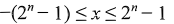
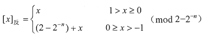
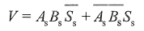

# 2021王道计算机组成原理考研复习指导 by 王道论坛 (z-lib.org)
## 第2章 数据的表示和运算
### 数制与编码
- 进位计数制
	- 整数
	- 小数
- 真值和机器数
- BCD码
	- 8421 码（最常用）
		- 8421 码是十进制数的编码，
×8421码就是二进制数
- 字符与字符串
- 校验码
	- 码距
		- 码距越大，检错、纠错能力越强
		- 仅靠增加奇偶校验位的位数不能提高正确性，还要考虑码距
	- 奇偶校验码
		- 偶校验
全校验
	- 海明（汉明）校验码
		- 发现:2
纠正:1
	- 循环冗余校验(CRC)码
发现:2
纠正:1
		- 发现并纠正信息串行读／写、存储或传送中出现的 一位或多位错（与多项式的选取有关）；
		- 数据链路层 & 大量数据
计算机网络的数据链路层， 适合对大量数据的数据校验。
		- 纠错原理和方法
在CRC码中， 选择适当的生成多项式G(x)， 
在计算机二进制信息M(x)的长度确定时， 余数与 CRC 码出错位的对应关系是不变的， 因此可以用余数作为判断出错位置的依据而纠正错码。
CRC码的检错方法如下：
	接收数据时， 将接收的CRC码与G(x)相除，若余数为0,则表明数据正确若余数不为0,说明数据有错。若G(x)选择得好， 则余数还可以判断出错位的位置， 从而实现纠错。
- 2.1.6 本节习题精选
	- 2.1.7 答案与解析
### 定点数
- 表示
	- 定点小数
	- 定点整数
	- 原码
简单、直观
		- 
			- 
		- 
			- 
	- 补码
加减法则统一采用加法
		- 小数
			- 
		- 整数
			- 
		- 求法
末位加1（即所谓“ 取反加1 ”)，此规则同样适用千由[x]补求[x]原 o
		- 补码 除法 (除以2)
符号&数值 ->右移一位
符号            ->不变
		- 补码的表示是唯一的
		- 变形补码(模4补码)
			- 常应用在
ALU
			- 加减运算 溢出问题
模 4 补码具有模 2 补码的全部优点且更易检查加减运算中的溢出问题，
			- 存储
存储时只需一个符号位
			- 送ALU加减运算时,两个符号位
只在把两个模 4 补码的数送往 ALU 完成加减运算时，才把每个数的符号位的值同时送到 ALU 的双符号位中，即只在 ALU 中采用双符号位，
	- 反码
中间过渡
		- 
		- 
	- 移码
常用来表示浮点数的阶码。它只能表示整数
		- x轴偏移若干单位
在真值X上加上一个常数（偏置值），通常这个常数取2n
			- 
		- 
		- 零的表示唯一
		- 移码和补码仅差一个符号位
		- 全0
			- 全1
		- 保持了数据原有的大小顺序， 移码大真值就大， 移码小真值就小
			- 
	- 机器数 转换
		- 机器数 转换
	- 码表
		- 几种码表示定点整数
- 运算
	- 算数移位
符号位不变
		- 相当于 真值补0
	- 逻辑移位
无符号数
	- 循环移位
带进位标志位CF（大循环）
不带进位标志位（小循环）
		- 
		- 适合 高低字节互换
将数据的低字节数据和高字节数据互换
	- 补码定点数加减
计算机系统中普遍采用补码加减运算
		- 逢二进一
		- 符号位与数值位按同样规则一起参与运算
		- 
			- modM运算是为了将溢出位丢掉
		- 有符号整数加减、无符号整数加减
			- 可以
利用同一个加法器辅助电路实现
			- n 位加法器实现的是模 2n 无符号整数加法运算
			- 无符号整数
对千无符号整数 a 和 b, a+ b 可以直接用加法器实现，而 a-b 可用 a 加 b 的补数实现，即 a- b =a+ [-b] 补(mod2^n)，所以 n 位无符号整数加减运算都可在 n 位加法器中实现。
			- 有符号整数
有符号整数用补码表示，补码加减运算公式为[a+ b]=[a]补＋［b］补 (mod2^n)，［a-b]补＝[a]补＋［-b]补(mod2^n)，所以 n 位有符号整数加减运算都可在 n 位加法器中实现。
		- 小数相加
|X+Y|<1 (X,Y<0) 
注意,溢出会被丢弃
	- 符号扩展
		- 补码 负数
原有形式的符号位移动到新形式的符号位上，新表示形式的所有附加位都用1 （对千整数） 或0 （对千小数） 进行填充。
		- 反码 负数
原有形式的符号位移动到新形式的符号位上， 新表示形式的所有附加位都用1进行填充。
	- 溢出
运算结果超过了数的表示范围。 通常，称大千机器所能表示的最大正数为上溢，称小千机器所能表示的最小负数为下溢。
		- 符号同->才能溢出
仅当两个符号相同的数相 加或两个符号相异的数相减才可能产生溢出
			- 运算结果是错误的
		- 一位符号位
无论是加法还是减法， 
只要参加操作的两个数符号相同， 
结果又与原操作数符号不同
			- 0 无溢出
正+正:V=00!1+!0!01->000+111
负+负:V=11!0+!0!01->111+000
		- 双符号位
S1S2不同， 表示溢出， 此时最高位符号位代表真正的符号
存储时只存储一位,运算时复制一位符号位
			- 双符号 异或
		- 一位 根据数据位进位
符号位的进位 Cs 与最高数位的进位G相同， 则说明没有溢出
			- 
			- 
				- 产生进位不一定代表溢出。
01或者10 才溢出 否者 多的位 直接丢弃
			- 进位 异或
		- 溢出判断电路
定点运算器中，无论是采用双符号位还是采用单符号位，必须有
			- 溢出判断电路，它一般用“异或“门来实现
		- 根本原因
计算机的字长有限
		- 标志位
			- 溢出标志位
OF 为1, 表示溢出，即说明寄存器 C 中的内容不是真正的结果
			- 符号标志位
符号标志位 SF 为 0,表示结果为正数（溢出标志为l ，说明符号标志有错）
			- 进位标志位
CF 为1, 仅表示加法器最高位有进位，对运算结果不说明什么。
	- 原码一位乘
符号位与数值位是分开求
把y数值位挨个和|x|相乘右移相加
数字位:|x|*|y|
符号位: xs⊕ys
		- 逻辑右移
右移
		- 
		- 双符号
考虑到运算时可能出现绝对值大于1的情况（但此刻并非溢出）， 所以部分积和被乘数取双符号位
		- 
	- 补码一位乘(Booth)
符号数的乘法， 采用相加和相减操作计算补码数据的乘积。
符号位参与运算
		- 算数右移
右移
		- ACC
（高位部分积）
			- MQ
（低位部分积／乘数）
		- 移位规则
		- 符号位参与运算
0.:1
		- https://www.bilibili.com/video/BV1wt411n7kL?from=search&seid=9999671720253224770
		- 结果 2N+1 位
补码一位乘法运算过程中一共向右移位 N 次，加上原先的 N 位，一共是 2N 位数值位，因乘积结果需加上符号位，因此共 2N+ l 位。
	- 乘法总结
原码: 乘数n个->累加n次
补码: 乘数n个+符号位1个->累加n+1次
(补码符号位参与运算)
	- 原码除法运算
原码加减交替除法
不恢复余数法
		- 恢复余数法
		- 不恢复余数法
如果第一步不是上0,而是1说明被除数大于除数->结果大于1->定点小数表示不了＞1的数->停止运算
			- 余数为负时,才需要恢复余数
仅当最后一步不够减时，才恢复一次余数
		- 符号单独判断
	- 补码除法运算
符号位与数值位一起参加运算，商符自然形成。
		- 第一 步根据被除数和除数的符号决定是做加法还是减法
		- 上商的原则根据余数和除数的符号位共同决定，同号上商”l",异号上商“ O"
			- 同号 减
若被除数与除数同号，则被除数减去除数；
			- 异号 加
若被除数与除数异号，则被除数加上除数。
				- 异号相除是看够不够减，然后上商，够减商0,不够减商1 
			- 余 除 同号->1->左移->减
若余数与除数同号，则商上 1,余数左移一位减去除数；
			- 余 除 异号->0->左移->加
若余数与除数异号，则商上 0,余数左移一位加上除数。
		- 最后一 步商恒置 “1 ”
			- 若对商的精度没有特殊要求
		- 
	- 除法运算总结
- 2C语言中的整数类型及类型转换
	- 存储方式
定点整数-补码
	- 数据的截取与保留
		- 浮点数&整数
当一个浮点数转换为整数时，浮点数的小数部分全部舍去，并按整数形式存储。但浮点数的整数部分不能超过整型数允许的最大范围，否则溢出。
浮点->整数
  小数->舍去->按整数存储(不能超过最大范围)
	- 精度丢失
		- 四舍五入会丢失一些精度，截去小数也会丢失一些精度。此外，数据由 long 型转换为 float 型或 double 型时，有可能在存储时不能准确地表示该长整数的有效数字，精度也会受到影响。
四舍五入
截取小数
long=>float/double(不能准确表示有效数字)
	- 转换结果的不确定性
		- 长->短&降格
较长的整数转换为较短的整数时，要将高位截去。例如，long型转换为short 型，只将低16 位送过去，这样就会产生很大的误差。浮点数降格时，如double 型转换为 float 型，当数值超过 float 型的表示范围时，所得到的结果将是不确定的。
长整数->短整数(保留低位)(long->short)
浮点数降格 (double->float)超f表示范围
	- 有符号&无符号
		- 有->无(短->长)
符号位成为数据的一部分
- 数据的存储和排列
	- 大端
便于人类阅读
先高位
	- 小端
便于机器计算
例如加法 CPU先计算低位(每次只能处理8位) 从67开始取正好
先低位
	- 边界对齐
		- 边界对齐
空同换时间
			- RISC如RAM
		- 边界不对齐
CISC如x86
- 2.2.5 本节习题精选
	- 2.2.6 答案与解析
### 浮点数
- 表示
	- 阶码E  - 范围
尾数M  -  精度
		- 尾数
绝对值大于1/2->节省尾数资源
->数量级使用阶码表示->节约位数
非规格化的数(数值+数量级)
			- 原码
最高位是1
				- 0.l
				- 1.l
			- 补码
最高位符号位相反
				- O.l
				- l.O
	- IEEE 754 标准
		- 尾数数符最前 隐藏最高位1
			- 
		- 短 长 常考
短 float 单精度
长 double 双精度
			- 短浮点数 真值
			- 长浮点数 真值
			- 一些规定
		- IEEE 754 浮点数 范围
E->最大 FE(254) FF占用了 表示无穷大
E->最小 01      00占用了 表示非规格化
M->最大 1.111...111=1+1-2^(-23)
E-范围
M-精度
			- 
		- 转换例子
- 加减
	- 对阶
先求阶差，然后以小阶向大阶看齐
	- 尾数求和
定点数加（减）运算规则运算。
	- 3 。规格化
	- 4 。舍入
		- "O" 舍“l" 入法
		- 恒置”1" 法
	- 5 。溢出判断
	- 例子
		- 
- C 语言中的浮点数类型及类型转换
	- int->float 32位->24位 ->精度可能损失
   是否损失 看a能否用 24表示
int/float->double 不损失
float/double->int 
   1. 小数 :int无小数(截断保留整数)
   2. 大   :int 范围更小->可能溢出
- 2.3.3 本节习题精选
	- 2.3.4 答案与解析
### 2.4 算术逻辑单元(ALU)
- 2.4.1 串行加法器和并行加法器
- 2.4.2 算术逻辑单元的功能和结构
- 2.4.3 本节习题精选
- 2.4.4 答案与解析
### 2.5 本章小结
### 2.6 常见问题和易混淆知识点
- 1.如何表示一个数值数据？计算机中的数值数据都是二进制数吗？
- 2 在高级语言编程中所定义的unsigned/short/int/l ong /float/double型数据是怎么表示的？什么称为无符号整数的 ＂溢出 “ ?
- 3 .如何判断一个浮点数是否是规格化数？
