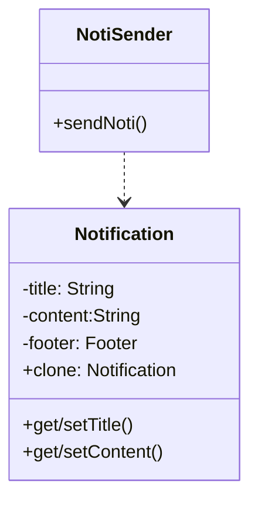

# prototype(原型)----对象创建型模式

## 意图

用原型实例指定创建对象的种类，并且通过拷贝这些原型创建新的对象。

## 动机

|                                                              |                                                              |
| ------------------------------------------------------------ | ------------------------------------------------------------ |
|  | 1. `Graphic`: 框架提供(音符和五线谱这样的图形构件)<br />2. `Tool`: 框架提供(定义选择板中的那些工具)<br />3. `GraphicTool`: 框架提供(创建图形对象实例并将它们加入到文档中的工具)<br />问题: `GraphicTool`不知道如何音乐类的实例(音符和五线谱的类特定于我们的应用，而`Graphic`类却属于框架), <br />为每一种音乐对象创建一个 `GraphicTool`的子类，但这样会产生大量的子类 |

## 结构

|                                                              | 参与者                                                       |
| ------------------------------------------------------------ | ------------------------------------------------------------ |
|  | - `Prototype`: 声明一个克隆自身的接口。<br />- `ConcretePrototype`: 实现一个克隆自身的操作。<br />- `Client`: 让一个原型克隆自身从而创建一个新的对象。 |

## 示例

设计问题:在COS中，Notification类 负责构建通知，有固定的格式(title 通知标题，content-通知内容，footer-公 司logo/落款)&  业务中有不同的通知类型，如订单生成通知，餐配送通知，订单完成通知等;在未来随着COS业务增加，可能会增加新的通知类型; 如何解决该设计问题?



```java
//不同通知只有title和content不同
class Notification implement Cloneable{ //java中实现克隆需要实现这个接口
    String title;
    String content;
    //setter getter
    Footer footer;
    
    Notification clone(){
        try{
            return (Notification)super.clone();//克隆出一个副本
        }catch(...){
            ...
        }
    }
}
```


