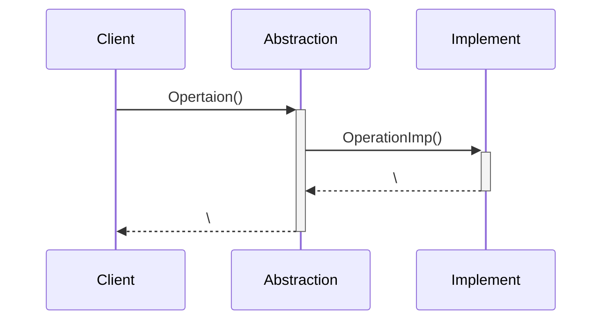
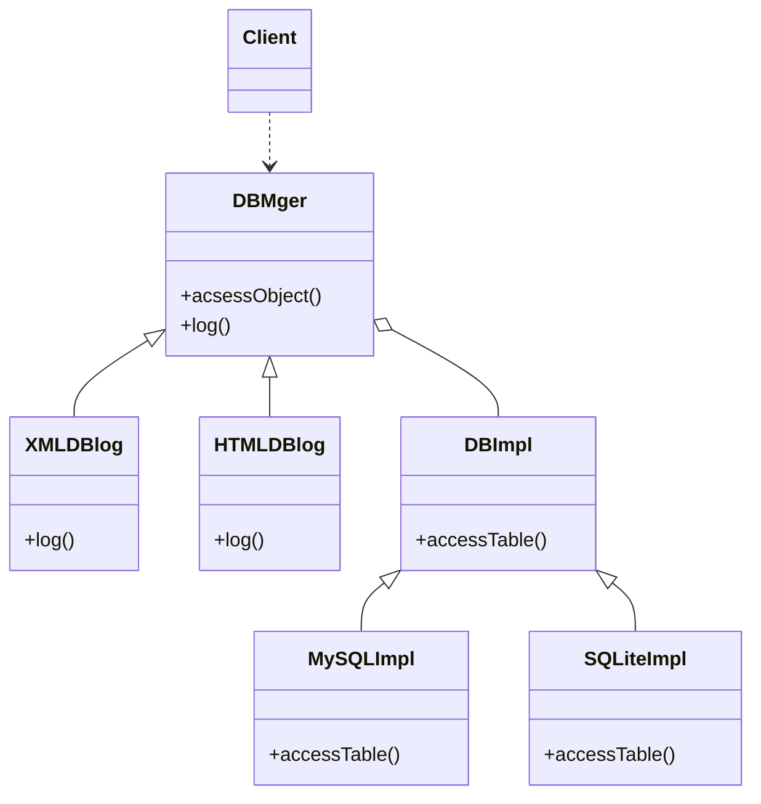

# Bridge(桥接)--对象结构型模式

## 意图

将抽象部分与它的实现部分分离, 使他们可以独立地变化

## 动机
||修改前|修改后|
|-|-|-|
|结构|||
|问题|1. `X`和`PM`是两类操作系统, 每增加一种`window`都需要为两种操作系统写一个类||

## 应用场景

1. 解耦合抽象和实现
   1. 你不希望在抽象和它的实现部分之间有一个固定的绑定关系。例如这种情况可能是因为，在程序运行时刻实现部分应可以被选择或者切换。
2. 抽象和实现需要分别自由扩展
   1. 类的抽象以及它的实现都应该可以通过生成子类的方法加以扩充。这时`Bridge`模式使你可以对不同的抽象接口和实现部分进行组合，并分别对它们进行扩充。
   2. 对一个抽象的实现部分的修改应对客户不产生影响，即客户的代码不必重新编译。
   3. （C++）你想对客户完全隐藏抽象的实现部分。在C++中，类的表示在类接口中是可见的。
   4. 你必须将一个对象分解成两个部分。
   5. 你想在多个对象间共享实现（可能使用引用计数），但同时要求客户并不知道这一点。

## 结构

|结构|参与者|
|-|-|
|&emsp;&emsp;&emsp;&emsp;&emsp;&emsp;&emsp;&emsp;&emsp;&emsp;&emsp;&emsp;&emsp;&emsp;&emsp;&emsp;&emsp;&emsp;&emsp;&emsp;&emsp;&emsp;&emsp;&emsp;&emsp;&emsp;&emsp;&emsp;&emsp;&emsp;&emsp;&emsp;&emsp;&emsp;&emsp;&emsp;&emsp;&emsp;&emsp;&emsp;&emsp;|1. `Abstraction(Window)`: <br />&emsp;&emsp;- 定义抽象类的接口<br />&emsp;&emsp;- 维护一个指向`Implementor`类型对象的指针<br />2. `RefinedAbstraction(IconWindow)`:扩充由`Abstracion`定义的接口<br />3. `Implementor(WindowImp)`<br />&emsp;&emsp;定义实现类的接口，该接口不一定要与`Abstraction`的接口完全一致；事实上这两个接口可以完全不同。一般来讲， `Implementor`接口仅提供基本操作，而`Abstraction`则定义了基于这些基本操作的较高层次的操作。<br />4. `ConcreteImplementor(XwindowImp,PMWindowImp)`: 实现`Implementor`接口并定义它的具体实现|

## 协作




## 好处/缺点

1. 增加了设计类的数量

## 例子

> 设计问题: COS需求中提出， 该系统在将来需要支持不同的数据库类型: 类 DBMger向客户代码提供面向对象的数据访问接口，井且记录数据访问日志, 与 据库类型无关)，日志以xml或html格式文件存储。如何解决该设计问题?



### 关键代码

```java
public class DBMger{
    DBImpl dbi;
    accessObject(){
        // 关于面向对象数据访问的实现
        dbi.accessTable();
        // 关于面向对象数据访问的实现
    }
    abstract log();
}

class XMLDBlog()
class HTMLDBlog()

class DBImpl{
    abstract accessTable();
}
class MySQLImpl
class SQLiteImpl


Client{
    // 
    DBMger.accessObject();
}
```