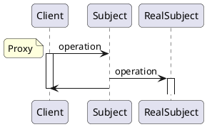
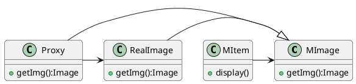

# Proxy(代理) -- 对象结构型模型

## 意图

- 为目标对象提供一个占位对象或代理对象, 用来控制客户端对目标对象的访问

## 应用场景

1. 控制昂贵对象的实例化
2. 控制客户端访问目标对象的权限
3. 为远程对象提供本地引用代理

## 好处缺点

1. 代码结构变复杂

## 结构

|                                                              | 对象 |
| ------------------------------------------------------------ | ---- |
|  |<br />•`Proxy(ImageProxy)`<br />&emsp;* 保存一个引用使得代理可以访问实体。若RealSubject和Subject的接口相同，Proxy会引用Subject。<br />&emsp;* 提供一个与Subject的接口相同的接口，这样代理就可以用来替代实体。<br />&emsp;* 控制对实体的存取，并可能负责创建和删除它。<br />&emsp;* 其他功能依赖于代理的类型：<br />•`RemoteProxy`负责对请求及其参数进行编码，并向不同地址空间中的实体发送已编码的请求。<br />•`VirtualProxy`可以缓存实体的附加信息，以便延迟对它的访问。例如，动机一节中提到的ImageProxy缓存了图像实体的尺寸。<br />•`ProtectionProxy`检查调用者是否具有实现一个请求所必需的访问权限。<br />•`Subject(Graphic)`<br />&emsp;* 定义RealSubject和Proxy的共用接口，这样就在任何使用RealSubject的地方都可以使用Proxy。<br />•`RealSubject(Image)`<br />&emsp;* 定义Proxy所代表的实体。|

## 协作




## 例子

> 问题: COS系统以列表形式显示菜单项MItem, 每个菜单项MItem都需要显示菜品图片MImage,由于列表页面加载菜单项MItem较多,页面响应时间变慢.如何解决该问题?



### 代码

```java
class Proxy extends MImage{
    Image img;
    getImg(){
        // 启动异步加载任务
        return img;
    }
    LoadImg(){
        // RealImage.getImage();
    }
}
class RealImage{
    getImg(){
        // 加载真正的菜单图片
    }
}
class MItem{
    display(){
        MImage mi;//指向一个Proxy
        mi.getImg();
    }
}
```