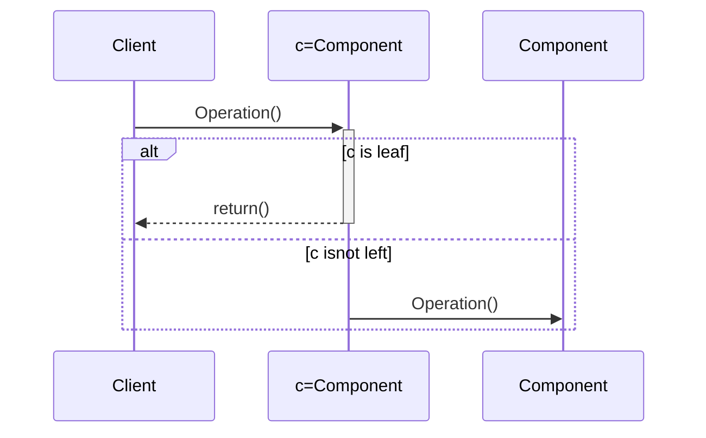

# Composite Pattern(组合)--结构型模式

## 意图

- 将聚合对象分解成树结构, 客户对象使用统一的方式对待聚合体和组成元素

## 应用场景

1. 使客户端忽略聚合体和组件的不同点, 使用统一的方式对待他们,
2. 客户端使用聚合对象及其组件时, 想简化客户端使用行为

## 好处/缺点

1. 无法限制聚合体组件的类型

## 结构

|                                                              | 参与者                                                       |
| ------------------------------------------------------------ | ------------------------------------------------------------ |
|  | 1. `Component`: <br />- 为组合中的对象生命接口<br />- 在适当的情况下, 实现所有类共同接口的缺省行为<br />- 声明一个接口用于访问和管理`Component`的子组件<br />-(可选)在递归结构中定义一个接口, 用于访问一个父部件, 并在合适得情况下实现它<br />2. `Leaf`: <br />-在组合中表示叶节点对象, 叶节点没有子节点<br />-在组合中定义图元对象得行为<br />3. `Composite`<br />- 定义有子部件的那些部件得行为<br />- 存储子部件<br />- 在`Component`接口中实现与子部件有关的操作<br />4. `Client`: <br />- 通过`Component`接口操纵组合部件的对象 |

## 协作



## 例子

> 设计问题: COS中， CViewer绘 制数据统计结果页面SPage,统计页面可以 包含多个统计单页面，每个统计单页面由多个或单个三种类型的图元素组成 Line,Bar;未来有可能加入新的图形元素Tree。如何解决该设计问题


### 关键代码

```java
class CViewer{
    StatisView sv;
    
    display(){
        sv.draw();
    }
}
class Spage{
    private List<StatisView> v;
    
    draw(){
        //for each s in v
        s.draw();
        //...
    }
}
class Pie{
    draw(){
        //绘制饼图
    }
}
```

