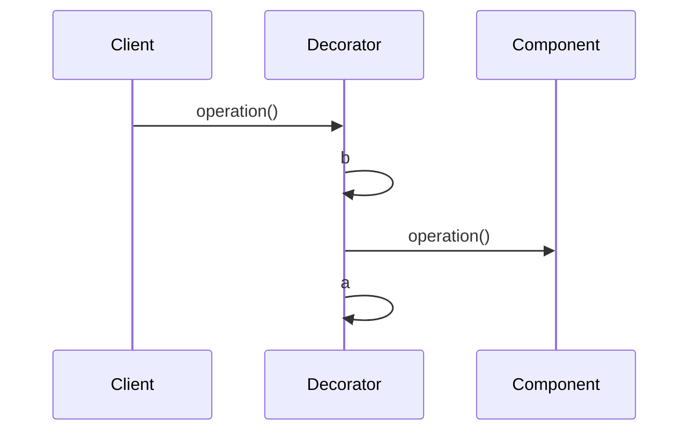

# DECORATOR（装饰）—对象结构型模式

## 意图

- 动态地向对象添加功能/职责

## 应用场景

1. 子类扩展功能不可行
2. 向同一类型对象中的某个对象动态添加或删除功能/职责, 而不影响到其他对象

## 好处/缺点

1. 动态地向对象添加/删除功能, 使代码调试变得困难

## 结构

|                                                              | 参与者                                                       |
| ------------------------------------------------------------ | ------------------------------------------------------------ |
|  | 1. `Component`: <br />— 定义一个对象接口，可以给这些对象动态地添加职责。<br />2. `ConcreteComponent`: <br />— 定义一个对象，可以给这个对象添加一些职责。<br />3. `Decorator`: <br />— 维持一个指向`Component`对象的指针，并定义一个与 `Component`接口一致的接口。<br />4. `ConcreteDecrator`:<br />— 向组件添加职责。 |

## 协作



## 例子

> 设计问题:COS系统中，当客户Patron订购的菜品时，每种菜品FoodItem设置订购数量，只有少数菜品对象，可以额外设置辣味或甜味的等级(微，中, 重) . 如何解决该设计问题?


```java
abstract class FoodItem{
    setAmount(){//....}
}
class SimpleFood extends FoodItem{
    @overrid
    setAmount(){//....}
}
class FoodDecorator extends FoodItem{
    FoodItem fi;
    @overrid
    setAmount(){
        fi.setAmount();
    }
}
class HFD extends FoodDecorator{
    @overrid
    setAmount(){
        super.setAmount();
    }
    setHL(){
        //设置轻, 中, 重
    }
}
class Patron{
    //...
    choose(){
        FoodItem f1=new SimpleFood();
        f1.setAmount();
        FoodItem f2=new SimpleFood();
        HFD hf2=new HFD(f2);//装饰
        hf2.setAmount();
        hf2.setHL();
    }
}
```

