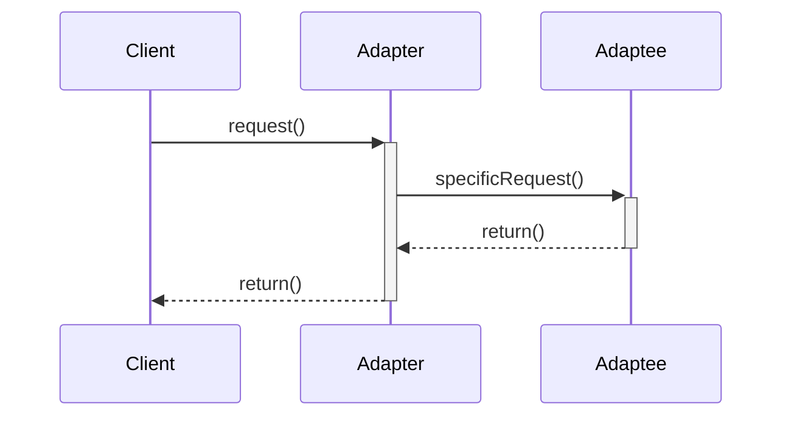
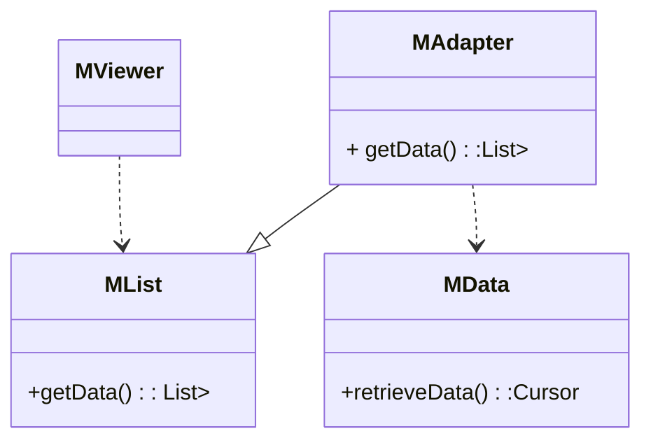

# Adapter Pattern适配器模式--结构型模式

## 意图

将目标类型的接口转换成客户端期望的接口, 从而使接口不兼容的类一起协作

## 应用场景

1. 当某个已存在的类提供的接口不是客户端期望的接口
2. 当想在不必提供兼容接口的客户类中重用目标类

## 好处/缺点

1. 适配器静态绑定到被适配对象, 无法重新适配其他目标对象

|            |                                                              | 参与者                                                       |
| ---------- | ------------------------------------------------------------ | ------------------------------------------------------------ |
| 多重继承   |  | 1. `Target` : 定义Client使用的与特定领域相关的接口<br />2. `Client`: 与符合Target接口的对象协同<br />3. `Adaptee`: 定义一个已经存在的接口, 这个接口需要适配<br />4. `Adapter`: 对Adaptee的接口与Target接口进行适配 |
| 对象适配器 |  |                                                              |



## 案例

> 设计问题:在COS系 统中，`MViewer`类显示菜单列表`MList`时，使用数据结构类型是`List<HashMap<String,String>>`,而数据源对象类`MData`只提供游标`Cursor`数据结构类型。如何解决该设计问题?



### 关键代码

```java
public class MAdapter{
    MData date;
    public List<HashMap<string,string>> getData(){
        Cursor c=data.retrieveData();
        //构建lsit<HashMap<stirng,string>>
        //通过Cursor c
        return List<HashMap<stirng,string>>
    }
}
class MViewer{
    MList ml=new MAdaptar;
    ml.getData();
}
```

