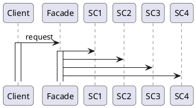
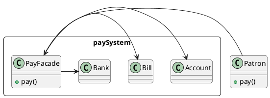

# Facade Pattern 门面模式

## 意图

- 为子系统接口集提供统一接口,使之更易使用

## 应用场景

1. 为复杂子系统提供简单接口
2. 解耦子系统抽象实现与客户端

## 好处/缺点

1. 子系统变化回导致门面接口变化

## 结构

| | |
|-|-|
| |<br />•`Facade(Compiler)`<br />&emsp;* 知道哪些子系统类负责处理请求。<br />&emsp;* 将客户的请求代理给适当的子系统对象。<br />•`Subsystemclasses(Scanner、Parser、ProgramNode`等)<br />&emsp;* 实现子系统的功能。<br />&emsp;* 处理由Facade对象指派的任务。<br />&emsp;* 没有facade的任何相关信息；即没有指向facade的指针.|

## 协作



## 例子

> 在`cos`系统中,当客户`Patron`支付订单时,使用支付子系统完成支付业务,支付过程中需要完成的业务有:账户管理,账单生成与维护,银行网关交互等;需要简化`Patron`使用支付子系统,并减少他们之间耦合关系.如何设计解决该问题?



### 关键代码

```java
class Patron{
    pay{
        // Facade.pay();
    }
}
class PayFacade{
    pay(){
        // Account.pay();
        // Bill.pay();
        // Bank.pay();
    }
}
```