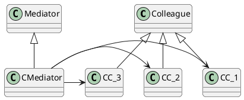
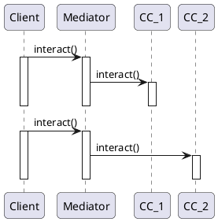
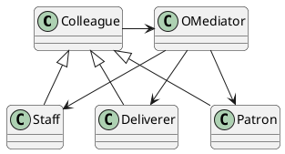

# Mediator Pattern

## 意图

定义一个对象,用来封装一组对象交互关系的实现, 以降低交互对象显示引用耦合, 使之自由变化

## 应用场景

1. 一组对象以与规律的方式交互, 但交互方式复杂
2. 因某个对象引用并且和多对象交互难以引用
3. 分布在不同类种的某个行为不使用多个子类进行定制

## 好处/缺点

仲裁者对象实现复杂, 且难以维护

## 结构

- Mediator: 定义交互(协作)对象的交互行为
- ConcreteMediator: 
- ColleagueClasses: 协作对象类



## 协作时序图



## 例子




```java
class OMediator{
    Patron p;
    Staff s;
    Deliverer d;
    deliverOrder(){
        s.deliverer();
    }
    deliverResponseFromStaff(){
        p.receive();
    }
}
class Patron{
    OMediator om;
    requestOrder(){
        om.deliverOrder();
    }
}
```