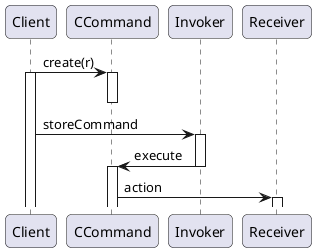
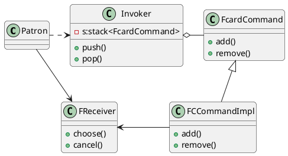

# Command Pattern 命令模式

## 意图

- 将请求封装为对象, 以便进行请求的参数化, 重做, 撤销等操作

## 应用场景

1. 业务请求保存在队列里, 以备执行
2. 支持业务请求的redo/undo
3. 实现业务行为参数化

## 好处缺点

1. 有可能造成类爆炸

## 结构

| |参与者 |
|-|-|
| |<br />•`Command`<br />&emsp;* 声明执行操作的接口。<br />•`ConcreteCommand(PasteCommand，OpenCommand)`<br />&emsp;* 将一个接收者对象绑定于一个动作。<br />&emsp;* 调用接收者相应的操作，以实现Execute。<br />•`Client(Appliction)`<br />&emsp;* 创建一个具体命令对象并设定它的接收者。<br />•`Invoker(MenuItem)`<br />&emsp;* 要求该命令执行这个请求。<br />•`Receiver(Document，Application)`<br />&emsp;* 知道如何实施与执行一个请求相关的操作。任何类都可能作为一个接收者。|

## 协作



## 例子

> 设计问题:`COS`系统中，客户`Patron`在点菜页面，可以直接点击撤销按钮撤销购物车中点选的菜品`Food`,而不需要在购物车`Cart`页面进行操作:每按一次撤销按钮，购物车中最近被点选菜品被删除，直到购物车为空。如何解决该设计问题



### 关键代码

```java
class Patron{
    FReceiver fr;
    FcartCommand fcc=new FCCommandImpl(fr);
    Invoker i;
    i.push(fcc);
    // pop();
}
class Invoker{
    push(r){
        s.push(fcc);
        fcc.add();
    }
    pop(){
        f=s.pop();
        f.remove();
    }
}
class FCCommandImpl{
    add(){
        r.choose();
    }
    remove(){
        r.cancel();
    }
}
```