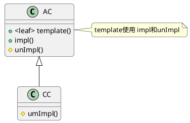
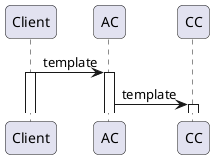
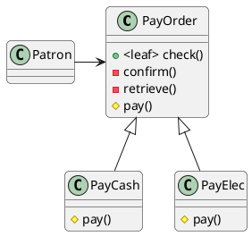

# Template Method Pattern

## 意图

在一个操作中定义算法的框架, 将算法中的某些步骤延迟到子类实现

## 应用场景

1. 将算法不变部分一次实现, 可变部分由子类实现
2. 控制子类扩展, 实现Hook方法

## 好处/缺点

1. 增加了实现类的数量

## 结构

- AbstractClass
- ConcreteClass





## 例子




```java
class PayOrder {
  final check(){
      confirm();
      pay();
      retrieve();
  }
  confirm(){
      ...
  }
  retrieve(){
      ...
  }
  abstract pay();
}
class PayCash extends PayOrder{
    pay(){
    //   现金支付
    }
}
class Patron {
  check(){
      PayOrder po=new PayCash();
      po.check();
  }
}
```