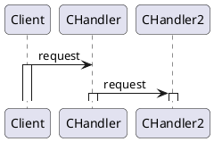
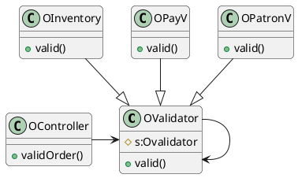

## Chain of Responsibility Patron-职责链

## 意图

- 减少请求发送者与接受者的耦合, 讲请求再接收者链上传递, 直到该请求被处理

## 应用场景

1. 将请求发送给多个对象中的某一个, 但不显式指定接收者
2. 多个对象可以处理请求,但预先不知道哪个对象处理
3. 处理请求的对象集应该被动态设定

## 好处缺点

1. 无法保证请求一定被正确处理

## 结构

| |参与者 |
|-|-|
| |<br />•`Handler（`如HelpHandler）<br />&emsp;* 定义一个处理请求的接口。<br />&emsp;* （可选）实现后继链。<br />•`ConcreteHandler（`如PrintButton和PrintDialog）<br />&emsp;* 处理它所负责的请求。<br />&emsp;* 可访问它的后继者。<br />&emsp;* 如果可处理该请求，就处理之；否则将该请求转发给它的后继者。<br />•`Client`第5章行为模式149下载<br />&emsp;* 向链上的具体处理者(ConcreteHandler)对象提交请求。 | 

## 协作



## 例子

> 设计问题:`COS`系统中，订单控制器`OController`根据订单`Order`状态，进行有效。.性验证，订单验证任务有:客户`Patron`身份验证，商品库存验证，支付结果验证分别由`OPatronV`,`OInventoryV`,`OPayV`对象完成验证业务处理;将来可能会加入新订单验证任务。如何解决该设计问题?



```java
class OController{
    OValidator chainv;
    ValidOrder (){
        order o;
        chain.valid(o);
    }
}
class OPatronV{
    valid(o){
        // 验证
        s.valid(o)
    }
}
```