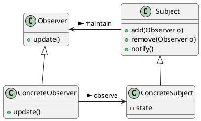
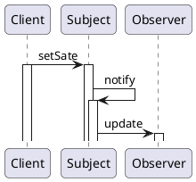
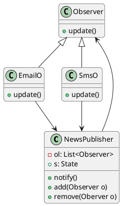

# Oberver Pattern

## 意图

定义对象之间1对多依赖, 当被依赖对象的状态改变时, 所有依赖对象能自动收到通知和更新自己

## 应用场景

1. 当一个对象改变时, 需要改变其他对象, 但并不了解其他对象的数量
2. 当一个对象应当负责通知其他对象的职责实现时, 降低通知对象和被通知对象的耦合

## 好处/缺点

1. 被观察脆响状态的更新可能会引起观察者级联更新

## 结构



## 协作



## 例子




```java
class NewsPublisher {
  List<Observer> ol;
  State s;
  add(Observer o){
      ol.add(o);
  }
  remove(Observer o ){
      ....
  }
  notify(){
      for (observer o: ol){
          o.update(s);
      }
  }
}
class EmailO implements Observer{
  update(State s){
      ...Response
  }
}
class SmsO implements Observer{
  ....
}
```