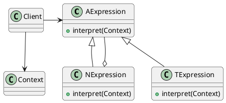
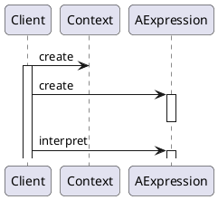
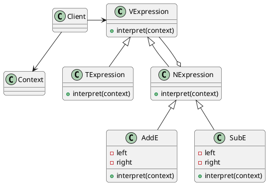

# Interpreter Pattern--解释器模式

## 意图

定义某个语言的语法, 用于解释该语言中的句子

## 应用场景

1. 当某个语言语法较为简单时
2. 解释语言的效率没有严格要求时

## 好处缺点

- Client: 使用解释器, 执行解释某个语言
- AbstractExpression: 表达式组成
- TermianalExpression: 终结符
- NonterminalExpression: 非终结符
- Context: 上下文

## 结构



## 协作



## 例子

> COS登录模块提供验证码服务, 验证码是由中文格式的个位数和加减法二元表达式的结果生成; 如壹+贰, 则该验证码的结果为3. 如何解决该设计问题?



```java
class Client{
    VExpression left,right; //初始化
    AddE ae=new AddE(left, right);
    Context c =new Context(); //执行时所需要的一切信息
    int result=ae.interpret(c);
}
class AddE extends NExpression{
    AExpressin left,right;
    @override
    interpret(Context c){
        return left.interpret(c)+right.interpret(c);
    }
}
```