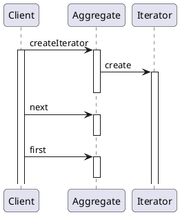
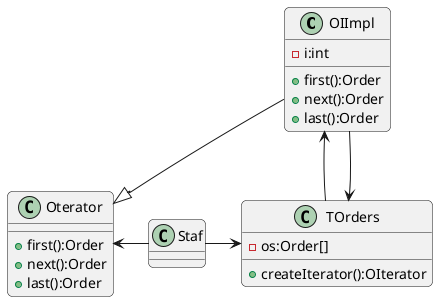

# Iteratro(迭代器)

## 意图

- 在不暴露聚合体对象内部表示的情况下, 提供遍历其组成元素的接口

## 应用场景

1. 不暴露聚合体内部表示, 访问该对象内容
2. 为聚合对象提供多种遍历方式
3. 为不同的聚合结构提供统一访问方式

## 好处

1. 访问聚合对象私有数据时, 可能会破坏聚合体的封装特性

## 结构

| |参与者|
|-|-|
| |<br />•`Iterator（`迭代器）<br />&emsp;* 迭代器定义访问和遍历元素的接口。<br />•`ConcreteIterator（`具体迭代器）<br />&emsp;* 具体迭代器实现迭代器接口。<br />&emsp;* 对该聚合遍历时跟踪当前位置。<br />•`Aggregate（`聚合）172设计模式：可复用面向对象软件的基础下载<br />&emsp;* 聚合定义创建相应迭代器对象的接口。<br />•`ConcreteAggregate（`具体聚合）<br />&emsp;* 具体聚合实现创建相应迭代器的接口，该操作返回ConcreteIterator的一个适当的实例。| 

## 协作



## 例子

> 设计问题:在`COS`系统中，订单管理员`Staff`需要逐个审核客户提交的订单`Order`,并修改订单状态;客户提交的未审核订单都存储在未审核订单`TOrders`中:需要使`Staf`在不需要了解`TOrders`如何聚合订单`Order`对象的情况完成审核业务。如何设计解决该问题?



### 关键代码

```java
class Staff{
    verify(){
        TOrder to;
        OIterator oi=to.createIterator();
        Order o=oi.first();
        // oi.next();
    }
}
class TOrders{
    Order[] os;
    OIterator createIterator(){
        return new OIImpl(this);
    }
}
class OIImpl implements OIterator{
    int i;
    Order first(){
        i=0;
        if(os!=null)
            return os[i];
        else
            return null;

    }
    next();
    last();
}
```

