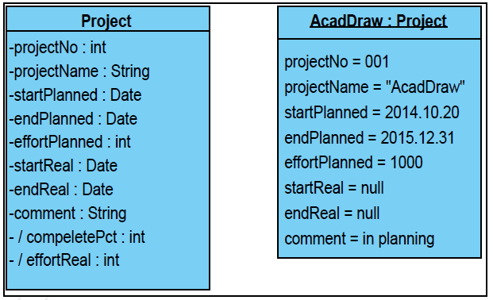
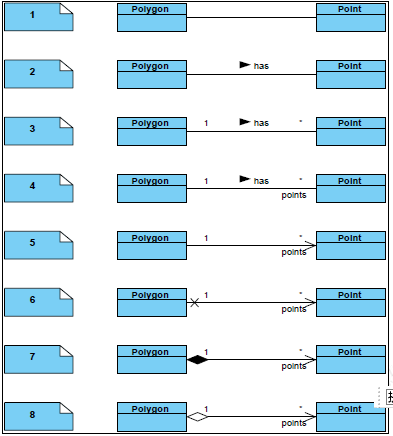
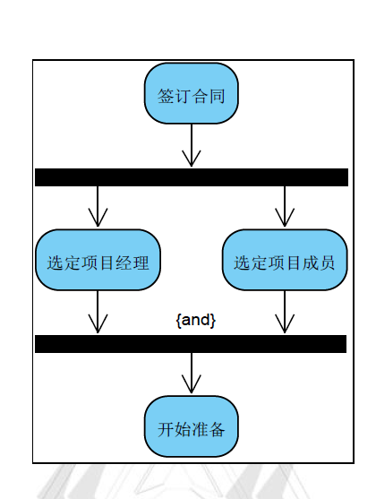
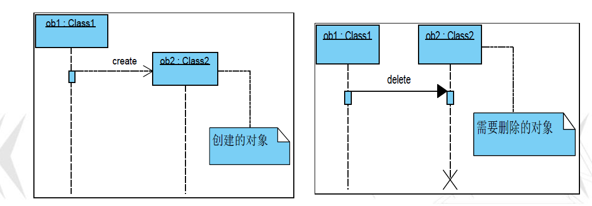

# 1. 软件工程概述

- 软件: 
  - 程序:指令集
  - 数据. 
  - 文档: 研制过程/方法/使用 的记录

|          |                                |                                                                         |                                                            |
| -------- | ------------------------------ | ----------------------------------------------------------------------- | ---------------------------------------------------------- |
| 软件危机 | 开发,维护$\rightarrow$严重问题 | $\rightarrow$软件寿命缩短/夭折                                          |                                                            |
|          | 表现                           | 预算/成本 没钱                             |                                                            |
|          |                                | 期限/进度 干不完                           |                                                            |
|          |                                | 质量 干的差                                |                                                            |
|          |                                | 用户满意 让人骂                            |                                                            |
|          |                                | 开发过程.有效介入.管理 干的乱七八糟        |                                                            |
|          |                                | 代码维护    代码是一坨屎,不会磨损,但会退化 |                                                            |
|          | 原因                           | 技术    干活的不行                         | 规模                                                       |
|          |                                |                                                                         | 复杂(固有)                                                       |
|          |                                | 管理 管人的不行                            | 无理论指导.靠个人技巧 瞎bb    |
|          |                                |                                                                         | 用户需求完整准确认识 啥也不懂 |
|          | 消除方式                       | 正确认识软件                               |                                                            |
|          |                                | 成功的更好的技术/方法/消除概念/做法        |                                                            |
|          |                                | 软件工具(开发/使用)                        |                                                            |
|          |                                | 管理措施(时间/人员/资源)                   |                                                            |

|          |                                                     |                                                                                             |     |
| -------- | --------------------------------------------------- | ------------------------------------------------------------------------------------------- | --- |
| 软件工程 | 研究方面(技术/管理)                                 |                                                                                             |     |
|          | 无章法(个人英雄)$\rightarrow$工程项目管理模式(团队) |                                                                                             |     |
|          | \[IEEE\]                                            | (工程原则/方法)系统/规范/可量化$\overset{应用于}{\rightarrow}$开发/运行/维护/方法的理论研究 |     |
|          | 目标   (高/低)         | (高效开发)高质量软件                                                                        |     |
|          |                                                     | (降低开发)成本                                                                              |     |
|          | 基本原理                                            | 1.分阶段/生命周期计划/严格管理                                                              |     |
|          |                                                     | 2.坚持/阶段评审                                                                             |     |
|          |                                                     | 3.严格/产品控制                                                                             |     |
|          |                                                     | 4.现代/程序设计技术                                                                         |     |
|          |                                                     | 5.结果/能/清楚审查                                                                          |     |
|          |                                                     | 6.开发小组/少/精                                                                            |     |
|          |                                                     | 7.承认/不断/改进/软件工程实践/必要性                                                        |     |

|          |          |                                                                                 |
| -------- | -------- | ------------------------------------------------------------------------------- |
| 系统工程 | 目的     | (更好)达到(系统目标)/对系统的(构成要素)(组织结构)(信息流动)(控制机构)/分析/设计 |  |
|          |          | 正确的/时间/方法/事情                                                           |  |
|          | 实现方法 | 商业过程工程(Business Process Engineering)                                      |  |
|          |          | 产品工程(Product Engineering)                                                   |  |
|          | 常用方法 | 层次分析方法/分解为不同的(组成因素)/关联影响.隶属关系/不同层次组合              |  |

|                                                                      |                                      |                                                                        |                                   |
| -------------------------------------------------------------------- | ------------------------------------ | ---------------------------------------------------------------------- | --------------------------------- |
| 统一建模语言UML(Unified Model Language) | 描述    | OO开发中占主导地位                        |                                   |
|                                                                      |                                      | 提供整套系统建模的基础设施:模型表示/建模  |                                   |
|                                                                      |                                      | 软件开发中的(语言表示)与(过程)分离        |                                   |
|                                                                      | 功能    | 可视化                                    |                                   |
|                                                                      |                                      |  规格说明                                 |                                   |
|                                                                      |                                      |  构造                                     |                                   |
|                                                                      |                                      |  文档化                                   |                                   |
|                                                                      | 2.0模型 | 用例                                                                   | 系统&使用者                       |
|                                                                      |                                      | 活动                                                                   | 顺序&并行活动                     |
|                                                                      |                                      | 类                                                                     | 类&接口&关系                      |
|                                                                      |                                      | 对象                                                                   |                                   |
|                                                                      |                                      | 顺序                                                                   | 对象的互动顺序                    |
|                                                                      |                                      | 通信                                                                   | 对象的交互方法&需要支持交互的连接 |
|                                                                      |                                      | 时序                                                                   | 重点对象交互时间安排              |
|                                                                      |                                      | 交互概况                                                               |                                   |
|                                                                      |                                      | 组成结构                                                               |                                   |
|                                                                      |                                      | 组件                                                                   |                                   |
|                                                                      |                                      | 包                                                                     | 类&组件的分级组织                 |
|                                                                      |                                      | 状态                                                                   | 生命周期对象的状态&事件           |
|                                                                      |                                      | 部署                                                                   |                                   |

|                  |                                                                            |                                                                          |
| ---------------- | -------------------------------------------------------------------------- | ------------------------------------------------------------------------ |
| 系统开发的解空间 | 现代的面向对象分析 和设计方法是(基于模型) | 综合使用/用例建模/静态建模/动态建模/构建建模/描述/软件需求,分析/设计模型 |

|                                                |                                               |                                                              |                                                              |
| ---------------------------------------------- | --------------------------------------------- | ------------------------------------------------------------ | ------------------------------------------------------------ |
|  软件工程开发方法 | 技术/规范                                     | 三个要素                        | 方法/工具/过程                                               |
|                                                | 传统(结构化)方法 | 静态的思想                                                   | 分而治之                        |
|                                                |                                               | 若干阶段/阶段任务/阶段顺序 好多阶段干啥,谁先干 |                                                              |
|                                                |                                               | 缺点                                                         | ~~灵活性~~                                                   |
|                                                |                                               |                                                              | ~~应对无法避免未预料变化~~                                   |
|                                                |                                               |                                                              | (软件规模大/早期需求模糊/常变)不成功/维护困难/系统总成本     |
|                                                |  面向对象方法    | 动态的思想                                                   | 模拟人类思维                    |
|                                                |                                               | 对象(静态属性/动态方法) 作为 (融合数据&数据之上的操作行为的统一)软件构件 对象 |                                                              |
|                                                |                                               | 对象划分为(类:静态属性/动态方法) 对象咋样 |                                                              |
|                                                |                                               | 类s构成(继承)层次关系 好多对象  |                                                              |
|                                                |                                               | (消息机制)联系-封装性 对象交流  |                                                              |
|                                                |                                               | 特点                                                         | 模拟人类思维 主动反复迭代过程 概念表示一致阶段过渡平滑无缝 继承 降复杂 重用 |

# 2. 软件开发过程/软件开发生命周期

- 软件开发 (宏观上)任务框架/规范

|                                               |          |                |                        ||
| --------------------------------------------- | -------- | -------------- | -----------------|----- |
| 软件生命周期模型 | 种类     | 顺序式         |                   |     |
|                                               |          | 迭代式         |                    |    |
|                                               |          | 增量式         |                     |   |
|                                               |          | 敏捷式         |                      |  |
| 过程管理 (划分软件生命周期)                    | 分而治之 | 软件定义(时期) | 具体阶段/对应/明确任务 ||
|                                               |          | 软件开发(时期) | 具体阶段/对应/明确任务 ||
|                                               |          | 运行维护(时期) | 具体阶段/对应/明确任务 ||
||更加细分软件生命周期|1.可行性分析与开发设计|尽快确定能否开发,是否值得开发的依据-可行性报告|解决办法(技术/经济/社会可行性)|
|||2.需求分析|未来需要完成的功能详细分析-需求规格报告|基础 成功与否 需求变更管理|
|||3.软件设计|需求系统求解的框架:架构/数据设计...|1. 概要设计-概要设计说明书 2. 详细设计-详细设计说明书 蓝图-未来扩展/稳定性|
|||4.编码|软件设计结果$\overset{翻译}{\rightarrow}$程序代码||
|||5.软件测试|单元测试 集成测试 系统测试|黑盒/白盒|
|||6.软件维护|持续时间最长 持续适应要求 延续寿命||

- 传统生命周期模型:严格按照 需求,分析, 设计, 编码, 维护
  - 最基本和有效

|                                               |                                                              |          |                                                              |
| --------------------------------------------- | ------------------------------------------------------------ | -------- | ------------------------------------------------------------ |
| 传统生命周期模型 | 顺序式瀑布模型最广泛 | 特点     | 文档/计划驱动(静态的开发形式) 阶段顺序 按攻略 |
|                                               |                                                              |          | 推迟实现/对系统充分认识理解 整明白再干 |
|                                               |                                                              |          | 质量保证(阶段结束前的评审)~~延迟处理~~ 靠开发者的谱 |
|                                               |                                                              | 问题     | 用户/早期结束接触/开发者臆想/系统返工 不靠用户的谱 |
|                                               |                                                              |          | ~~灵活性~~/~~变更~~ 不希望有变化 |
|                                               |                                                              | 应用     | 规模较大(系统开发)/分布式(开发模式)-系统的整体把控&协调 |
|                                               | 顺序式快速原型模型 | 特点     | 用户与开发者(桥梁)              |
|                                               |                                                              |          | 对系统快速简单分析$\rightarrow$软件原型  需求阶段产生                     |
|                                               |                                                              |          | 试用演示原型/沟通反馈/评价改进/~~误解~~/~~需求不明确风险~~/提高质量/真正需求 |
|                                               |                                                              | 适用     | 全新系统开发/原型$\rightarrow$开发方向正确性                 |
|                                               |                                                              |          | 尝试运用未来系统中需要的新技术,提前测试性能上要求            |
|                                               |                                                              | 主要问题 | 选用的(开发技术/工具)实际不一定需要                          |
|                                               |                                                              |          | 快速建立的模型不符合各种开发规范/不断修改$\rightarrow$质量差/完全抛弃 |
|                                               | 增量式增量(演化)模型            | 特点     | 软件(视为)一系列(增量构件)-设计/实现/继承/测试 |
|                                               |                                                              |          | 构件-代码片段-特定功能-互相作用的模块 |
|                                               |                                                              |          | 第一个增量(基本需求的核心产品)/评估/下一个增量               |
|                                               |                                                              | 不足     | 加入构件不能破坏系统部分/需要开放式体系结构                  |
|                                               |                                                              |          | 灵活性-容易退化成边做边改-~~软件过程的控制整体性~~           |
|                                               | 迭代式螺旋模型                  | 特点     | 结合瀑布&快速原型               |
|                                               |                                                              |          | 风险驱动(可选方案&约束条件:-软件重用) - 每个阶段都有风险分析 |
|                                               |                                                              |          | 使用原型/其他方法/降低风险      |
|                                               |                                                              | 适用     | 大型复杂(系统开发)              |
|                                               |                                                              | 限制     | 客户难理解风险分析/内部的大规模开发                          |
|                                               |                                                              |          | 风险分析影响利润-大项目                                      |
|                                               |                                                              |          | 准确分析风险/否则/更大的风险                                 |
|                                               |                                                              | 缺点     | 有些风险无能为力                                             |
|                                               |                                                              |          | 需要专业风险评估人员                                         |
|                                               | 迭代式喷泉模型 |          | (典型的)面向对象生命周期模型    |
|                                               |                                                              |          | 具有更多增量和迭代性质                                       |
|                                               |                                                              |          | 各生存期可以嵌入子生存期                                     |
|                                               |                                                              | 优势     | 体现(面向对象软件开发)迭代/无缝(~~分析到设计的转化~~/局部的优化) |
|                                               |                                                              |          | 避免无序$\rightarrow$(线性过程)(作为总目标)                  |

|                                               |                                       |                                                              |                                                 |
| --------------------------------------------- | ------------------------------------- | ------------------------------------------------------------ | ----------------------------------------------- |
| 敏捷生命周期模型 | 敏捷宣言 | 个体/互动$\overset{胜过}{\rightarrow}$流程/工具 人 |                                                 |
|                                               |                                       | 工作的软件$\overset{胜过}{\rightarrow}$详尽的文档 show code |                                                 |
|                                               |                                       | 客户合作$\overset{胜过}{\rightarrow}$合同谈判 听人话 |                                                 |
|                                               |                                       | 响应变化$\overset{胜过}{\rightarrow}$遵循计划 机灵 |                                                 |
|                                               | 特点                                  | 增量交付                                                     | 分批分期交付用户产品/~~软件产品外~~的不确定因素 |
|                                               |                                       |                                                              | 实现必要的用例(软件的价值)-功能细化             |
|                                               |                                       | 迭代开发                                                     | 先构建后修改/对方案不断提升优化                 |
|                                               | 优势                                  | 精确/质量/ 速度:~~较大前期规划/关注当前~~/ 丰厚的投资回报率/高效的自我管理团队 |                                                 |
|                                               | 适合                                  | 规模中小/需求变化频繁/强调团队/集中式的开发模式 |                                                 |

| 极限编程 | eXtrame Programing |                                                              |
| -------- | ------------------ | ------------------------------------------------------------ |
|          | 目的               | 降低(需求变化)成本                                           |
|          | 崇尚               | 客户和开发团队融合 结对编程                             |
|          | 开发流程           | 编写用例、架构规范、实施规划、 迭代计划、代码开发、单元测试、验收测试 |
|          | 积极接受变化       |                                                              |
|          | 价值观与原则       | 互动交流(文档不是必须的) 反馈 简单 勇气 团队                |
|          | 核心做法           | 规模小 发布版本频繁 迭代周期短 测试驱动 结对编程 每日站立会议 共同拥有代码 持续集成 系统隐喻 |

| SCRUM过程 | 敏捷(混乱)开发框架 |                                                              |
| -------------------------------------- | ---------- | ------------------------------------------------------------ |
|                                        | 注重       | 软件开发的系统化过程,XP注重实践                                              |
|                                        | 需求       | 被定义为 产品需求积压(用例/功能描述/技术要求...)                                        |
|                                        | 开发过程   | 分为多个Sprint冲刺周期(1~4周的开发周期) 有限安排重要产品需求积压到下一个Sprint Daily Scrum Meeting-进展&障碍 Sprint Review Sprint评审会议-给客户看-Sprint Retrospective回顾会议-改进&肯定 burn down 燃尽图(公开图表):当前冲刺未完成的数目 |
| SCRUM角色 | 产品拥有者 | 远景规划 平衡利益 确定产品积压的优先级... 联络点(开发团队&客户) |
|                                        | 涉众(利益相关者) | 客户代表 收集编写产品需求 审查                       |
|                                        | 专家       | 指导 联络点(开发团队&产品拥有者)                         |
|                                        | 团队成员   | 开发人员                                                     |

| DevOps过程 | Development&Operation开发运维 |                                                    |
| ---------- | ----------------------------- | -------------------------------------------------- |
|            | 源于                          | 敏捷开发                                           |
|            | 遵从                          | 敏捷宣言                                           |
|            | 不限于                        | 某种软件开发过过程 瀑布都能用                      |
|            | 强调                          | 开发和运维 紧密协作 部门: 开发&技术运营&质量保障                                |
|            | 核心目标                      | 自动化"软件交付"&"架构变更" 可持续交付                              |
|            | 实现                          | 生命周期的工具全链路打通&自动化 跨团队线上协作 |
|            | 提高生产环境                  | 可靠/稳定/弹性/安全                                |

# 3. 需求分析

- 需求分析:软件开发的第一个阶段

1. 需求分析活动

| 部分                                          | 内容                                                                                                                                                                                                           |
| --------------------------------------------- | -------------------------------------------------------------------------------------------------------------------------------------------------------------------------------------------------------------- |
| 需求准备                                      | 通过(需求规格说明书)描述项目应该实现的内容 需求分析的开始阶段(可行性分析) *可行性分析*:明确(功能性需求/边界位置/ 在技术,经济,法律,操作方面项目是否可行,给出解决方案) |
| 系统涉众 (Stakeholder) (利益相关者) | 与目系统相关的一切人和物                                                                                                                                                                                       |
| 系统目标                                      | 涉众提供了目标/目标影响对涉众的取舍                                                                                                                                                                            |
|用于|软件验收依据|
||软件设计依据|
||用户开发者共同理解软件要做什么|

2. 用例与系统功能

| 部分                                   |          | 定义                                                         | 类型                               |                                      |
| -------------------------------------- | -------- | ------------------------------------------------------------ | ---------------------------------- | ------------------------------------ |
| 用例      |          | 使用一种交互的方式来描述系统的场景 借以捕获用户的需求    |                                    |                                      |
|       识别角色                              |          | 系统边界外 Actor(角色)                                       |                                    |                                      |
|  用例提炼 | 包含关系 | 通用过程的定义->为主用例提供基础性功能   间接服务 | \<\<include\>\> <\<secondary>> | 员工数据维护/工作状态更新-->系统登录 |
|                                        | 扩展关系 | 某些情况下强烈表达的一种意愿,一般备选事件流 直接服务 | <\<extend>>                        | 项目状态分析<--项目警告              |

1. 活动图
   1. 处理流程--事件流
2. 数据流图DFD
   1. 描绘信息流&数据变换(输入移动到输出)
   2. 系统的逻辑模型
   3. 分析和设计的工具  
   4. 成分 
      1. 源点/终点
      2. 处理
      3. 数据存储
      4. 数据流
   5. 信息流
      1. 交换流
      2. 事务流

# 4. 软件构架的构建

- 也称为软件体系结构

- 好处 :  对软件构架的系统, 深入的研究$\rightarrow$提高软件**生产率**/解决软件**维护问题**  的  新途径

  | 理解                                                                                                                                                                          | 定义                                                                                                                                                                                                                                                                                    |
  | ----------------------------------------------------------------------------------------------------------------------------------------------------------------------------- | --------------------------------------------------------------------------------------------------------------------------------------------------------------------------------------------------------------------------------------------------------------------------------------- |
  | 软件架构设计:  建立系统所需的(数据结构)&(程序构件) 考虑:          - 体系结构风格          - 组成构件的结构&属性          - 所有体系结构构件之间的相互关系 | 为系统提供**结构**/**行为**/**属性**的**高级抽象**, 由构成系统的元素的**描述**,元素的**相互作用**,指导元素**集成的模式**,**模式的约束**组成 指定了系统的**组织结构**/**拓扑结构**, 显示了**系统需求**.构成系统的元素之间的**对应关系** 提供了一些**决策的基本原理** |
  
- 软件架构的**5种模型**(根据侧重点不同)

  > - 结构模型
  > - 框架模型
  > - 动态模型
  > - 过程模型
  > - 功能模型

- 软件架构的 **"4+1"模型**

  > - 将五种模型有机的**统一**,形成**完整**的模型
  > - 
  > - 从五个不同的角度描述软件架构
  > - 每个视图只关心系统的一个**侧面**,五个视图结合在一起才能反应系统的**软件架构的全部内容**

- 软件架构的**基本元素**

  > - 五种元素则称体系结构的核心模型
  > - ***构件***: 具有某种功能的可**重用**的**软件模板单元**,表示了系统中主要的**计算元素**和**数据存储**
    > > - 复合构件
    > > - 原子构件
  > - ***连接件***: 构件之间的**交互**
    > > - 简单的: 管道(Pipe),过程调用(Procedure call), 事件广播(Event broadcast)等
    > > - 复杂的: 客户/服务器(Client/Server)通信协议、数据库和应用之间的SQL连接等
  > - ***配置***: 表示了构件和连接件的**拓扑逻辑**和**约束**
  > - 其他非基本
    > > - 端口(Port)
    > > - 角色(Role)

- 软件架构**风格**

  - 软件架构设计的一个核心问题是能否使用**重复的体系结构**模式**，即能否达到**体系结构级的**软件重用**。

  -  软件架构风格是描述某一**特定应用领域中系统组织方式**的惯用模式。

  -  *定义*了一个**系统家族**，包括体系结构的定义、词汇表和一组约束。

     *定义*了用于描述系统的**术语表**和一组指导构建系统的**规则**。

  -  软件架构风格促进了**对设计的重用**，不变的部分使不同的系统可以共享同一实现代码，只要系统是使用常用的、规范的方法来组织，就可使别的设计师很**容易地理解系统**的体系结构。

  - 通用体系结构的**分类**

    - 数据流风格：批处理序列、**管道与过滤器**等。

    - 调用/返回风格：**层次结构**、**正交软件结构**、客户机/服务器结构、浏览器/服务器结构等。

    - 独立构件风格：进程通信、事件系统、**MVC**结构等。

    - 虚拟机风格：解释器、基于规则的系统等。

    - 数据中心风格：数据库系统、超文本系统、**仓库/黑板系统**等。

      - ***管道与过滤器***(数据流风格)

        

        • 每个构件都有一组**输入和输出**，构件读取输入的数据流，经过内部处理，然后产生输出数据流。
        • 构件被称为**过滤器**，这种风格的**连接件**就是数据流传输的**管道**，将一个过滤器的输出传到另一过滤器的	输入。
        • 过滤器是**独立的实体**，不能与其他的过滤器**共享数据**，而且一个过滤器不知道它上游和下游的**标识**。

        - **应用:**适合**批处理**和**非交互处理**的系统，使软件具有良好的**信息隐藏性**和**模块独立性**，从而产生**高内聚、低耦合**的特点。
		
      - ***层次系统***(调用返回风格)

        

        • 层次系统中，每一层为上层**提供服务**，并作为其下层**客户**。
        • **连接件**通过决定层间如何交互的**协议**来定义，**拓扑约束**包括对相**邻层间交互**的约束。
        • 这种风格支持基于**可增加抽象层**的设计，允许将一个复杂问题分解成一个**增量步骤序列**的实现。

      - ***仓库/黑板系统***(数据中心风格)

        

        **•** 两种不同的**构件**,**中央数据结构**说明**当前状态**，**独立构件**在中央数据存储上**执行**. 仓库与外构件间的相互作用在系统中会有较大的变化。
        **•** **控制原则**的选取将产生两个主要的**子类**：
            – 若输入流中某类**时间触发**进程执行选择，仓库是传统型数据库；
            – 若中央数据结构的**当前状态触发**进程执行选择，仓库是黑板系统。
        **•** 黑板系统的

        - ***应用 :*** 传统应用是**信号处理领域**，如语音和模式识别，另外的应用包括**松耦合代理数据共享存取**等。

        三部分组成
        1. **知识源** : 包含独立的与应用程序相关的**知识**,知识源之间不直接进行通信,**交互只通过黑板完成**
        2. **黑板数据结构** : 按照与应用程序相关的**层次来组织**的,**解决问题**的数据 **.** 知识源通过**不断改变黑板数据**来解决问题
        3. **控制** : 完全由黑板的**状态驱动**, 黑板状态的改变决定知识的改变

      - ***正交软件结构***(调用返回风格)

        

        **•** 由**组织层和线索**的构件构成
        	– **层**是由一组具有相同**抽象**级别的构件构成；
        	– **线索**是子系统的特例，它由**完成不同层次功能**的构件组成，通过相互调用来**关联**，每一条线索完成个系统中相对独立的一部分功能。

        **•** 如果线索是相互独立的，即不同线索中的构件之间**没有相互调用**(即同一层级)，那么这个结构就是**完全正交**的。

        **•** 正交软件架构是一种以**垂直线索构件族**为基础的**层次化结构**。
        **•** 在软件演化过程中，系统需求会不断发生变化。在正交软件架构中，因线索的正交性，**每个需求变动仅影响某一条线索**。

      - ***客户 / 服务器架构***(调用返回风格)

        

        **•** 服务器负责**管理系统资源**：访问与并发性控制、安全性、备份与恢复和全局数据完整性规则。
        **•** 客户应用程序提供用户与服务器交互的**界面**、向服务器**提交用户请求**并**接收来自服务器的信息**、利用客户应用程序对存在于**客户端的数据执行应用逻辑要求**。
        **•** 网络通信软件的主要作用是完成服务器和客户应用程序之间的**数据传输**。

        • 服务器为多个客户应用程序管理数据
        • 对于硬件和软件的变化具有极大的**适应性**和**灵活性**
        • **易于**对系统进行**扩充**和**缩小**
        • 系统中的**功能构件**充分**隔离**
      - ***浏览器 / 服务器架构***(调用返回风格)

        

        • B/S是C/S的扩展，瘦客户。
        • 应用(程序)在一定程度上具有**集中特征**。
        • **减轻**安装、配置和升级等**维护工作**。
        • **层**与层之间**相互独立**，任何一层的改变都不影响其他层原有的功能，所以可用不同厂家的产品组成性能更佳的系统。（**平台透明性**）
      - ***MVC架构***(独立构件风格)

        

        • 模型(Model)－视图(View)－控制器(Controller)
        • MVC是一种软件设计典范，用业务逻辑、数据、界面显示分离的方法组织代码，将业务逻辑聚集到一个部件里面，在改进和个性化定制界面及用户交互的同时，不需要重新编写业务逻辑。
        • **视图**是用户看到并与之交互的**界面**。
        • **模型**表示**企业数据**和**业务规则**。
        • **控制器**接受用户的输入并调用模型和视图去**完成用户的需求**，控制器**本身不输出**任何结果和做任何处理。

- 软件架构**设计**

  • 在软件架构设计的起初，要考虑软件必须**放在所处的环境**。
  • 一旦建立了软件的**环境模型**，并且描述出所有的**外部软件接口**，那么设计师就可以通过**定义和求精实现架构的构件**来**描述**系统的结构。这个过程不停地**迭代**，直到获得一个完善的架构。
  • 通过软件架构，系统将**逻辑关系密切的单元划分到一起**，形成系统的**逻辑划分**，有利于后续独立的开发和管理。
  • 这个划分经常是基于**类模型**进行的，并可参照一些设计优化方法形成更合理的组织方式，达到模块内部的**高内聚**模块间的**低耦合**。
  • 软件架构对应的实现就是将软件使用所谓的“**包(Package)**”进行**构造**，每个包对应某种**专属的功能**，并尽可能**独立**。
  • 包中的**类**互相紧密**配合协作**完成**包的功能**，每个包与其他包中含有的类之间的**接口**应该尽可能**简单**，**降低**它们的**耦合性**

- **包结构设计**

# 5. 类的分析与设计

• 对未来系统的**功能进行总体上的概括**并使用UML的类图进行表达。
• 在开始阶段**粗略**的对模型进行构建，后续再通过**迭代逐级具体化**，是一个逐步求精的设计过程。
• **初始类图**要覆盖**所有需求**的功能，并通过**优化**尽量**保持业务结构的稳定**，然后通过修订和丰富细
节逐渐过渡到**详细设计**，并最终转化为成功的**物理实现**。

## 5.1. ①基本**类的确定**

• 设计阶段的主要任务是从需求分析阶段的规格说明出发，对系统进行**模型表示**并**优化**。
• 面向对象的概要设计首先**寻找**系统中参与业务处理的**对象和类**。
• 然后使用**类图**（Class Diagram）将系统中不同的类抽象出来描述系统的**静态结构**，包括类以及它们之间的关系。

### 5.1.1. 类及其**种类**

1. 实体类：对应需求中的实体，通常需要**永久保存**，一般使用数据库表或文件来记录，既包括**存储和传递数据**的类，还包括**操作数据**的类。（名词、POJO）
2. 控制类：用于体现应用程序的**执行逻辑**，提供相应的**业务操作**，抽象控制类可以**降低**界面和数据库之间的**耦合度**。
控制类有时也称为管理类。（动宾）
3. 边界类：边界类用于对外部用户与系统之间的**交互对象**进行抽象，主要包括界面类以及与外部系统的数据交换类(如同步、缓存等)。

- 类的**识别**

  • 类的寻找和细化是**迭代**的过程，不断补充新类及信息并逐渐扩展，最后发展为更多的类和实例变量。

  • **需求规格说明书**是寻找业务类的**直接来源**。
       –  一种比较快速而实用的分析方法是按照语法分析的方式将**名词**作为**对象的候选**，**形容词**作为**属性（实例变量）的候选**进行重点关注。
  • **业务术语词汇表**也是类信息的重要来源，这些与业务术语相关的类通常为**实体类**。
  
  ### 2.**初始类图**
  
  将现在发现的所有信息融入一个类图加以表示,形成初始类图
  
  
  
  

      
初始类图

  

  
  

实体类的便携表示

  

  
  *可见性*
  
  > \- : 私有,其他类对私有属性的读取只能通过类提供的方法进行
  > 
  > \+ : 公开,对所有类可见
  > 
  > \# : 受保护的,对该类的子类可见
  > 
  > \~ : 包的, 只对同一包中声明的其他类可见
  > 
  > / : 依赖属性, 其取值是通过其他相关变量的值计算而来
  
  *构造型*
  
  > <\<entity\>> : 实体类  
  > 
  > <\<boundary\>> : 边界类   
  > 
  > <\<control\>>: 控制类 
  
  ### 3. 类的**关系**
  
  ### 4.**对象**与**类**
  
  • 系统中的每个**对象**在表示上具有唯一的**标识ID**以及通过其**属性**进行**描述**。
  • 比如一个具体的项目名字为“考勤系统”，项目经理名“王楠”，项目开始日期“2010年10月20日”。这些属性称为**实例变量**（instance variable）或**属性**（attribute）。
  • 同类对象的**共同结构**可通过类进行说明，除了类名外，所有的**实例变量**都可包含在类中作为类的
  **初始信息**。因此对于“项目”类来说，它是所有具体“项目对象”的一个模板。
  
  
  
  • 连接类与对象间的**实线**，表示类图中关联关系的实例化
  • <u>对象名:类的类型</u>
  • 实例变量的初始值

## 5.2. ②**类的细化**

- 在下一轮的迭代中，将**重新审视**并分析**需求陈述**和**词汇表**中提到的**功能与对象之间的对应关系**。
- 除了实例变量的说明，类中还包含**方法**，又称为操作或对象功能，它们为业务计算或对实例变量值的读写提供了服务。
- 一个对象中**所有实例变量值**的组合构成了**该类的状态集合**。

### 5.2.1. 管理类和控制类

 - 方法和管理类
>   - 访问和修改方法，不涉及业务，在分析模型中通常不考虑，实现阶段再考虑。
>   - 对象通常还提供了只需通过内部信息，如实例变量，对业务数据进行计算的方法。
>     – 如方法computeAllocatedEffort()，计算已经对项目中的任务和子项目分配的工作量。
>   -  对于同类对象的**协调**和**管理**通常使用一个管理类，主要负责对对象的**创建**、**代理访问**其它对象的信息等。
>   -  管理类必须能够提供所管辖所有对象**统一的处理方式**。

- 控制类

  - 控制类通常**控制**和**协调**不同对象**的行为**，用来**封装用例的特有行为**。复杂用例一般都需要一个或多个控制类。
  - 借助控制类可将**边界对象**与**实体对象**分开，让系统更能适应其边界内发生的变更。
  - 控制类还将用例所**特有的行为**与**实体对象**分开，使实体对象在用例和系统中具有更高的**复用性**。

  - 控制类的**识别**
    - **一般方法**：先对所有的用例进行分析，对每个**用例**对应产生一个**控制类**，用来对该场景中需要的对象进行管理和协调。
    - 设置和细化过程中的**建议**
      - 控制类每次考虑**一个任务**，只向控制类添加与该任务相关的方法和方法需要的实例变量。
      - **类与类**之间尽可能保持**较少的联系**，这样可以**降低接口的数量**。

### 5.2.2. 设计优化

## 5.3. ③. **补充和确认**

- 当初始版本的分析类图完整的构建出来后，需要确认是否**需求中的所有信息**在模型中都得到了体现而没有遗漏。
- 可使用UML中的**顺序图**对需求场景中涉及到的不同对象之间的**交互过程进行建模**。
- 类图在UML中是一种**静态图**，因为描述了系统的**功能侧面**，而基于类图的**顺序图**可以用来设计对象之间的**动态交互**过程，描述对象之间的**过程调用顺序和关系**。
- 通过**顺序图**可以用来检验类图中说明的**功能**是否能够实现活动**图中描述的功能需求**。

### 5.3.1. 顺序图

- 对象的删除和创建
  - 
- 结构表示
  - 
- 场景模拟
  - 

### 5.3.2. 通信图

## 5.4. ④**界面类设计**

- **基本要求**：通过界面使得模型中含有的类的**某些部分对外部可见**，比如用户通过界面可进行业务内容的修改或访问，即包括人机交互界面。
- 界面类设计通常可**推迟进行**，因为可以直接应用现成的类库中的模型，采用**不同的类库**对整体的类设计会有很大的影响。
- 对现有的类模型补充对应的**界面描述**，一个直接的方法就是对于**每个类补充一个对应的接口**，使得它向外部**提供可访问的信息**。
- 对于项目类可设置一个**ProjectMask**界面，对外提供项目**创建和修改**的操作  是一个边界类
  使用一个界面控制**GUIControl**，控制当前**哪个类的界面类处于使用状态**。 是一个控制类

# 6. 代码生成

• 考虑**设计方案**向**实际运行方式**的**转变**过程，即由**概要设计**产生出对应的**程序代码框架**的过程。
• **工程化的设计方法**将导致程序代码具有更好的**可实现性**、更好的**可维护性**和**可修改性**以及更好的**可扩展性**。
• 先对类图到可运行程序的**基本转换**过程进行**概要的说明**，然后考虑对其**优化和细化**的过程。

> 1. CASE工具
>
> > 软件开发环境
> >
> > > 软件开发的工具及其集成环境,用以支持软件开发的过程, 活动和任务, 为软件开发,维护及管理提供统一的支持, 也即计算机辅助软件工程(CASE)
> >
> > 不同类型的项目其软件开发环境的构成使不一样的, 工具的选择也有较大的不同
> >
> > 工具的选择会对开发过程的选择产生一定的影响, 
> >
> > > 不同的工具组合对开发过程的支持能力会有所不同. 
> > >
> > > 同时涉及到工具的集成问题
> >
> > 集成开发环境(IDE)
> >
> > > 是软件开发环境中的一种实现方式
>
> CASE环境的搭建
>
> > 与开发过程中的选择具有很强的依赖关系
> >
> > 较重要的一点是要考虑开发过程中的
> >
> > > "变更"的管理方式
> > >
> > > > 存在两种较为极端的情况
> > > >
> > > > > 1. 需求分析, 概要设计和详细设计阶段只进行一次, 或者 迭代-增量式 的进行. 
> > > > >    每次修改只发生在代码, 其他文档不做更新.
> > > > > 2. 每个改动的意愿都要经过完整的分析, 概要设计和详细设计流程, 
> > > > >    所有必须的改动需要在所属的文档以及代码中对应修改,
> > > > >    并保证他们的一致性
> > > >
> > > > > 两种方式的选择需要根据项目需要进行确定, 或者在两者之间折中
> > > > >
> > > > > (2)更适合项目需要长期维护, 不多扩展功能
> > > > >
> > > > > (1)更适合项目结束后不需要长期维护
>
> 从类图向代码实现的转换过程中需要引入  正向 和 逆向 工程的技术方法
>
> > 正向工程
> >
> > > 从类图出发生成程序代码的框架, 进一步的开发可直接在代码上进行
> >
> > 逆向工程
> >
> > > 将代码的修改方向映射回类图的设计中, 从而在设计与代码之间保证一致性
> >
> > > 一种特殊的情况是设计图纸完全由代码生成
> >
> > > 需要设计和编码工具紧密集成和配合

从类图到程序代码框架的生成过程

> 2. 单个类的代码实现
>
> > 类模型的内容必须要完整, 需要包含
> >
> > > 每个实例变量,需要指定其类型
> >
> > > 每个方法中的参数和返回值, 需要指定其类型
> >
> > > 每个关联关系, 其关联关系,使用或导航方向必须说明
> >
> > > 
> > >
> > > > 带有下划线的方法和属性--> 类变量(静态),和 类方法(静态)
> > >
> > > > 静态变量的使用需要仔细斟酌-->破坏了面向对象的本地性(封装性)原则
> > >
> > > > 静态变量和静态方法通常在一般性的常规工作(记录文件的存储路径，常规的数值计算等，加密等)
> > >
> > > > 方法参数的输出输入类型
> > > >
> > > > > **in**
> > > > >
> > > > > > 在方法内部是**只读**的, 不会被修改
> > > > >
> > > > > **inout**
> > > > >
> > > > > > 在方法的处理过程中或被**访问, 修改**, 方法结束后**修改结果可以保持**,即可以被外部接收到
> > > > >
> > > > > **out**
> > > > >
> > > > > > 只能作为方法**内部计算结果**-->调用改方法时,out参数可以被赋予任何值(哑值), 对于方法的**内部计算不起任何作用**, 方法结束后该参数**记录**并**保持计算结果**
>
> 实际上的补充
>
> > CASE工具能够进自动进行整个代码框架的生成, 具体业务的代码一般需要人工补充
>
> > 业务越复杂, 代码能够自动进行的可能性就越低
>
> 3. 关联关系的实现
>
> > 明确了类于类之间的静态关系,
> >
> > 关联关系最终体现为对应类中增加了**实例变量**
> >
> > 变量存在的的具体形式依赖于关联的具体类型
> >
> > 
> >
> > 1. 存在关联关系
> > 2. has :关联的名字   ▶: 关联名字的方向  (名字信息不会出现在程序代码中)
> > 3. 加了数量关系
> > 4. points : 一个(集合类型)实例变量 管理这些点
> > 5. → : 导航方向(能从多边形或者包含的点的信息 /  不能从点获知多边形的信息)
> > 6. ✗:显示的表示无此导航方向
> > 7.  : 聚合 (另外一种关联 :部分与整体的弱包含关系--相互之间没有存在层面的依赖性) (多边形被删,点还在)
> > 8. 组合 (特殊的关联关系, 点的存在依赖于多边形对象--多边形被删,点也被删)
>
> > ​	导航
> >
> > > 导航至"可选"方向
> > >
> > > 
> > >
> > > 导航至“唯一”方向
> > >
> > > 
> > >
> > > 导航至“任意”方向
> > >
> > > 
>
> 4. 依赖关系
>
> > 描述对象间访问的瞬时性, 将某些类向其他类进行传递, 这种瞬时的关系并不在对象键保持
> > 局部变量/方法参数/对静态方法的调用
> >
> > 
> >
> > 可以使用<\<include\>>代替uses
>
> 举例
>
> > 
> >
> > 
>
> 5. 软件架构: MVC的实现
>
> > • MVC，Model-View-Controller模式，能够很好的对设计的灵活性进行解释。
> > • MVC的核心思想是将数据本身与其修改的方式以及数据的展现形式进行分离。
> > • 通过MVC提供的模式，使得数据能够以各种不同的修改方式进行处理，而不影响对数据的管理和对外展现的形式。
> > • 同时，系统中可以具有不同的数据展现方式，与其它组件是完全独立的。
> >
> > > • 模型：业务数据实际的组织与存储。
> > > • 视图：向外界显示结果。
> > > • 控制器：改变模型中的值。

# 7. 类的详细设计

>  主要活动
>  > 概要设计说明书-->基础
>  > • 为每个模块进行详细的**算法设计**。用某种图形、表格、语言等工具将每个模块处理过程的详细算法描述出来。
>  > • 为模块内的**数据结构进行设计**。对于需求分析、概要设计确定的概念性的数据类型进行确切的定义。
>  > • 为数据结构进行**物理设计**，即**确定数据库的物理结构**。物理结构主要指数据库的存储记录格式、存储记录安排和存储方法，这些都依赖于具体所使用的数据库系统。
> >  其他 **输入输出格式 人机交互**
> >  详细设计说明书
> >  评审
>  结构化的程序
>  > 如果程序的代码块仅仅通过**顺序、选择和循环**三种控制结构进行连接，并且每个代码块**只有一个入口和一个出口**，则称这个程序是结构化的。
>  >
>  > > **目的**是**简化**设计过程，仅**使用有限的可预测的操作**即可完成相应的算法流程
>
>  图形设计工具-类方法的详细设计
>
>  > 程序流程图
>  >
>  > 
>
>  > 盒图
>  >
>  > 
>
>  > 问题分析图$(PAD)$
>  >
>  > 
>
>  表格工具-类方法的详细设计
>
>  > 判定表/决策表
>  >
>  > 
>  >
>  > > 构成
>  > >
>  > > > 条件列表
>  > > >
>  > > > 条件组合
>  > > >
>  > > > 动作列表
>  > > >
>  > > > 动作入口
>  >
>  > 判定树 (决策树)
>  >
>  > 
>
>  语言工具-类方法的详细设计
>
>  > (Programming Design Language)程序设计语言
>  >
>  > > 容易翻译成各种编程语言
>  > >
>  > > 不用担心语法错误, 集中精力设计
>  > >
>  > > 接近代码实现
>
>  状态图-类的行为设计
>
>  > 无状态对象(无记忆对象)
>  >
>  > > 方法的返回值对实例变量值没有任何影响
>  >
>  > 有状态对象(有记忆对象)
>  >
>  > > 一些对象的功能需要依赖于其内部状态
>  >
>  > > 对象的状态以及状态变化可以借助状态图（StateDiagram）或有穷状态机（Finite State Machine）进行描述。
>  >
>  > 基本结构
>  >
>  > > 
>  > >
>  > > • Entry：给出当**刚进入该状态时**应该进行的动作（action）。在这里可以表示一个简单的赋值操作，也可以是对一个或多个方法的调用。
>  > > • Do：给出在保持该状态的过程中，**对象应执行的活动**。这个部分一般对那些受时间控制行为的对象比较适用，因为它们通常要求能够持续的读取信息。
>  > > • Exit：这个部分描述当**离开该状态时**应进行的动作。
>  > > 			 这三个部分的内容是可选的，根据需要进行取舍。
>  >
>  > 状态转换
>  >
>  > > • 状态通过状态转换进行**过渡（Transition）**。
>  > > • 事件部分：转换的主要内容，状态图主要是对被动系统的行为描述，对外界的刺激事件进行相应的响应。
>  > > • 条件部分：状态间的转换只有在事件被触发并且满足某个特定条件的情况下才会进行，可选。
>  > > • 动作：表示当转换发生时执行的一个动作，该动作执行的时机是在转换对应的目标状态的entry事件被执行之前，即还未进入到目标状态前。
>  > >
>  > > > 
>  >
>  > 状态图的扩展
>  >
>  > > 

# 8. 设计优化

- 以不变应万变
- 尽可能提升设计方案应变能力
- 软件模式 :  相似问题的解决方案 设计经验的总计与重用

## 8.1. 小即是美

- 体现设计思想的 灵活性.完整性.轻量型
- 优化的基础

### 8.1.1. KISS(Keep It Simple Stupid)

### 8.1.2. YAGNI(You Ain't Gonna Need It)

## 8.2. 设计的味道(smell)

- 僵化性 : 隐藏的设计关联
- 脆弱性 : 改动->没有概念关联的地方出现问题
- 顽固性 : 分离设计中有价值的部分并进行重用的付出和风险巨大
- 粘滞性 : 添加新功能->拼凑代码(不愿不敢碰现有代码.不对代码重构),导致原有实际破坏退化
- 不必要的复杂性 : 设计人员加的用不到
- 不必要的重复性 : 导致修改无法保持一致
- 晦涩性 : 难以阅读  丧失清晰性和表达力

## 8.3. 设计的优化

- 运行时的多态: 多态性在结构上形成类的继承层次

- 重写的要求

  - 相似行为
  - 细节调整
  - 方法在相同条件下工作
  - 不应有比父类更严格的条件限制
  - 方法不能超过父类方法的状态

- 耦合的消息链

  - 集中的设计
  - 分散交互设计: 每个类只用了解本身相关的任务---模块的组织简单化
    - 封装不能完全保证模块的独立性---需要设计中考虑

- 被拒绝的馈赠
  - 类功能和结构的扩展
    - 继承  子类不想和父类保持一致 应该用下一种
    - 委托  新类 原类 关联关系(拥有它的一个实例变量)
- 循环依赖

## 8.4. 设计的基本原则

- 隔离变化-以不变应万变
- 对  面向对象思维  的  深化  和  具体
- 高质量软件设计的基石

### 8.4.1. 单一职责原则

- Single Responsibility Principle, SRP

- 类功能只有一个

- 职责:  一起"变化"的原因---两个以上变化方向,会产生过多的变化点

- 解决方法:   **拆分变化**

  

- 条件苛刻:  可以有多个功能:  但是如果会成为单独的变化方向---> 类职责的拆分/保留功能共存(装饰模式)

### 8.4.2. 接口隔离原则

- 尽量接口继承 ~~实现继承~~
- 接口:   需要的操作暴露给客户--充当类的视图
- 具体类的变化不会影响到Cient
- Cilent只需关系业务的实现, 不必关心使用对象的具体实现
- 松耦合

  

### 8.4.3. 依赖倒置原则

- 宗旨:  依赖于抽象, 而不依赖具体

- 扩展基础具体-->扩展难度大

- 具体类变化无常-->扩展类不稳定

  

### 8.4.4. 开放封闭原则

- The Open-Closed Principle,OCP

- 模块  对  扩展  开放  , 对  修改  封闭

- 给出模块  不用改写现有内部代码/逻辑

- 基本特点
  - 模块行为可扩展
  - 源代码不允许改动
  
- OCP是相对的

  

  增加零件: 新整一个继承Part 不用改Client

### 8.4.5. Liskov 替换原则

- (Liskov Substitution Principle, LSP)
- 要求
  - 父类的地方都可以用子类无条件替换(正常工作)
  - 继承关系  与  静态属性  动态行为  相关
  - 父类型 
    - 使用前---前置条件
    - 使用后---后置条件
  - 子类型替换父类型时
    - 不能违反前后置条件---不能有更多限制

### 8.4.6. 合成/聚合复用原则

- Composite/Aggregate Reuse Principle,CARP

- 合成/聚合----特殊关联关系

  - 委托方式实现对象间功能的重用

- 重用

  - 委托重用--低耦合--对象间独立性
  - 继承重用--高内聚--对象间

- 合成/聚合复用原则

  - 尽量 使用  合成/聚合 形式 的委托重用
  - 尽量  不用  继承重用

- 例

  - 多重继承

    

  - CARP

    

#### 8.4.6.1. 继承的使用

- 子类--父类的特殊类型

  ​				~~父类扮演的角色~~

- 子类的实例永远不用转化为其他类的一个对象

- 职责: 对父类进行扩展  ~~重写~~  违反LSP可能提升

### 8.4.7. 设计模式

- 规则: 表示 周境(Context) 动机(System of Forces) 解决方案(Soluntion) 关系
- 准则: 经验提取的
  - 不同层面上提供不同的层面的指导
- 层次(处理问题的粒度) (高 $\rightarrow$ 低)
  - 架构模式(Architectural Pattern)
    - 描述: 系统 基本 结构组织/纲要 
      - 通常提供一组事先定义好的子系统 $\rightarrow$ 指定他们的责任 $\rightarrow$ 给出把它们组织在一起的法则和指南 
        - eg. N-层架构 , MVC
    - 分解: 多个设计模式的联合使用
  - 设计模式(Design Pattern)
    - 用途: 处理程序中反复出现的问题
    - 识别: 基于工程化的方法
    - 特点:
      - 对解决方案的进一步抽象
        - 抽象的设计思想的重用,~~代码的重用~~
        - ~~具体问题完整解决方案~~, 方案的一种结构
  - 实现模式(Implementation Pattern)
    - 用途: 处理具体到编程语言的问题: 类名.变量名...

#### 8.4.7.1. 抽象工厂

- 作用: 实现耦合(客户类 创建(new) 产品类: 依赖关系)
- 实现: 分离(产品的创建过程)

#### 8.4.7.2. 单例模式

- 管理类和控制类
  - 作用: 方便管理和维护(相关业务类)
- 特点: 只有单一实例 不存在副本
- 要求
  - 构造方法私有(防止外部创建)
  - 公有方法获取实例
  - 实例变量(私有/受保护)

#### 8.4.7.3. 适配器模式

- 作用:
  - 交互(被适配对象 和 客户类)
  - 改变类的接口 $\rightarrow$ 接口不匹配的可以一起工作
  - 接口扩展(可 通过 装饰模式 进一步描述)
- 工作方式
  - 委托
  - 继承

#### 8.4.7.4. 桥模式

- 思想: 分离(抽象部分  实现部分(行为)) $\rightarrow$ 独立地变化
- 使用: 
  - 识别: 一个类 的 两个独立变化的维度 $\rightarrow$ 两个独立的继承等级结构 $\rightarrow$ 建立抽象层 和 抽象耦合
  - 抽象类: 业务方法和与之关系最密切的维度
  - 实现类: 另一个维度

#### 8.4.7.5. 装饰模式

- 额外的责任: 加密 缓存 ...(不严格按照维度变化)
- 方式: 扩展对象的功能(对客户端透明)
- 替代方案: (继承关系) 更灵活
- 动态: 增加功能 撤销功能
- 特殊形式: 
  - 将Bridge中的抽象和实现二合一
  - 有继承和组合

#### 8.4.7.6. 门面模式

- 要求: 通信(外部 一个子系统) 通过 一个统一的 门面对象
- 接口: 提供 一个高层次 的 $\rightarrow$ 易于使用
  - 一个子系统 一般 一个门面类 一个实例(单例模式)--相当于适配器

# 9. 实现技术

- 首要任务 : 构造合适的程序架构 $\rightarrow$ 用户需求 在未来系统中 满足/体现
- 转换过程 : 针对**算法过程**的实现 / 考虑每个具体项目的**约束条件**
- 相关关键技术 : 
  - 数据管理策略和方法、
  - 数据
  - 持久化、
  - XML、
  - 领域特定语言(DSL)、
  - 模型驱动架构(MDA)、
  - 重构(Refactoring)等

## 9.1. 非功能性需求的实现

- 特点 : 需求涉及的范围广 类型不尽相同 $\rightarrow$ 设计和实现 根据要求 区别对待
- 提升性能 : 硬件 . [(考虑)算法, (监控)资源利用情况...]
  - cache
  - 数据持久化 : 存储
  - 数据传输 : 
- 质量(right)的需求:
  - 可测试性
  - 程序结构
- 安全要求 : 
  - 传输安全性
  - 数据安全性
  - 操作安全性

### 9.1.1. 分布式系统

- 云计算
- 分布式数据库
  - 分片
  - 投影 主服务 选择一些存在...

- 特点: 存在多个 控制点(多个程序需同时工作) e. 操作系统中的进程
- 复杂的问题: 进程间 信息交互的方式和规则
  - 解决方法: 与条件要求(关键区域)密切相关 e. 数据库的事务
- 实现要求: 
  - 同构与异构
  - 对象在网络中的分布管理
  - **同步和异步调用...**
    - 同步
      - 优点: 进程相互了解 各自在通信过程中所处的状态
      - 缺点: 实现相对负载的同步通信 / 执行速度变慢(相互等待)
    - 异步
      - 优点: 执行速度块(独立工作)
      - 缺点: 运行变慢/信息丢失  (缓冲区满)
    - 死锁, 竞争, 活锁
      - 活锁 : 饿死
      - 解决 : 调度问题, 公平性和合理性 做出折衷

### 9.1.2. XML

- W3M委员会定义 标准化语言
- 描述: 模型和数据
- XML结构: DTD（DataTypeDefinition）和XSD（XMLSchemaDefinition）
- well formed: XML文档对其标准的DTD或XSD进行了**说明并进行了约束**，指定了该XML文档的**有效性**
- 用途: 
  - 文档的存储 处理 传输
    - 处理方式: 
      - 文档对象模型(DOM)  : 复杂对象处理/随机处理文档中数据
      - 用于XML的简单API(SAX)流方式  
  - 配置文件

### 9.1.3. 程序轮子

- 公共的资源共享: 经常出现的问题 $\rightarrow$ 常见解决方法 $\rightarrow$ 提取(库函数形式)
- 库函数: 免费或收费,都当作是对的不用测试
- 有价值的轮子
  - •成熟稳定，代码规范，接口友好，功能符合期望；
  - •有相关支持的保证，如文档健全，最好要有实际用例；
  - •社区相对活跃，用户众多，维护频繁，缺陷处理及时；
  - •松耦合，定制容易；
  - •价格合适，有适合的使用许可，最好是开源的。

#### 9.1.3.1. 组件

- 特殊的对象: 对数据和方法的简单封装
- 可以实现: 
  - 拖放式编程
  - 快速属性处理
  - 真正的面向对象设计
- 进一步提升: 对类库思想的
  - 不是仅提供单一类的功能
  - 而是将某个子应用封装提供使用
- 模式:
  - 设计时态
  - 运行时态

#### 9.1.3.2. Java bean组件

- 具体的组件支持机制: Java领域
- 特殊的类: 
  - 实现接口Serializable: 
    - 接口无任何函数
    - 一般只能由需要数据进行序列化的类使用
      - 通常这些类中的实例变量和类变量 也必须实现 Serialization接口
    - 默认的构造函数(无参)
    - getter setter
- PlainOldJavaObject(POJO)

#### 9.1.3.3. 框架

- 也是轮子
- 快速、高效和正确的将很多 原始的工作 积累合成到一个 更大粒度 的 半成品式的系统中
- $\rightarrow$真实系统: 只需进行必要的参数定制
- 提供通用平台
  - 嵌入业务类: 接口或继承的方式 $\rightarrow$ 定制
  - 和组件区别: 控制权在框架中要进行转移，也就是说框架中的类会去调用那些由用户补充实现的对象中的方法，而不会反过来，但这在组件中是会发生的——反射

#### 9.1.3.4. 数据的持久化

- 方式: 
  - 物理文件
    - 方便
      - 手工编辑
      - 其他程序读取
    - 繁琐: 不同的存取方法
  - 数据库
    - 共享性: 并发使用
    - 安全性

##### 9.1.3.4.1. 文件持久化

##### 9.1.3.4.2. 数据库持久化

- 关系型数据库: 缺点: 业务存储模型(事先设计 构建)

#### 9.1.3.5. 领域特定语言

- Domian Specific Language,DSL
- 初衷:
  - 抽象指令: 为不同领域 补充 特定 的不依赖具体编程语言的 .this
  - 计算机程序设计语言: 针对某一特定领域具有受限表达性的一种 .this
  - 受限性是相对通用编程语言而言
- 核心价值: 概念性语言(清晰准确)--表达和沟通--就系统某部分的意图(更清晰)
- 平台无关性: DSL语言另外一个关键的作用是满足.this的要求。
- 重新定义一个全新的语言体系是比较困难的（外部DSL），因此可以借助某种已经熟悉的语言对业务命令进行组织和定义（内部DSL）。
  - 外部DSL是一种“不同于应用系统主要使用语言”的语言
  - 内部DSL是一种通用语言的特定用法。

#### 9.1.3.6. 模型驱动架构(MDA)

- 基本思想: 提供解决方案(正式的)--与编程语言/ 甚至框架无关
- 使用MDA四个开发阶段
  - CIM（ComputationIndependentModel）：聚焦于系统环境及需求，但不涉及系统内部的结构与运作细节。
  - PIM（PlatformIndependentModel）：聚焦于系统内部细节，但不涉及实现系统的具体平台。
  - PSM（PlatformSpecificModel）：聚焦于系统落实于特定具体平台的细节，如EJB，J2EE或.NET都是一种具体平台。
  - Coding：最后程序员依据PSM的UML模型内容，按图施工，编写出适用于特定具体平台的代码。
- MDA描述的软件开发生命周期和传统生命周期没有大的不同，主要的区别在于开发过程创建的工件，包括PIM、PSM和代码。
- PIM是具有高抽象层次、独立任何实现技术的模型。PIM被转换为一个或多个PSM。
- PSM是为某种特定实现技术量身定做的模型，例如，EJBPSM是用EJB结构表达的系统模型。
- 开发的最后一步是把每个PSM转换为代码，PSM同应用技术密切相关。
- MDA的变换都是由工具自动完成的，这个过程转换规则的定义也是非常重要的，即要对模型间的过渡进行形式化的描述。

- 图中将PIM和PSM的转换描述为模型1到模型2的过渡

  
- 有模型和转换规则需要正式的语义定义，因此OMG组织出台了一系列的规范将MDA方法标准化，其中最重要的语义描述包含在规范MetaObjectFacility（MOF）中。

#### 9.1.3.7. 重构

- 面向对象目标之一: 复杂程序的可重构性--简化程序--增加可读性
- 详细设计文档 额外准则
  - 方法的名字要尽可能的自解释；
  - 方法最长应不超过12行，尽可能少的包含while、switch和if逻辑块。

# 10. 交互设计

- 可用性: 项目的成与败
  - 不具备直观的可操作性: 用户很难接受

## 10.1. 心理学

## 10.2. 人机工程学

# 11. 软件测试

## 11.1. 形式化验证

- 基本思想(模型检测)
  - 用(状态迁移系统(S)) 表示系统行为
  - 用(模态逻辑公式(F)) 描述系统的性质
- 转化为数学问题
  - 系统是否有所期望的性质 -> .this 状态迁移系统S是否在是公式F的一个模型
  - 可判定
    - 对有穷状态系统: 可用计算机程序在有限时间内自动确定

## 11.2. 测试技术

- 定义
  - 运行和测定某个软件系统的过程
    - 使用人工或自动的手段
  - 目的: 1.需求2./差别
    - 检验它是否满足规定的需求
    - 预期结果与实际结果的差别
  - 并行
    - 软测和开发并行(并非开发后期的一次性活动)
    - 重视: 敏捷思想的普及
- 测试用例(Test Case)
  - 数据集: 测试输入/执行条件/预期结果--状态体现
    - 需求: 测试某个程序路径或核实软件是否满足某个特定需求

## 11.3. 测试分类和测试V类型

1. 类测试(单元测试)
   1. 测试: 每个单一的新开发的功能模块
2. 集成测试
3. 系统测试
4. 验收测试
---
1. 白盒测试
   1. 关注: 被测对象的内部构成细节(eg. 算法的结构/流程)
   2. 采用: 多在类测试阶段
2. 灰盒测试
   1. 关注: 类,包 等 程序单元之间的关系
   2. 采用: 多在集成测试阶段
3. 黑盒测试
   1. 关注: 系统的外部行为
   2. 采用: 多在系统或验收测试阶段

----
1. 需要软测
   1. 缺陷修正成本与曲线的类型有关 (需求阶段的成本比实现阶段高很多)
   2. 缺陷越早被识别并处理成本越低
2. f
3. f

----

1. 集中管理: 所有测试用例
   1. 执行的条件和预期的结果: 为每个测试具体指定

## 11.4. 非功能测试

1. 功能性测试
2. 对软件系统的测试
3. 非功能性测试

## 11.5. 界面测试

1. 适合使用: 等价类的方法建立对应的测试类
2. 常采用: "捕捉和回放"(Capture-and-Replay)工具

## 11.6. 软件度量(白盒)

1. 辅助手段: 确定软件质量
2. 指标和作用:...
3. McCabe指标:
4. LCOM*指标
5. 节点
   1. 顺序节点
   2. 分支节点
   3. 汇节点
6. 环形复杂度
   1. 头到尾的环的数量
   2. 分支节点数量+1

### 11.6.1. McCabe指标

1. McCabe环形复杂度(McCabe值)
   1. 边数-节点数+2 (入度为零和出度为零的节点不能超过一,如果他俩连接起来了就换成+1)

### 11.6.2. LCOM*指标

1. 一个变量会在多少个方法中使用

$$LCOM*=\frac{(\frac{1}{a}\sum_{j=1}^{a}\mu(A_j))-m}{1-m}$$

//TODO

2. 值为零 内聚性佳 (变量被使用的多)
3. 不考虑set和get方法

## 11.7. 覆盖指标

1. 程序覆盖是提供一组测试用例尽可能使得覆盖率指标越大越好，或者说越接近1越好。
2. 覆盖率指标有很多计算标准，其中较基础的有
   1. 语句覆盖(StatementCoverage)、
   2. 分支覆盖(BranchCoverage)、
   3. 条件覆盖(ConditionCoverage)、
   4. 多条件组合覆盖(MultipleConditionCoverage)及
   5. 路径覆盖(PathCoverage)等
3. 覆盖率: 用测测试的用例的占比 --尽量的覆盖(走过)多的节点

### 11.7.1. 语句覆盖

1. 语句覆盖表示在程序控制流图中测试经过的节点数与所有节点数的比例

$$\frac{控制流图中测试所经过的节点数}{所有节点数}$$

### 11.7.2. 分支覆盖

1. 尽量覆盖所有边

$$\frac{控制流图中测试经过的边数}{所有的边数}$$

### 11.7.3. 条件覆盖

1. 每个原子谓词的真假两值都要取到
2. 根据出现的bool条件进行测试用例的设计

$$\frac{取值为真的原子谓词+取值为假的原子谓词}{2*所有的原子谓词数}$$

### 11.7.4. 多条件组合覆盖

- 单条件和条件组合

$$\frac{取值为真的原子谓词+取值为假的原子谓词}{2*所有的原子谓词数}$$

### 11.7.5. 路径覆盖

1. 所有可能路径的覆盖情况
2. 路径: 方法的入口到开始到出口结束
   1. 独立路径: 相对与之前的有新的节点或者路径引入(每次尽量少加 -路径更多)
3. 典型方法: 基本路径测试
   1. 控制流图基础上
   2. 导出基本可执行的路径集合(通过分析控制结构的环形复杂度)
   3. 从而设计测试用例

#### 11.7.5.1. 基本路径测试

## 11.8. 等价类测试

1. 数值型(根据输入变量的取值范围)
  1. 有效的
  2. 两个无效的
2. 非数值型
   1. 枚举 
      1. 枚举里有的是有效
      2. 其他是无效
   2. 字符型
      1. 长短
      2. 字符集的要求
      3. 字符类型
3. 基础上--边界值分析

## 11.9. 断言(Assertation)

## 11.10. 测试框架之Junit

- test driver
- test case
- test result

# 12. 软件项目级管理

## 12.1. 软件配置管理

- Software Configuration Management,SCM
- 产品库管理
- 对产品项
  - 技术(标识,组织,控制修改)
- 贯穿整个软件声明周期

### 12.1.1. 版本管理

- **两方面的工作**
  - 规范
    - 不同人员间的合作方式
    - 覆盖(不配别人意外覆盖)
  - 需要的版本&提供基础
    - 每个人工作的对象是当前.this1 并能为后续的开发.this2
- **回到先前工作状态的机制**(累进式的开发过程)

- **版本管理系统的核心工作**
  - 项目软件/项目文档的管理
    - 版本仓库
      - 软件配置项(仓库管理的各种软件资产, 文档数据代码)

### 12.1.2. 构建管理

1. **主要任务**(构架管理系统)
   1. (描述最终软件产品的)结构和生成过程
   2. 小型的开发项目
      1. 调用编译器
      2. 使用不同的链接器生成可执行文件并执行
   3. 大型的项目
      1. 重新编译和链接(被修改的部分)

# 13. 项目计划

1. **项目成功重要因素:**
   1. 开发的方法
   2. 技术
   3. 开发环境
   4. 项目管理
      1. 关注: 组织和管理
2. **实际上**
   1. 估算
      1. 项目规模、工作量、成本、进度等方面
      2. 尽量估算项目的实际成本趋于准确
   2. 资源统筹安排
      1. 人员 时间 计算机资源
      2. 项目经理-项目整体上的计划,进度控制等工作

## 13.1. 工作分解WBS

1. 按照功能数 分解功能  主功能-子功能
2. H图-系统功能模块划分

## 13.2. 软件规模估算

1. 项目基于分解的方法-**WBS** 分解为子项目
2. 评估方式(度量单位)
   1. "类比": 参照相似项目
   2. LOC/KLOC lines of code 
      1. $S=\frac{a+4b+c}{6}$
      2. a:悲观值
      3. b:正常值
      4. c:乐观值
   3. 功能点(FPs)分析(系统化的.this): 可以进行认证的.this
      1. 尽量 功能 归到5中任务类型
         1. 内部逻辑文件(ILF,内部数据):在待开发系统内部处理的数据，如开发的类本身。
         2. 外部结构文件（EIF，引用数据）：从开发系统的外部引入并进行处理的数据。
         3. 外部输入（EI，输入）：从开发系统外部的输入，并由此对数据展开处理，如数据以某种格式约定（输入掩码）从系统外部的输入。
         4. 外部输出（EO，输出）：在待开发系统中实现业务计算结果外部的输出，比如数据以某种形式的输出格式（输出掩码）或对其它系统的错误消息输出。
         5. 外部查询（EQ，查询）：从外部系统发出的对数据信息的查询，对数据的查询格式、报告以及分析，不包括其它需要的附加计算。
   4. ProjectObject

## 13.3. 开发成本估算

1. 带有权重的功能点 $\rightleftarrows$ 工作量的评估
   1. 方法
      1. 经验曲线
      2. CoCoMo (Constructive Cost Model)
         1. $PM=A\times Size^E \times \prod_{i=1}^{n}EM_i$
         2. Size: 不含注释的程序长度
         3. $EM_i$:公式中表示每个影响因子的变量

## 13.4. 管理方面的成本

## 13.5. 任务安排和工程网络图

## 13.6. 项目组织与甘特图

## 13.7. 项目计划跟踪

## 13.8. 挣值分析模型

1. BCWS(BS)（BudgetedCostofWorkScheduled）
   1. 计划完成工作的预算成本:到目前为止的**总预算成本**
2. ACWP (AP)(ActualCostofWorkPerformed)
   1. 已完成工作的实际成本:是到目前为止所完成工作的**实际成本**，它说明了“到该日期为止实际花了多少钱”，可以由项目组统计。
3. BCWP（BudgetedCostofWorkPerformed）
   1. 已完成工作的顶算成本，又称**挣值**:是到目前为止己经完成的工作的原来预算成本，它表示了“到该日期为止完成了多少工作?”
4. BAC(BudgetedAtCompletion):
   1. 工作完成的预算成本:是项目计划中的成本估算结果，是项目完成的预计总成本
---
1. 进度偏差SV（ScheduleVariance）=BCWP-BCWS，
   1. 若此值为零，表示按照进度进行；如果为负值，表示项目进度落后；如果为正值，表示进度超前。
2. 成本偏差CV（CostVariance）=BCWP-ACWP，
   1. 若此值为零，表示按照预算成本进行;如果为负值，表示项目超出预算成本；如果为正值，表示低于预算成本。
3. 进度执行指标SPI（SchedulePerformanceIndex）=BCWP/BCWS，
   1. 指项目挣值与计划值之比。当SPI>1时，表示进度超前；当SPI=1时，表示实际进度与计划进度相同；当SPI<1时，表示进度延误。
4. 成本执行指标CPI（CostPerformanceIndex）=BCWP/ACWP，
   1. 项目挣值与实际费用之比。当CPI>1时，表示低于预算，即实际费用低于预算费用；当CPI=1时，表示实际费用与预算费用吻合；当CPI<1时，表示超出预算，即实际费用高于预算费用

## 13.9. 参数取值原则

1. 计算 挣值BCWP
   1. **50/50**规则是当一项工作任务已经开始，但是没有完成时，我们就假定已经实现50%的价值，当这个工作任务全部完成的时候才实现全部的价值。
   2. **0/100**规则是当一项工作任务开始，只要没有完成时，不产生任何价值，即是0，直到完成时才实现全部的价值

## 13.10. 项目偏差控制

# 14. 软件过程管理和改进

## 能力成熟度模型

- CMM模型 Capability Maturity Model

## CMMI过程域

软件过程 高质量软件 任务框架 技术 文档 管理 软件工程方法学3 组成
瀑布 强迫 规范文档 质量检验 依赖文档 用户需求不
软件危机 开发维护 增长需求 维护膨胀软件 开发维护特点 技术 管理 维护
软工7原理现代技术 少而精 阶段生命周期 阶段评审 结果清楚审查 严格产品控制 改进软工实践 
软件逻辑
软件配置 程序 数据 文档
软件工程方法学 可维护 维护代价 方法工具过程
可行性技术 经济 操作 是否值得 复查 研究 导出 解法 推荐 草拟开发计划 文档
软件系统逻辑模型 数据流图 数据字典 
数据流图 逻辑模型 信息流 数据流(名字方向) 源终点 处理 数据存储 数据流  自顶向下 分层绘制 逐步求精 功能分解
数据字典 数据流图 元素定义合集
流程图 物理模型
开发成本 人力消耗 
需求分析 理解 调查 分析
软件需求 软件需求规格说明书 一致性 完整性 现实性 有效性
接口需求 用户 硬件 软件 通信 逆向
结构化分析方法 数据流 自顶向下 求精
快速原型 快速 容易修改 演示功能可行性
软件设计 总体设计 详细设计 原理模块化
总体设计 系统设计 结构设计
模块独立 模块化 抽象 信息隐藏 局部化概念
内聚 模块 功能强度
耦合 软件结构 模块 互联程度
信息流 交换流 事务流
事务流 数据->处理T->根据数据类型选个动作执行->数据流->事务流
传统过程化详细设计 (概要设计说明书) 算法 数据结构 IO 交互 详细设计说明书 评审
模块算法设计/类方法详细设计/模块处理过程/过程设计工具 图形 表格 语言
PDL 作为注释 书写简单 自动处理程序
实现 编码 测试
单元(模块)测试 模块做为一个单元
白盒 单元
集成测试 子系统 检测&组装-含义
灰盒 类 包 程序单元 关系
系统测试 
验收测试 实际数据
黑盒 不内部结构&处理过程 基本路径 条件 循环
调试 发现错误后排除错误
验收测试数据 正常 边界 无效
可维护性 可 理解 测试 修改 移植 重用 性
软件维护 改正 适应 完善 预防 性 文档决定性因素
代码重构&正向工程 重新 数据结构&算法&编码 重构不改体系结构只局部数据结构

用例图

活动图

数据流图

类图

顺序图

状态图

工程网络图

